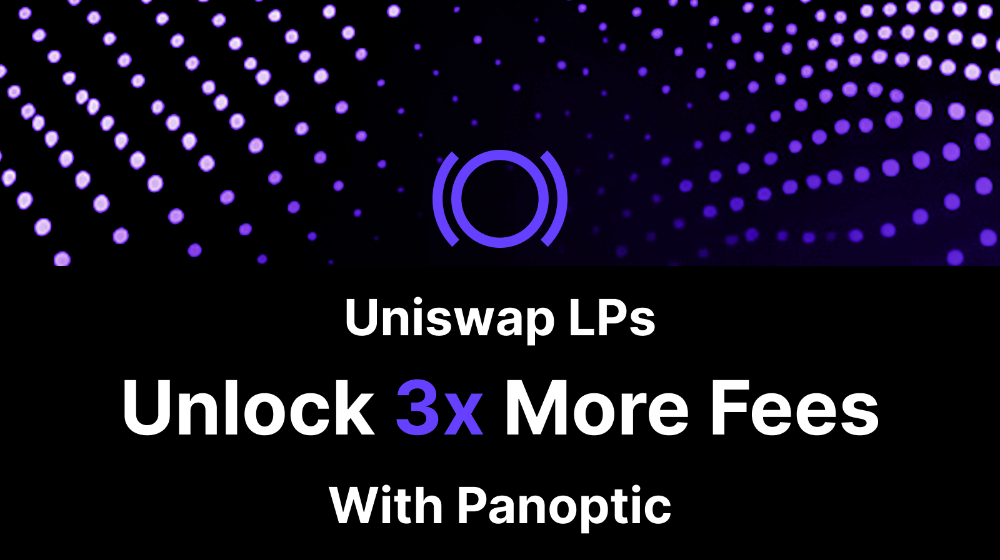
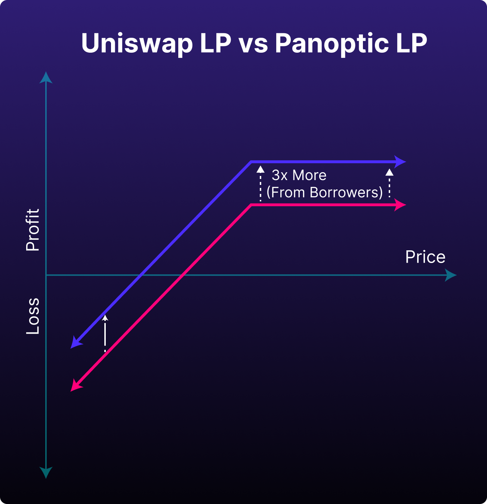
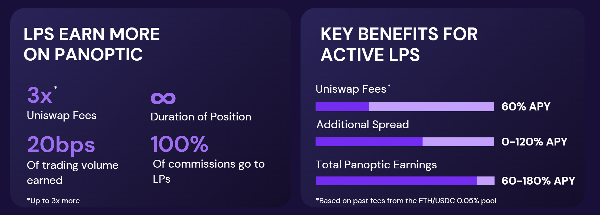
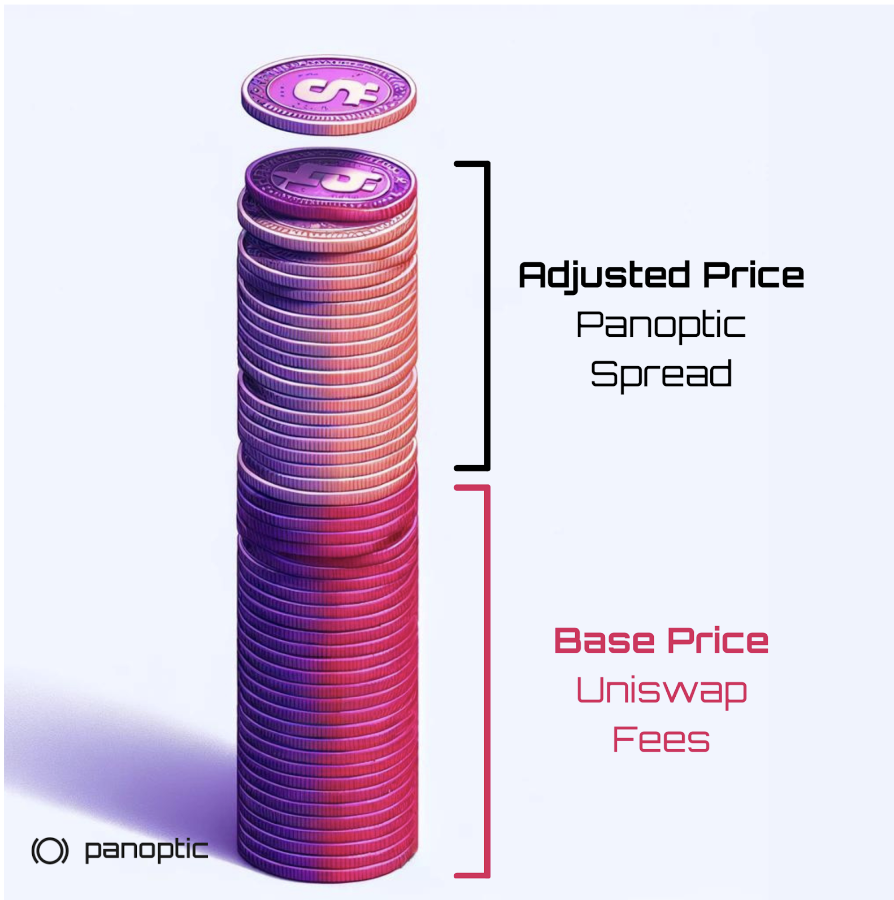

---
slug: uniswap-lps-unlock-3x-more-fees-with-panoptic
title: "Uniswap LPs: Unlock 3x More Fees with Panoptic"
tags: [Uniswap, LPs, ]
image: /img/banners/unlock-3x-more-fees.png
description: "Unlock 3x more fees as a Uniswap LP with Panoptic's innovative options strategies and enhanced capital efficiency."
--- 

## LPing on Uniswap

Liquidity provisioning (LPing) involves depositing pairs of tokens into a pool to facilitate trading for other users. Uniswap v3's innovative concentrated liquidity feature allows liquidity providers to allocate their funds within custom price ranges, significantly improving capital efficiency.

However, LPing comes with challenges. Risks like [impermanent loss](https://panoptic.xyz/blog/turning-impermanent-loss-into-gain) or [loss-versus-rebalancing](https://panoptic.xyz/research/panoptic-solves-lvr) can erode profits, making LPing less rewarding or even unprofitable at times.

## LPing on Panoptic

Panoptic transforms LPing into a more profitable venture. By complementing rather than competing with Uniswap, Panoptic enables LPs to replicate their Uniswap strategy while earning up to 3x more in fees. Through Panoptic, LPs not only provide liquidity to Uniswap but also leverage their LP tokens to generate additional income.

This is made possible by the [spread](https://panoptic.xyz/research/liquidity-spread), a unique feature where options buyers pay extra to LPs using Panoptic. LPs benefit from this additional income stream without compromising their existing Uniswap activity, making it a lucrative opportunity to enhance returns.

*APYs based on past fees in the ETH/USDC 0.05% pool on Uniswap earning 57.68% APY*

For instance, Uniswap LPs in the ETH/USDC pool earning 60% APY in fees could earn up to **180% APY through Panoptic.** This 3x increase is driven by the Panoptic’s spread.

## How It Works

<iframe width="1120" height="630" src="https://www.youtube.com/embed/Gfl-_yPGZyU?si=1-5ndx32fj7RA0QP" title="YouTube video player" frameborder="0" allow="accelerometer; autoplay; clipboard-write; encrypted-media; gyroscope; picture-in-picture; web-share" referrerpolicy="strict-origin-when-cross-origin" allowfullscreen></iframe>
  

LPs earn at least the same fees they would on Uniswap, plus an additional spread. Here’s how:
1.  **When there are no options buyers:** LP tokens are deployed directly into Uniswap, earning regular Uniswap fees.
2.  **When there are options buyers:** LP tokens are shorted and removed from Uniswap. LPs earn both Uniswap-equivalent fees and an additional spread paid by options traders.

Regardless of the scenario, LPs earn **at least as much as they would on Uniswap.** With Panoptic, capital never sits idle.

## Additional Benefits for LPs

Panoptic offers features that take LPing to the next level:
-   **Leveraged LPing:** Borrow tokens to [LP on leverage](https://panoptic.xyz/docs/product/leverage) in Uniswap, further increasing capital efficiency.
-   **Short LP tokens:** Take the opposite side by [shorting an LP token](https://panoptic.xyz/blog/turning-impermanent-loss-into-gain#shorting-lp-tokens-for-impermanent-gain), effectively purchasing an option.
-   **Passive LPing:** Earn [passive yield with no IL](https://panoptic.xyz/docs/getting-started/passive-lp) on deposited collateral from other LPs and options traders.   
-   **Advanced strategies:** One click [delta-neutral](https://panoptic.xyz/research/options-market-making#delta-hedging-examples) or hedged LP positions through Panoptic’s trading app.
-   **Dashboard insights:** Monitor profit and loss (PnL) and manage positions with [Panoptic’s intuitive interface](https://panoptic.xyz/docs/getting-started/options-traders#start-trading-options-on-panoptic).
    

## What are the Risks?

Panoptic provides higher returns with similar risks to Uniswap LPing, along with a few additional considerations:

-   Liquidity Risk: If demand for borrowing LP tokens surges, you may face delays in [closing your position](https://panoptic.xyz/docs/product/closing-a-position). You can either wait for the LP token to become available or pay a [force exercise fee](https://panoptic.xyz/docs/product/force-exercise) to close immediately.    
-   Smart Contract Risk: Panoptic utilizes a [semi-fungible position manager (SFPM)](https://panoptic.xyz/docs/contracts/smart-contracts-overview#directory) that wraps Uniswap’s non-fungible LP tokens so that option buyers can borrow portions of an LP token. The SFPM and Panoptic smart contracts have been thoroughly [audited](https://panoptic.xyz/docs/security/security_audits).
    
*Join the growing community of Panoptimists and be the first to hear our latest updates by following us on our [social media platforms](https://links.panoptic.xyz/all). To learn more about Panoptic and all things DeFi options, check out our [docs](https://panoptic.xyz/docs/intro) and head to our [website](https://panoptic.xyz/).*
