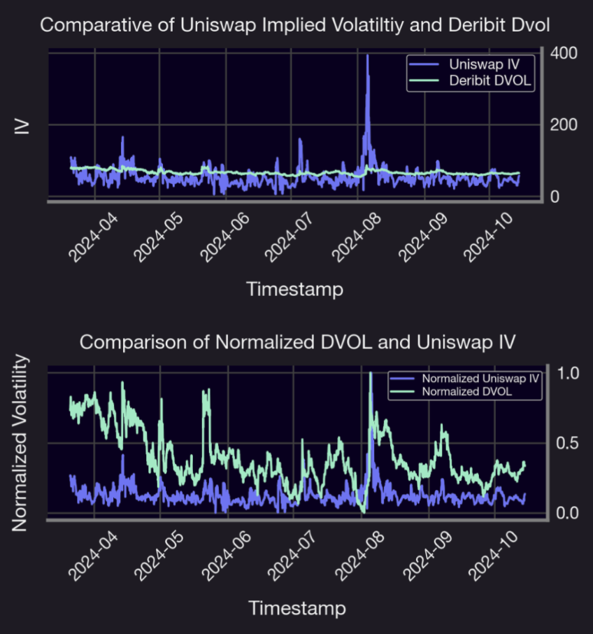
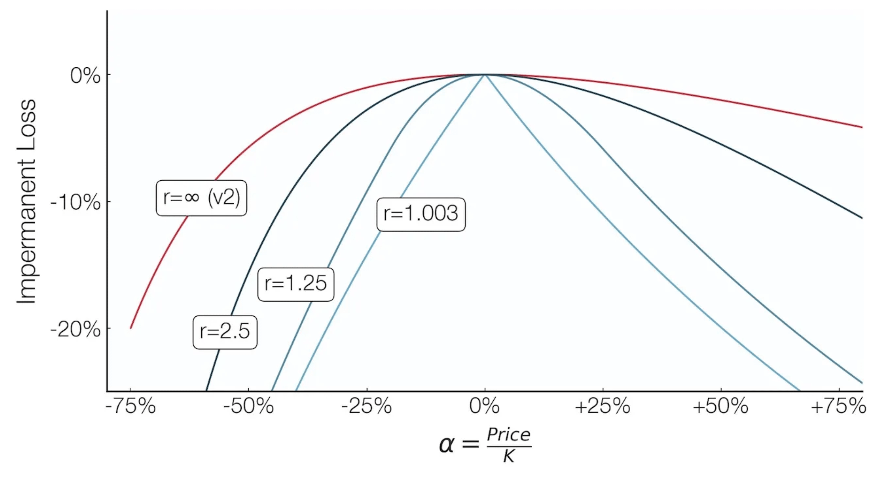
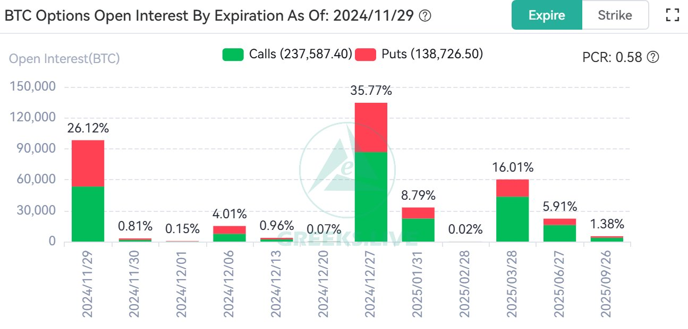

Welcome Panoptimists to the December edition of the Panoptic Newsletter, where we provide industry insights, research recaps, and Panoptic-specific content to keep you updated on our DeFi-native options platform.

If you want future newsletters sent directly to your email, signup on our [website](https://panoptic.xyz/).

## About Panoptic

Discover the future of trading with Panoptic, your gateway to perpetual options in DeFi. Our cutting-edge platform empowers you to manage risk effectively and trade with unprecedented flexibility. Join us and be part of a secure, decentralized revolution in options trading, tailored for both crypto newcomers and experienced traders.

## Panoptic Highlights

### Uniswap vs. Deribit: Unpacking the Volatility Connection

The relationship between decentralized (DEX) and centralized exchanges (CEX) is evolving, and implied volatility (IV) metrics provide a critical lens for understanding these dynamics. [Comparing IV](https://panoptic.xyz/research/comparing-uniswap-deribit-implied-volatilities) on Uniswap and Deribit reveals intriguing patterns: while both exhibit correlated trends, Uniswap’s IV is consistently lower, averaging 55%—more than 10 percentage points below Deribit. This difference stems from Uniswap’s “sell-only” options market, where liquidity providers (LPs) act as option sellers without the ability to buy, suppressing IV. Excess liquidity in key pools like ETH/USDC further compounds the issue, reducing option premiums and impacting LP profitability.

Panoptic aims to reshape this landscape by enabling users to borrow LP positions and remove them from Uniswap, effectively allowing the purchase of options. This mechanism increases demand for options, raising Uniswap’s IV and aligning it closer to Deribit’s levels. By unlocking new strategies, Panoptic introduces a more balanced and profitable dynamic for LPs, reducing oversupply and enhancing returns. For further insights, check out the thread below.

<blockquote class="twitter-tweet">
Our founder <a href="https://twitter.com/guil_lambert?ref_src=twsrc%5Etfw">@guil_lambert</a> discovered that <a href="https://twitter.com/Uniswap?ref_src=twsrc%5Etfw">@Uniswap</a> LPs are betting on future volatility. But are they correct?  To answer this, we test Uniswap implied volatility (IV) with the biggest options CEX in crypto — <a href="https://twitter.com/DeribitExchange?ref_src=twsrc%5Etfw">@DeribitExchange</a>!   <a href="https://twitter.com/hashtag/Crypto?src=hash&amp;ref_src=twsrc%5Etfw">#Crypto</a> <a href="https://twitter.com/hashtag/DeFi?src=hash&amp;ref_src=twsrc%5Etfw">#DeFi</a> <a href="https://twitter.com/hashtag/Volatility?src=hash&amp;ref_src=twsrc%5Etfw">#Volatility</a> <a href="https://twitter.com/hashtag/Uniswap?src=hash&amp;ref_src=twsrc%5Etfw">#Uniswap</a> <a href="https://twitter.com/hashtag/Deribit?src=hash&amp;ref_src=twsrc%5Etfw">#Deribit</a> <a href="https://t.co/H0xJhzIQ5w">pic.twitter.com/H0xJhzIQ5w</a>
&mdash; Panoptic (@Panoptic_xyz) <a href="https://twitter.com/Panoptic_xyz/status/1859025170067059063?ref_src=twsrc%5Etfw">November 20, 2024</a></blockquote> 
  

### Shallow Dive: Panoptic Turns Impermanent Loss into Permanent Opportunity

Impermanent Loss (IL) has been a persistent challenge for liquidity providers (LPs) in decentralized finance (DeFi), as token price volatility in liquidity pools often leads to diminished returns. Panoptic’s [innovative solutions](https://panoptic.xyz/blog/turning-impermanent-loss-into-gain) tackle this issue head-on, providing LPs with tools to hedge against IL, earn additional revenue, or even profit from market movements. LPs can lend their LP tokens to generate extra income, utilize single-sided liquidity for risk-free participation, or employ shorting strategies to turn potential losses into gains. These mechanisms not only reduce risk but also open new avenues for LPs to maximize profitability.

A standout feature of Panoptic is its shorting of LP tokens, which mimics the effect of buying a put option. This approach allows traders to benefit from downward price movements and mitigate the traditional drawbacks of IL. Additionally, passive LPing lets users focus on single-sided liquidity, simplifying participation for those who prefer a hands-off strategy. By combining advanced financial tools with a user-friendly interface, Panoptic is redefining liquidity provisioning in DeFi and fostering a more inclusive and robust market environment.

## Market Overview

### BTC Options Market Signals Bullish Sentiment, Eyes Year-End Volatility

The BTC [options](https://x.com/GreeksLive/status/1862381339955339405) market showed a strong concentration around the November 29 and December 27 expirations, comprising over 61% of the total open interest. The put-call ratio of 0.58 highlights a bullish bias, with calls significantly outpacing puts. This optimism aligns with broader market sentiment, but the December 27 expiration–which accounts for nearly 36% of open interest–underscores the potential for heightened volatility. As institutions position cautiously, memories of the turbulent 2020 year-end loom large, suggesting that while the market mood remains upbeat, the risk of sharp movements cannot be ignored.

## Panoptic in the Media

### Spotlights
#### Panoptic V1 Contracts Clear Final Audit

The final audit with Cantina is [complete](https://x.com/Panoptic_xyz/status/1861508556874490032), confirming Panoptic V1 contracts are secure with no high-severity issues found. This audit follows an earlier Cantina audit competition which also did not find any major issues. With this milestone achieved, the countdown to launch is officially underway!

<blockquote class="twitter-tweet">
📢 The final audit results with <a href="https://twitter.com/cantinaxyz?ref_src=twsrc%5Etfw">@cantinaxyz</a> are in.  We&#39;re excited to announce no high-severity issues were found. Panoptic&#39;s V1 contracts are polished and secure.  We are grateful to all who contributed to our protocol&#39;s security. The countdown to launch begins—stay tuned! 🚀
&mdash; Panoptic (@Panoptic_xyz) <a href="https://twitter.com/Panoptic_xyz/status/1861508556874490032?ref_src=twsrc%5Etfw">November 26, 2024</a></blockquote> 

#### Exploring Volatility: Panoptic Joins the Revelo Roundtable

We joined the Revelo Intel space alongside Derive and Smilee Finance for an engaging conversation about volatility products and their evolving role in DeFi. Listen below.

<blockquote class="twitter-tweet">
🎙️Tune in now!  We’re live with <a href="https://twitter.com/derivexyz?ref_src=twsrc%5Etfw">@derivexyz</a> &amp; <a href="https://twitter.com/SmileeFinance?ref_src=twsrc%5Etfw">@SmileeFinance</a>, diving into the vooooolatility on the <a href="https://twitter.com/ReveloIntel?ref_src=twsrc%5Etfw">@ReveloIntel</a> space! <a href="https://t.co/zkwmxRLou4">https://t.co/zkwmxRLou4</a>
&mdash; Panoptic (@Panoptic_xyz) <a href="https://twitter.com/Panoptic_xyz/status/1853467301565317363?ref_src=twsrc%5Etfw">November 4, 2024</a></blockquote> 

#### Panoptic x Margarita Finance: Redefining DeFi Investment Opportunities

Panoptic’s [partnership](https://panoptic.xyz/blog/panoptic-partners-with-margarita-finance-next-generation-structured-products) with Margarita Finance sets a new benchmark for innovation in DeFi structured products by integrating Panoptic's on-chain options with Margarita's expertise in customizable investment strategies. This collaboration introduces permissionless structured products that offer higher yields, comprehensive risk management, and access to a broader range of assets—all without issuer risk.

Investors can now tailor their portfolios across various parameters like lock-up periods, APY targets, and underlying assets, creating strategies akin to those found in traditional finance but with DeFi's efficiency and accessibility. Together, the two platforms are redefining how users interact with decentralized investment opportunities.

#### Guillaume Lambert Unveils Panoptic’s Vision for Perpetual Options

Our founder, Guillaume Lambert, expanded on Panoptic's groundbreaking approach to decentralized liquidity. He detailed how LP positions on Uniswap act as perpetual options and how Panoptic allows users to borrow and short these tokens for speculation or hedging without counterparty risk.

<blockquote class="twitter-tweet">
2. Panoptic also lets you borrow+short LP tokens. Borrowing an LP token is effectively *buying* a perpetual option.  Buying options with no counterparty risk is good for hedging &amp; risk management.  Or it can be used for pure speculation. Think perps, but with no liquidation risk <a href="https://t.co/RVl9Um8IKx">pic.twitter.com/RVl9Um8IKx</a>
&mdash; GEE-yohm LAMB-bear (@guil_lambert) <a href="https://twitter.com/guil_lambert/status/1838609506546389042?ref_src=twsrc%5Etfw">September 24, 2024</a></blockquote> 

By tying option premiums to realized volatility, Panoptic ensures accurate pricing and [higher yields](https://panoptic.xyz/blog/uniswap-lps-unlock-3x-more-fees-with-panoptic) compared to traditional Uniswap LPing. Guillaume also highlighted the platform’s use of ERC-1155 tokens, which optimize gas efficiency while making options composable across DeFi.

## Up Next

Panoptic is coming to Ethereum mainnet soon! Subscribe so you don’t miss any future announcements.

*Join the growing community of Panoptimists and be the first to hear our latest updates by following us on our [social media platforms](https://links.panoptic.xyz/all). To learn more about Panoptic and all things DeFi options, check out our [docs](https://panoptic.xyz/docs/intro) and head to our [website](https://panoptic.xyz/).*
