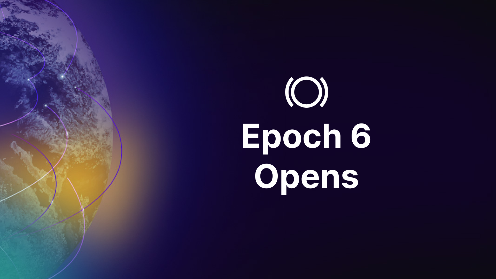

Mark your calendars! On Tuesday, February 13, Panoptic's beta platform launches on Polygon! The Epoch 6 trading competition on Polygon will have $1000 in prizes for the best performing traders.

Epoch 6 is **open to everyone**. Whether you're a seasoned trader or new to the platform, this is your chance to dive in! Additionally, the first 100 depositors will be eligible to claim the Epoch 6 POAP, celebrating their early involvement in this new launch.
 

## About Our Beta Launch

Panoptic's [beta launch](https://panoptic.xyz/docs/gated-launch/) is structured as multiple rounds of trading competitions called epochs. In the epochs, participants use real, albeit capped, assets to buy and sell perpetual options.

In each round of the trading competition, top performers receive prizes. Throughout the beta launch, we’re offering exclusive NFTs and up to $100,000 in monetary prizes.

## Epoch 6 Overview  

For the sixth epoch, we're moving to a new chain and bringing new options markets to the competition.
  

### Panoptic Launches on Polygon

Epoch 6 sees Panoptic's beta options protocol launch on [Polygon](https://polygon.technology/), an EVM enabled sidechain.

### New Markets

Epoch 6 introduces new options markets to DeFi. Participants now have the opportunity to trade perpetual options on the MATIC token.

### Participation
    Whitelist: No whitelist, anyone can participate

### Timeline
    Start Date: February 13, 17:00 UTC
    End Date: February 23, 17:00 UTC

### Prizes

The top qualifying traders will receive:
   
WMATIC-USDC.e 0.05%:

    1st Place: $500 USDC
    2nd Place: $300 USDC
    3rd Place: $200 USDC

The ranking metrics are based on profit and loss (PnL) calculated in terms of the account's value at the end of the epoch. 

For Epoch 6, the first 100 participants will receive an Epoch 6 POAP that is custom designed by the Panoptic team. The top five traders of each market will be eligible for a Top Trader POAP.

### Technical Details

    Chain: Polygon PoS

    Pool: WMATIC-USDC.e, 0.05%
    Deposit Amount: ~30 MATIC and 25 USDC.e.

The deposit limit for each user will be ~$50/market. Please note that you must deposit the required amount to participate, and that the exact amount can be found on the onboarding modal of the [app](https://beta.panoptic.xyz/) once the competition starts.

### Feedback

Feedback is an essential part of our beta launch. If you encounter any bugs or have ideas on how to improve our platform, submit them [here](https://feedback.panoptic.xyz/).

  

### Seeking Uniswap LPs, Market Makers, and Traders

Are you an LP on Uniswap, market maker, or experienced trader? If so, you might qualify for VIP access to our beta platform for trading DeFi options.

To apply, fill out our form [here](https://docs.google.com/forms/d/e/1FAIpQLSeggT7ad9NvJ9LPW5thzwWBLvj35nr5Sg7rzp4xs4kUK932ag/viewform).

## How to Participate in Epoch 6

Here are the steps you need to take to join the competition: 

1.  Navigate to the beta version of the [Panoptic app](http://beta.panoptic.xyz/)
2.  Connect your wallet to Polygon. If you’re unfamiliar with how to do this, follow the instructions [here](https://polygon.technology/blog/getting-started-with-metamask-on-polygon).
3.  To begin trading MATIC options, follow these steps:

    Deposit required funds on Panoptic by following the onboarding instructions on the [Panoptic app](http://beta.panoptic.xyz/).
    
    To participate, you will need a small amount of MATIC in your wallet to pay for gas. You will also need the required deposit amounts of both tokens comprising the Panoptic pool. Please see the Technical Details section above for more information on the deposit amounts.
        
    Obtain MATIC on Polygon: Send funds directly from a compatible exchange or [bridge](https://coinmarketcap.com/academy/article/how-to-bridge-to-polygon) your funds from another chain.

    Obtain other tokens on Polygon: Swap your funds on Polygon for WMATIC or USDC.e via the [Uniswap](https://app.uniswap.org/swap?chain=polygon) interface.

4.  Buy or sell options between February 13 (17:00 UTC) and February 23 (17:00 UTC). Check out our [leaderboard](https://beta.panoptic.xyz/leaderboard) to see where you stand in comparison to other traders.

Winners will have their prizes distributed at the end of the competition period.

Learn how to deposit liquidity, trade an option, and more through our YouTube videos:

<iframe width="560" height="315" src="https://www.youtube.com/embed/videoseries?si=oeSJONnOeGPukUXO&amp;list=PLB5qwiSwzT_rgH-HvQtDaWTe48xPaF6se" title="YouTube video player" frameborder="0" allow="accelerometer; autoplay; clipboard-write; encrypted-media; gyroscope; picture-in-picture; web-share" allowfullscreen></iframe>

*Disclaimer: Panoptic provides these external links and sources for your convenience. However, it's crucial for users to independently verify all sources and information. Please be aware that Panoptic is not responsible for the verification of external sources or the security of external platforms. Users should exercise caution and are solely responsible for their actions; Panoptic is not liable for any loss of funds or other damages incurred as a result of using these external platforms.*  

## Additional Information

In preparation for the trading competition, traders can familiarize themselves with the protocol and associated fees by reading through our [documentation](https://panoptic.xyz/docs/intro).

  

As part of our multi-epoch beta launch, we will be testing various combinations of these pool parameter values to assess their safety, robustness, and fairness for a variety of tokens and market conditions.

  

We outline the pool parameter values for Epoch 5 below. For further explanation of how these parameters affect users in Panoptic, please see our pool parameters [guide](https://panoptic.xyz/blog/gated-launch-parameters).

### Fees

|              Fees             |                             Value                             |                                                                                                                                                                                                                                     Example                                                                                                                                                                                                                                    |
|:-----------------------------:|:-------------------------------------------------------------:|:------------------------------------------------------------------------------------------------------------------------------------------------------------------------------------------------------------------------------------------------------------------------------------------------------------------------------------------------------------------------------------------------------------------------------------------------------------------------------:|
| Commission fee                | 10 bps (0.10%)                                                | Buying/selling a 1 ETH put will incur a 0.001 ETH commission fee                                                                                                                                                                                                                                                                                                                                                                                                               |
| Forced exercise cost          | As high as 1.28%                                              | [Forcing](https://panoptic.xyz/docs/panoptic-protocol/forced-exercise) an option buyer to close an at-the-money 1 ETH put will incur a 0.0128 ETH fee on the force exercisor. Deeper in-the-money and out-of-the-money options will incur lower fees.                                                                                                                                                                                                                                                                                         |
| In-the-money (ITM) spread fee | 20 bps (0.20%)                                                | Buying/selling an ITM 1 ETH put at a 2000 strike price with current ETH price being 1900 USDbC (intrinsic value of put option = 100 USDbC) incurs a 0.20 USDbC fee. Buying/selling an at-the-money or out-of-the-money option will not incur any ITM spread fee.                                                                                                                                                                                                               |
| Vegoid                        | 1x - 3.25x spread (1.25x spread at 50% liquidity utilization) | Buyers pay sellers anywhere from [1x to 3.25x](https://www.desmos.com/calculator/lo2qsg77im) the amount of Uniswap LP fees, depending on the available liquidity of the option.  Examples: 1) If a sold option is not purchased, it will earn the Uniswap LP fees (1x spread). 2) If half of the sold options are purchased, buyers pay sellers an additional 25% of Uniswap LP fees (1.25x spread). 3) If 90% of the sold option has been purchased, buyers pay sellers an additional 225% of Uniswap LP fees (3.25x spread). |
  

### Collateral Requirements

  
|      Pool Parameter     |       Value       |                                                             Example                                                            |
|:-----------------------:|:-----------------:|:------------------------------------------------------------------------------------------------------------------------------:|
| Sell Collateral Ratio   | 20% (5x leverage) | Maintaining a 1 ETH short put position would require at least 0.2 ETH in collateral.                                          |
| Buy Collateral Ratio    | 10% (10x leverage) | Maintaining a 1 ETH long put position would require at least 0.1 ETH in collateral.                                           |
| Mint Buffer Requirement | 1.1x             | Suppose the buy collateral ratio is 10%. Buying a 1 ETH put would require at least 0.11 ETH in collateral (0.11 = 1.1 x 10%). |

  

### Pool Utilization (PU)

|       Pool Parameter       | Value |                                                                                Example                                                                               |
|:--------------------------:|:-----:|:--------------------------------------------------------------------------------------------------------------------------------------------------------------------:|
| Target Pool Utilization    | 50%   | Half of all the Panoptic pool liquidity has been used to sell options. The protocol uses collateral requirement incentives to target this amount.                    |
| Saturated Pool Utilization | 90%   | Nine-tenths of all the Panoptic pool liquidity has been used to sell options. The protocol uses collateral requirement incentives to avoid exceeding this amount. |  

## Disclaimer

During Panoptic’s beta launch, the protocol is still in an experimental state, and trading activities involve inherent risks. Engaging in the competition may lead to a loss of funds due to the inherent nature of trading assets and the experimental nature of the protocol. Participants are encouraged to exercise caution and conduct their due diligence before making any financial decisions.

  

*Join the growing community of Panoptimists and be the first to hear our latest updates by following us on our [social media platforms](https://links.panoptic.xyz/all). To learn more about Panoptic and all things DeFi options, check out our [docs](https://panoptic.xyz/docs/intro) and head to our [website](https://panoptic.xyz/).*
