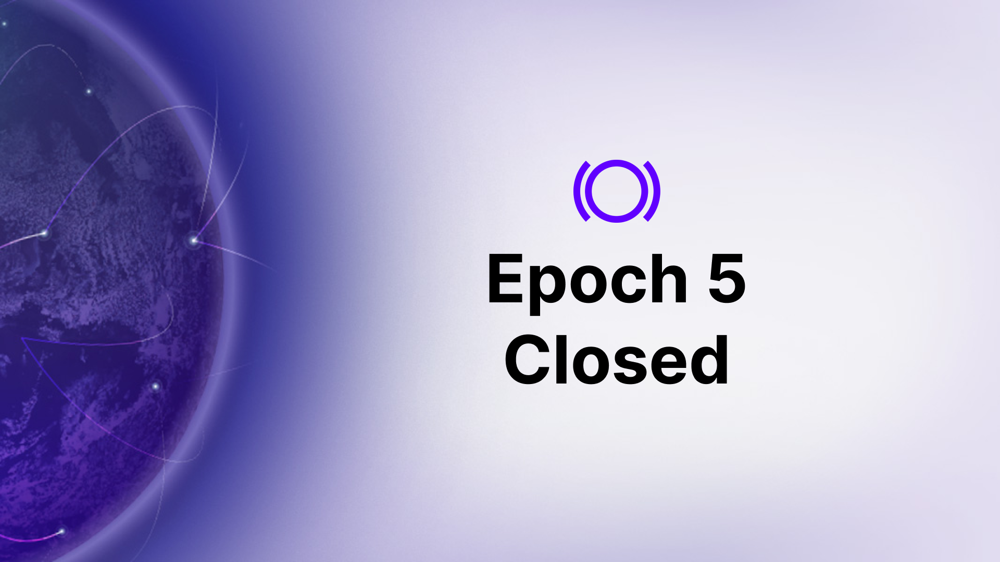
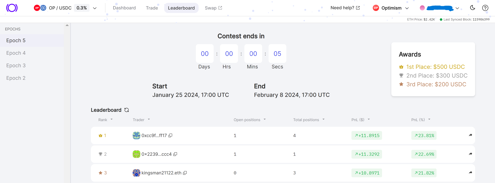
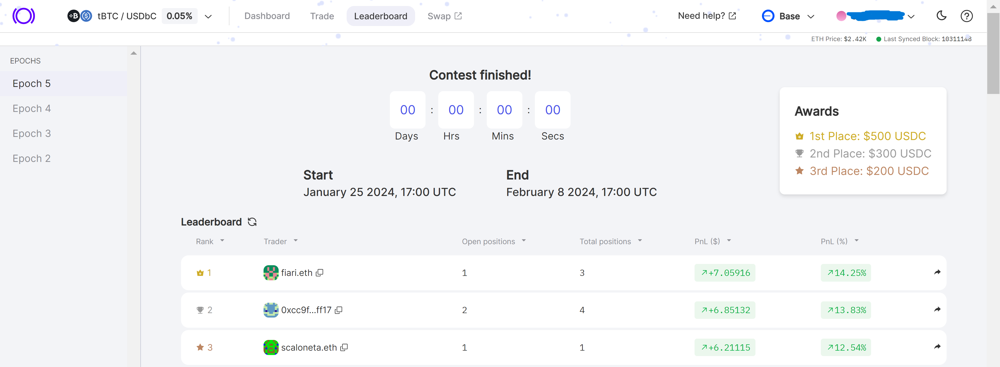

Epoch 5 of Panoptic's beta launch of the Optimism and Threshold Bitcoin markets has ended. Thank you to everyone who participated!

Following our [earlier announcement](https://panoptic.xyz/blog/panoptic-beta-launch-epoch-five), this conclusion marks a planned transition. We are excited to prepare for Epoch 6.

### Engage Now

Don't wait until Epoch 6! Participate in our [December Nutcracker](https://panoptic.xyz/blog/panoptic-demo-launch) competition on Base now. There's over $10,000 in NFT prizes including a Milady, Lil Pudgy, and mfer. [Join](https://beta.panoptic.xyz) now!

## Epoch 5's Winners

We're excited to announce the winners of our Epoch 5 trading competition. A total of $2,000 in prizes will be distributed to the best traders. Additionally, the top five traders of each market will each receive the prestigious Top Trader POAP.

Congratulations to the top traders!

### OP Options Contest
-   🥇 1st Place: 0xcc9f20a8d46ba531f9e29c751821294265ffff17 ($500 + Top Trader POAP)
-   🥈 2nd Place: 0x2239bfbab4cd1cb8c2abb8ba33f97f523b56ccc4 ($300 + Top Trader POAP)
-   🥉 3rd Place: kingsman21122.eth ($200 + Top Trader POAP)
-   4️⃣ 4th Place: 0xaa60084b1170bce4b6aaa1c56c1aa5f3dca85923 (Top Trader POAP)
-   5️⃣ 5th Place: rrcllctr.eth (Top Trader POAP)

### tBTC Options Contest
-   🥇 1st Place: fiari.eth ($500 + Top Trader POAP)
-   🥈 2nd Place: 0xcc9f20a8d46ba531f9e29c751821294265ffff17 ($300 + Top Trader POAP)
-   🥉 3rd Place: 0x9C2b07Dd951eDAE10fbf58bB98a1448cDe417F58 ($200 + Top Trader POAP)
-   4️⃣ 4th Place: ozy4211.eth (Top Trader POAP)
-   5️⃣ 5th Place: johnnysack.eth (Top Trader POAP)

Winners, claim your POAP [here](https://poap.delivery/panoptic-epoch-5-top-trader)! Additionally, the first 100 Epoch 5 participants can grab their Epoch 5 POAP [here](https://poap.delivery/panoptic-epoch-5). 
 

## What's Next?
The Panoptic team is already incorporating your feedback from Epoch 5 and prepping for Epoch 6. Stay tuned to our [social media](https://linktr.ee/panopticxyz) channels for upcoming competition details!

_Join the growing community of Panoptimists and be the first to hear our latest updates by following us on our [social media platforms](https://links.panoptic.xyz/all). To learn more about Panoptic and all things DeFi options, check out our [docs](https://panoptic.xyz/docs/intro) and head to our [website](https://panoptic.xyz/)._
