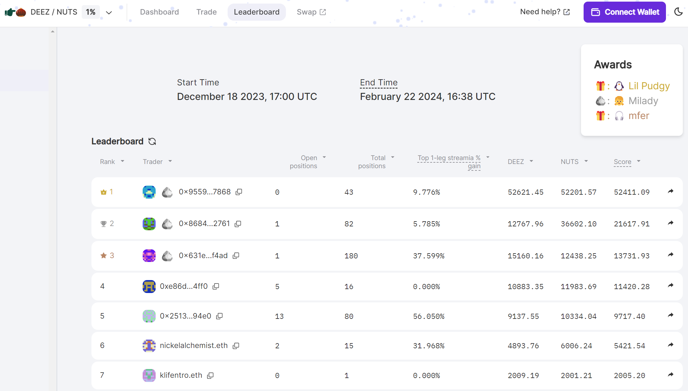
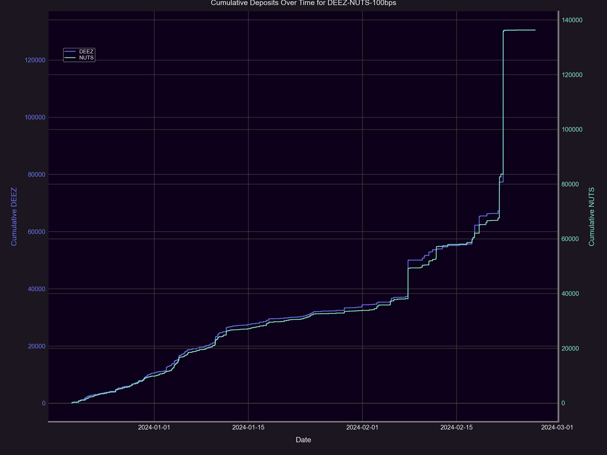
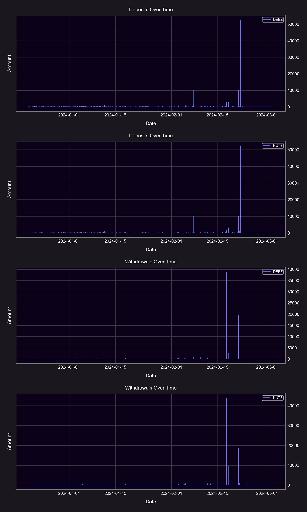

The long awaited [December Nutcracker](https://panoptic.xyz/blog/december-nutcracker) trading contest results are in! From naughty to nice trading strategies, we are excited to reveal the winners for each prize.

## Best Naughty Trader
[Milady](https://opensea.io/collection/milady) 2447 goes to the best naughty trader: 0x955916640f96efcd66f4aee595e0a44700a57868!  

0x9559 rapidly [opened and exercised](https://deeznuts.panoptic.xyz/?view_as=0x955916640f96efcd66f4aee595e0a44700a57868) many long options for quick profits while manipulating the Uniswap price with their alt account. They hid their profits by withdrawing, and then proceeded to re-deposit them right before the last day.

The actual competition end time was around 12 hours later. To keep the competition fair, the end time was kept secret with the hash posted on our [blog](https://panoptic.xyz/blog/december-nutcracker). The hash can be verified using [this](https://emn178.github.io/online-tools/sha256.html?input_type=utf-8&input=Thursday%2C%20February%2022%2C%2011%3A38%20am%20EST%20Salt%3AWzzPwF(_yEg*K4Jvx4D%3BU%5DW!J%3DLX%40T&hmac_input_type=utf-8)) preimage.

## Best Nice Trader
[Lil Pudgy](https://opensea.io/collection/lilpudgys) #16930 goes to the best nice trader: 0x2513aa49e95dc6368618f20e2cf75146178c94e0!
  

0x2513 [sold](https://deeznuts.panoptic.xyz/?view_as=0x2513aa49e95dc6368618f20e2cf75146178c94e0) many puts and calls, incidentally benefiting from the extreme volatility caused by naughty swappers.

## Best Trade for Streamia
[mfer](https://opensea.io/collection/mfers) #5997 goes to the highest streamia trader: 0x1f2aac54e7f2d001572571980664aa2185aff164!

0x1f2a [sold](https://deeznuts.panoptic.xyz/positions/0x10002bc002a03e6726b3160690?view_as=0x1f2aac54e7f2d001572571980664aa2185aff164) a 1D call at the 1.07 strike for over a month. This call incidentally benefitted from naughty swapping activity between the 1.06 and 1.08 price range.

Congratulations to the winners of the December Nutcracker trading contest, and thank you to all who participated! Prizes will be distributed at the end of the week.

## Trading Overview
Overall, the contest saw over 1k trades, 2m in volume, and 250k DEEZ/NUTS deposits. Check out the stats below.

### Trades
Lots of trades were opened, primarily from naughty accounts.
- Number of positions opened: 859
- Number of positions closed: 582
- Total trades: 1441

### Notional Volume
Around a million of each token was traded as puts and calls during the competition.

- 974,988 DEEZ
- 1,213,766 NUTS

### Commission Fees

- 532.8005 DEEZ
- 639.9648 NUTS

### Passive LP Yield
Active LPs (options traders) paid over 1k in $DEEZ $NUTS to passive LPs (depositors), for an average APY of approximately 5% to 8%.

- DEEZ APY: 4.8%
- NUTS APY: 7.6%

### Long vs. Short
The amount of short options slightly outnumbered long options, likely due to the incentivized mfer prize for best streamia.

- Buy-sell ratio: 0.82
- Number of option legs purchased: 709
- Number of option legs sold: 866

### Put vs. Call
Out of all the long options traded, calls were the most popular position.

- Put-call ratio: 0.7292682926829268
- Number of puts purchased: 299
- Number of calls purchased: 410

  
_Join the growing community of Panoptimists and be the first to hear our latest updates by following us on our  [social media platforms](https://links.panoptic.xyz/all). To learn more about Panoptic and all things DeFi options, check out our [docs](https://panoptic.xyz/docs/intro) and head to our [website](https://panoptic.xyz/)._