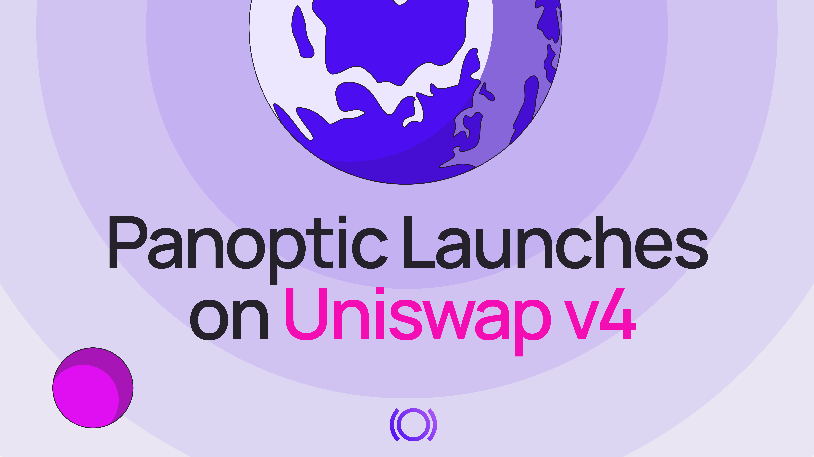
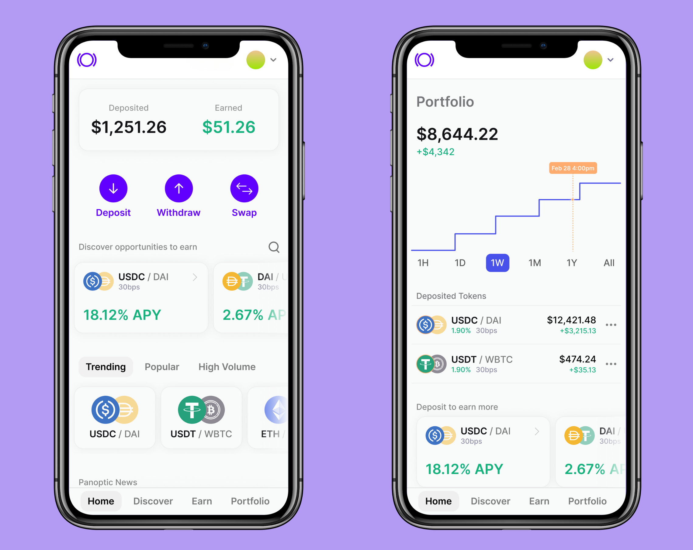

  

Panoptic, a DeFi-native [options trading platform](http://app.panoptic.xyz), launched today on Uniswap v4, introducing a new DeFi derivative—the perpetual option. This milestone integration also debuts gRHO (pronounced “grow”), a streamlined liquidity interface that allows passive liquidity providers (LPs) to earn yield without exposure to impermanent loss (IL).

Uniswap v4, the latest upgrade to the Ethereum-based decentralized exchange (DEX), boasts enhanced customization, improved transaction efficiency, and reduced costs. With Panoptic’s integration, traders can now seamlessly access options on native tokens like ETH, eliminating the need for wrapped ETH (WETH) and significantly lowering gas fees.

> _“Uniswap v4 unlocks a new era for DeFi with hooks, lower gas fees, and more opportunities for builders to innovate,”_ said Guillaume Lambert, CEO & Founder of Panoptic. _“Panoptic is proud to integrate with Uniswap v4 from day one. Our goal has always been to make it possible for passive LPs to be profitable in Uniswap, while providing active LPs the option to better manage risks and mitigate impermanent loss.”_

## Introducing gRHO: An Easier Way to LP

Panoptic’s lending interface, gRHO, offers users an easier way to LP by eliminating impermanent loss and the complexities of active liquidity management. Funded by a grant from the [Uniswap Foundation](https://www.uniswapfoundation.org/), gRHO enables LPs to passively earn yield by lending single-sided tokens to Uniswap LPs, removing the need for price range selection or manual rebalancing.

When passive LPs deposit a token on gRHO, other LPs can borrow these assets to create leveraged positions in Uniswap, generating yield for depositors. Earnings are automatically reinvested, compounding yields.

The launch of Panoptic on Uniswap v4 lays the foundation for gRHO’s upcoming rollout, expanding opportunities for LPs.

## Goodbye WETH, Hello Lower Fees

Panoptic’s integration with Uniswap v4 unlocks access to the latest liquidity pools, lowers costs, and expands market opportunities for traders, LPs, and token launchers. With Uniswap v4’s native token support, wrapped ETH (WETH)—previously required for trading between ERC-20 tokens and ETH—will become obsolete, streamlining transactions.

Another key benefit of this integration is the reduction of gas fees. Uniswap v4’s optimized architecture lowers the cost of deploying new pools and options markets, making it significantly more affordable for users to participate.

Beyond cost savings, Uniswap v4 introduces hooks, customizable smart contract functionalities that enable new use cases such as liquidity incentives, derivative assets, and lending features directly embedded in liquidity pools. By integrating with these next-generation liquidity pools, Panoptic enhances LP management and introduces new passive liquidity strategies.

Panoptic’s adoption of Uniswap v4 offers cutting-edge, accessible, and cost-efficient DeFi options markets. The smart contract integration is live on Ethereum, with [app](https://app.panoptic.xyz) support to follow.

## About Panoptic

Panoptic offers a market-driven solution to boost LP profitability, an intuitive interface for perps, options, and institutional investors, and a safe way to avoid impermanent loss (IL).

Built on Uniswap, Panoptic LPs earn the same yield as in Uniswap pools, with the potential to earn extra yield from the [spread](https://panoptic.xyz/docs/product/spread) when option buyers leverage their tokens. Uniswap LPs can access this extra yield by [deploying their tokens on Panoptic](http://app.panoptic.xyz/).

Panoptic's intuitive [interface](http://app.panoptic.xyz) replaces traditional order books with a visual approach, letting users easily build strategies based on whether they believe an asset will rise or fall. Advanced traders can access one-click strategies, including multi-leg options and perp trading. Traders can also create their own options markets using any tokens available on Uniswap.

Panoptic [eliminates IL](https://panoptic.xyz/blog/turning-impermanent-loss-into-gain) by bringing [passive, single-sided liquidity](https://panoptic.xyz/blog/bringing-passive-liquidity-to-uniswap) to Uniswap through gRHO. Passive LPs can lend tokens to other LPs on Panoptic. Passive LPing is as easy as depositing a token, and avoids the hassles of active management, choosing a price range, rebalancing when going out of range, and impermanent loss.

The [gRHO platform](https://panoptic.xyz/blog/panoptic-awarded-uniswap-foundation-grant) is a lending interface for Uniswap liquidity, where liquidity providers can borrow from passive LPs, generating yield in the process. That means no [LVR](https://panoptic.xyz/research/panoptic-solves-lvr) or IL for passive LPs who deposit single-sided to earn auto-compounded fees.

The platform has undergone comprehensive [third-party security audits](https://panoptic.xyz/docs/security/security_audits) to ensure integrity and reliability. Panoptic has rolled out a public [bug bounty program](https://panoptic.xyz/docs/security/bug-bounties) in partnership with Cantina.

To drive participation and bootstrap liquidity, the company launched the [Panoptic Incentive Points (Pips) Program](https://pips.panoptic.xyz/), designed to engage traders of all experience levels and reward them for their contributions. Pips are live for the WETH/USDC (0.3%) and WBTC/WETH (0.3%) markets on Uniswap v3, with additional markets on Uniswap v4 to follow.

Panoptic’s v1.1 contracts, integrated with Uniswap v4, are now live on Ethereum mainnet. Support for Uniswap v4 pools on its [lending interface](https://panoptic.xyz/blog/panoptic-awarded-uniswap-foundation-grant) and [trading platform](http://app.panoptic.xyz) will follow shortly. Panoptic will expand to other layer 2 (L2) and EVM-compatible chains in a phased rollout.

### Start Here
-   Access the [Panoptic platform](https://app.panoptic.xyz/)
-   Learn how to [use the Panoptic options trading platform](https://youtube.com/playlist?list=PLB5qwiSwzT_rgH-HvQtDaWTe48xPaF6se&feature=shared)
-   Learn more about [gRHO, the lending interface for Uniswap LPs](https://panoptic.xyz/blog/panoptic-awarded-uniswap-foundation-grant)
-   For a full guide on getting started on Panoptic, read our [docs](https://panoptic.xyz/docs/product/opening-a-position)
    

### Learn More
-   For [passive LPs](https://panoptic.xyz/docs/getting-started/passive-lp)
-   For [Uniswap LPs](https://panoptic.xyz/docs/getting-started/active-lp)
-   For [token launchers](https://panoptic.xyz/docs/product/token-launchers/bootstrap-liquidity)
-   For [traders](https://panoptic.xyz/docs/getting-started/options-traders)
    
_Join the growing community of Panoptimists and be the first to hear our latest updates by following us on our [social media platforms](https://links.panoptic.xyz/all). To learn more about Panoptic and all things DeFi options, check out our [docs](https://panoptic.xyz/docs/intro) and head to our [website](https://panoptic.xyz/)._