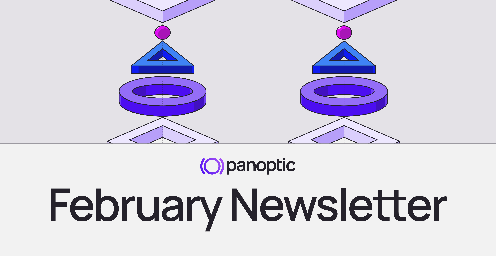
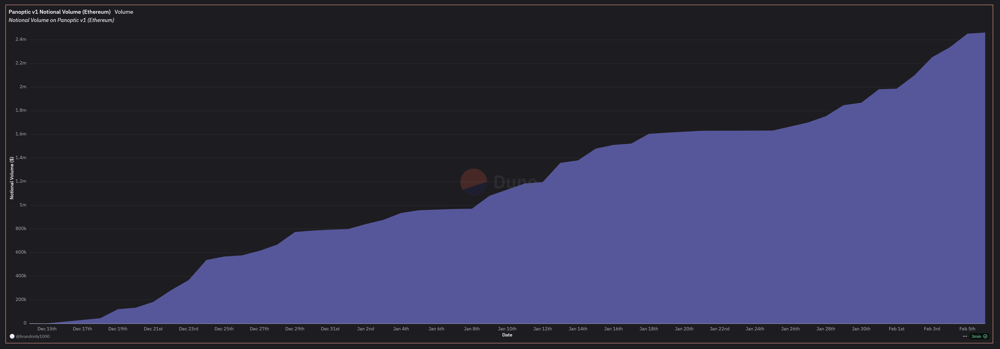
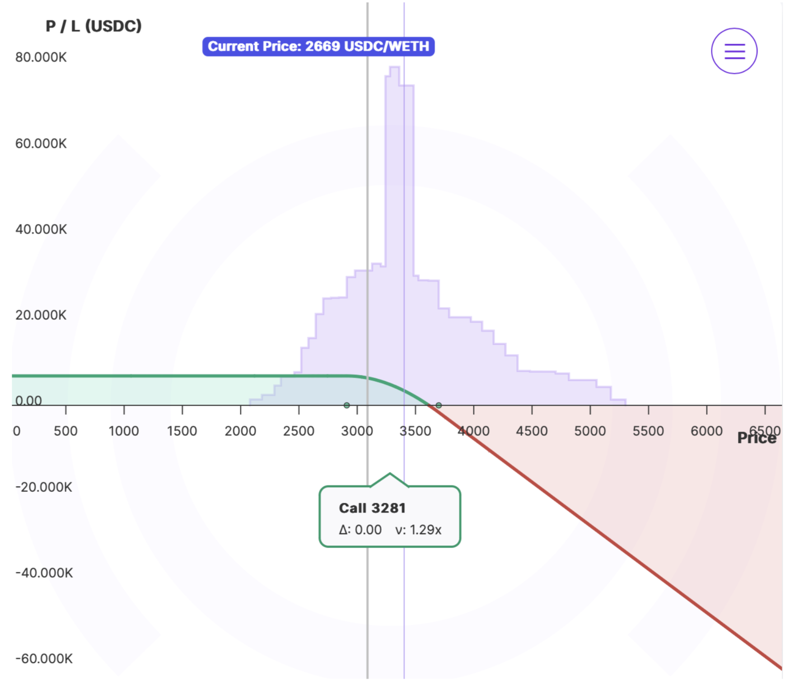
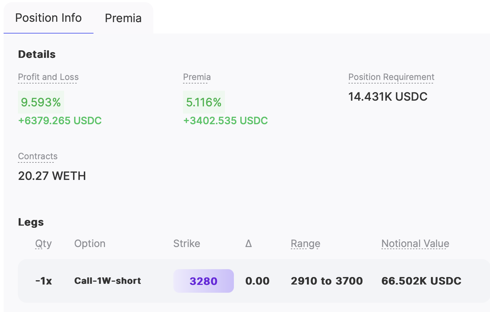
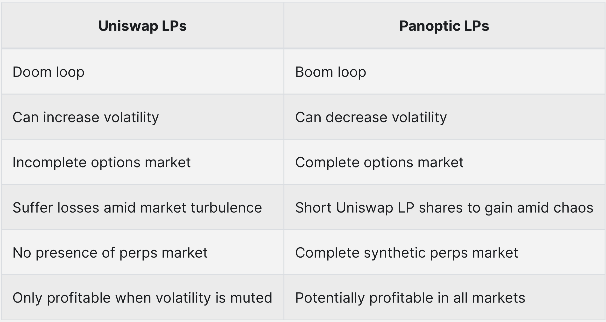
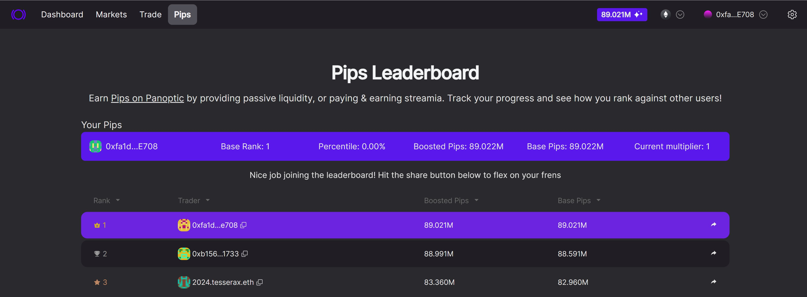
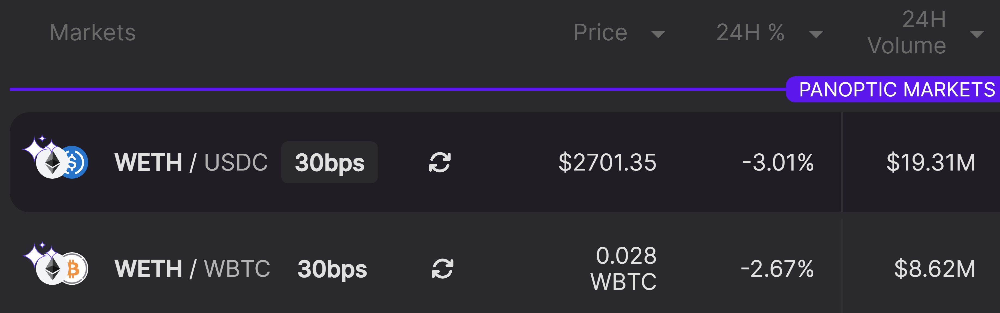

Welcome Panoptimists to the February edition of the Panoptic Newsletter, where we provide industry insights, research recaps, and Panoptic-specific content to keep you updated on our DeFi-native options platform.

If you want future newsletters sent directly to your email, signup on our [website](https://panoptic.xyz/).

## About Panoptic
Discover the future of trading with Panoptic, your gateway to perpetual options in DeFi. Our cutting-edge platform empowers you to manage risk effectively and trade with unprecedented flexibility. Join us and be part of a secure, decentralized revolution in options trading, tailored for both crypto newcomers and experienced traders.

## Panoptic Highlights

Panoptic hits a major milestone, reaching over $2 million in [notional volume](https://dune.com/brandonly1000/panoptic) and over $1 million in total value locked (TVL). We’re thrilled to see the organic growth of DeFi options on our platform.

<blockquote class="twitter-tweet">
Panoptic hits a major milestone — $1 million in TVL! 🚀  We’re thrilled to see this organic growth in assets deposited on our platform. Thank you for believing in the future of DeFi options, we&#39;re just getting started! 💜 <a href="https://t.co/7BIEhrOsdQ">pic.twitter.com/7BIEhrOsdQ</a>
&mdash; Panoptic (@Panoptic_xyz) <a href="https://twitter.com/Panoptic_xyz/status/1879637815342125422?ref_src=twsrc%5Etfw">January 15, 2025</a></blockquote> 

Over 50 [options markets](https://app.panoptic.xyz/markets/ethereum) have been launched on Panoptic, including MORPHO, ENA, LDO, SOL, AXS, UNI, SHIB, ENS, APE, and tBTC. Market creators receive a [special onchain vector graphic NFT](https://x.com/Panoptic_xyz/status/1884044106487464430) to commemorate their contribution.

<blockquote class="twitter-tweet" data-media-max-width="560">
🚀 48 new markets launched on Panoptic this week!  Highlights include: <a href="https://twitter.com/search?q=%24MORPHO&amp;src=ctag&amp;ref_src=twsrc%5Etfw">$MORPHO</a>, <a href="https://twitter.com/search?q=%24ENA&amp;src=ctag&amp;ref_src=twsrc%5Etfw">$ENA</a>, <a href="https://twitter.com/search?q=%24LDO&amp;src=ctag&amp;ref_src=twsrc%5Etfw">$LDO</a>, <a href="https://twitter.com/search?q=%24SOL&amp;src=ctag&amp;ref_src=twsrc%5Etfw">$SOL</a>, <a href="https://twitter.com/search?q=%24AXS&amp;src=ctag&amp;ref_src=twsrc%5Etfw">$AXS</a>, <a href="https://twitter.com/search?q=%24UNI&amp;src=ctag&amp;ref_src=twsrc%5Etfw">$UNI</a>, <a href="https://twitter.com/search?q=%24SHIB&amp;src=ctag&amp;ref_src=twsrc%5Etfw">$SHIB</a>, <a href="https://twitter.com/search?q=%24ENS&amp;src=ctag&amp;ref_src=twsrc%5Etfw">$ENS</a>, <a href="https://twitter.com/search?q=%24APE&amp;src=ctag&amp;ref_src=twsrc%5Etfw">$APE</a>, <a href="https://twitter.com/search?q=%24tBTC&amp;src=ctag&amp;ref_src=twsrc%5Etfw">$tBTC</a>, and more!<a href="https://twitter.com/Panoptic_NFT?ref_src=twsrc%5Etfw">@Panoptic_NFT</a> rarity breakdown: • Level 2️⃣: 1 • Level 4️⃣: 9 • Level 5️⃣: 35 • Level 6️⃣: 3 <a href="https://t.co/CHSkFjmw2j">pic.twitter.com/CHSkFjmw2j</a>
&mdash; Panoptic (@Panoptic_xyz) <a href="https://twitter.com/Panoptic_xyz/status/1884044106487464430?ref_src=twsrc%5Etfw">January 28, 2025</a></blockquote> 

This [trader](https://app.panoptic.xyz/trade/Ethereum/?tokenId=0x5002fb20203003c8ad599c3a0ff) sold naked calls on ETH at the $3,280 strike—an unhedged short call position covering approximately 20.27 WETH (notional value of about $66.5K). By selling during a market sell-off, when tariff concerns drove volatility higher, they collected a larger-than-normal [streamia](//docs/product/streamia) of about $3,402.

Because implied volatility was elevated, the option contracts were priced richly, and the trader effectively capitalized on the heightened fear in the market.

They skillfully closed the calls before ETH bounced, locking in a total profit of approximately $6,379 (nearly 9.59% of notional) while still near-the-money. The margin requirement was around $14,431, and by exiting early, they sidestepped the risk of a surge above $3,280 that could have eroded or wiped out their gains. As a result, the trader earned a significant amount of streamia and navigated the position intelligently, profiting from time decay and implied volatility convergence without facing a large adverse price move.

### Panoptic’s Ethereum Debut: Ushering in a New Era for DeFi Options

On December 18, 2024, Panoptic officially [launched](//blog/panoptic-launch) on Ethereum, introducing perpetual options as a groundbreaking DeFi derivative. By leveraging Uniswap’s automated market maker (AMM) model, Panoptic eliminates impermanent loss for passive LPs while providing higher earnings and better risk management for active LPs. Fully onchain and permissionless, Panoptic’s integration marks a significant milestone for DeFi, reshaping how traders and LPs participate in on-chain markets.

As Guillaume Lambert, Panoptic’s founder, remarked, this innovation parallels the impact of perpetual futures, positioning Panoptic as “the Uniswap of options.” Supported by Uniswap Labs Ventures, Coinbase Ventures, and other industry leaders, Panoptic enables seamless options creation on any digital asset in Uniswap’s ecosystem. This launch marks a pivotal step in reshaping DeFi, offering traders and LPs unprecedented tools to maximize profitability while mitigating risk.

### Breaking the Uniswap Doom Loop: How Panoptic Empowers Market Stability

The Uniswap price [doom loop](//research/derivatives-solve-uniswap-doom-loop) presents a systemic challenge for LPs, exacerbating downward price spirals due to the inherent rebalancing mechanics of automated market makers (AMMs). When prices stray out of range, LPs must rebalance by selling tokens, triggering negative feedback cycles that amplify price declines. This issue is further intensified if LPs hedge their positions, creating additional sell pressure akin to a perpetual short put option dynamic.

Panoptic directly addresses this imbalance by introducing a complete derivatives ecosystem to Uniswap. By enabling the shorting of LP tokens and other advanced strategies, Panoptic allows traders to offset doom loop risks, providing balance and mitigating volatility. Derivatives like Panoptic’s perpetual options have historically demonstrated their ability to stabilize spot markets, as evidenced in traditional markets where futures and options trading reduced price volatility and enhanced liquidity. For the first time, Uniswap LPs gain access to tools that not only protect but also potentially profit from turbulent market conditions, transforming the doom loop into a “boom loop.”

## Panoptic in the Media

## Spotlights

### Start Earning Pips in DeFi's Top Markets!

Unlock rewards with Panoptic Incentive Points (Pips). Eligible Panoptic markets on Uniswap v3 include WETH/USDC (30bps) and WETH/WBTC (30bps), with additional Panoptic markets on Uniswap v4 to follow. Earn Pips by depositing assets or trading options. Whether you're passive LPing or accumulating streamia through options trading, every action contributes to building your rewards within the Panoptic ecosystem.

<blockquote class="twitter-tweet">
✨ Earn Pips ✨ in eligible markets!  If a market has the ✨Pips✨ icon, it means you can start earning Panoptic Incentive Points.  For example, to earn Pips in the <a href="https://twitter.com/search?q=%24WETH&amp;src=ctag&amp;ref_src=twsrc%5Etfw">$WETH</a> / <a href="https://twitter.com/search?q=%24USDC&amp;src=ctag&amp;ref_src=twsrc%5Etfw">$USDC</a> (30bps) pool, you can do any of the following: • Deposit USDC • Deposit WETH • Accumulate streamia… <a href="https://t.co/ECNMvZ8vaC">pic.twitter.com/ECNMvZ8vaC</a>
&mdash; Panoptic (@Panoptic_xyz) <a href="https://twitter.com/Panoptic_xyz/status/1877518996767207673?ref_src=twsrc%5Etfw">January 10, 2025</a></blockquote> 

### Guillaume Lambert Walks Through Panoptic's First Liquidation Event

Panoptic reached a milestone with its first liquidation, signaling the strength of its DeFi options mechanics. Our founder, Guillaume Lambert, explained the details: the liquidated account leveraged ETH calls but fell below the collateral requirement due to adverse price movements. This case also introduced a fascinating "negative bonus," where the liquidator provided USDC to receive a net-positive bonus in WETH.

<blockquote class="twitter-tweet">
Important milestone for Panoptic: the first liquidation happened last night. This liquidation is particularly noteworthy because it led to a negative bonus (?!)  Here&#39;s the breakdown of what happened 👇  The liquidated account deposited $300 worth of ETH in the ETH-USDC-30bps… <a href="https://t.co/Fd9FtFQzeu">pic.twitter.com/Fd9FtFQzeu</a>
&mdash; GEE-yohm LAMB-bear (@guil_lambert) <a href="https://twitter.com/guil_lambert/status/1877012736418201668?ref_src=twsrc%5Etfw">January 8, 2025</a></blockquote> 

### Options Hour Recap: A Masterclass in DeFi Options

Options Hour is a recurring series where the Panoptic team explores DeFi options strategies, market trends, and predictions for the coming year. Each episode is streamed live on [X](https://x.com/Panoptic_xyz) and YouTube each week. Check out our [YouTube channel](https://www.youtube.com/@Panopticxyz/streams) to watch previous sessions and expand your trading knowledge.

<blockquote class="twitter-tweet" data-media-max-width="560">
Stop Losing, Start Trading <a href="https://t.co/Hh9qyUgQFC">https://t.co/Hh9qyUgQFC</a>
&mdash; Panoptic (@Panoptic_xyz) <a href="https://twitter.com/Panoptic_xyz/status/1888996528146276450?ref_src=twsrc%5Etfw">February 10, 2025</a></blockquote> 

### Ethereum Builders & Ethereum Foundation Researchers Unite in X Space

We recently took part in an X Space where Ethereum app builders and Ethereum Foundation (EF) researchers connected to discuss ongoing projects and innovations. Attendees learned about why these new developments matter and had the chance to ask questions and share feedback. Catch the replay below.

<blockquote class="twitter-tweet">
Tomorrow at 11 AM PST  Join us for a Twitter Space connecting Ethereum App Builders &amp; Core Devs / EF Researchers  App builders will share what they’re building &amp; why it matters in an open conversation with Q&amp;A &amp; feedback  Should be some amazing discussions<a href="https://t.co/xExwLnXQLY">https://t.co/xExwLnXQLY</a>
&mdash; chaskin.eth (@jchaskin22) <a href="https://twitter.com/jchaskin22/status/1879556759842430979?ref_src=twsrc%5Etfw">January 15, 2025</a></blockquote> 

### Why Options Are Great! Markets with IVX and Panoptic

Dive into an insightful [discussion](https://x.com/ivx_fi/status/1880268902590275669) on DeFi options with the IVX and Panoptic teams. Discover why options matter, how they fit into decentralized markets, and gain valuable strategies to enhance your trading approach. Don’t miss this opportunity for top-tier insights and practical tips from experienced builders and market experts!

<blockquote class="twitter-tweet">
Why Options Are Great! Markets with IVX and Panoptic <a href="https://t.co/kX5YHTZ1If">https://t.co/kX5YHTZ1If</a>
&mdash; IVX (@ivx_fi) <a href="https://twitter.com/ivx_fi/status/1880268902590275669?ref_src=twsrc%5Etfw">January 17, 2025</a></blockquote> 

  
## Up Next

Panoptic’s contracts are live on Uniswap v4! We’re gearing up for our interface support of Uniswap v4 pools, introducing the gRHO interface for passive LPs, and preparing for upcoming launches on Layer 2 networks.

Heading to ETH Denver? So are we! Come find Panoptic at the Unichain booth and don’t miss our side event, Panopticon—stay tuned for more details!

*Join the growing community of Panoptimists and be the first to hear our latest updates by following us on our [social media platforms](https://links.panoptic.xyz/all). To learn more about Panoptic and all things DeFi options, check out our [docs](//docs/intro) and head to our [website](https://panoptic.xyz/).*
