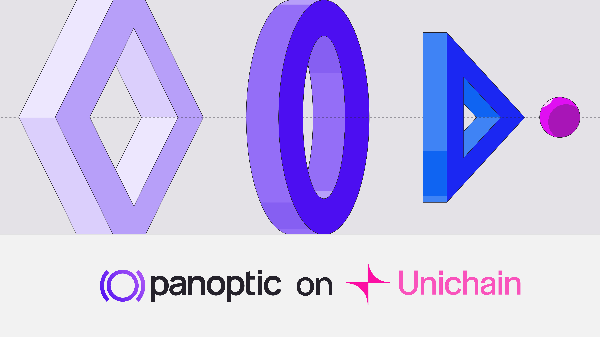

Panoptic, a [DeFi-native options trading platform](http://app.panoptic.xyz), officially launched on [Unichain](https://www.unichain.org/), making liquidity provisioning (LPing) easier than ever for the newly launched Optimism layer-2 network. Panoptic is expanding its LP ecosystem to a fast, low-cost environment and enabling Uniswap LPs to earn higher yields.

## Unichain: Accelerating Liquidity

Unichain is designed to be the home for DeFi liquidity, offering fast finality thanks to one-second block times, with an upgrade to 250-millisecond block times planned. Its architecture reduces transaction costs by up to 95% compared to Ethereum. It also increases decentralization through permissionless fault proofs and the Unichain Validation Network (coming soon).

> _"Launching on Unichain is our first step toward expanding Panoptic to layer 2s. By integrating with Unichain, we're able to offer LPs and options traders a faster and more efficient experience,"_ said Guillaume Lambert, CEO & Founder of Panoptic. _"Panoptic is delighted to launch on Unichain and help it become the liquidity layer for all of DeFi."_

With these capabilities, Unichain aligns closely with Panoptic’s goal of providing Uniswap users with a better way to LP and earn fees sustainably. Thanks to Unichain’s rapid finality and minimal gas fees, LPs and options traders can move assets or adjust strategies with a fraction of the cost seen on other networks. This reduction in friction enables a more dynamic and profitable environment for LPs.

## About Panoptic

Panoptic is a DeFi-native liquidity and perpetual options platform built on top of Uniswap v3 and v4. By leveraging their tokens on Panoptic, Uniswap LPs can earn the same yield they would receive in Uniswap pools, with the advantage of earning an additional spread from traders borrowing LP tokens to create leveraged options positions.

Panoptic's [gRHO platform](https://panoptic.xyz/blog/panoptic-awarded-uniswap-foundation-grant), tailored for passive LPs, offers users the opportunity to earn yield by lending tokens single-sided to other LPs who want to LP on leverage, paying a borrow cost in the process.

For traders seeking to optimize their strategies, Panoptic offers an intuitive platform packed with powerful tools for options and perps trading.

To incentivize participation, the company launched the [Panoptic Incentive Points (Pips) Program](https://app.panoptic.xyz/leaderboard), designed to engage traders of all experience levels and reward them for their contributions. Pips are live for the WETH/USDC (0.3%) and WBTC/WETH (0.3%) markets on Uniswap v3, with additional markets on Uniswap v4 to follow.

The platform has undergone comprehensive [third-party security audits](https://panoptic.xyz/docs/security/security_audits) to ensure integrity and reliability. Panoptic has rolled out a public bug bounty program in partnership with [Cantina](https://cantina.xyz/welcome).

LPs and traders can start using Panoptic on Unichain today, benefiting from a seamless, permissionless experience with minimal transaction costs and unparalleled speed.

### Start Here

-   Access the [Panoptic platform](https://app.panoptic.xyz/)
-   Learn how to [use the Panoptic options trading platform](https://youtube.com/playlist?list=PLB5qwiSwzT_rgH-HvQtDaWTe48xPaF6se&feature=shared)
-   Learn more about [gRHO, the lending interface for Uniswap LPs](https://panoptic.xyz/blog/panoptic-awarded-uniswap-foundation-grant)
-   For a full guide on getting started on Panoptic, read our [docs](https://panoptic.xyz/docs/product/opening-a-position)
    

### Learn More
-   For [passive LPs](https://panoptic.xyz/docs/getting-started/passive-lp)
-   For [Uniswap LPs](https://panoptic.xyz/docs/getting-started/active-lp)
-   For [token launchers](https://panoptic.xyz/docs/product/token-launchers/bootstrap-liquidity)
-   For [traders](https://panoptic.xyz/docs/getting-started/options-traders)
    
_Join the growing community of Panoptimists and be the first to hear our latest updates by following us on our [social media platforms](https://links.panoptic.xyz/all). To learn more about Panoptic and all things DeFi options, check out our [docs](https://panoptic.xyz/docs/intro) and head to our [website](https://panoptic.xyz/)._