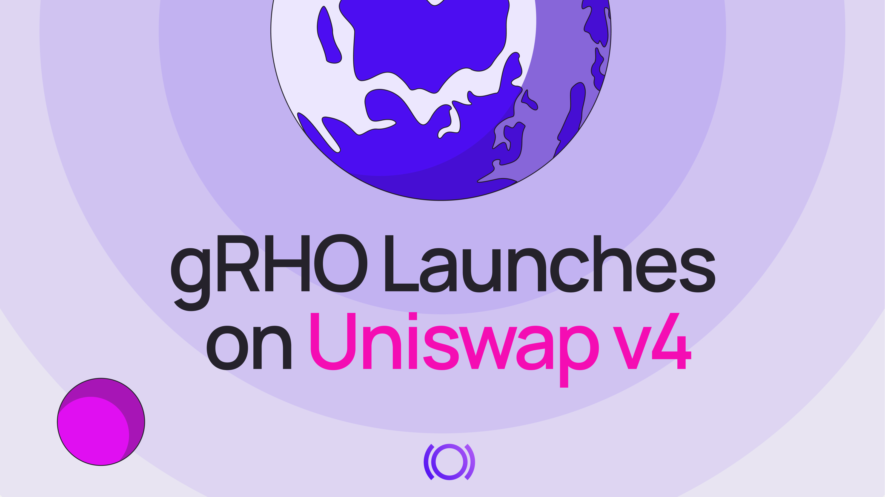
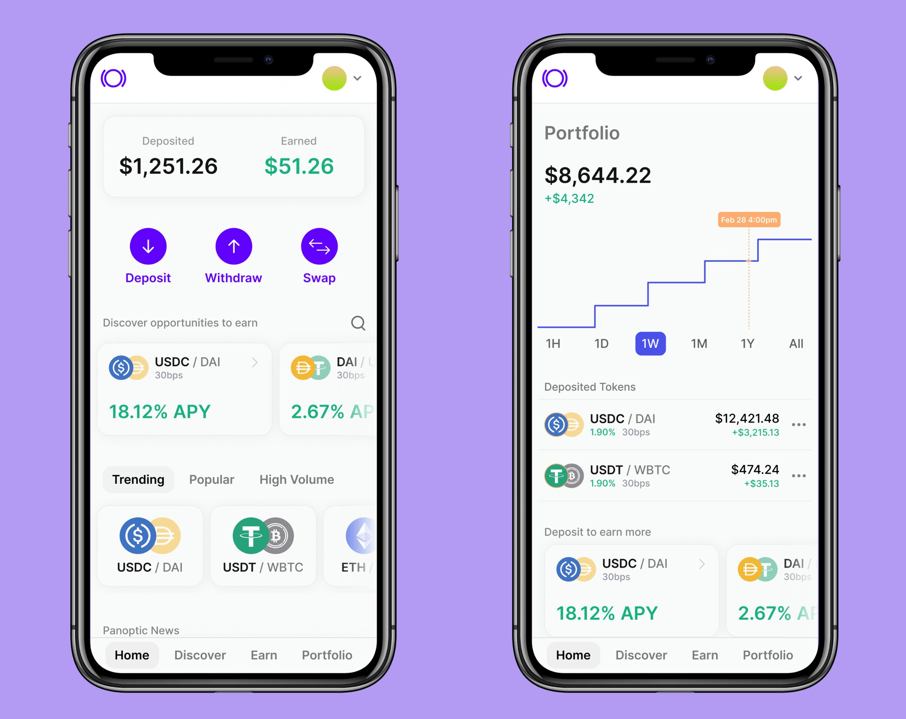

Panoptic, the [DeFi-native options trading platform](http://app.panoptic.xyz), is excited to announce the launch of gRHO (pronounced “grow”) on Uniswap v4. Supported by a [grant from the Uniswap Foundation](https://uniswapfoundation.mirror.xyz/qCp75in7UJA2SwOE66u-FrcsPSK-6UfopAfEWRi1RLQ), gRHO is a new, streamlined liquidity interface that eliminates impermanent loss (IL) and removes the complexities of liquidity providing (LPing) on Uniswap.

Building on Panoptic’s core mission to democratize and simplify DeFi options and LPing, gRHO allows passive LPs to deposit single-sided tokens and earn auto-compounded yields, all without the need for manual rebalancing or price range selection. By offering a “lend-to-LP” model, gRHO gives depositors a way to earn yield while active LPs borrow liquidity to create leveraged positions on Uniswap.

>_“gRHO is all about simplicity and accessibility,”_ said Brandon Ly, Manager of Product & Research at Panoptic. _“For many users, LPing can be intimidating due to impermanent loss and range management. With gRHO, we are ushering in a new era of passive DeFi participation—one where single-sided deposits, automated rebalancing, and zero IL empower everyday users.”_

----------

## Introducing gRHO: Single-Sided Liquidity, Zero IL

Panoptic’s liquidity interface, gRHO, offers users an easier way to LP by eliminating impermanent loss and the complexities of active liquidity management. gRHO enables LPs to passively earn yield by lending single-sided tokens to Uniswap LPs, removing the need for price range selection or manual rebalancing.

### No Impermanent Loss  
gRHO is designed to [remove impermanent loss](/blog/turning-impermanent-loss-into-gain#passive-single-sided-lping)—often the biggest hurdle for aspiring LPs. By lending tokens to active LPs, passive depositors avoid direct exposure to Uniswap pool price fluctuations.

### Single-Sided Deposits  
Passive LPs can deposit tokens in a single asset, such as ETH, WBTC, or USDC. This sidesteps the need to manually manage a token pair or maintain a balanced ratio.

### Auto-Compounded Yields  
Earnings generated by borrowers of these assets are automatically reinvested, leveraging the power of compound interest. Users can deposit once and watch their yields grow over time.

### No Ongoing Maintenance  
gRHO removes the need for manual management. There’s no price range selection, no rebalancing, and no complex fee calculations—ideal for passive users and institutions.

----------

## Key Features and Early Incentives

### Early Panoptic Incentive Points (Pips) Boost

To drive participation and bootstrap liquidity, the company launched the [Panoptic Incentive Points (Pips) Program](https://pips.panoptic.xyz/), designed to engage traders of all experience levels and reward them for their contributions.

To celebrate the launch of gRHO, Panoptic is offering a limited time 2× Pips boost to early depositors within the first week. Any deposit of at least $100 worth of tokens in the following Panoptic pools will qualify:

-   [ETH/USDC 0.05% (v4)](https://grho.panoptic.xyz/markets/?marketAddress=0xdfbfe4c03508648589120350f96e05c780eb6e50)
-   [WBTC/USDC 0.3% (v4)](https://grho.panoptic.xyz/markets/?marketAddress=0x9de7fcb1c561a913427035bb6bbdf516fcf5ae63)
-   [WETH/USDC 0.3% (v3)](https://grho.panoptic.xyz/markets/?marketAddress=0x000000000000305b8621e2475aee38ab5721d525)
-   [WBTC/WETH 0.3% (v3)](https://grho.panoptic.xyz/markets/?marketAddress=0x000000000000100921465982d28b37d2006e87fc)
-   [WBTC/USDC 0.3% (v3)](https://grho.panoptic.xyz/markets/?marketAddress=0x05b142597bedb8ca19be81e97c684ede8c091de8)
    

This special incentive aims to reward the early community of passive LPs.

### Uniswap v4 Support

With Uniswap v4’s advanced hooks, customizable smart contract functionality, and reduced gas fees, gRHO’s integration brings forth an optimized environment for passive LPing. Users can now deposit liquidity in v4 pools, and passive yields on v4 will become activated once the [Panoptic platform](http://app.panoptic.xyz) supports LPs and options traders to borrow these funds on Uniswap v4 (coming soon).

### Accessible for US-based Users

gRHO is now available for US-based users, extending the opportunity to participate in passive LP strategies to a wider audience.

----------

## About Panoptic

Panoptic offers a market-driven solution to [boost LP profitability](/docs/product/spread), an intuitive [interface for perps, options, and institutional investors](http://app.panoptic.xyz/), and a safe way to avoid impermanent loss (IL).

  

Panoptic [eliminates IL](/blog/turning-impermanent-loss-into-gain) by bringing [passive, single-sided liquidity](/blog/bringing-passive-liquidity-to-uniswap) to the Uniswap protocol through gRHO. Passive LPs can lend tokens to other LPs on Panoptic. Passive LPing is as easy as depositing a token, and avoids the hassles of active management, choosing a price range, rebalancing when going out of range, and impermanent loss.

  

The [gRHO platform](https://panoptic.xyz/blog/panoptic-awarded-uniswap-foundation-grant) is a lending interface for Uniswap liquidity, where liquidity providers can borrow from passive LPs, generating yield in the process. That means no [LVR](https://panoptic.xyz/research/panoptic-solves-lvr) or IL for passive LPs who deposit single-sided to earn auto-compounded fees.

  

The platform has undergone comprehensive [third-party security audits](/docs/security/security_audits) to ensure integrity and reliability. Panoptic has rolled out a public [bug bounty program](/docs/security/bug-bounties) in partnership with Cantina.

  

[The gRHO platform is now live on Ethereum mainnet,](http://grho.panoptic.xyz) with vanilla, standard fee tier pools supported. Support for non-standard fee tiers and hook pools will be added next. In Q2 2025, the interface will be made open source and forkable, furthering our commitment to fostering innovation and enabling developers across the ecosystem to build upon and adapt the platform.

### Start Here

-   Access [gRHO, the lending interface for Uniswap LPs](http://grho.panoptic.xyz)
-   Access the [Panoptic platform](https://app.panoptic.xyz/)
    

### Learn More

-   For [passive LPs](https://panoptic.xyz/docs/getting-started/passive-lp)
-   For [Uniswap LPs](https://panoptic.xyz/docs/getting-started/active-lp)
-   For [token launchers](https://panoptic.xyz/docs/product/token-launchers/bootstrap-liquidity)
-   For [traders](https://panoptic.xyz/docs/getting-started/options-traders)