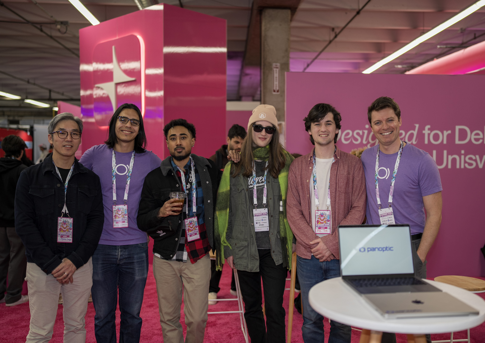

ETH Denver 2025 was an unforgettable experience for the Panoptic team! From showcasing our protocol at Unichain's booth to hosting our own side event, Panopticon, we had the opportunity to connect with some of the brightest minds across DeFi and TradFi. Highlights included a keynote from legendary options trader and founder Tom Sosnoff, a live trading show, and a spirited panel discussion on the future of derivatives in DeFi featuring top industry leaders.

Huge thanks to Unichain for welcoming us at their booth! It was the perfect spot to meet curious minds and passionate users.

Our team was busy throughout ETH Denver, giving non-stop demos, fielding tough questions, and introducing new faces to the Panoptic community. From first-time DeFi explorers to seasoned options traders, we loved diving into the nitty-gritty of how our protocol works and sharing our vision for the future of on-chain options.

We kicked off the ETH Denver festivities on February 28 with Panopticon, an exclusive side event bringing together leading voices from both DeFi and TradFi. The evening was full of thought-provoking conversations, live trading, and valuable community connections.

  

We were honored to host Tom Sosnoff, founder of tastytrade and tastylive. His talk on the intersection of traditional finance and crypto was eye-opening and inspiring, sparking conversations that lasted long after the event. His perspective on risk management and the potential for options in DeFi set the tone for the rest of the evening—and fueled the lively debate afterward.

  
  

Next up, Guillaume and Rosalie took the stage for a [live trading show](https://x.com/i/broadcasts/1yoJModYyYoKQ), proving that even in times of market uncertainty and price dips, options are powerful tools for managing risk and earning premia. Watching real trades in action showcased the real power of Panoptic and how it can offer unique strategies in any market condition.

  

One of the evening’s highlights was our panel discussion on DeFi derivatives. We were joined by some of the sharpest minds in the space, including Joshua Lim (Co-Head of Markets at FalconX), Matthieu Gavaudan (Co-Founder at InfinityPools), Cole Kennelly (Founder & CEO at Volmex), Michael Miller (Head of BD at XBTO), Andrew Stewart (Senior Protocol Strategist at Aera Finance), and Simran Singh (Head of DeFi Trading at GSR).

Beyond the panels and presentations, the best part was meeting so many of you face-to-face. Your questions, ideas, and energy remind us why we’re building Panoptic in the first place. We’re more motivated than ever to push the boundaries of what’s possible with DeFi options and can’t wait to share what’s coming next.

We’re now back to building and pushing the boundaries of what’s possible with DeFi. If you missed us at ETH Denver, don’t worry—we’ve got plenty more in store. Stay tuned for upcoming events and more ways to get involved.

See you next year, ETH Denver!

_Join the growing community of Panoptimists and be the first to hear our latest updates by following us on our [social media platforms](https://links.panoptic.xyz/all). To learn more about Panoptic and all things DeFi options, check out our [docs](https://panoptic.xyz/docs/intro) and head to our [website](https://panoptic.xyz/)_