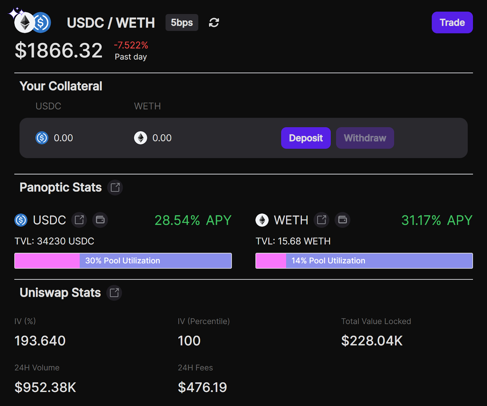
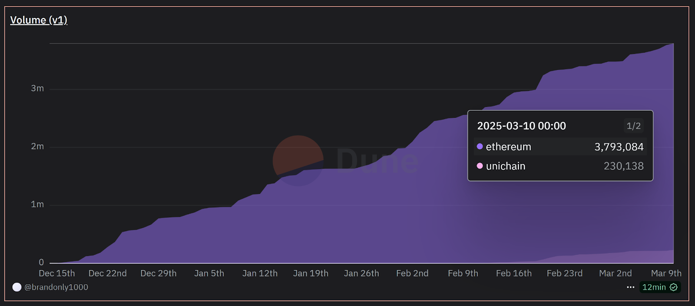

Welcome Panoptimists to the March edition of the Panoptic Newsletter, where we provide industry insights, research recaps, and Panoptic-specific content to keep you updated on our DeFi-native options platform.

If you want future newsletters sent directly to your email, signup on our [website](https://panoptic.xyz/).

## About Panoptic
Discover the future of trading with Panoptic, your gateway to perpetual options in DeFi. Our cutting-edge platform empowers you to manage risk effectively and trade with unprecedented flexibility. Join us and be part of a secure, decentralized revolution in options trading, tailored for both crypto newcomers and experienced traders.

## Panoptic Highlights

### Early Depositor Boost

By popular demand, we're bringing back the [2x Pips boost](https://x.com/Panoptic_xyz/status/1894027877068558799) for deposits of $100+ in qualifying pools—now through Friday (March 14)!

### Unichain Rollout: A Game Changer for LPs

Panoptic has officially [launched](https://x.com/Panoptic_xyz/status/1889797639325229480) on Unichain, bringing enhanced efficiency and accessibility to liquidity provisioning. Designed for speed and cost-effectiveness, Unichain offers one-second block times with an upcoming upgrade to 250-millisecond finality. Its architecture slashes transaction costs by up to 95% compared to Ethereum, significantly improving capital efficiency for LPs and traders. Future updates will further decentralize the network through permissionless fault proofs and the Unichain Validation Network, reinforcing its role as a robust liquidity layer for DeFi. Our [Panoptic Incentive Points System (Pips)](https://app.panoptic.xyz/leaderboard) is already live on Unichain.

By integrating with Unichain, Panoptic is expanding its LP ecosystem, ensuring Uniswap LPs can operate in a faster, more cost-effective environment. Lower gas fees and near-instant execution enable both active and passive liquidity providers to optimize their strategies without the friction of high transaction costs. As Unichain continues to position itself as a leading liquidity hub, Panoptic is making it easier than ever for LPs and traders to earn sustainable yields in a seamless, trustless system.

### Panoptic Launches on Uniswap v4: Introducing Perpetual Options and gRHO for Passive LPs

Panoptic has [officially launched](/blog/panoptic-launches-on-uniswap-v4) on Uniswap v4, introducing perpetual options and a [new passive liquidity interface, gRHO](https://grho.panoptic.xyz). Uniswap v4’s latest upgrade enhances customization, lowers gas fees, and improves transaction efficiency, making it the ideal foundation for Panoptic’s DeFi-native options trading. With this integration, traders can access options on native tokens like ETH without requiring WETH, reducing transaction costs, and simplifying the user experience. Guillaume Lambert, CEO & Founder of Panoptic, emphasized that Uniswap v4’s innovations align with Panoptic’s goal of making LPing more profitable for passive providers while giving active LPs better risk management tools.

gRHO, funded by a grant from the Uniswap Foundation, offers LPs a seamless way to earn yield without managing price ranges or rebalancing positions. Instead, passive LPs can lend single-sided tokens to other LPs, who use them to create leveraged positions on Uniswap. This structure eliminates impermanent loss while ensuring automatic reinvestment and compounding of yields. The launch of Panoptic on Uniswap v4 sets the stage for gRHO’s wider adoption, providing a more efficient alternative for liquidity providers looking to maximize returns without the complexities of active management.

Uniswap v4’s native token support eliminates the need for WETH, streamlining transactions and significantly reducing gas fees. The upgrade also introduces hooks—customizable smart contract functionalities that enable embedded liquidity incentives, new derivative structures, and advanced lending mechanisms. By integrating with these next-generation liquidity pools, Panoptic enhances LP strategies while making options markets more accessible and cost-effective. With its v1.1 contracts live on Ethereum mainnet and Uniswap v4 support rolling out soon, Panoptic continues to redefine DeFi options trading, paving the way for future expansion to L2 and EVM-compatible chains.

## Panoptic in the Markets

A Panoptic user recently [sold a strangle](https://app.panoptic.xyz/positions/ethereum/0x5002f3a02030500301b0403003c8ad599c3a0ff?view_as=0x53e213da8c28d85dc6663c3b5e35bb0ffbb05752&block_number=21781605) by writing both a put at a 2774 strike and a call at a 3976 strike on ETH, with a notional size of **3 WETH** in total. The position was opened with a **margin requirement of approximately 3,792 USDC**, reflecting both legs of the trade.

**Position Specs:**
-   Short Put: 2774 strike, ∆: 1.00, v: 1.00x, Notional ≈ 8,322 USDC    
-   Short Call: 3976 strike, ∆: 0.00, v: 1.19x, Notional ≈ 11,927 USDC
-   Contracts: 3 WETH 
-   Initial Margin Requirement: ~3,792 USDC
    
**Results:**
-   Profit and Loss (P/L): +4.82% (≈ +976.6 USDC)
-   Premia Earned: +6.91% (≈ +1,399 USDC)

By opening both a short call and a short put, the trader collected [streamia](/docs/product/streamia) from two directions. Their strategy likely hinged on ETH’s price staying within the 2,774–3,976 range during elevated implied volatility. Thanks to the heightened volatility, the premiums were priced richly, allowing the trader to collect a larger-than-usual streaming premium.

When market conditions settled, implied volatility subsided, and the trader was able to profit from  time decay on both option legs. By monitoring ETH’s price moves and actively managing their risk, they locked in a combined gain on the short strangle—securing both the put and call premiums before any large move in ETH could threaten their position. The overall result amounted to over **6.9%** in accumulated premiums, while still earning a healthy **+4.82%** in realized P/L.

This trade highlights how Panoptic’s real-time streamia accrual can be harnessed to capture time decay and volatility convergence without the overhead of constant rebalancing. With margin requirements set on-chain, the position’s health is transparent, and users can flexibly close or adjust based on market dynamics, all while benefiting from Panoptic’s permissionless environment.

## Panoptic in the Media

## Spotlights

### Panoptic at Unichain’s ETH Denver Booth 
 
Panoptic was an official collaborator at [Unichain’s ETH Denver booth](https://x.com/Panoptic_xyz/status/1897765675034460456). Huge thanks to Unichain for welcoming us at their booth! It was the perfect spot to meet curious minds and passionate users.

Our team was busy throughout ETH Denver, giving non-stop demos, fielding tough questions, and introducing new faces to the Panoptic community. From first-time DeFi explorers to seasoned options traders, we loved diving into the nitty-gritty of how our protocol works and sharing our vision for the future of on-chain options.

### Panopticon: ETH Denver Side Event  

We hosted [Panopticon](https://x.com/Panoptic_xyz/status/1895504745881903146), our ETH Denver side event featuring [expert speakers](https://x.com/Panoptic_xyz/status/1897721776622518749) from GCR, XBTO, Infinity Pools, Aera, FalconX, and Volmex. A [special keynote](https://x.com/Panoptic_xyz/status/1897520317494591799) was delivered by Tom Sosnoff, co-founder of tastytrade and tastylive, bridging the gap between traditional finance options and on-chain derivatives.

### New Pips Markets: Earn More in BTC & Beyond

Panoptic just [added](https://x.com/Panoptic_xyz/status/1894027877068558799) four new markets to its Panoptic Incentive Points (Pips) program, including a WBTC market on Ethereum Mainnet. Whether you’re depositing tokens, LPing, or trading options in these pools, you can now rack up even more Pips. Look for the Pips icon on WETH/USDC (0.05%) on Unichain and WBTC/USDC (0.30%), WETH/USDC (0.30%), WETH/WBTC (0.30%), and ETH/USDC (0.05%) on Ethereum—and start growing your DeFi rewards today.

### Join the Panoptic USDC Deposit Campaign on DeBank!

The Panoptic Passive Liquidity Quest is now [live on DeBank](https://debank.com/stream/3032584), offering users the chance to deposit USDC into the USDC/WETH market on Panoptic and earn passive yields—with no impermanent loss. Plus, participants can win one of five $100 cash prizes and collect Pips for their contributions to this evolving DeFi ecosystem.

### Track Panoptic on Dune

Keep tabs on Panoptic’s growing ecosystem by visiting our [Dune dashboard](https://dune.com/brandonly1000/panoptic), where you can monitor trading volume, the number of active markets, and more. Stay tuned for additional charts and analytics designed to give you even deeper insights into Panoptic’s perpetual options platform.

## Up Next

The [gRHO platform](http://grho.panoptic.xyz/) is officially live on Ethereum mainnet, with deposits in select pools now earning a limited-time 2x Pips boost! Borrowing from gRHO’s v4 pools will be added soon on [app.panoptic.xyz](https://app.panoptic.xyz). Stay tuned for more updates!

*Join the growing community of Panoptimists and be the first to hear our latest updates by following us on our [social media platforms](https://links.panoptic.xyz/all). To learn more about Panoptic and all things DeFi options, check out our [docs](/docs/intro) and head to our [website](https://panoptic.xyz/).*
