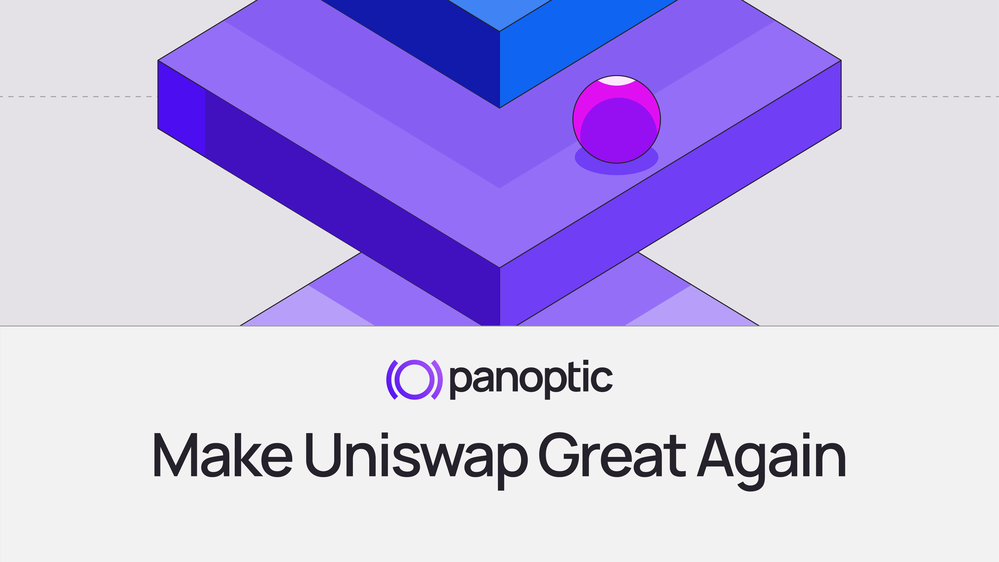
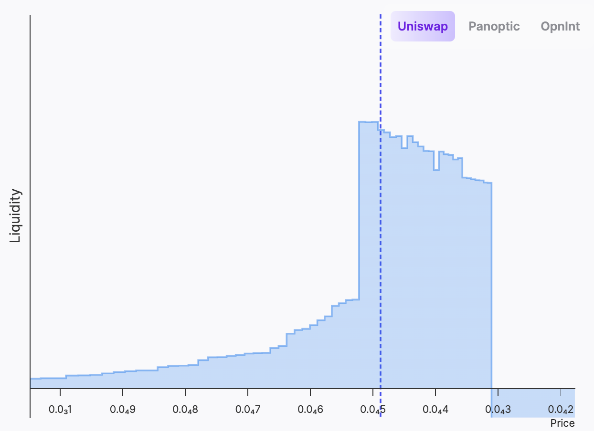
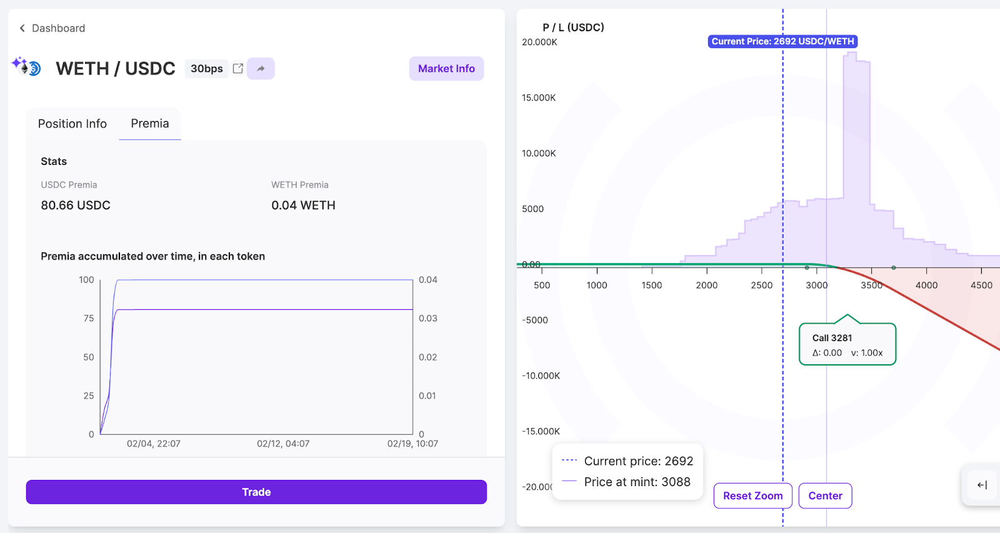
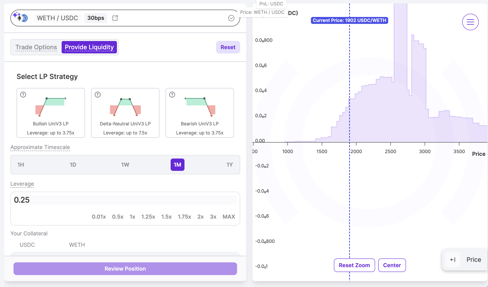
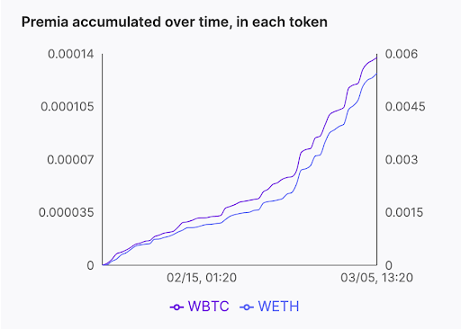
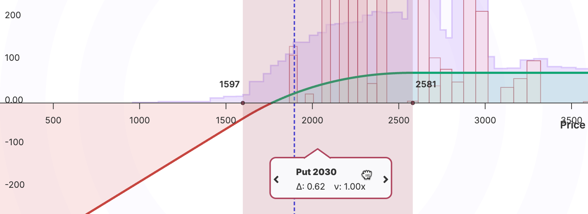
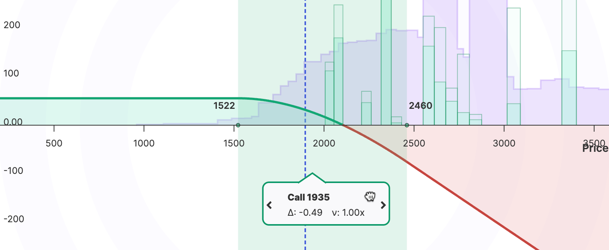
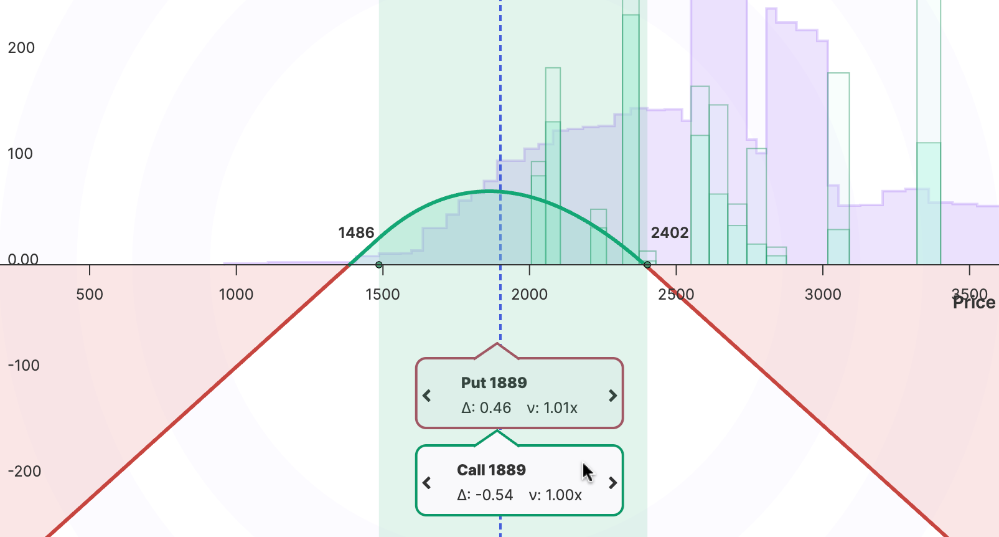

In the ever-evolving world of decentralized finance (DeFi), liquidity providers (LPs) play a crucial role in ensuring the smooth functioning of trading platforms. Panoptic is a DeFi platform offering enhanced profitability and advanced strategies for LPs.

LPs are Essential for:
-   Providing necessary liquidity for token swapping
-   Enabling price discovery
-   Supporting the overall stability and efficiency of decentralized markets

By contributing to liquidity pools, LPs act as decentralized market makers, a role traditionally held by centralized entities.

## Why Panoptic? More Profit, More Control, No Extra Effort

Liquidity providers on Uniswap are leaving money on the table—Panoptic [changes that](/research/loss-versus-panoptic-why-lps-are-losing). By integrating options into LP positions, Panoptic supercharges earnings, turning regular Uniswap fees into a more lucrative opportunity.

In the WETH/USDC market, Panoptic LPs have seen earnings soar—up to **67% more**, with a 3.1x increase in returns. For example, this LP position (shown below) would have only collected $61 in fees on Uniswap, while the same position on Panoptic brought in $186. That extra $125 came from an options buyer borrowing the LP position to execute a covered call strategy—an additional revenue stream Uniswap LPs are completely missing out on.

And the advantage doesn’t stop there. When prices drop, Uniswap LPs lose. However, on Panoptic, LPs can profit from price declines by structuring bearish positions.

The same example above saw LPs earning:

-   19% from Uniswap fees
-   40% from options premiums
-   41% from the price drop

That’s real, data-backed profit that Uniswap LPs are leaving behind. If you’re providing liquidity, ask yourself: Why settle for one stream of income when you could have multiple? Panoptic makes it possible—seamlessly, passively, and without changing your core LP strategy.

## Why Do Liquidity Providers Offer Their Assets?

LPs are motivated by several factors:

1.  Earning Fees: LPs receive a portion of trading fees generated by their pool, creating a passive income stream
2.  Passive Income: Opportunity to earn yield on idle assets without active trading
3.  Supporting the DeFi Ecosystem: Enabling decentralized trading on tokens through automated market making of their liquidity
    

> _Users can earn WBTC and WETH fees by providing liquidity in the pool._

## The Hurdles of LPing

Liquidity providers have faced several significant challenges impacting their profitability:

-   [Impermanent Loss (IL)](/blog/turning-impermanent-loss-into-gain): LPs may experience underperformance compared with HODLers when the price of the assets in a liquidity pool changes relative to when they were deposited
-   [Loss-Versus-Rebalancing (LVR)](/research/panoptic-solves-lvr): LPs may experience underperformance compared with actively rebalanced positions
-   Oversupply of Liquidity: An excess of liquidity in popular pools can dilute returns, as trading fees are distributed among a larger number of LPs
-   Active Management Difficulties: Managing liquidity positions requires constant monitoring and decision-making, which can be complex and time-consuming
    

The persistent challenges in liquidity provision have significantly undermined profitability and hindered the DeFi ecosystem's growth. Panoptic, built on top of Uniswap, offers an innovative solution that enables users to participate comprehensively in market dynamics while providing liquidity providers with advanced tools to mitigate traditional operational struggles.

## 3 Ways to LP– Which One Actually Profits?

### Bullish LP Position
The  most common–and only way–to LP on Uniswap is a **bullish LP Position**. Here, the LP buys tokens and pairs them with ETH (or another quote asset) in a specific price range. This approach is fundamentally bullish because it profits if the token's price increases but incurs losses if the price falls.
  

#### How it works
-   The LP deposits their own tokens and ETH into a liquidity pool.
-   As the price rises, the LP sells tokens for more ETH.
-   If the price drops, the LP ends up holding more of the depreciating token, leading to realized losses.

#### Why it’s hard to profit
Some tokens underperform ETH over time, making this **positive-delta strategy** inherently risky. If the token falls in value relative to ETH (or some other quote asset), the LP holds more of a declining asset, locking in a loss. Without constant management, LPs can lose a lot.

### Bearish LP Position

**A bearish LP position** is a more advanced strategy that inverts the bullish position. Instead of buying and depositing tokens, the LP **borrows** the asset using ETH as collateral, swaps part of it for ETH, and then provides liquidity. This allows the LP to profit when the token price falls.
 

#### How it works
-   The LP borrows tokens (e.g., using a lending protocol) and pairs them with ETH.
-   If the token price decreases, the value of the borrowed position increases, offsetting IL.
-   This is a **negative-delta strategy**, meaning it profits from price declines and loses if the token price rises.
    
#### Why it’s more profitable

Some tokens have a negative drift, meaning they trend downward relative to ETH. This strategy takes advantage of that bias, allowing LPs to turn falling prices into profit rather than loss.

### Delta-Neutral LP Position

The **Delta-Neutral LP Position** is the **most capital-efficient and profitable method of LPing.** It combines elements of the bullish and bearish strategies but balances exposure to minimize directional risk. Instead of borrowing the full value of the LP position, the LP only borrows half the required tokens, reducing exposure while maintaining liquidity.
 

#### How It Works
-   The LP borrows half the token value and pairs it with ETH.
-   If the price moves in either direction, the loss is [smaller](https://x.com/guil_lambert/status/1897012853514629327) compared to bullish or bearish positions.
-   This position profits the most when the price remains **within range**, allowing the LP to capture fees from both sides.

#### Why it’s the most capital-efficient
Delta-neutral positions have [half the risk](/docs/trading/capital-efficiency#short-straddles-and-strangles) compared to directional positions (bullish or bearish). This efficiency allows LPs to deploy more capital elsewhere while maintaining substantial fee income.

The most important thing to remember is that prices fluctuate unpredictably, making it difficult to time their rises and falls. Instead of trying to predict price movements, traders may be better off focusing on volatility by using delta-neutral, range-bound strategies.

## Panoptic's Unique Advantages for LPs

Panoptic offers several innovative features that make it an appealing choice for LPs:

1.  **Enhanced Profitability:** Potential to [earn up to 3x more fees](/docs/product/spread) than Uniswap LP positions, helping to offset IL risks through fees
2.  **Expanded LP Strategies:** More flexibility with the ability to choose from bullish, bearish, and delta-neutral LPing
3.  **Expanded Options Strategies:** Engage in options trading strategies such as [calls, puts, strangles, or straddles,](/research/essential-options-strategies-to-know) providing more tools for active management
4.  **Mitigating Oversupply Issues:** Address challenges of [oversupply in Uniswap pools](/research/comparing-uniswap-deribit-implied-volatilities#technical-comparison-between-uniswap-iv-and-deribit-index-volatility) by enabling users to borrow and remove liquidity
5.  **Empowerment Through Education:**  [Research](/research) and [educational content](/docs/getting-started/active-lp) for personalized strategies to empower users to make decisions that best fit their needs.

| Feature              | Traditional LP      | Panoptic LP              |
|----------------------|---------------------|--------------------------|
| Profitability    | Standard pool fees  | Up to 3x higher returns  |
| Options Trading  | Selling puts        | Expanded strategies available |
| Oversupply Mitigation | Vulnerable to losses  | Active management tools    |

## What's Next for LPs in DeFi?

Why settle for ordinary returns when you can unlock multiple revenue streams? Panoptic empowers LPs with the tools to implement advanced, data-driven strategies. Whether you choose to go bullish, bearish, or delta-neutral, Panoptic makes earning higher returns possible. The next era of liquidity provision is here—offering LPs new ways to maximize their returns.

*Join the growing community of Panoptimists and be the first to hear our latest updates by following us on our [social media platforms](https://links.panoptic.xyz/all). To learn more about Panoptic and all things DeFi options, check out our [docs](https://panoptic.xyz/docs/intro) and head to our [website](https://panoptic.xyz/).*
