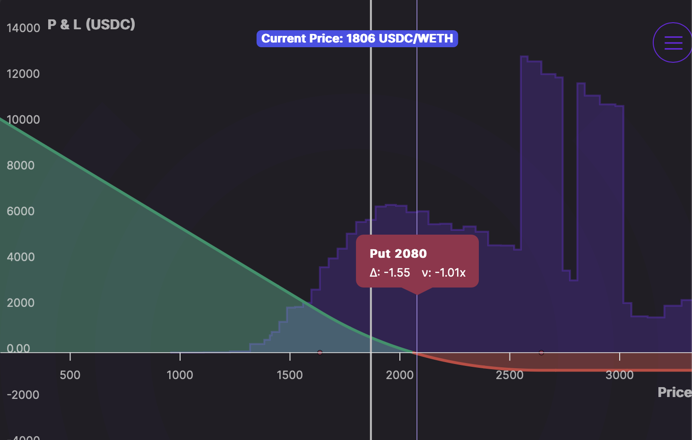
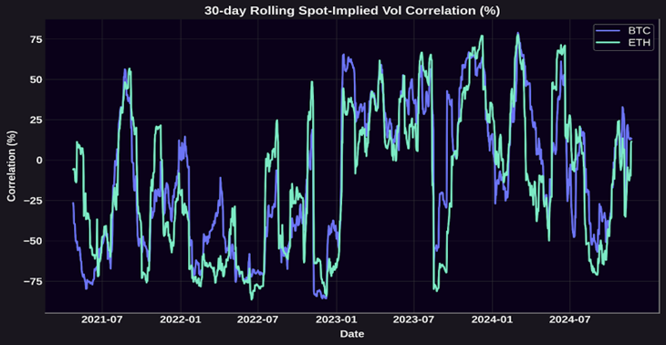
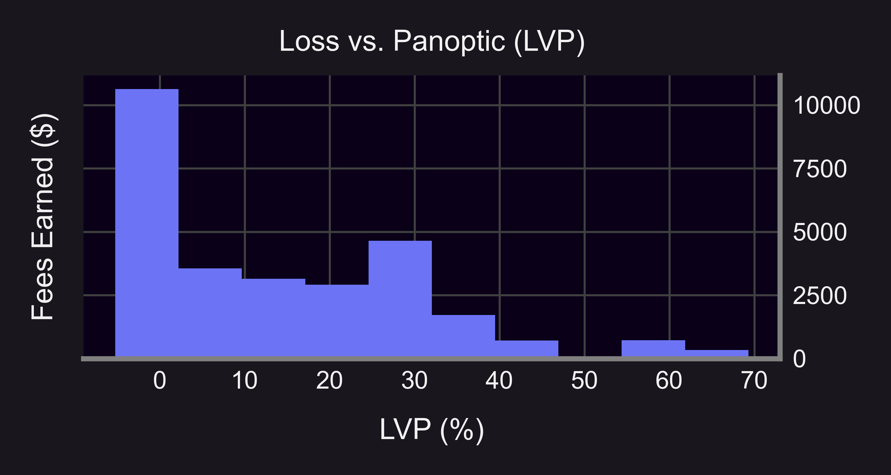

Welcome Panoptimists to the April edition of the Panoptic Newsletter, where we provide industry insights, research recaps, and Panoptic-specific content to keep you updated on our DeFi-native options platform.

If you want future newsletters sent directly to your email, signup on our [website](https://panoptic.xyz/).

## About Panoptic
Discover the future of trading with Panoptic, your gateway to perpetual options in DeFi. Our cutting-edge platform empowers you to manage risk effectively and trade with unprecedented flexibility. Join us and be part of a secure, decentralized revolution in options trading, tailored for both crypto newcomers and experienced traders.

## Highlights

### ETH Yield Surge: 20% APY for Passive LPs

March saw annualized [ETH yields on Unichain at over 20%](https://x.com/Panoptic_xyz/status/1905047141309120624) on Panoptic’s [gRHO interface](https://grho.panoptic.xyz). Passive LPs earned more by simply parking their ETH and outsourcing the risks of impermanent loss to others. No rebalancing. No hassle. Just smart yield.

### Panoptic Team Takes on Key Conferences

Following their appearance at Digital Asset Summit in NYC this March, the team will be at Paris Blockchain Week and Token 2049 Dubai. [Reach out to the team](https://discord.com/invite/8sX5Af2KXG) to connect!

### 2× Pips Boost for Early gRHO Depositors

To reward early adopters, Panoptic offered a limited-time 2× Pips boost for users who deposited $100+ into any Pips pool on [gRHO](https://grho.panoptic.xyz). The chance to snag a [boost](https://x.com/Panoptic_xyz/status/1900575592665551336) wrapped up on March 21—but not before giving active LPs a solid edge.

### Builder Stories: Guillaume Talks Panoptic with Uniswap Foundation

Panoptic’s co-founder, Guillaume Lambert, was featured in [April’s Builder Stories](https://uniswapfoundation.mirror.xyz/2ic8OAy1a5VjZfZacWp54J3LMbeT7hLrx635D7CBcFg?1) by the Uniswap Foundation, diving into whether AMMs are dead, why LP = options, and how [gRHO](https://grho.panoptic.xyz) reimagines the passive LP experience. The interview highlighted Panoptic’s role in solving impermanent loss and letting LPs stay passive while earning actively.

### Volatility Deep Dive: Panoptic Chat on IV Trends

This month’s [Options Hour](https://x.com/Panoptic_xyz/status/1902389728827339077) broke down implied volatility across IBIT, Deribit, and Uniswap. The team explored why BTC IV rank remained low despite macro volatility, and how traders were positioning around the Fed meeting using Panoptic puts.

## Markets

### ETH Trader Captures 5.5% Gain Using Leveraged Put Position

Looking at the WETH/USDC [trade](https://app.panoptic.xyz/positions/ethereum/0x11c95bbbd8783ec3a714fa0a57c93bc218f50ee9f621be83634c4b49d311bedc%2313/?view_as=0x8afad0586ce511ac9be1f7d6b4b86a360794b008) displayed in these images, we can observe a Put-1M-long position with several notable characteristics. The trader has allocated 1,249 USDC in margin to control a position with a notional value of 12,010 USDC, establishing an approximately 10:1 leverage ratio. The position was initiated with a strike price of 2080 USDC and maintained a trading range of 1636 to 2644 USDC, demonstrating how on-chain options positions can be structured with specific customization.

The position's performance data shows a 52.5% profit (approximately 661 USDC) on the used margin over three days, coinciding with Ethereum's price movement from around 2078 USDC at position entry to approximately 1900 USDC at the time of the screenshot. This price decline benefited the long put position as expected. What distinguishes this particular setup from traditional options is that the position accumulates premia costs over time as ETH price moves within defined range bounds, but ultimately paid less than 0.4% (43.68 USDC) on the notional in [streamia](https://panoptic.xyz/docs/product/streamia). This represents one approach to on-chain options trading that combines elements of both options strategies and liquidity provision mechanics. The structure maintains directional exposure while paying for that exposure through streamia, demonstrating how traders can potentially optimize capital efficiency while expressing market views through parametric positions.

## In the Media

### The Seven Gamma Traps Driving Crypto's Volatile Feedback Loops

In recent decades, volatility suppression strategies have ironically become amplifiers of market turmoil, with crypto markets particularly susceptible to self-perpetuating price feedback loops. [Panoptic Research explores](https://x.com/Panoptic_xyz/status/1904889478310973576) seven structural "[gamma traps](https://panoptic.xyz/research/crypto-gamma-traps)" unique to crypto markets that enable wild price action and create extreme volatility as a norm rather than an exception.

From Deribit's coin-margined options that create liquidation cascades when collateral value drops alongside positions, to Uniswap's LP rebalancing mechanism that causes a price doom loop, these embedded systems create compounding market movements. DeFi Option Vaults (DOVs) further exacerbate volatility by placing retail traders at a disadvantage with their short gamma strategies and auction timing that is often front-run by market makers, systematically depressing implied volatility during auctions.

Unlike traditional markets where options market makers typically maintain long gamma inventory, crypto derivatives markets frequently experience periods of negative Gamma Exposure (GEX), forcing market makers to buy into rallies and sell into downturns to maintain delta-neutrality. This problem is compounded by crypto's predominant "sticky delta" volatility regime, where implied volatility positively correlates with price movements, causing traders to systematically over-hedge OTM puts during downturns and under-hedge OTM calls during upswings.

Additional factors like the negative vanna gamma squeeze (where short OTM calls create explosive upward price movements in positive spot-volatility correlation environments) and crypto's negative convenience yield (which incentivizes spot holders to sell during downturns) complete the seven-pronged cocktail of structural mechanisms that make extreme volatility an inherent characteristic of crypto markets rather than an unusual anomaly. These characteristics cannot be resolved, but they can be traded—particularly through strategies that go long on volatility.

### Panoptic Reveals Hidden Revenue Potential for Uniswap LPs with Loss Versus Panoptic (LVP) Metric

Our [research](https://t.co/tP7w2f1nCQ) on the "Loss Versus Panoptic" (LVP) metric reveals that liquidity providers (LPs) on Uniswap may be earning substantially less than possible—in some cases just one-third of potential revenue. The metric measures the difference between fees earned by providing liquidity directly on Uniswap versus through Panoptic's decentralized options protocol.

Research shows LVP values typically hovering around 15-20% in the WETH-USDC pool, but climbing as high as 67% in certain pools. This means Uniswap LPs could be leaving significant revenue on the table. A compelling real-world example demonstrates how a WETH-USDC position that would earn approximately $61 in fees when providing directly on Uniswap v3 captured around $186 when deployed through Panoptic—representing a 3.1× increase in yield.

Panoptic achieves this enhanced profitability by layering an on-chain perpetual options market on top of Uniswap v3 and v4. LPs lend their positions to options traders who pay both the standard swap fees plus an additional premium called the "Panoptic spread." This creates a strictly more profitable arrangement for liquidity providers when there's demand for options.

Beyond higher returns, Panoptic offers LPs unprecedented flexibility to create bullish, bearish, or delta-neutral positions, overcoming the inherent bullish bias of traditional Uniswap LP positions. In one documented example of a bearish position, an LP earned $316.10 in total profits, with only 19% coming from base Uniswap fees, 40% from additional options premiums, and 41% from price movement as ETH dropped.

This combination of higher returns through the "Panoptic spread" and the ability to profit in different market conditions represents a significant evolution in DeFi liquidity provision, potentially transforming standard LP strategies into a more dynamic and profitable approach.

  

## Up Next  
Panoptic V1.1, for Uniswap V4, is now [live](http://app.panoptic.xyz) on Ethereum. V1.1 has rolled out for standard fee tier, non-hook pools. Non-standard fee tiers and hook pools will roll out in Q2 2025. Additional Layer-2 support and trading competitions will be coming soon. Stay tuned for more updates!

  
_Join the growing community of Panoptimists and be the first to hear our latest updates by following us on our [social media platforms](https://links.panoptic.xyz/all). To learn more about Panoptic and all things DeFi options, check out our [docs](https://panoptic.xyz/docs/intro) and head to our [website](https://panoptic.xyz/)._