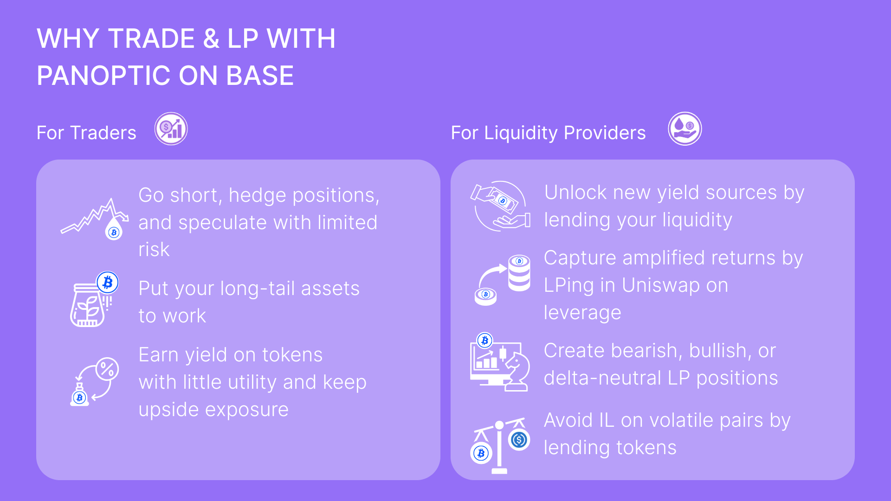

Panoptic Launches on Base

We are excited to announce that [Panoptic](https://app.panoptic.xyz/), the DeFi-native perpetual options platform built on Uniswap, has officially launched on Base! To celebrate, we’re kicking off a two‑week trading competition on Base—with $5,000 in cash prizes, over 5 million Pips, and a jumbo Rilakkuma plushie—open to all traders.

This launch unlocks a new frontier for degens, strategists, and onchain power users. Base’s low fees and fast finality make it the perfect playground for trading—and now with Panoptic, you can take those plays even further. Go beyond simple swaps and LPing: build perpetual, gas-efficient options strategies directly onchain. Whether you're hedging, farming, or looking for asymmetric upside, Panoptic on Base is your new power tool.

> _The Panoptic [app](https://app.panoptic.xyz/) is only available to non-US users, while [gRHO](https://grho.panoptic.xyz/) is available globally._

## Why trade and LP with Panoptic on Base?

### For Traders

-   Go short, hedge positions, and speculate with limited risk
-   Put your long-tail assets (like BRETT) to work
-   Earn yield on tokens with little utility and keep upside exposure
    

### For Liquidity Providers

-   Unlock new yield sources by [lending your liquidity](https://panoptic.xyz/docs/product/spread) 
-   Capture amplified returns by LPing in Uniswap on leverage
-   Create bearish, bullish, or [delta-neutral LP positions](https://panoptic.xyz/blog/make-uniswap-great-again#3-ways-to-lp-which-one-actually-profits)
-   Avoid impermanent loss on volatile pairs by lending tokens [(passive LPing)](https://panoptic.xyz/docs/getting-started/passive-lp)
    

  

The Base ecosystem is growing fast—and Panoptic brings the tools to stay ahead of the meta.

# Base: Bringing the World Onchain

Base is designed to be a secure, low-cost, builder-friendly Ethereum Layer 2 solution aimed at bringing the next billion users onchain. With its architecture, Base offers significantly reduced transaction costs compared to Ethereum mainnet, facilitating seamless and efficient onchain experiences. ​

  

> _"Integrating with Base marks a significant milestone for Panoptic,"_ said Guillaume Lambert, CEO & Founder of Panoptic. _"By launching on Base, we can offer LPs and options traders a faster and more cost-effective experience, aligning with our mission to make options trading more accessible and efficient."_

# About Panoptic

Panoptic is an onchain liquidity and perpetual options platform built on top of Uniswap v3 and v4. Panoptic gives LPs new ways to interact with onchain options through an interactive interface layered on Uniswap.

  

Panoptic's [gRHO platform](https://grho.panoptic.xyz/), the passive LP interface built for [Uniswap](https://panoptic.xyz/blog/panoptic-awarded-uniswap-foundation-grant), offers users the opportunity to earn yield by lending single-sided tokens to other LPs who want to LP on leverage, paying a borrow cost in the process.​

  

For traders seeking to optimize their strategies, whether that is perps, LPing, or options, Panoptic provides an intuitive platform equipped with powerful tools.

## Base Incentives

Panoptic launched the [Panoptic Incentive Points (Pips) Program](https://app.panoptic.xyz/leaderboard), designed to engage traders of all experience levels and reward them for their contributions.

### Base Markets Receiving Pips

Anyone can earn Panoptic Incentive Points simply by depositing or trading in our eligible Base markets. Every deposit, LP, or options trade in the following markets can credit your account with Pips. Look for the ✨ icon!

-   ETH/USDC 5bps v4
-   USDC/cbBTC 5bps v4

Panoptic has undergone comprehensive [third-party security audits](https://panoptic.xyz/docs/security/security_audits) to ensure integrity and reliability. Panoptic has rolled out a public bug bounty program in partnership with [Cantina](https://cantina.xyz/welcome).

LPs and traders can start using Panoptic on Base today, benefiting from a seamless, permissionless experience with lower gas fees.

## Trading Competition

Panoptic is kicking off a two-week trading competition on Base, featuring a prize pool of $5,000 in cash rewards, over 5 million Pips, and a jumbo Rilakkuma plushie!

Starting May 5, traders can participate by opening options positions in the ETH/USDC 5bps v4 market on Base. Just connect your wallet, deposit funds, and start trading. [Sign up early on our website](https://panoptic.xyz/) to receive a 1.1x Pips boost and get notified when the competition begins!

### Start Here

-   Access the [Panoptic platform](https://app.panoptic.xyz/)
-   Learn how to [use the Panoptic options trading platform](https://youtube.com/playlist?list=PLB5qwiSwzT_rgH-HvQtDaWTe48xPaF6se&feature=shared)
-   Learn more about [gRHO, the lending interface for Uniswap LPs](https://panoptic.xyz/blog/grho-launches-on-uniswap-v4)
-   For a full guide on getting started on Panoptic, read our [docs](https://panoptic.xyz/docs/product/opening-a-position)
    

### Learn More

-   For [passive LPs](https://panoptic.xyz/docs/getting-started/passive-lp)
-   For [Uniswap LPs](https://panoptic.xyz/docs/getting-started/active-lp)
-   For [token launchers](https://panoptic.xyz/docs/product/token-launchers/bootstrap-liquidity)
-   For [traders](https://panoptic.xyz/docs/getting-started/options-traders)
    
    
_Join the growing community of Panoptimists and be the first to hear our latest updates by following us on our [social media platforms](https://links.panoptic.xyz/all). To learn more about Panoptic and all things DeFi options, check out our [docs](https://panoptic.xyz/docs/intro) and head to our [website](https://panoptic.xyz/)._