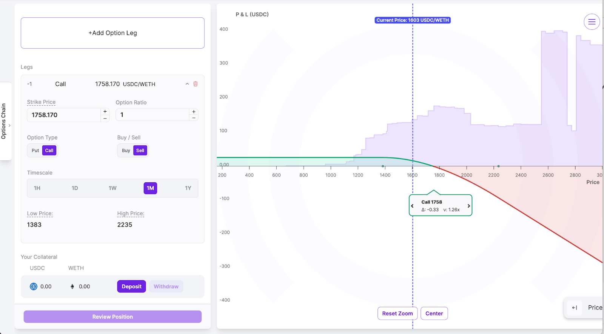

  

We're kicking off an exclusive, limited-time trading competition to celebrate our launch on Base—rack up points, win cash rewards, and compete for epic prizes! Whether you're an options expert, LP, or just getting started, this is your moment to get rewarded for trading.

Anyone can join—just trade in the designated [ETH/USDC 5bps v4 market on Base](https://app.panoptic.xyz/markets/base/0x36a3088b94f73853a3964a0352b47605c6354f27) to participate. The highest PnL and volume will be awarded, but there is more than one prize to win.

### Minimum deposit: $100
You’re welcome to deposit more than the minimum required. Just keep in mind that a higher deposit means you'll need a higher percentage return to rank competitively.

  

If you withdraw any collateral during the competition, your performance will still be evaluated based on the maximum, cumulative amount of funds you had deposited during the event. This ensures fair comparison across all participants.

## Prizes

### Total Prize Pool

-   Pips: 5,000,000+ Pips
-   USDC: $5000
-   Bonus: Jumbo 23” plushie
    

### Highest PnL % (Top 50)

-   🥇 1st place: 1,000,000 Pips + $1,400 USDC
    
-   🥈 2nd place: 500,000 Pips + $700 USDC
    
-   🥉 3rd place: 250,000 Pips + $400 USDC
    
-   4th–10th: 100,000 Pips + $100 USDC each
    
-   11th–20th: 50,000 Pips + $50 USDC each
    
-   21st–50th: 25,000 Pips each  
      
    

### Highest Volume (Top 3)

-   🥇 1st place: 1,000,000 Pips + $700 USDC + jumbo plushie
    
-   🥈 2nd place: 500,000 Pips + $400 USDC
    
-   🥉 3rd place: 250,000 Pips + $200 USDC
    

Good luck, and may the best trader win!

## Timeline

    Start Date: May 5 at 17:00 UTC
    End Date: May 19 at 17:00 UTC
    Duration: 2 weeks total

## How to Participate

### 1. Head to the [Panoptic app](https://app.panoptic.xyz/)

  

Launch the Panoptic app and switch your network to Base.

  

### 2. Open the [ETH/USDC 5 bps Market](https://app.panoptic.xyz/markets/base/0x36a3088b94f73853a3964a0352b47605c6354f27)

  

Tap “Markets” and select the ETH/USDC 5 bps v4 pool.

  

Click ‘Trade’.

  

  

### 3. Deposit ETH and USDC

Hit the Deposit button. Enter the amounts of ETH and USDC you want to add (minimum $100 total). Make sure to deposit a little bit of both tokens for a smoother trading experience. Confirm in your wallet to fund your competition balance.

  

### 4. Select a strategy

Click “Strategies” and pick the style that fits your market view:

-   Bullish (e.g. long call)
    
-   Bearish (e.g. long put)
    
-   Neutral (e.g. strangle)
    

Tap your preferred strategy and review the projected payoff chart.

  

### 5. Open your position

  

Adjust strike price, timescale, and contract size. Check fees and risk parameters. Hit Review Position and confirm in your wallet.

  

### 6. Monitor the leaderboard

  

Head to the Leaderboard tab and click ‘Competition’. Track your rank under PnL % and Volume columns over the two‑week event. Your final PnL % standing is based on gains on your cumulative deposits. Your volume standing is based on the size and frequency of trades placed.

  

For more information on how to [open a position](https://panoptic.xyz/docs/product/opening-a-position), [close a position](https://panoptic.xyz/docs/product/closing-a-position), and [manage](https://panoptic.xyz/docs/product/position-management) your trades on Panoptic, visit our [docs](https://panoptic.xyz/docs/intro).

## How to Get ETH or USDC on Base

### Fund Your Wallet

-   You can send ETH from your [Coinbase](https://exchange.coinbase.com/assets) account to fund your Base wallet
    

### Bridge to Base

-   Use the official Base bridge: [https://bridge.base.org](https://bridge.base.org)
-   Bridge ETH or USDC from Ethereum mainnet to Base
-   Use [Uniswap](https://app.uniswap.org/):
    -   Connect your wallet 
    -   Under ‘Sell’, select ETH or USDC
    -   Under ‘Buy, choose ETH or USDC (select ‘Swap across networks’ and choose the asset with the Base logo)
    

>_Disclaimer: Panoptic provides these external links and sources for your convenience. However, it's crucial for users to independently verify all sources and information. Please be aware that Panoptic is not responsible for the verification of external sources or the security of external platforms. Users should exercise caution and are solely responsible for their actions; Panoptic is not liable for any loss of funds or other damages incurred as a result of using these platforms._

## Technical Details

    Eligible Markets: ETH/USDC 5bps v4 (Base market)
    Chain: Base
    Minimum Deposit Size: $100 (combined amount in USDC and ETH, e.g. depositing $50 of USDC and $50 of ETH would qualify)
    Reward Distribution: $5,000 in cash prizes, over 5 million Pips, and a giant 23″ plushie!

  
_Join the growing community of Panoptimists and be the first to hear our latest updates by following us on our [social media platforms](https://links.panoptic.xyz/all). To learn more about Panoptic and all things DeFi options, check out our [docs](https://panoptic.xyz/docs/intro) and head to our [website](https://panoptic.xyz/)._