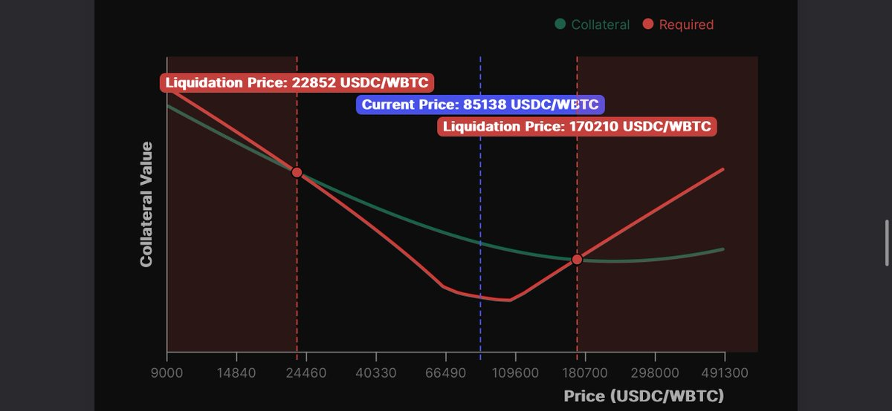
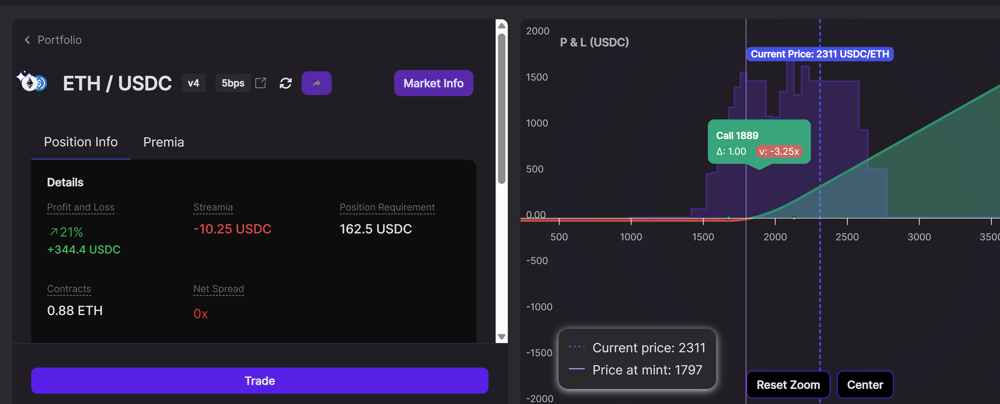
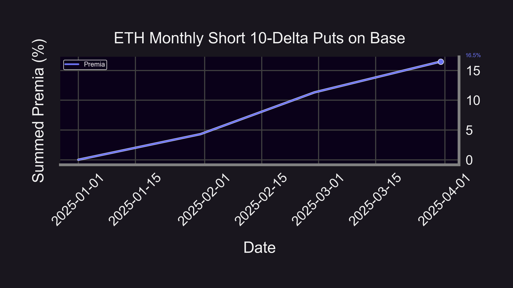
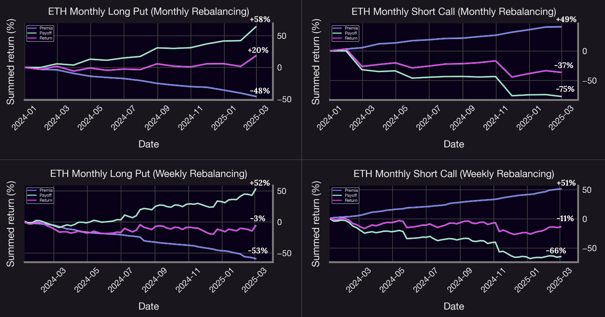
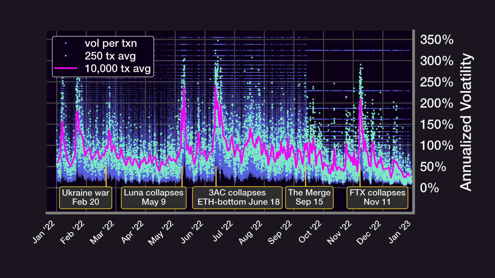

Welcome Panoptimists to the May edition of the Panoptic Newsletter, where we provide industry insights, research recaps, and Panoptic-specific content to keep you updated on our DeFi-native options platform.

If you want future newsletters sent directly to your email, signup on our [website](https://panoptic.xyz/).

## About Panoptic

Discover the future of trading with Panoptic, your gateway to perpetual options in DeFi. Our cutting-edge platform empowers you to manage risk effectively and trade with unprecedented flexibility. Join us and be part of a secure, decentralized revolution in options trading, tailored for both crypto newcomers and experienced traders.

  

## Panoptic Highlights

### Base Gets Boosted: Panoptic Brings Gas-Efficient Onchain Options to DeFi Traders

Panoptic has officially [launched on Base,](https://x.com/Panoptic_xyz/status/1918349802498343294) introducing a suite of gas-efficient, fully onchain options trading and liquidity provision tools for crypto traders and investors. The platform enables users to trade options directly onchain, short tokens with limited risk exposure, provide liquidity with leverage, and engage in passive liquidity provision without impermanent loss.

To celebrate the launch, Panoptic is hosting a [two-week trading competition](https://x.com/Panoptic_xyz/status/1919437098027028482) featuring $5,000 in cash prizes, over 5,000,000 Pips, and a plushie the size of your dreams. Contest ends May 19, so be sure to join in on the fun before then!

### Empowering Panoptic Traders with Real-Time Liquidation Data

We've just rolled out a game-changing [update](https://x.com/guil_lambert/status/1913571575573401704) to the Panoptic platform that addresses one of the key challenges facing options sellers. Previously, users had to manually calculate their own liquidation prices when deploying leveraged LP positions on Uniswap. Now, our new "Risk Analysis" feature, integrated directly into the main UI, provides instant visibility into how your collateral requirements change with price movements and clearly displays your liquidation thresholds.

The feature is now live on each [‘Markets’ page](https://app.panoptic.xyz/markets/), allowing you to monitor your position's health in real-time or even analyze other traders' positions. Whether you're selling multiple options like the account above with its $23k-$170k liquidation range, or just getting started with options on Panoptic, this tool empowers you to make more informed risk management decisions with confidence.

## Panoptic in the Markets

### Crypto Market Analysis: Strategic Trade Profits as ETH Breaks $2K Barrier

One trader on Base opened a [perpetual call option](https://app.panoptic.xyz/positions/base/0x455543053eb4e51d82eed442b8c446cc0150e70253749de4dd970347a1b3e607%23125/?view_as=0x98b69d0b81fb1966ebe0af76789425706e5afe7b) on May 6, just a few hours before Ethereum’s anticipated Pectra upgrade. While ETH price remained relatively indifferent post upgrade, global trade optimism may have sparked the 28%+ weekly gain to over $2,300 soon to follow.

  

  

The trader’s call option had a leveraged exposure of 10 times its capital requirement, profiting +21% on the notional (+210% on margin) and costing the trader less than 1% of notional in streaming premia.

This strategic entry captured value during a critical market transition, helping this trader top the [Panoptic leaderboards](https://app.panoptic.xyz/leaderboard/pnl) during its ongoing Base trading competition. The timing aligns perfectly with the broader crypto market's bullish reversal, particularly as Bitcoin has shattered the psychological $100K barrier that many analysts had long anticipated as a major milestone for institutional adoption.

  

## Panoptic in the Media

### Panoptic Founder Guillaume Lambert Featured on Ungovernable Podcast, Shares Origin Story

Guillaume Lambert, the founder of Panoptic, appeared on the ["Ungovernable Podcast”](https://x.com/i/broadcasts/1ypKdZLVlXVJW). During this conversation, Guillaume shared insights about Panoptic's origin story and development journey, discussing how the platform evolved to its current state. The podcast offers listeners a behind-the-scenes look at the challenges and milestones Panoptic has faced, as well as Guillaume's vision for on-chain options and Uniswap.

### Put Wing Premia: Base vs. Ethereum Analysis Reveals Similar Returns Across Chains

The comparative analysis of [Panoption put wings on Ethereum versus Base](https://panoptic.xyz/research/put-wing-premia-eth-base) reveals striking similarities in performance metrics. Despite their architectural differences, both chains demonstrate nearly identical cumulative premia when examining monthly sales of 10-delta Panoption puts from January through March 2025. The data shows Ethereum producing 15.8% (80% annualized) premia while Base generated slightly higher premia at 16.5% (84% annualized). This marginal difference suggests that the underlying market mechanics driving volatility risk premium (VRP) transcend the specific blockchain implementation.

These similarities stem from shared fundamental characteristics that contribute to on-chain VRP: market incompleteness and price jumps. Both chains experience the effects of Just-in-Time (JIT) liquidity providers who essentially function as short-term perpetual put option sellers, capturing elevated volatility risk premia during periods of high implied volatility. The research demonstrates how jumps in ETH/USDC pools follow a fat-tailed power law distribution, indicating larger kurtosis associated with these price movements. As the article suggests, these patterns may gradually smooth over time as trading platforms like Panoptic provide outlets for options buyers, potentially enhancing stability across both L1 and L2 blockchain environments.

### Bear Strategy Breakdown: Short Calls vs Long Puts – Which Strategy Wins?

Panoptic's latest research examines [two popular bearish options strategies](https://panoptic.xyz/research/short-call-vs-long-put-bear-fight): selling calls and buying puts on ETH. The comprehensive analysis reveals that while both strategies profit from ETH price decreases, they exhibit fundamentally different risk profiles and performance characteristics. Over the backtesting period of January 2024 through February 2025, long puts with monthly rolling achieved impressive 20%+ returns while providing defined risk parameters, making them particularly effective during significant market downturns.

The research highlights three key insights for traders: long puts offer better risk management by limiting losses and excelling during market drops, while short calls generate steady gains but with exposure to substantial losses during sharp market movements. Additionally, the study demonstrates that weekly rolling increases trading frequency and smooths returns without fundamentally altering strategy behavior. This analysis empowers Panoptic traders to make more informed decisions based on their market outlook and risk preferences, showing why proper strategy selection is critical in on-chain options trading.

### Volatility Risk Premium: Capturing Enhanced Returns with OTM Put Wings

Panoptic's examination of volatility risk premium reveals compelling opportunities for traders [selling deep out-of-the-money (OTM) put options](https://panoptic.xyz/research/implied-volatility-put-wing-premia). The research found that 10-delta Panoption puts saw mean monthly premia of approximately 3.9% (58.6% annualized) for ETH/USDC and 2.8% (39.5% annualized) for WBTC/USDC 30bps pools from May 2021 to March 2025. These strategies generated cumulative returns of 153% and 108% respectively, highlighting significant profit potential during volatility spikes.

The study provides critical insights into Just-in-Time (JIT) liquidity provision, equating it to extremely short-dated put options selling that captures heightened options premia during macro events. The research refined Panoptic's previous findings, demonstrating that expanded volatility and abbreviated time horizons significantly enhance streamia collected by Panoptions sellers, with these effects amplified when trading deep OTM puts. The unique structural components of crypto markets create opportunities accessible through Panoptic that would otherwise be unavailable to traditional Uniswap LPs.

## Up Next  
Panoptic is live on Base and kicking things off with a [trading competition](https://x.com/Panoptic_xyz/status/1919437098027028482). Stay tuned for more contests and prizes!

_Join the growing community of Panoptimists and be the first to hear our latest updates by following us on our [social media platforms](https://links.panoptic.xyz/all). To learn more about Panoptic and all things DeFi options, check out our [docs](https://panoptic.xyz/docs/intro) and head to our [website](https://panoptic.xyz/)._