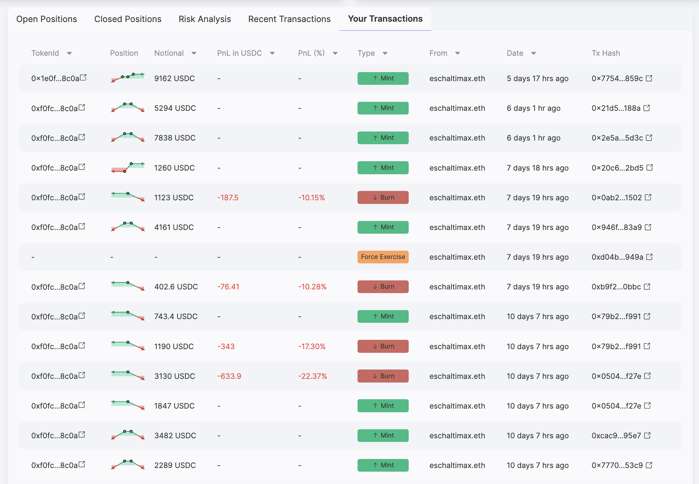
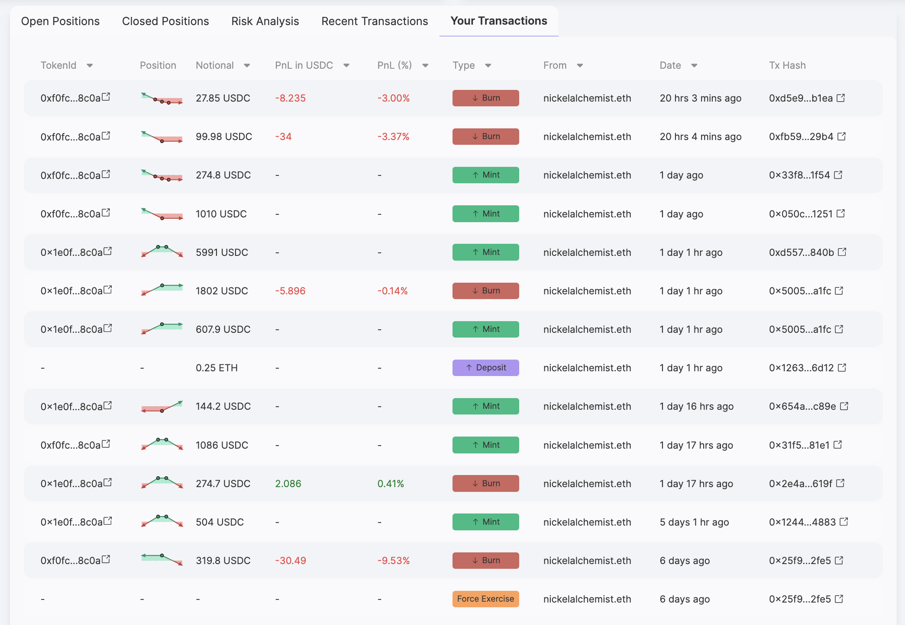

---

slug: base-trading-competition-concludes
title: "Base Trading Competition Concludes"
tags: [Liquidity, Base, DeFi, Trading]
image: /img/banners/banner.png
description: "Panoptic’s Base trading competition has ended, with top traders and LPs winning over $5K in prizes and 5M+ Pips."

---

The Panoptic [trading competition](/blog/base-trading-competition) on Base has officially come to a close, and the results are in. Thank you to everyone who participated! Over the past two weeks, participants actively traded, LP’d, and deposited into Panoptic markets for a chance to win over $5,000 in USDC, 5,000,000+ Pips, and a limited edition 23” Panopduck plushie.

Thank you to everyone who participated and helped make this competition a success. You can view the full list of winners on the [leaderboard](https://app.panoptic.xyz/leaderboard/pnl).

# Base Trading Competition Winners

## Highest PnL %

🥇 1st Place: Ohmmm.eth (1,000,000 Pips + $1,400 USDC), with a total PnL of 149%, highlighted by their strike $1597 long call:

🥈 2nd Place: 0x707acab2506e5f59d428369a8d29973d02cbb767 (500,000 Pips + $700 USDC) with a total PnL of 85.67%, highlighted by their strike $1889 long call:

 

🥉 3rd Place: Steveflanagan.eth (250,000 Pips + $400 USDC), with a total PnL of 41.74%, highlighted by their strike $2080 short put:

-   4th–10th: 100,000 Pips + $100 USDC each
-   11th–20th: 50,000 Pips + $50 USDC each
-   21st–50th: 25,000 Pips each

## Highest Volume

Participants competed to generate the most trading volume in the ETH/USDC v4 market on Base, with over $205,550 in total deposits.

🥇 1st Place: 0xb2b99928f08539fb21a7e605355208f681643d42 (1,000,000 Pips + $700 USDC + jumbo plushie), with a total volume of $110.89K:

🥈 2nd Place: eschaltimax.eth (500,000 Pips + $400 USDC), with a total volume of $83.99K:

🥉 3rd Place: nickelalchemist.eth (250,000 Pips + $200 USDC), with a total volume of $51.75K:

Congratulations to all our winners, and thank you to every degen, strategist, and LP who participated. Prizes and Pips will be distributed by the end of the week.

## What’s next?

This competition marks just the beginning. In the coming months, we will be hosting more trading competitions and incentive campaigns, with expanded prize pools and new opportunities to engage with Panoptic.

Follow us on our social media accounts to stay informed about upcoming competitions, product updates, and live streams.

*Join the growing community of Panoptimists and be the first to hear our latest updates by following us on our [social media platforms](https://links.panoptic.xyz/all). To learn more about Panoptic and all things DeFi options, check out our [docs](/docs/intro) and head to our [website](https://panoptic.xyz/).*
