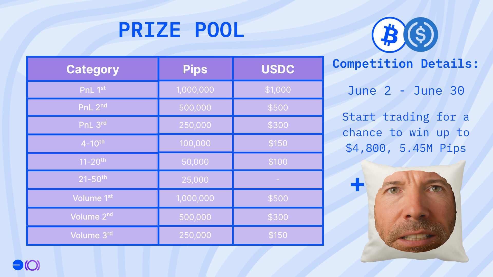
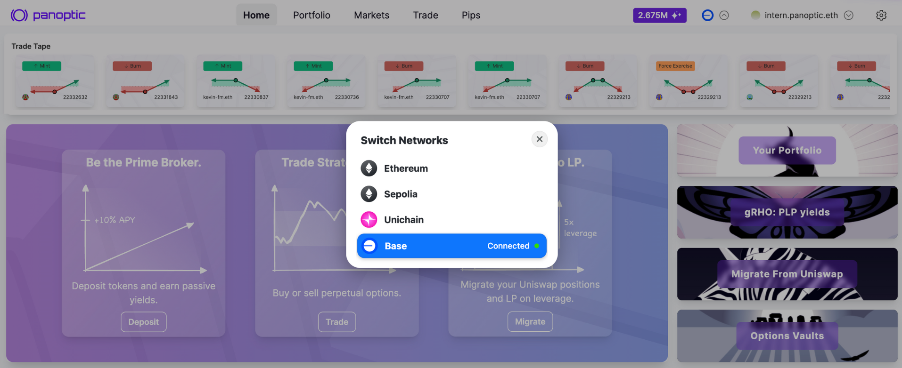
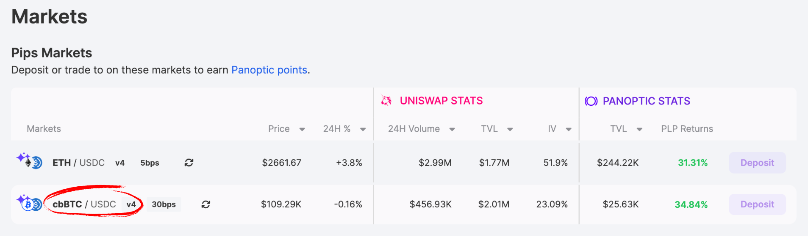
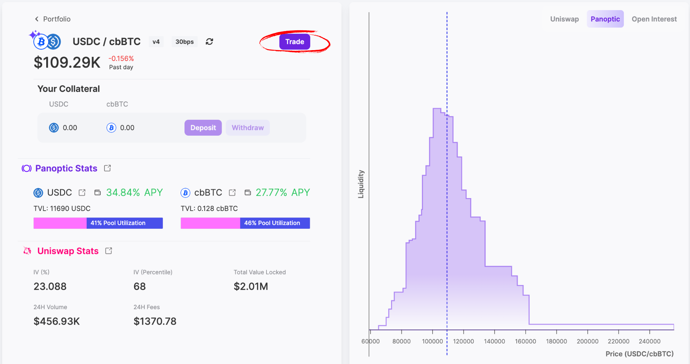
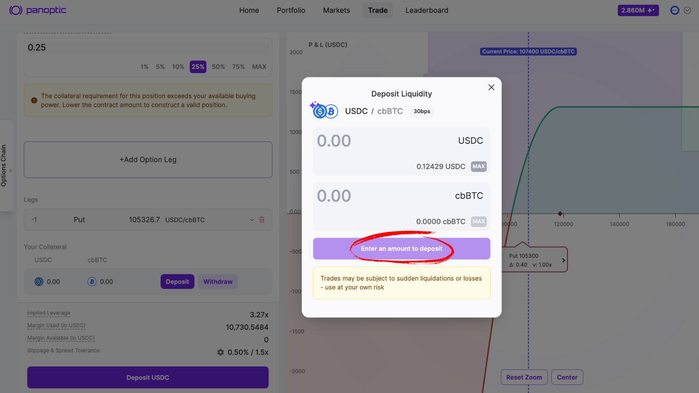
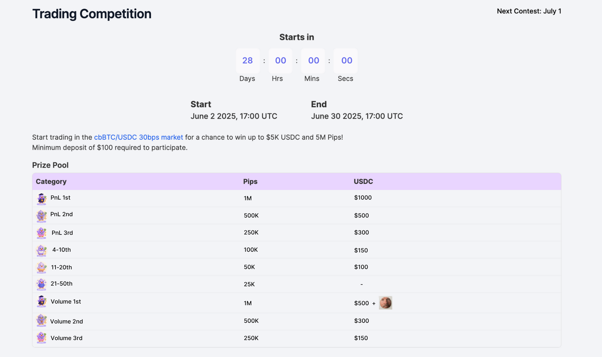

Following the strong momentum from our recent [launch on Base](/blog/panoptic-launches-on-base) and the success of our [trading competition](/blog/base-trading-competition-concludes), we're excited to announce the next contest, centered around [cbBTC](https://app.panoptic.xyz/markets/base/0x128f822727193887ffc4186b556f2d68e60dc330).

With Bitcoin recently hitting a new all-time high, the cbBTC market unlocks new possibilities for directional strategies, volatility plays, and capital-efficient positioning using Panoptic’s perpetual options.

Anyone can join—just trade in the designated cbBTC/USDC 30bps v4 market on Base to participate. The best PnL and volume will be rewarded, but there is more than one prize to win. Prizes include 5.45M Pips, $4.8K USDC, and a Michael Saylor pillow!

  

> **Minimum deposit: $100**

You’re welcome to deposit more than the minimum required. Keep in mind that a higher deposit requires a higher percentage return to rank competitively.
  

Please **do not withdraw collateral from the cbBTC market** during the competition period or your PnL will be negatively impacted. PnL % is evaluated based on the **maximum cumulative deposits** you made during the event. This ensures fair comparison across all participants.

> _Note: Unlike the previous competition, PnL will now be based only on your placed trades and Passive LP earnings. Changes in collateral value due to asset price movements will no longer impact your PnL._

# Prizes

## Total Prize Pool

-   Pips: 5.45 million points
-   USDC: $4,800
-   Bonus: Michael Saylor pillow
    

## Highest PnL %

-   🥇 1st place: 1M Pips + $1,000 USDC
-   🥈 2nd place: 500K Pips + $500 USDC
-   🥉 3rd place: 250K Pips + $300 USDC
-   4th - 10th place: 100K Pips + $150 USDC
-   11th - 20th place: 50K Pips + $100 USDC
-   21st - 50th place: 25K Pips  
      
    

## Highest Volume

-   🥇 1st place: 1M Pips + $500 USDC + Michael Saylor Pillow
-   🥈 2nd place: 500K Pips + $300 USDC
-   🥉 3rd place: 250K Pips + $150 USDC
    

Good luck, and may the best trader win!

## Timeline

- Start Date: June 2 at 17:00 UTC
- End Date: June 30 at 17:00 UTC
- Duration: 4 weeks total

## How to Participate

1. **Head to the [Panoptic app](https://app.panoptic.xyz/)**

    Launch the Panoptic app and switch your network to Base.

    

2. **Open the cbBTC/USDC market**

    Tap “Markets” and select the cbBTC/USDC 30bps v4 pool.

    

    Then, click ‘Trade’.

    

  

3. **Deposit cbBTC and USDC**

    

    Click the 'Deposit' button and enter the amounts of cbBTC and USDC you want to add (minimum $100 total). Make sure to deposit a little bit of both tokens for a smoother trading experience. Confirm in your wallet to fund your competition balance.

  

4. **Select a strategy**

    

    Click “Strategies” and pick the style that fits your market view:

    -   Bullish (e.g. long call)
    -   Bearish (e.g. long put)
    -   Neutral (e.g. strangle)

    Tap your preferred strategy and review the projected payoff chart.

    

  

5. **Open your position**

    Adjust strike price, timescale, and contract size. Check fees and risk parameters. Hit Review Position and confirm in your wallet.

  

6. **Monitor the leaderboard**

    

    Head to the [Leaderboard tab](https://app.panoptic.xyz/leaderboard/pnl) and click ‘Competition’. Track your rank under PnL % and Volume columns over the four‑week event. Your final PnL % standing is based on gains on your trades made. Your volume standing is based on the size and frequency of trades placed.

    For more information on how to [open a position](/docs/product/opening-a-position), [close a position](/docs/product/closing-a-position), and [manage](/docs/product/position-management) your trades on Panoptic, visit our [docs](/docs/intro).

## How to Get cbBTC or USDC on Base

### Fund Your Wallet

-   You can send cbBTC from your [Coinbase](https://exchange.coinbase.com/assets) account to fund your Base wallet
    
-   When Coinbase users [send their BTC](https://www.coinbase.com/cbbtc) from Coinbase to an address on Base that BTC will automatically be converted 1:1 to cbBTC
    

### Bridge to Base

-   Use the official Base bridge: [https://bridge.base.org](https://bridge.base.org)
    
-   Bridge cbBTC or USDC from Ethereum mainnet to Base
    

> _Disclaimer: Panoptic provides these external links and sources for your convenience. However, it's crucial for users to independently verify all sources and information. Please be aware that Panoptic is not responsible for the verification of external sources or the security of external platforms. Users should exercise caution and are solely responsible for their actions; Panoptic is not liable for any loss of funds or other damages incurred as a result of using these platforms._

## Technical Details

- **Eligible Markets**: cbBTC/USDC 30 bps v4
- **Chain**: Base
- **Minimum Deposit Size**: $100 (combined amount in cbBTC and USDC, e.g., depositing $50 of cbBTC and $50 of USDC would qualify)
- **Reward Distribution**: $4,800 in cash prizes, over 5 million Pips, and a Michael Saylor pillow!

_Join the growing community of Panoptimists and be the first to hear our latest updates by following us on our [social media platforms](https://links.panoptic.xyz/all). To learn more about Panoptic and all things DeFi options, check out our [docs](/docs/intro) and head to our [website](https://panoptic.xyz/)._