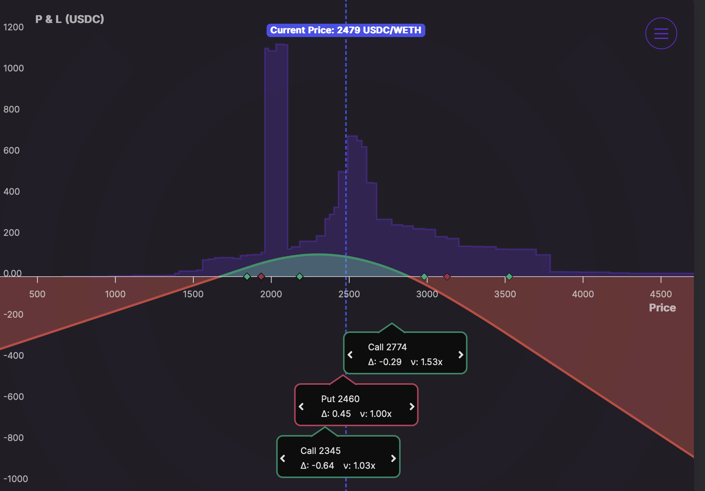
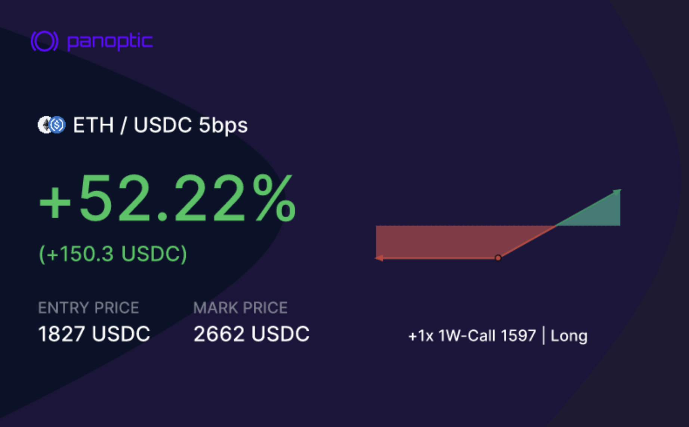
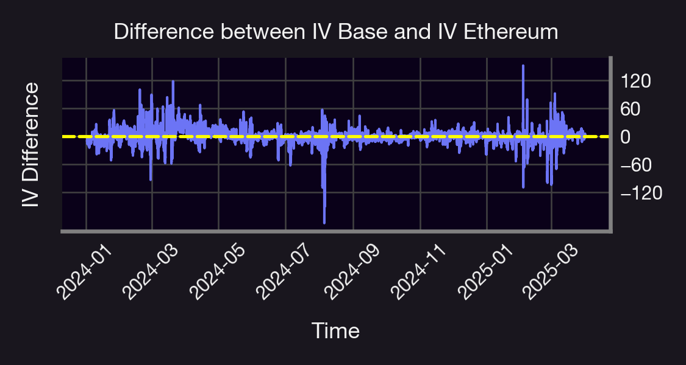
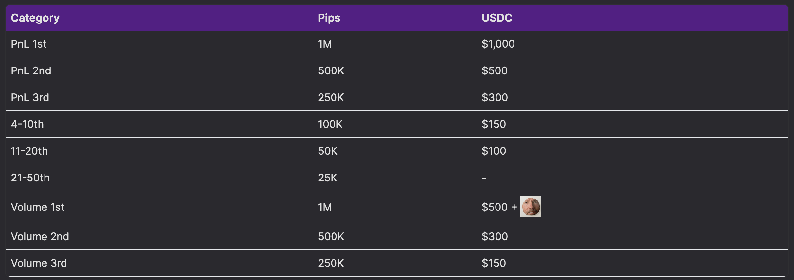

Welcome Panoptimists to the June edition of the Panoptic Newsletter, where we provide industry insights, research recaps, and Panoptic-specific content to keep you updated on our DeFi-native options platform.

If you want future newsletters sent directly to your email, signup on our [website](https://panoptic.xyz/).

## About Panoptic

Discover the future of trading with Panoptic, your gateway to perpetual options in DeFi. Our cutting-edge platform empowers you to manage risk effectively and trade with unprecedented flexibility. Join us and be part of a secure, decentralized revolution in options trading, tailored for both crypto newcomers and experienced traders.

## Market Highlights

### Coinbase's Deribit Acquisition Signals Pivotal Shift in Crypto Options Landscape

In a landmark development that stands to fundamentally reshape the crypto options ecosystem, Coinbase [announced](https://www.coinbase.com/blog/coinbase-to-acquire-deribit-becoming-the-most-comprehensive-global-crypto-derivatives-platform) on May 8 its agreement to acquire Deribit, the world's dominant crypto options exchange, for approximately $2.9 billion. This strategic acquisition, which combines Deribit's $30 billion in open interest with Coinbase's rapidly expanding derivatives business, creates an unprecedented comprehensive derivatives platform spanning futures, perpetual futures, and options trading—all within a single, capital-efficient infrastructure. The transaction represents the most significant consolidation in the crypto derivatives space to date and positions Coinbase as the global leader in crypto options by both open interest and trading volume.

This acquisition comes at a critical inflection point as regulatory frameworks for crypto derivatives continue to evolve favorably, with on-chain verifiability increasingly emerging as the inevitable foundation for future financial rails. Panoptic's on-chain options protocol stands to benefit significantly from this industry consolidation, as the move accelerates mainstream adoption of options trading while highlighting the growing imperative for transparent, verifiable infrastructure.

As traditional and decentralized options markets converge, Panoptic's permissionless architecture provides the crucial technological bridge between CeFi scale and DeFi innovation—enabling the composable, provable transactions that regulators increasingly favor while maintaining the capital efficiency and sophisticated strategies that institutional traders demand. The Coinbase-Deribit union signals that crypto options have reached a maturation inflection point similar to the equity options boom of the 1990s, creating unprecedented momentum for protocols like Panoptic that deliver the transparency, security, and programmability needed to define the next generation of financial markets.

### Synthetix Flirts with Options Acquisition of Derive Platform

Synthetix and Derive have [mutually](https://www.theblock.co/post/355678/synthetix-derive-call-off-merger) withdrawn their proposed $27 million acquisition deal following community discussions and feedback. The merger would have combined the two DeFi protocols into a unified derivatives platform on Ethereum mainnet, with Synthetix acquiring Derive's treasury, technology, and product suite through a token swap of 27 DRV tokens for 1 SNX token. The deal required Synthetix to mint 29.3 million new SNX tokens but was ultimately canceled after both sides formalized withdrawal proposals (SIP-415 and the corresponding DIP) in late May. The decision reflects the decentralized governance process in action, where community input plays a crucial role in major strategic decisions for DeFi protocols.

## Panoptic in the Markets

### Strategic Options Win: Trader Captures 90+ Basis Points as ETH Tests $2,500 Resistance

A savvy Panoptic trader recently executed a well-timed [options strategy](https://app.panoptic.xyz/positions/ethereum/0x84fb134d1612e0900a3989061894934e1497ffc59d62b735eb56fdf8286693fc%23580?view_as=0x50b1799782DFdc5f0aAbd4b6719902d8955596BD) that yielded nearly 3% profit during Ethereum's consolidation around the critical $2,500 level. The position, displayed in our platform's visualization tools, shows how the trader skillfully deployed a multi-leg approach when ETH was trading at approximately $2,479, capitalizing on ETH's price movements without taking on excessive directional risk.

The trade, executed by kevin-fm.eth on May 21, involved a position margin requirement of 2,357 USDC and generated a 68.83 USDC profit (2.92% return) in one week. The trader positioned themselves with balanced exposure—utilizing call options at the $2,345 and $2,774 strike prices alongside a put at $2,460 with varied delta exposure across the different option legs, ranging from -0.64 to +0.45. This spread of delta values means the position can profit from multiple market scenarios rather than betting on just one direction—whether ETH moves up, down, or stays relatively flat, different parts of the strategy can generate returns. This diversified approach allowed the trader to capture profits even during ETH's uncertain price action around $2,500, demonstrating how Panoptic's on-chain options platform enables sophisticated risk management strategies that were previously only available to institutional traders.

### Base Trading Competition Wraps with Over $205K Volume and Record-Breaking Returns

Panoptic's two-week [trading competition](/blog/base-trading-competition-concludes) on Base has concluded with impressive participation and exceptional returns, showcasing the platform's growing adoption among DeFi traders. The competition, which ended May 19, attracted significant activity across trading, liquidity provision, and deposits, with total deposits exceeding $205,550 in the ETH/USDC v4 market on Base. Participants competed for a prize pool featuring $5,000 in USDC, over 5 million Pips, and the coveted 23" jumbo duck plushie.

The performance metrics were nothing short of remarkable, with top traders demonstrating the profit potential of Panoptic's on-chain options platform. Ohmmm.eth claimed the first-place position in the PnL category with an extraordinary 52% return, primarily driven by a strategic long call position at the $1,597 strike price that perfectly captured Ethereum's upward momentum. The volume category saw equally impressive engagement, with the winner generating over $110,890 in trading volume.

Other notable performances included the second-place PnL winner who achieved an 33% return through a well-timed long call at the $1889 strike, and third-place winner Steveflanagan.eth who utilized a short put strategy at $2080 to secure a 13% return. All fifty-three prize winners will receive their rewards by the end of the week, concluding the initial expansion of Panoptic to Base and the broader adoption of on-chain options trading.

## Panoptic in the Media

### Uncovering the "Relief Risk Premium": New Analysis Reveals Hidden Opportunity in Panoption Call Wings

Panoptic's latest research expands beyond previous work on [put wing options](/research/implied-volatility-call-wing-premia) to examine the unique characteristics and profitability of deep out-of-the-money (OTM) Panoption call wings in cryptocurrency markets. The comprehensive analysis, spanning from May 2021 to April 2025, reveals asymmetries in how call wing premia behave in relation to implied volatility (IV) across both ETH and BTC markets. While traditional commodity markets like crude oil often show higher volatility risk premiums for calls than puts, crypto markets display a distinct structural bias toward put wing premia—yet call wings still offer compelling returns during specific market conditions that the research team has identified as the "relief risk premium" phenomenon, where diminished market fear creates steady income opportunities for strategic options sellers.

The data shows that selling 10-delta Panoption calls on ETH/USDC 30bps pools generated mean monthly premia of approximately 2.8% (39.5% annualized), with peak monthly returns reaching an impressive 11.7% (279% annualized) during July 2022 when Uniswap IV was notably subdued. Similarly, WBTC/USDC 30bps pools yielded mean monthly premia of 2.1% (28.5% annualized) for the same strategy, with cumulative returns over the period reaching 114% for ETH and 85% for BTC.

Most intriguingly, the research identified that call wing premia typically oscillate inversely to put wing premia during normal market conditions, but occasionally move in concert during periods of extreme price volatility—creating identifiable opportunities for traders to time their strategy deployments based on market sentiment cycles and volatility regimes. Unlike traditional equity markets where "relief rallies" follow uncertainty resolution (such as FOMC announcements), crypto markets demonstrate that in tranquil trading environments, Panoption call wing premia gradually increases and provides consistent returns even as implied volatility decreases, offering a complementary income strategy to the more commonly deployed put wing tactics.

### Base vs. Ethereum: Analysis Reveals Distinct Volatility Patterns and Trading Dynamics

A comprehensive [study](/research/base-vs-ethereum-iv) by Panoptic researcher Amy Khaldoun examines the technical differences between Ethereum and Base blockchains in the ETH/USDC 5bps pool, revealing significant implications for options traders. The quantitative analysis, using minute-level data from January 2024 through March 2025, found that Base consistently exhibits higher baseline implied volatility but with smoother dynamics, while Ethereum demonstrates sharper volatility spikes during market stress events. These differences stem from fundamental structural elements: Ethereum's deeper liquidity and established market presence generate more reactive price discovery, while Base's thinner markets and Coinbase integration create a unique environment with elevated implied volatility levels and more persistent price dislocations.

Performance metrics across chains showed remarkable divergence in strategy outcomes, with short volatility trades outperforming on Base (+17.65% vs +14.76% for short calls) due to inflated premia, while Ethereum's deeper liquidity provided more favorable pricing for long put strategies (+17.58% net return vs +13.42% on Base). These structural differences in implied volatility and option pricing create opportunities for cross-chain strategies that can exploit temporary price dislocations—sometimes exceeding ±150 USDC—particularly during periods of significant market movement. The asymmetry in premium structure across networks suggests that Base's option market consistently prices in higher tail risk, benefiting sellers during periods of low realized volatility but penalizing buyers unless significant price movement materializes, while Ethereum's more efficient pricing benefits sophisticated strategies requiring deep liquidity and reliable execution.

### PnL Share Card Contest Ends with Three Lucky Pip Winners

Our week-long raffle [celebrating](https://x.com/Panoptic_xyz/status/1925252083550495027) the new PnL Card feature has concluded! Traders who shared their Panoptic trade cards on social media using #ShareYourCard were entered to win 50,000 Pips each. Congratulations to our three winners who showcased their trading prowess and helped spread the word about Panoptic's new sharing capabilities.

<blockquote class="twitter-tweet">
We have a new feature 👀  Share you Panoptic trade card for a chance to win 50,000 Pips!  To celebrate our new PnL Card feature, we&#39;re running a 1-week raffle.  Here&#39;s how to enter: 1️⃣ Post your Panoptic share card on Twitter or Discord 2️⃣ Use the hashtag <a href="https://twitter.com/hashtag/ShareYourCard?src=hash&amp;ref_src=twsrc%5Etfw">#ShareYourCard</a> 3️⃣ That’s… <a href="https://t.co/BtBTjSljOY">pic.twitter.com/BtBTjSljOY</a>
&mdash; Panoptic (@Panoptic_xyz) <a href="https://twitter.com/Panoptic_xyz/status/1925252083550495027?ref_src=twsrc%5Etfw">May 21, 2025</a></blockquote> 

### tasty_live_ Show Covers Crypto Options with Guillaume Lambert

Panoptic's Guillaume Lambert [joined](https://x.com/tastycrypto/status/1927423328769212866) Truth Dan C on tastylive for an in-depth discussion about crypto options trading. The conversation covered how to read current market conditions and what options signals are indicating about Bitcoin's next potential moves. The show provides valuable insights from a seasoned trader's perspective on navigating the current crypto derivatives landscape.

<blockquote class="twitter-tweet">
.<a href="https://twitter.com/Truth_Dan_C?ref_src=twsrc%5Etfw">@Truth_Dan_C</a> welcomes <a href="https://twitter.com/guil_lambert?ref_src=twsrc%5Etfw">@guil_lambert</a> for a deep dive into crypto options.  Hear from a seasoned trader on how to read the current market—and what options are signaling about <a href="https://twitter.com/search?q=%24BTC&amp;src=ctag&amp;ref_src=twsrc%5Etfw">$BTC</a> ’s next move.  5.28.25 | 4:30pm CT | LIVE <a href="https://twitter.com/tastyliveshow?ref_src=twsrc%5Etfw">@tastyliveshow</a> <a href="https://t.co/TzCW5pYqXh">https://t.co/TzCW5pYqXh</a>
&mdash; tastycrypto (@tastycrypto) <a href="https://twitter.com/tastycrypto/status/1927423328769212866?ref_src=twsrc%5Etfw">May 27, 2025</a></blockquote> 

## Up Next

### Catch Us at Permissionless & EthCC!

The Panoptic team is hitting the road this summer! We’ll be at Permissionless in Brooklyn, New York (June 24–26) and EthCC in Cannes, France (June 30–July 3).

If you're attending either conference, we’d love to connect. Reach out on [Discord or Telegram](http://links.panoptic.xyz/all) to meet up with the team!

### Bitcoin Trading Competition Starts June 2

Get ready for our next trading competition [focused](https://app.panoptic.xyz/leaderboard/pnl) on Bitcoin strategies! The leaderboard is now live and competition officially begins June 2. Traders can compete for top PnL and volume rankings and showcase their Bitcoin trading skills on Panoptic's platform. Visit the leaderboard to see current standings and prepare your strategies for launch day.

*Join the growing community of Panoptimists and be the first to hear our latest updates by following us on our [social media platforms](https://links.panoptic.xyz/all). To learn more about Panoptic and all things DeFi options, check out our [docs](/docs/intro) and head to our [website](https://panoptic.xyz/).*
