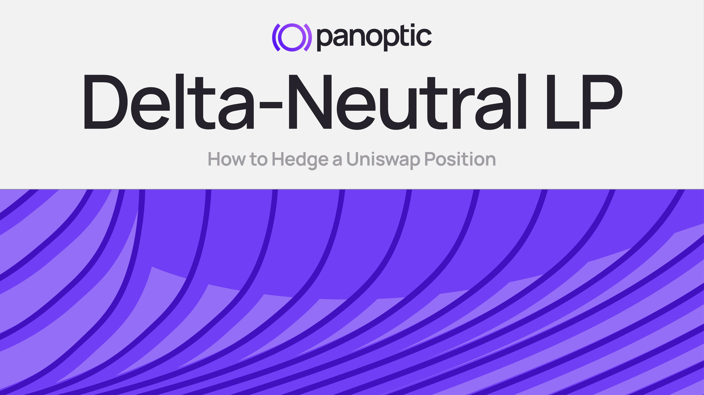
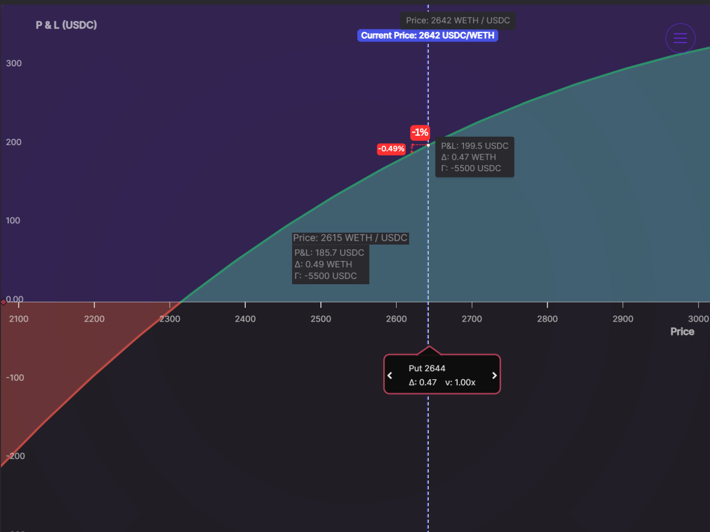
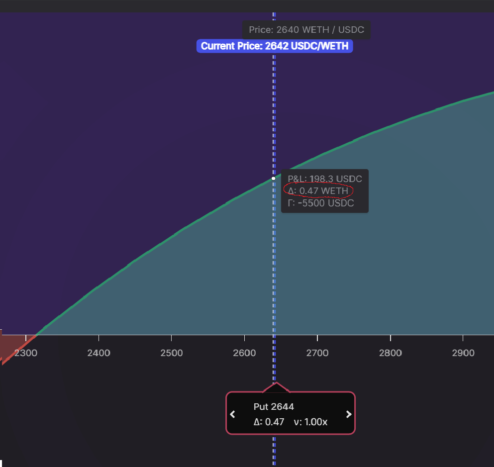
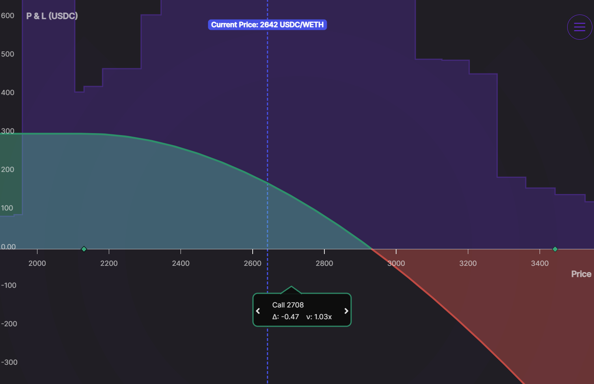
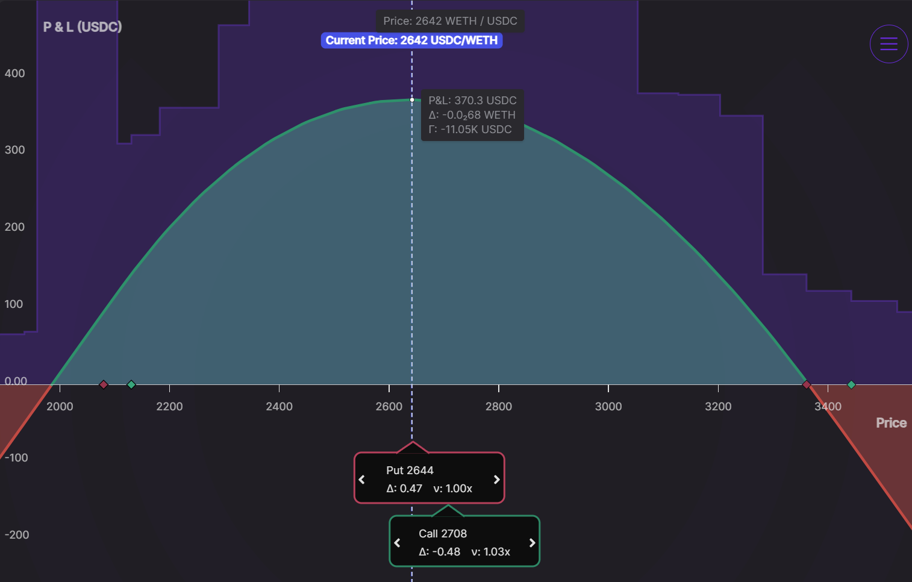
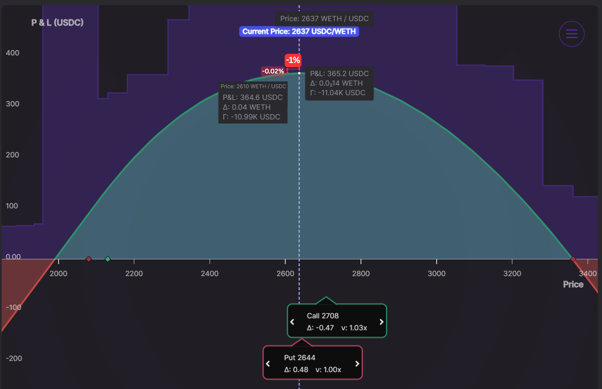
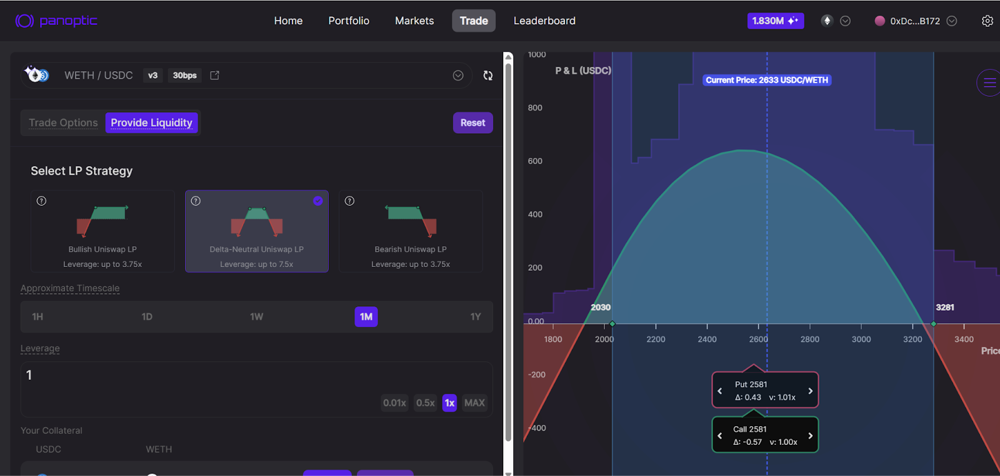

LPs know that falling prices are detrimental for profitability. Not only do they suffer impermanent loss (IL), but they also rack up unrealized losses.

In this article, we’ll show how LPs **lose less** on the downside and **earn more** from those juicy LP fees–by embracing delta-neutral LPing.

## The Natural Directionality of LPing

When you LP on Uniswap, you’re implicitly taking a directional bet:

-   **Fees inside your range**: If you center your liquidity around the current price, you collect swap fees as long as the price stays in range.
-   **Bullish on the underlying**: Your position is composed of both tokens. As price rises, the combined value of your underlying tokens increases.
    

That’s great when markets are sideways or going up. But when prices start crashing, you’re out of range and underwater. No more fees, just IL.

### Quantifying The Pain: A 1% ETH Drop

Suppose you LP in the ETH/USDC pool around the current price of $2,642. Because Uniswap v3 (and v4) is a concentrated liquidity AMM, you must select a price range. You select a moderately wide range between $2,080 and $3,361.

**What’s your unrealized loss if ETH falls 1%?**

The answer is **-0.49%**.

Why? A centered LP is roughly 50% ETH and 50% USDC, so losses are about half the price move.

A quick rule of thumb is **delta (Δ)**—the slope of the payoff curve. Here, Δ = 0.47, meaning every $1 drop in ETH cuts the LP value by $0.47.

## Enter the Hedge: Short Perpetual Call

Can we blunt those losses? Yes. Sell a perpetual call. Here’s what that looks like:

A call option is exactly what we need to offset the LP’s downside. Combining the LP position (bullish) with a short call (bearish) gives a delta‑neutral position: Δ ≈ 0 at entry. Delta-neutral strategies lose nearly nothing when prices move, which is why they’re so popular.

Here’s the payoff of our hedged LP position:

**What’s your unrealized loss if ETH falls 1%?**

The answer is: **-0.02%**. Now, a 1% ETH drop hurts the hedged LP by just ‑0.02%—only 2¢ on the dollar.

## Delta-Neutral LPing: The Perpetual Straddle

Here’s the formula:

| Leg | Exposure | Fees Earned |
|---------------------------|----------|------------------------------------------|
| **Uniswap LP** | Bullish | Uniswap swap fees |
| **Short Call (Panoptic)**| Bearish | Uniswap swap fees **+** Option premium |
| **Hedged Position** | Δ ≈ 0 | Both fee streams |

Effectively, you’re running what’s called a short straddle in the options world: profitable if price stays in range, cushioned if it drifts.

Even better, on Panoptic the short call earns at least as many LP fees as the Uniswap leg, so you’re doubling your fee income while neutralizing direction.

> You can execute the entire strategy in Panoptic via “Delta‑Neutral Uniswap LP” under [Provide Liquidity](http://app.panoptic.xyz/trade).

### Stay Hedged: The Importance of Rebalancing

Delta drifts over time. As the market moves, your LP position becomes less hedged. You may become directionally long or short again. That’s why periodic rebalancing is key.

To stay delta-neutral:

-   Adjust your Uniswap LP range when price strays from your entry point.
-   Adjust your Panoptic call to restore the hedge.
-   Monitor net delta—Panoptic’s dashboard make this easy.
    

With timely adjustments, you keep neutral exposure, high fee capture, and minimal directional risk.

### LP Smarter, Not Harder

Uniswap democratized market making. Panoptic makes it strategic.

By combining your LP with call options, you’re protecting yourself from price crashes and reducing impermanent loss.

Delta-neutral LPing won’t make you immune to volatility, but it will make you more prepared.

*Join the growing community of Panoptimists and be the first to hear our latest updates by following us on our [social media platforms](https://links.panoptic.xyz/all). To learn more about Panoptic and all things DeFi options, check out our [docs](/docs/intro) and head to our [website](https://panoptic.xyz/).*