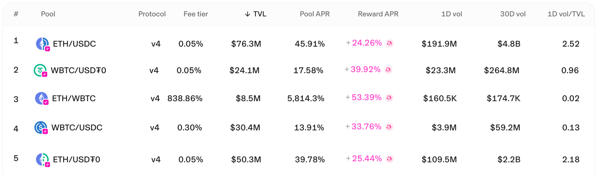

We’re thrilled to announce that Panoptic LPs and option traders will receive [UNI token incentives](https://gov.uniswap.org/t/governance-proposal-uniswap-unleashed-unichain-and-uniswap-v4-liquidity-incentives/25250). Liquidity Providers who supply liquidity to specific Uniswap v4 and Unichain pools can participate, and will earn on the amount of liquidity they provide and key performance metrics, such as trading volume and time in-range. This program is designed to jumpstart liquidity on v4 and Unichain, attract swappers, and build a sustainable DeFi ecosystem.

Rewards are in the form of UNI Token Incentives—available across select Uniswap v4 markets.

The incentives maintained by Gauntlet are being [distributed bi-weekly](https://x.com/gauntlet_xyz/status/1927752247431012619), with 440,997 UNI tokens (~$3.7M USD in value) to be distributed over the next two weeks.

<blockquote class="twitter-tweet">
1/ Round 5 <a href="https://twitter.com/unichain?ref_src=twsrc%5Etfw">@unichain</a> incentives are live  • Budget spend ↑ $158K • Incentives to <a href="https://twitter.com/bunni_xyz?ref_src=twsrc%5Etfw">@bunni_xyz</a>, <a href="https://twitter.com/RenzoProtocol?ref_src=twsrc%5Etfw">@RenzoProtocol</a>, <a href="https://twitter.com/AegisMarkets?ref_src=twsrc%5Etfw">@AegisMarkets</a> hooks are live • WBTC incentives shifted 100% to OFT-enabled pools • Continued increased incentive spend on stable pairs  More about the campaign 👇 <a href="https://t.co/4nY91fxW3Z">pic.twitter.com/4nY91fxW3Z</a>
&mdash; Gauntlet (@gauntlet_xyz) <a href="https://twitter.com/gauntlet_xyz/status/1932503480562061494?ref_src=twsrc%5Etfw">June 10, 2025</a></blockquote> 

**Eligible Panoptic Markets on Unichain:**

-   [ETH/USDC v4 5bps](https://app.panoptic.xyz/markets/unichain/0x000003493cb99a8c1e4f103d2b6333e4d195df7d) on Unichain
-   [WBTC/USDT0 v4 5bps](https://app.panoptic.xyz/markets/unichain/0x00006d1224c7b77d89ce39ca9eb161d9dd6a759f) on Unichain
-   [ETH/WBTC v4 5bps](https://app.panoptic.xyz/markets/unichain/0x00000344137b8efbf9bdba1d56cca688deda8ce5) on Unichain
-   [WBTC/USDC v4 30bps](https://app.panoptic.xyz/markets/unichain/0x0000cc48ddbde5b520b5fd1130884c13192ab6aa) on Unichain
-   [ETH/USDT0 v4 5bps](https://app.panoptic.xyz/markets/unichain/0x0000ed265c5edaa58c3eaf503f8bfe2ccab1c0ad) on Unichain

> _Update: ETH/WBTC v4 5bps is no longer eligible for UNI incentives_

**Eligible Panoptic Markets on Ethereum:**

- [ETH/USDC v4 5bps](https://app.panoptic.xyz/markets/ethereum/0xdfbfe4c03508648589120350f96e05c780eb6e50) on Ethereum

    

## Who Will Receive the UNI Tokens?

The UNI tokens will be distributed as liquidity incentives to Liquidity Providers (LPs) on Uniswap v4 markets on Unichain when LPing through Panoptic.

Specifically, LPs who deposit liquidity into selected pools on these platforms will be eligible for incentives. Importantly, this is not a blanket airdrop; it’s a performance-based system where incentives are directed to pools actively managed and selected based on market conditions like liquidity depth and trading volume.

Incentive distribution will be dynamic, with pools selected and adjusted every two weeks.

More details regarding reward distribution to Panoptic users will be revealed later.

> _Update: All UNI rewards will be redistributed to depositors, LPs, and option traders based on their Panoptic points allocation. That means that if you only deposit, you'll still earn UNI rewards. But if you LP or buy options, you'll earn even more!_

## What Is the Distribution Based On?

### Incentives are distributed based on:
-   The amount of liquidity provided by an LP
-   Amount of LP fees collected
-   How often the LP positions are in range
-   The pools targeted are selected based on swap volume, TVL, and the need for organic growth

The incentive structure is built on a [Gauntlet](https://x.com/gauntlet_xyz/status/1932503480562061494)-designed dynamic program (which is subject to change), with clear goals in mind:

**For Uniswap v4:**
-   Targeting the migration of $32.8 billion in rolling 30-day volume from Uniswap v3 to v4 across Unichain.
    
**For Unichain:**
-   Aiming for $750 million in Total Value Locked (TVL) and $11 billion in swap volume within the first few months.

*Join the growing community of Panoptimists and be the first to hear our latest updates by following us on our [social media platforms](https://links.panoptic.xyz/all). To learn more about Panoptic and all things DeFi options, check out our [docs](/docs/intro) and head to our [website](https://panoptic.xyz/).*
