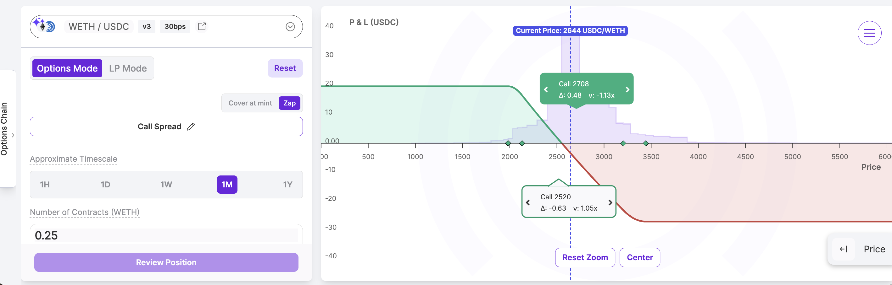

> TL;DR: Panoptic is the Uniswap of Options.

Let’s take a deep dive into the real meaning of LPing and what Panoptic unlocks for Uniswap LPs. Panoptic repurposes Uniswap as an options clearinghouse. Uniswap isn’t just an exchange; it is the foundation of a decentralized options market.

Panoptic’s thesis is that the LP side of concentrated liquidity AMMs (CLAMMs) is structurally equivalent to an options clearing house, and we’re building the platform to make this visible. Uniswap has proven that automated market-making revolutionized swapping and creating liquid pools for DeFi, but what is still missing is a native, fully integrated decentralized options layer that taps into the other side of LPing.

## The Core Thesis

### LP Positions = Short Put Options

When you provide liquidity in Uniswap v3 or v4, you select a price range and this action defines your payoff structure.

-   If the price is **below the range** → you hold 100% **token A**
-   If the price is **above the range** → you hold 100% **token B**
-   If the price **stays in range** → you **earn fees** from trading activity

This behavior mimics the payoff structure of a short put option. You are getting paid in fees to absorb directional risk.

### Uniswap LP Positions are Perpetual Short Puts

-   They have no expiry
-   They are re-priced at every block
-   They collect premiums over time

**Adding liquidity** to a CLAMM is **selling options.**

## Buying Options = Shorting LPs

Here’s where Panoptic comes in.

On Panoptic, you can **short Uniswap LP tokens** which inverts the payoff and lets traders **buy** perpetual options. This enables a full two-sided market:
-   LPs continue collecting fees = option sellers
-   Traders borrow LP tokens = option buyers
   
**Short LP position = long option payoff**

This unlocks real options trading mechanics: **delta hedging, risk management, spreads**–all inside of Uniswap.

### How Does Panoptic Translate LP Widths into Option-Like Exposures?

-   **Narrow range = short-dated option**
-   **Wide range = long-dated option**

The positions don’t have expiration dates, but the virtual duration gives an approximation of fees and payoff.

_One day option payoff ≈ ±%4 wide LP price range._

_One week option payoff ≈ ±13% wide LP price range._

_One month option payoff ≈ ±27% wide LP price range._

### How Do the Fees from Uniswap Work with Options Premiums?

-   The premium earned by an LP is the trading fees accumulated from in-range swaps
-   The premium paid by a buyer includes those fees plus a spread (which scales based on liquidity demand)
-   Pricing is path-dependent and occurs per block, just like how volatility and returns are modeled in traditional options markets
    
Some LPs earn only Uniswap fees, others outperform Black-Scholes predictions by tapping into the Panoptic spread. The result is an organic, onchain implied volatility surface.

Here, a Panoptic LP is making 202% more than they would on Uniswap (v: 3.02x).

### How does Panoptic turn Uniswap LPs into Option Contracts?

Uniswap LP positions are NFTs. Panoptic wraps them into **ERC-1155 semi-fungible tokens,** so that:

-   Positions with the same strike and width (i.e. LP price range) become fungible
-   Traders can compose, bundle, and trade these options contracts seamlessly
  
This is what transforms **Uniswap into a true, decentralized options clearinghouse**.

## What Panoptic Adds

### The Cypherpunk Design

Panoptic embraces the values that made DeFi powerful in the first place:
-   No governance votes
-   No oracles
-   No intermediaries
-   No admin keys
-   No custodians

All trades are fully on-chain and managed directly from the user’s wallet. Your funds stay yours. Forever. Immutable, permissionless, oracle-free. More importantly, Panoptic removes the centralized role of the market maker (MM) cartel in DeFi.

Traditionally, market makers have played a central role in DeFi liquidity—but this often comes with trade-offs for protocols and DAOs. These can include:

-   Terms that favor MMs over the community
-   Free options or covered calls priced at low implied volatility
-   Exclusive liquidity deals that disappear when MMs exit the market
    
Uniswap didn’t need market makers to launch their liquidity markets; why should option protocols need them? Panoptic eliminates that fragility by letting the market take on **risk management** in a decentralized way, instead of outsourcing it to a handful of VC-backed MMs.

### LP = Options

While Panoptic’s foundation reinterprets LP positions as options selling, the protocol goes much further, making these positions tradeable, customizable, and more rewarding.

On Panoptic, your LP position can become a hedged LP position (sold straddle)—effectively, a combination of a short put and short call at the same strike price. This setup continues to collect standard Uniswap fees, but also opens your LP token to Panoptic’s option market, **earning additional premiums** from traders buying options against it.

Additional benefits include:
-   **Earn more fees:** Uniswap fees + Panoptic option premiums
-   Apply up to **3.5x leverage**
-   Receive [points](http://pips.panoptic.xyz) in Panoptic’s reward program
    

You’re not replacing your LP strategy—you’re upgrading it into a fully onchain, yield-optimized options position. 

### Delta-Neutral and Advanced Option Strategies

With Panoptic, you’re no longer limited to static LP returns. Because you can short LP tokens, you unlock an entire spectrum of onchain options strategies, including:

-   **Delta-neutral LPing:** Hedge out market direction while earning consistent fees

    
-   **Call spreads:** Buy and sell calls at different strikes to cap risk and cost 

    
-   **Straddles and strangles:** Express volatility views with range-bound or breakout setups

    
-   **Covered calls:** Earn extra premium on top of directional holdings
 

Panoptic doesn’t just integrate with Uniswap—it repurposes Uniswap as a permissionless, perpetual options clearinghouse.

## A Few Risks to Understand

Like any financial product, Panoptic introduces new considerations:
-   Leverage = Liquidation Risk: Decide your risk appetite carefully
-   Rehypothecation = Exit Limits: You may need to “force exercise” to close
-   Smart contact risk (see audits [here](https://panoptic.xyz/docs/security/security_audits))
    

## Already Live & Scaling

Panoptic launched in December 2024. We’ve since:
-   Surpassed $15M in trading [volume](https://dune.com/brandonly1000/panoptic)
-   Gone live on Ethereum Mainnet, Unichain, and Base
-   Preparing launches on Arbitrum and Optimism this summer

*Join the growing community of Panoptimists and be the first to hear our latest updates by following us on our [social media platforms](https://links.panoptic.xyz/all). To learn more about Panoptic and all things DeFi options, check out our [docs](/docs/intro) and head to our [website](https://panoptic.xyz/).*
