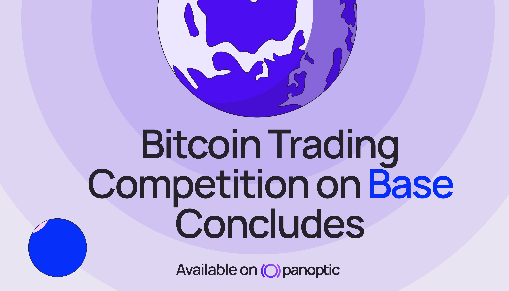
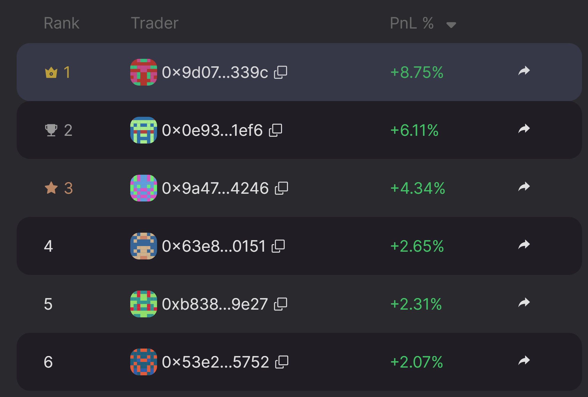
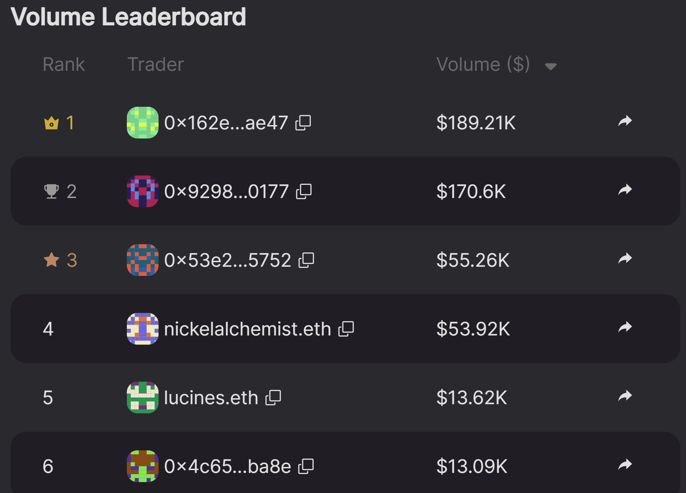

The Panoptic [trading competition](/blog/base-trading-competition) on Base has officially come to a close, and the results are in. Thank you to everyone who participated! Over the past two weeks, participants actively traded, LP’d, and deposited into Panoptic markets for a chance to win $4,800 in USDC, 5,450,000 Pips, and a Michael Saylor pillow.

Thank you to everyone who participated and helped make this competition a success.

## Base Trading Competition Winners

### Highest PnL

- 🥇 1st Place: 0x9d07e3406d3e7ec5e19b6804f6f821f684c9339c with +8.75% PnL winning 1,000,000 Pips + $1,000 USDC
- 🥈 2nd Place: 0x0e93cf50f54517059cfb4ad9f4cf9f6628061ef6 with +6.11% PnL winning 500,000 Pips + $500 USDC
- 🥉 3rd Place: 0x9a4773eeee73e34e1ee0e9a64e4b7453b0b04246 with +4.34% PnL winning 250,000 Pips + $300 USDC

-   4th–10th: 100,000 Pips + $150 USDC each
-   11th–20th: 50,000 Pips + $100 USDC each
-   21st–50th: 25,000 Pips each
    

### Highest Volume

Participants competed to generate the most trading volume in the ETH/USDC v4 market on Base, with over $134K in total deposits (minimum deposit of $100).

- 🥇 1st Place: 0x162e7dada6125aa4335d5ab17fd04d3fa22eae47 with $189K in deposits winning 1,000,000 Pips + $500 USDC + Michael Saylor pillow
- 🥈 2nd Place: 0x92988324f2858a59c384013ae9411da4237b0177 with $171K in deposits winning 500,000 Pips + $300 USDC
- 🥉 3rd Place: 0x53e213da8c28d85dc6663c3b5e35bb0ffbb05752 with $55K in deposits winning 250,000 Pips + $150 USDC

Congratulations to all the winners, and thank you to every degen, strategist, and LP who participated. Prizes and Pips will be distributed soon.

## What’s next?

The next competition will begin July 7. Stay tuned for more details!

*Join the growing community of Panoptimists and be the first to hear our latest updates by following us on our [social media platforms](https://links.panoptic.xyz/all). To learn more about Panoptic and all things DeFi options, check out our [docs](/docs/intro) and head to our [website](https://panoptic.xyz/).*
