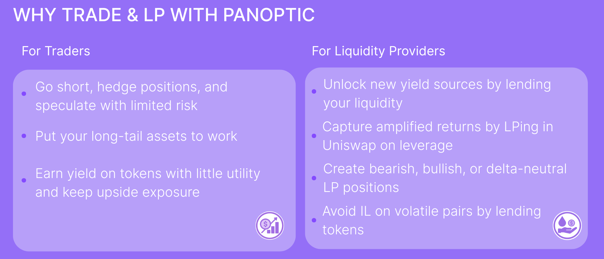
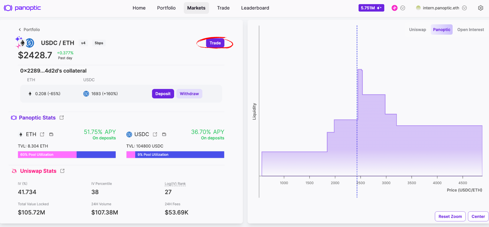

Following the launch of UNI [incentives](/blog/uni-token-incentives-on-panoptic) on Unichain and the success of our trading competitions, we're excited to announce the next contest, centered around **ETH**.

The ETH market is a playground for trying out LP strategies, options trading, hedging, and other volatility plays using Panoptic’s perpetual options.

Anyone can join—just trade in the designated **ETH/USDC 0.05% v4 market on Unichain** to participate. Prizes are available for the best trader, the worst trade, the most traded, and more! Prizes include 2,250,000 Pips, $2,000 USDC, and a consolation prize!

**Minimum deposit: $100**.
You’re welcome to deposit more than the minimum required. Keep in mind that a higher deposit requires a higher percentage return to rank competitively.

Please **do not withdraw any collateral from the ETH market** during the competition period or your profit and loss (PnL) % will be negatively impacted. PnL % is evaluated based on the **maximum, cumulative amount of funds you had deposited** during the event. This ensures fair comparison across all participants.

# Prizes

## Total Prize Pool

-   USDC: $2,000
-   Incentives:  [UNI tokens](/blog/uni-token-incentives-on-panoptic)
-   Points: 2,250,000 [Pips](http://pips.panoptic.xyz)
-   Bonus: Consolation prize 
    

## Categories

-   💜 **The Panoptimist (Highest PnL %):** 500,000 Pips + $500 USDC
-   🎯 **The Sniper (Highest Absolute Gain in Single Trade):** 250,000 Pips + $250 USDC
-   💩 **The N00b  (Highest Absolute Loss in Single Trade):** 250,000 Pips + $250 USDC + Consolation Prize
-   🚂 **The Penny Picker (Highest Streamia Earned in Single Trade):** 250,000 Pips + $250 USDC
-   🤑 **The Big Tipper (Highest Streamia Paid in Single Trade):** 250,000 Pips + $250 USDC
-   💰 **Big Bags (Highest Volume):** 500,000 Pips + $250 USDC
-   👁️👄👁️ **The Bragger (Shared Trading Card Lottery for [Prime Members](/blog/panoptic-prime-loyalty-program) Only):** 250,000 Pips + $250 USDC  

Good luck, and may the best trader win!

## Timeline

- Start Date: July 7 at 17:00 UTC
- End Date: July 21 at 17:00 UTC
- Duration: 2 weeks total

## How to Participate

1. Head to the [Panoptic app](https://app.panoptic.xyz/)

    Launch the Panoptic app and switch your network to Unichain.
    

2. Open the ETH/USDC 5bps v4 market.
    
    Tap “Markets” and select the **ETH/USDC** 5bps v4 market on Unichain.
    Click Deposit.
    

3. Deposit ETH and USDC
    

    Hit the **Deposit** button. Enter the amounts of ETH and USDC you want to add (minimum $100 total). Make sure to deposit a little bit of both tokens for a smoother trading experience. Confirm in your wallet to fund your competition balance.

4. Once you have deposited, click "Trade"
    

5. Select a strategy
    

    Click “Strategies” and pick the style that fits your market view:
    -   **Bullish** (e.g. long call)
    -   **Bearish** (e.g. long put)
    -   **Neutral** (e.g. strangle)

    Choose your preferred strategy and review the projected payoff chart.

    

6. Open your position

    Adjust strike price, timescale, and contract size. Check fees and risk parameters. Click "Review Position" and confirm in your wallet.

7. Monitor and manage your open positions 
    

8. Monitor the leaderboard

    

    Head to the **Leaderboard** tab and click "Competition". Track your rank over the two‑week event.

For more information on how to [open a position](/docs/product/opening-a-position), [close a position]/docs/product/closing-a-position), and [manage](/docs/product/position-management) your trades on Panoptic, visit our [docs](/docs/intro).

### How to Get ETH or USDC on Unichain

### Fund Your Wallet

-   You can [swap](https://app.uniswap.org/swap) your tokens to ETH or USDC
    

### Bridge to Unichain

-   Use a [bridge](https://www.unichain.org/bridge) to Unichain
-   Bridge **ETH or USDC** from Ethereum mainnet (or another network) to Unichain

> *Disclaimer: Panoptic provides these external links and sources for your convenience. However, it's crucial for users to independently verify all sources and information. Please be aware that Panoptic is not responsible for the verification of external sources or the security of external platforms. Users should exercise caution and are solely responsible for their actions; Panoptic is not liable for any loss of funds or other damages incurred as a result of using these platforms.*

## Technical Details

- **Eligible Markets**: ETH/USDC 5bps v4 (Unichain market)
- **Chain**: Unichain
- **Minimum Deposit Size**: $100 (combined amount in ETH and USDC, e.g., depositing $50 of USDC and $50 of ETH would qualify)
- **Reward Distribution**: $2,000 USDC, UNI tokens, 2,250,000 Pips, and a consolation prize to the worst trader!

  
*Join the growing community of Panoptimists and be the first to hear our latest updates by following us on our [social media platforms](https://links.panoptic.xyz/all). To learn more about Panoptic and all things DeFi options, check out our [docs](/docs/intro) and head to our [website](https://panoptic.xyz/).*
