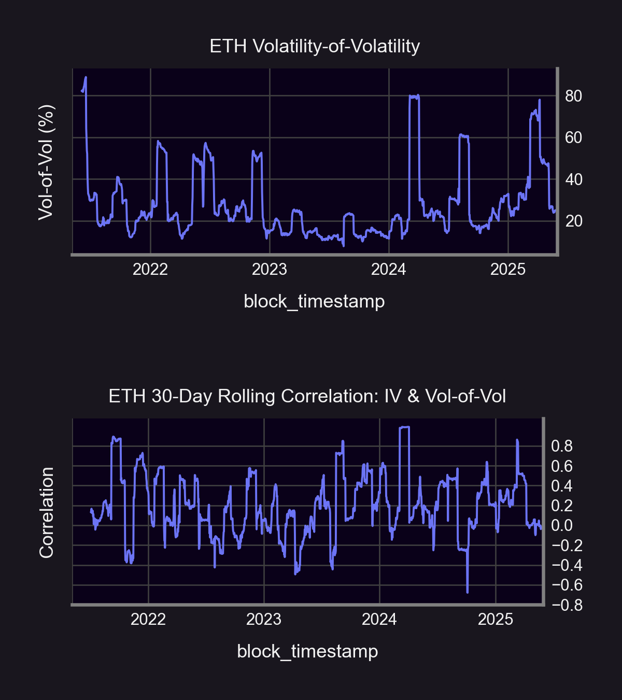

Welcome Panoptimists to the July edition of the Panoptic Newsletter, where we provide industry insights, research recaps, and Panoptic-specific content to keep you updated on our DeFi-native options platform.

If you want future newsletters sent directly to your email, sign up on our [website](https://panoptic.xyz).

## About Panoptic

Discover the future of trading with Panoptic, your gateway to perpetual options in DeFi. Our cutting-edge platform empowers you to manage risk effectively and trade with unprecedented flexibility. Join us and be part of a secure, decentralized revolution in options trading, tailored for both crypto newcomers and experienced traders.

## Market Highlights

### UNI Token Incentives Launch Marks Major DeFi Integration Milestone

Panoptic has officially [integrated](/blog/uni-token-incentives-on-panoptic) with Uniswap's incentive program, with depositors, LPs and option traders now receiving UNI token rewards across select Uniswap v4 markets. The program features 440,997 UNI tokens (~$3.7M USD) distributed bi-weekly by Gauntlet, targeting five key markets on Unichain including ETH/USDC, WBTC/USDT0, and ETH/WBTC pools, and one market on Ethereum Mainnet–ETH/USDC.

This performance-based incentive structure rewards LPs for liquidity provision, fee collection, time in-range, and trading volume—directly aligning with Uniswap v4's ambitious goals of migrating $32.8 billion in rolling 30-day volume from v3 and achieving $750 million TVL with $11 billion swap volume.

Unlike traditional airdrops, this is a dynamic, merit-based system where pools are selected and adjusted every two weeks based on market conditions, making Panoptic users direct beneficiaries of Uniswap's ecosystem growth while earning enhanced yields through both swap fees and UNI token distributions.

### Delta-Neutral LPing Strategy Gains Traction as Market Volatility Returns

Panoptic's comprehensive [analysis](/blog/delta-neutral-lp-hedge-uniswap-position) of delta-neutral LP hedging strategies reveals how LPs can dramatically reduce downside exposure while earning enhanced fee income through strategic options overlay. The research demonstrates that combining traditional Uniswap LP positions with short perpetual calls can reduce losses from -0.49% to just -0.02% on a 1% ETH drop, while simultaneously doubling fee income through both Uniswap swap fees and Panoptic option premiums. This "perpetual straddle" approach effectively transforms passive liquidity provision into an active options-selling strategy that profits when prices stay in range and provides cushioned exposure during price movements.

The strategy addresses one of DeFi's most persistent challenges—impermanent loss and directional exposure in LP positions—by creating delta-neutral exposure that maintains consistent fee capture regardless of market direction. As crypto markets continue to experience heightened volatility, this hedging approach offers LPs a sophisticated risk management tool that was previously only available to institutional traders, democratizing advanced portfolio management techniques through Panoptic's permissionless infrastructure.

## Panoptic in the Markets

### Bitcoin Trading Competition Concludes on Base

Panoptic's cbBTC trading [competition](/blog/bitcoin-trading-competition-on-base-concludes) on Base launched with exceptional participation, featuring a prize pool of 5.45 million Pips, $4,800 USDC, and the coveted Michael Saylor pillow. The four-week competition focused on the cbBTC/USDC 30bps v4 market, with participants competing for both highest PnL percentage and trading volume rankings. The competition structure rewards well-executed trading strategies while maintaining accessibility with a $100 minimum deposit requirement, allowing both newcomers and experienced traders to showcase their Bitcoin options strategies.

The timing of the competition coincides with Bitcoin's continued strength near all-time highs, creating an ideal environment for testing various options strategies including directional plays, volatility trades, and delta-neutral positions. Early competition data shows strong engagement across multiple strategy types, with participants deploying everything from simple long calls to complex multi-leg spreads, demonstrating the growing sophistication of DeFi options traders and the platform's ability to support institutional-grade strategies.

Congratulations to all the [winners](/blog/bitcoin-trading-competition-on-base-concludes)!

### Panoptic Prime Loyalty Program Launches for Elite Community Members

The [exclusive](/blog/panoptic-prime-loyalty-program) Panoptic Prime loyalty program launched as an invite-only initiative for the platform's most engaged traders and LPs. Members with 100,000+ non-boosted Pips or holders of Panoptic testnet NFTs/POAPs gain access to private Discord channels, early product access, boosted Pips for feedback and testing, special trading competition rewards, and direct 1:1 sessions with the core team. The program represents Panoptic's commitment to building a community-driven platform where user feedback directly shapes product development and strategic direction. A new round of applications to join the exclusive program will open again in Q3 2025.

## Panoptic in the Media

## Spotlights

### Vol-of-Vol Trading Strategies Reveal Crypto's Unique Volatility Characteristics

Panoptic's latest research explores volatility of implied volatility (volga) through comprehensive backtesting of reverse iron butterfly strategies on ETH/USDC and WBTC/USDC pools. The analysis reveals that ETH markets generated 59% cumulative returns (12% annualized) over four years using short volga strategies, significantly outperforming traditional equity markets where long volga typically dominates. The study identifies crypto's unique IV/vol-of-vol correlation patterns, with ETH showing 0.51 correlation compared to the VIX/VVIX correlation of 0.27, creating opportunities for systematic vol-of-vol premium harvesting.

The research demonstrates that crypto markets exhibit elevated vol-of-vol risk premiums due to heightened correlation between implied volatility and its own volatility, making short volga trades more attractive than in traditional markets. BTC showed more muted performance at 17% total returns, but both assets displayed the same fundamental pattern where rapid changes in spot-vol correlation and Hurst exponent measurements created optimal entry points for risk reversal strategies, suggesting that crypto's volatility structure offers unique opportunities for sophisticated options traders.

### Straddles vs Strangles: Delta-Neutral Performance Analysis Reveals Strategic Insights

Comprehensive backtesting of delta-neutral volatility strategies on ETH/USDC pools shows that long strangles consistently outperformed straddles over a one-year period, generating 10.46% returns versus 3.28% for straddles. The analysis reveals that monthly rolling frequencies outperformed weekly rebalancing by 2x for both strategies, demonstrating that less frequent adjustments allow positions to capture larger price movements while reducing the impact of streaming fee accumulation. The research spans ETH's dramatic price action from May 2024 to April 2025, including the massive 56% decline from peak to trough in early 2025.

The study highlights how Panoptic's perpetual options framework transforms traditional theta decay into positive revenue streams for sellers, while buyers benefit from the absence of expiration dates that can eliminate time-value losses. Strangles proved more resilient during breakout-driven markets due to lower cost structure and wider profit ranges, while straddles showed superior sensitivity to short-term volatility with peak monthly returns reaching 10-15% during high-conviction volatility periods, providing traders with clear guidelines for strategy selection based on market conditions.

### OpenZeppelin Audit Strengthens Security Foundation

Panoptic [successfully](docs/security/security_audits#openzeppelin) completed its Uniswap V4 oracle hook audit with OpenZeppelin on May 20, 2025, reinforcing the platform's commitment to security and institutional-grade reliability. The audit covers critical infrastructure components that enable Panoptic's integration with Uniswap v4, ensuring that the protocol's oracle mechanisms meet the highest security standards as the platform scales across multiple networks. This audit represents another milestone in Panoptic's comprehensive security framework, building on previous audits and demonstrating the team's dedication to protecting user funds through rigorous third-party verification.

### Panoptic Vaults Begin Code4rena Competitive Audit

Our new vault infrastructure is now in the wild for a competitive security audit on Code4rena. Researchers have ten days to break, probe, and improve the code— and there’s an $18,000  bounty waiting for the most critical findings. Follow the contest [here](https://x.com/code4rena/status/1938688838504960081).

<blockquote class="twitter-tweet">
New $18,000 competitive audit, STARTS NOW  Welcome Panoptic, a DeFi options protocol designed to enhance LPing and trading.  10 days to help secure <a href="https://twitter.com/Panoptic_xyz?ref_src=twsrc%5Etfw">@panoptic_xyz</a> with the biggest prizes go to the rarest vulnerabilities found.  Check out the audit docs below for more details.⤵️ <a href="https://t.co/S1lQDkAdjQ">pic.twitter.com/S1lQDkAdjQ</a>
&mdash; Code4rena (@code4rena) <a href="https://twitter.com/code4rena/status/1938688838504960081?ref_src=twsrc%5Etfw">June 27, 2025</a></blockquote> .

# Up Next

### Trading Competition Returns on Unichain

By popular demand, we’re bringing back the [trading competition](/blog/unichain-defi-options-trading-competition) for the month of July! The contest takes place on Unichain, so participants can double dip on UNI incentives. Prizes are available for the best trader, the worst trade, the most traded, and more, and include 2,250,000 Pips, $2,000 USDC, and a consolation prize for the worst trade. Contest ends July 21.

### Passive LP Vaults Coming Soon

While the Hypovault infrastructure is being battle-tested in the Code4rena audit, we’re gearing up for a busy Q3 2025:

-   Passive LP Vaults: set-and-forget vaults that automatically consolidate your liquidity and rotate it into the highest-yield pools.
-   Additional Vault Products: more strategies built on the audited Hypovault core, turning every option strategy into a structured product.

Keep an eye out—once the audit wraps, we’ll share launch dates and how to get access.
  
*Join the growing community of Panoptimists and be the first to hear our latest updates by following us on our [social media platforms](https://links.panoptic.xyz/all). To learn more about Panoptic and all things DeFi options, check out our [docs](/docs/intro) and head to our [website](https://panoptic.xyz/).*
