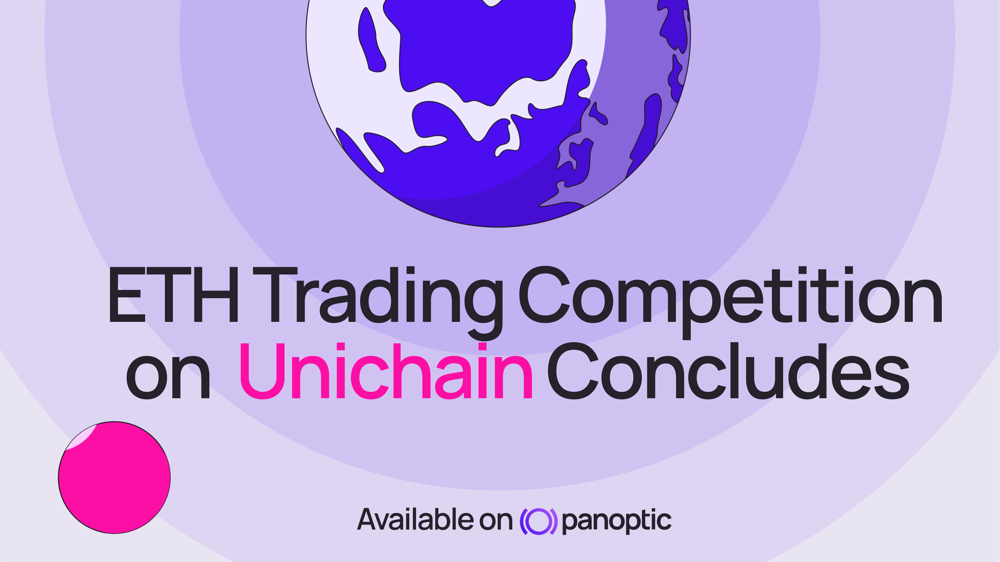
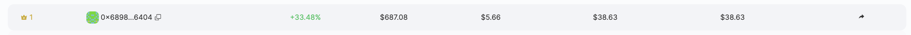
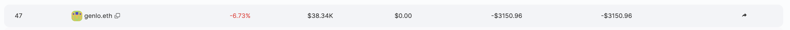
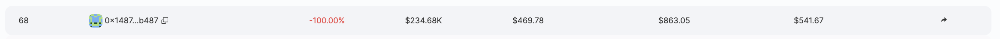
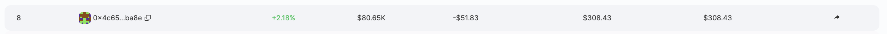
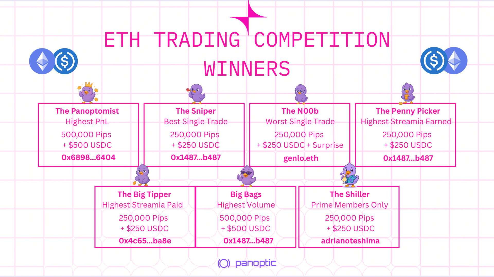

The Panoptic [trading competition](/blog/unichain-defi-options-trading-competition) on Unichain has officially come to a close, and the results are in. Thank you to everyone who participated! Over the past two weeks, participants actively traded, LP’d, and deposited into Panoptic markets for a chance to win $2,000 in USDC, 2,000,000+ Pips, and $100 of FARTCOIN as a consolation prize for the biggest loser.

Thank you to everyone who participated and helped make this competition a success.

## ETH Trading Competition Winners
> _Image values from left to right: rank, address, PnL, volume, streamia, best trade, worst trade._

💎 Highest PnL: 0x6898...6404

🧠 Best Trade: 0x1487...b487

💀 Worst Trade: genlo.eth 

📈 Most Streamia Earned: 0x1487...b487

💸 Most Streamia Paid: 0x4c65...ba8e

🚀 Highest Volume: 0x1487...b487

👁️👄👁️ The Shiller: Our lucky [Panoptic Prime](/blog/panoptic-prime-loyalty-program) member - [Adrianoteshima](https://x.com/adrianoteshima)

Congratulations to all our winners, and thank you to every degen, strategist, and LP who participated. Prizes and Pips will be distributed by the end of the week.  
  
We're excited to recognize genlo.eth as the recipient of our N00b recognition award. As part of our commitment to supporting new traders in their learning journey, genlo.eth will receive $100 worth of FARTCOIN tokens as consolation for the worst trade.

The ETH/USDC v4 market on Unichain has demonstrated significant traction with over $750,000 in total trading volume. The market has attracted substantial user engagement, with 191 option positions opened and more than $250,000 in total value deposited by traders.

## What’s next?

This competition is the third of many! In the coming months, we will be hosting more trading competitions and incentive campaigns, with new prizes and opportunities to engage with DeFi options trading.

*Join the growing community of Panoptimists and be the first to hear our latest updates by following us on our [social media platforms](https://links.panoptic.xyz/all). To learn more about Panoptic and all things DeFi options, check out our [docs](/docs/intro) and head to our [website](https://panoptic.xyz/).*
