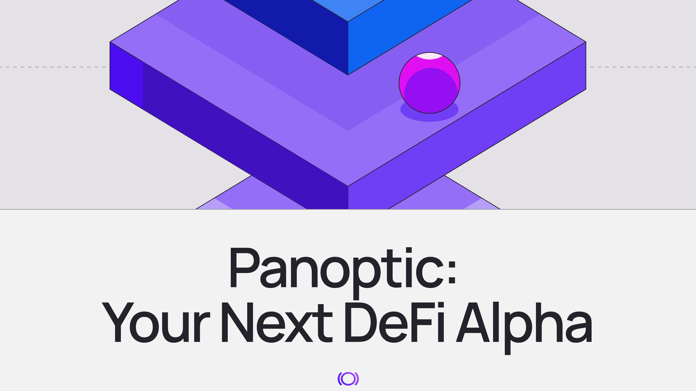
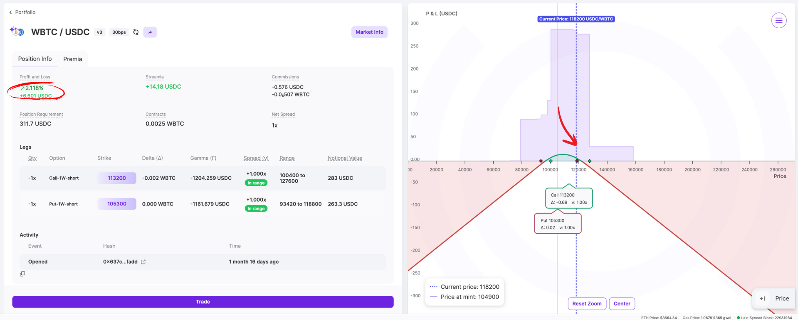
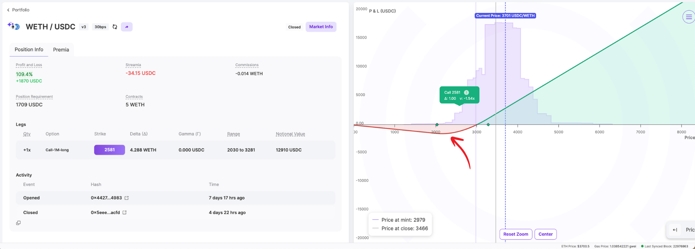
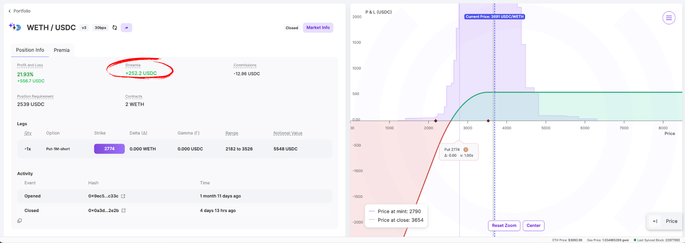
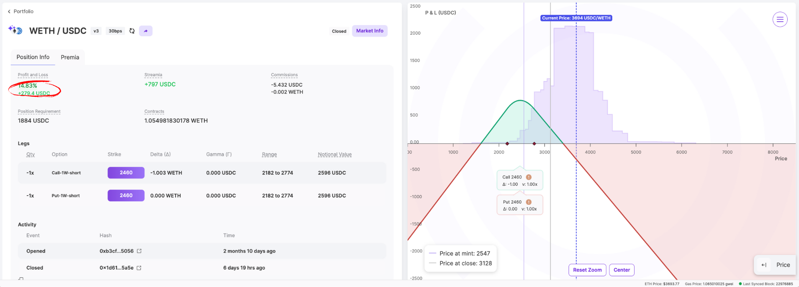
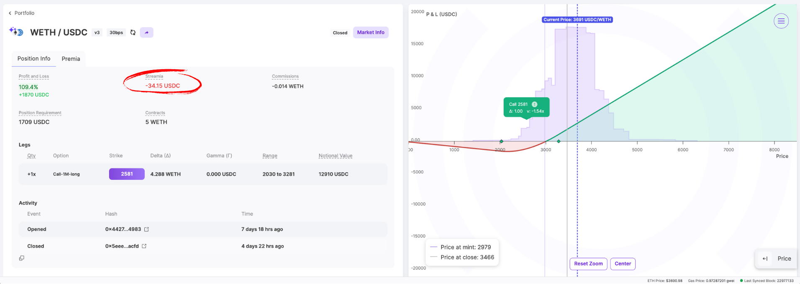
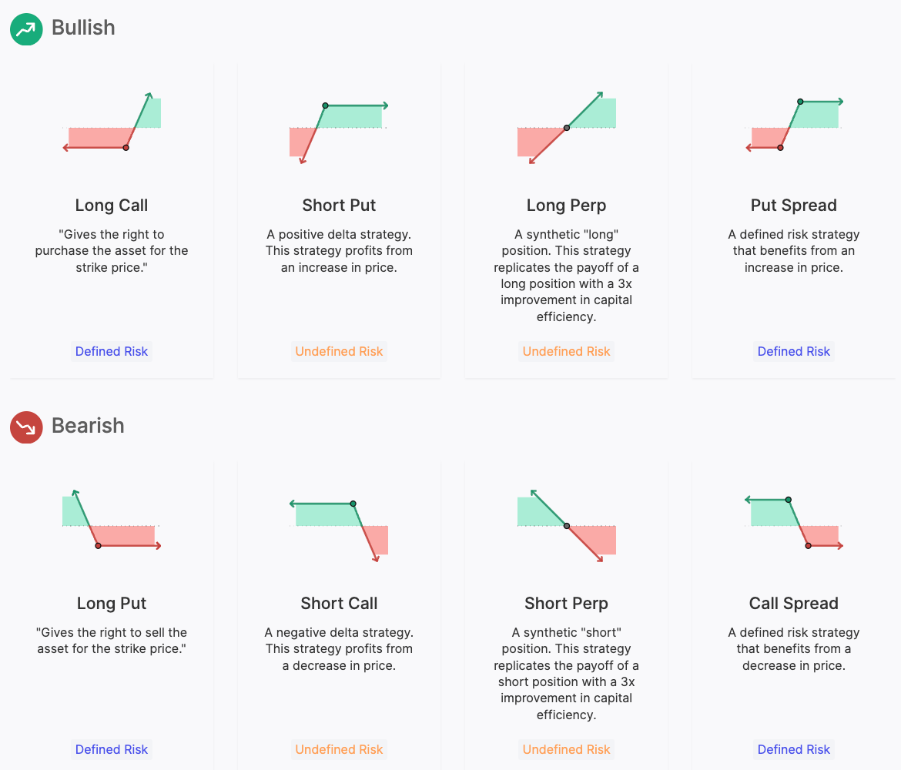
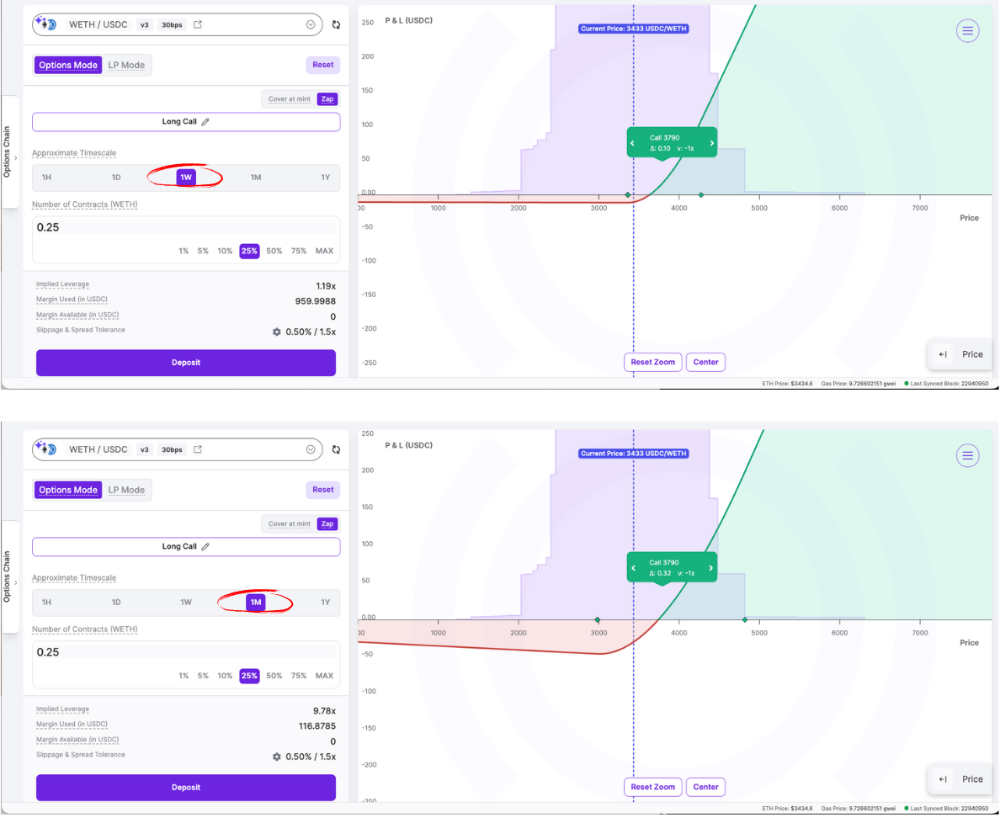
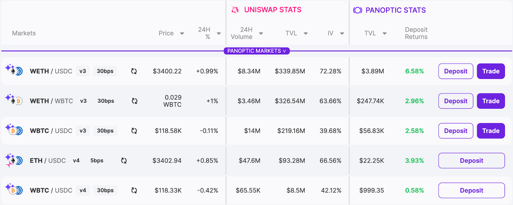
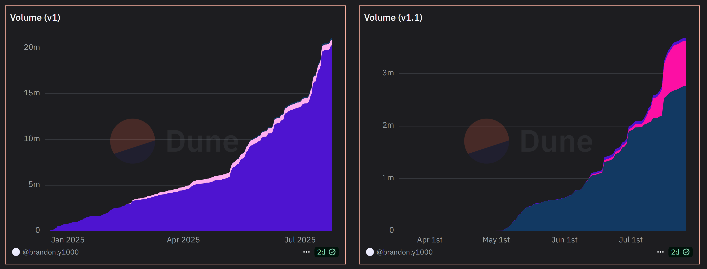

If you've been farming points on Eigenlayer or Pendle, you already understand the game: get in early, accumulate points, hope for an airdrop. But while everyone's crowding into the same LST and lending protocols, there's a different opportunity brewing in options.

## A New Opportunity For Points
Most DeFi users see "options on Uniswap" and immediately think it's too complex. This creates the perfect alpha opportunity. While retail crowds chase 5% APY on overcrowded LST protocols, fewer sophisticated users are accumulating points in a protocol that is bringing options onchain.
On Panoptic, users can buy or sell options on any token that has an existing Uniswap market (or even launch a new market). What makes options genuinely exciting is that you're not just betting on price direction like with perps–you're trading time, volatility, and probability.

## "Why Not Just Do Perps?"
This is the million-dollar question. Perps are easier, more liquid, and offer higher leverage. But here's the thing–everyone's doing perps. The opportunity isn't in doing what's easy; it's in managing risk, getting token exposure, and hedging your losses.

**Perps vs. Options:**
-   **Perps:** Like a car that can only go 100 mph forward, 100 mph backward, or stop completely
-   **Options:** Like a normal car, where you can accelerate gradually, slow down, and control your speed

**The Point:** Options aren't binary win/lose. You can be strategic, make money even when you're partially wrong.

With perps, you're either right or wrong about price movement. Instead of going 10x long on ETH and getting liquidated if it drops 10%, you could buy a call option. If the price drops, you only lose the premium you paid, while still having the same upside exposure.  

With options, you can also:
-   Make money even when you're wrong about direction
    
-   Buy calls when you think ETH will pump (but limit your downside)
    
-   Sell puts to collect premium while holding
    
-   Create strangles or straddles that profit from sideways movement
    
-   Hedge your existing portfolio without having to sell

    <iframe width="560" height="315" src="https://www.youtube.com/embed/B-euRCseMGY?si=NkhRZbes36K-so1z" title="YouTube video player" frameborder="0" allow="accelerometer; autoplay; clipboard-write; encrypted-media; gyroscope; picture-in-picture; web-share" referrerpolicy="strict-origin-when-cross-origin" allowfullscreen></iframe>

**The best part?** As you explore this innovative trading primitive, you’re also earning [Pips](https://pips.panoptic.xyz)—our points system that rewards your activity and positions you for future incentives. Think of it as getting rewarded while learning the future of DeFi trading.

Pips are calculated based on streamia, which accumulates over time. Selling options earns the most Pips, while buying options gives you the second-highest point rewards. The more active you are, the more you earn. [Streamia](https://panoptic.xyz/docs/product/streamia) is the Uniswap LP fees + a Panoptic premium from option buyers. You can think of this as a funding rate where buyers pay sellers at each block.

## The Points Game: Earn While You Explore
**How to Earn Pips (Panoptic Incentive Points)**
-   **Options sellers:** Earn Pips from streamia (options trading fees) collected
-   **Options buyers:** Earn Pips from streamia fees paid
-   **PLPs:** Deposit funds → earn Pips based on deposit size × time

> *Streamia earned/paid is netted per account to avoid double rewards*

**Why this beats LST farming:** You're not just passively earning yield–you're amplifying point rewards through active strategies, harvesting volatility premiums, and targeting precise exposure

## Why Options Are Cool
**1.  Asymmetric Risk/Reward**
- **Risk:** Limited to premium paid and decline in intrinsic value if price moves against you.
- **Reward:** Potentially unlimited (for calls) or substantial (for puts) 

**2. Volatility Trading**
- High volatility = more expensive options (good for sellers)
- Low volatility = cheaper options (good for buyers)

There are a hundred more reasons, but we will start with the basics for now.

## The Basics
Let’s start with ETH/USDC as an example
-   Users can choose from different strategies based on their market outlook
    
It’s a good idea to start with simple calls/puts. Use weekly options for shorter-term plays and monthly options for longer-term positioning. 

The number of contracts refers to how much ETH you want to trade with. In the example pictured above, 0.25 contracts is like trading with ¼ ETH.

### Which Markets Earn Points?

Look for the ✨emoji on the markets page to see which markets are currently earning points and start trading today.

For a more detailed guide on how to open a position, visit this [guide](/research/opening-a-position-on-panoptic). Think of your first few trades as educational. You're learning options mechanics while earning points. The goal isn't to become a master trader overnight, but to understand a new DeFi primitive. Time to get some upside exposure and level up to the next derivative!

### Start Here
-   Access the [Panoptic platform](https://app.panoptic.xyz/)
-   Learn how to [use the Panoptic options trading platform](https://youtube.com/playlist?list=PLB5qwiSwzT_rgH-HvQtDaWTe48xPaF6se&feature=shared)
-   Learn more about [gRHO, the lending interface for Uniswap LPs](/blog/grho-launches-on-uniswap-v4)
-   For a full guide on getting started on Panoptic, read our [docs](/docs/product/opening-a-position)

### Learn More
-   For [passive LPs](/docs/getting-started/passive-lp)
-   For [Uniswap LPs](/docs/getting-started/active-lp)
-   For [token launchers](/docs/product/token-launchers/bootstrap-liquidity)
-   For [traders](/docs/getting-started/options-traders)

## Already Live & Scaling
Panoptic launched in December 2024. We’ve since:
-   Surpassed $25M in trading [volume](https://dune.com/brandonly1000/panoptic)
-   Gone live on Ethereum Mainnet, Unichain, and Base
-   Perpetual Option Vaults (POVs) are coming this Fall

*Join the growing community of Panoptimists and be the first to hear our latest updates by following us on our [social media platforms](https://links.panoptic.xyz/all). To learn more about Panoptic and all things DeFi options, check out our [docs](/docs/intro) and head to our [website](https://panoptic.xyz/).*
