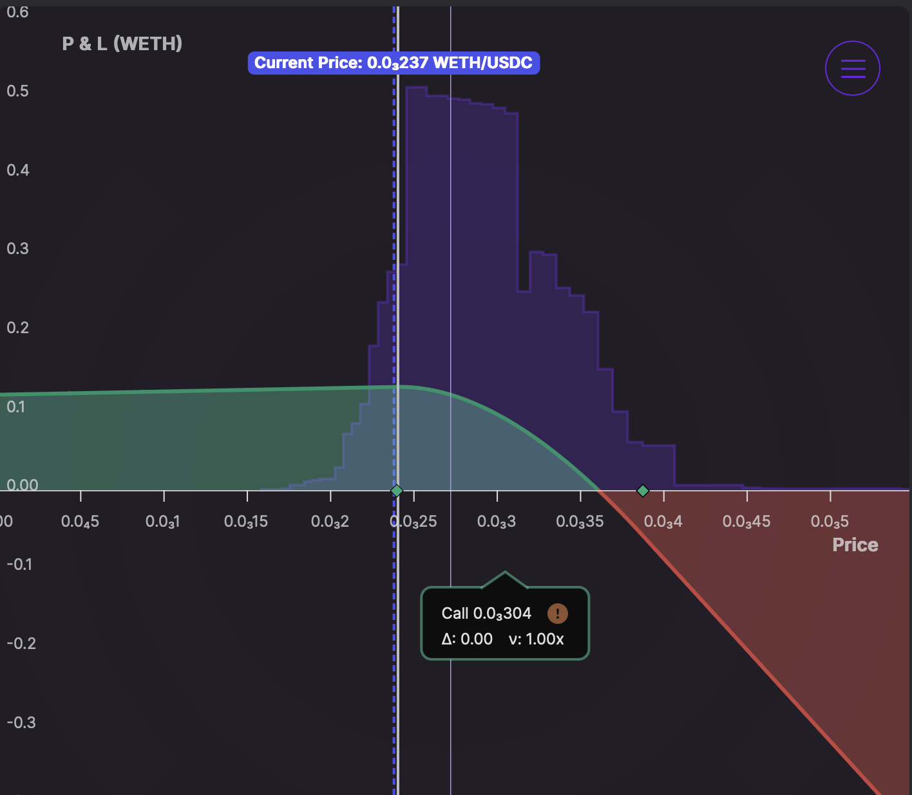

  
Welcome Panoptimists to the August edition of the Panoptic Newsletter, where we provide industry insights, research recaps, and Panoptic-specific content to keep you updated on our DeFi-native options platform.

If you want future newsletters sent directly to your email, sign up on our [website](https://panoptic.xyz/).

## About Panoptic

Discover the future of trading with Panoptic, your gateway to perpetual options in DeFi. Our cutting-edge platform empowers you to manage risk effectively and trade with unprecedented flexibility. Join us and be part of a secure, decentralized revolution in options trading, tailored for both crypto newcomers and experienced traders.

## Market Highlights
### Alpha Opportunities: Why Options Trading is the Next Frontier in DeFi Points Farming

If you've been farming points on Eigenlayer or Pendle, you already understand the game: get in early, accumulate points, hope for an airdrop. But while everyone's crowding into the same LST and lending protocols, there's a [different](/blog/panoptic-your-next-defi-alpha) opportunity brewing in options.  

Most DeFi users see "options on Uniswap" and immediately think it's too complex. This creates the perfect alpha opportunity. While retail crowds chase 5% APY on overcrowded LST protocols, fewer sophisticated users are accumulating points in a protocol that is bringing options onchain. On Panoptic, users can buy or sell options on any token that has an existing Uniswap market (or even launch a new market). What makes options genuinely exciting is that you're not just betting on price direction like with perps–you're trading time, volatility, and probability.

Perps are like a car that can only go 100 mph forward, 100 mph backward, or stop completely. Options are like a normal car, where you can accelerate gradually, slow down, and control your speed. Options aren't binary win/lose. You can be strategic, make money even when you're partially wrong.  

As you explore this innovative trading primitive, you're also earning [Pips](https://app.panoptic.xyz/leaderboard/pips)—our points system that rewards your activity. Pips are calculated based on deposits and streamia, which accumulate over time. Selling options earns the most Pips, while buying options and depositing also earns Pips. The more active you are, the more you earn. Why this beats LST farming: You're not just passively earning yield–you're amplifying point rewards through active strategies, harvesting volatility premiums, and targeting precise exposure.  
  

## Panoptic in the Markets
### Competition Wrap-Up: $2,000+ in Prizes Awarded as Unichain Trading Contest Concludes

The Panoptic [trading](/blog/unichain-defi-options-trading-competition-concludes) competition on Unichain has officially come to a close, and the results are in. Thank you to everyone who participated! Over the past two weeks, participants actively traded, LP'ed, and deposited into Panoptic markets for a chance to win $2,000 in USDC, 2,000,000+ Pips, and $100 of FARTCOIN as a consolation prize for the biggest loser.

Congratulations to all our winners, and thank you to every degen, strategist, and LP who participated. All prizes and Pips have been distributed. We're excited to recognize genlo.eth as the recipient of our N00b recognition award. As part of our commitment to supporting new traders in their learning journey, genlo.eth received $100 worth of FARTCOIN tokens as consolation for the worst trade.

The ETH/USDC v4 market on Unichain has demonstrated significant traction with over $750,000 in total trading volume. The market has attracted substantial user engagement, with 191 option positions opened and more than $250,000 in total value deposited by traders.  
  

### Profitable Options Strategies in Action

Recent trading activity showcases the potential of well-executed options strategies on Panoptic across multiple time horizons and market conditions. A standout short-term tactical play demonstrated a 28.03% return, likely capitalizing on rapid volatility expansion or directional price movement through precise entry and exit timing. These quick strikes exemplify how traders can leverage Panoptic's efficient pricing mechanisms to capture short-term alpha without the friction of traditional options expiries or upfront premiums that would erode returns in conventional markets.

Even more impressive is a patient strategic position that generated an exceptional [96% return](https://app.panoptic.xyz/positions/ethereum/0xba5f657012854b9140659a6ed8bd9d6abae6a08ce2b82f97ec81b4d20c6080c7%23230/?view_as=0x9d07e3406d3e7ec5e19b6804f6f821f684c9339cc) over seven months through an ETH put writing strategy. This long-term winner demonstrates that traders can maintain conviction positions without the constant rollover costs and expiry management that plague traditional options strategies. The position likely benefited from both ETH's price appreciation and favorable streamia accumulation, showing how sophisticated traders are leveraging Panoptic's unique pricing model to implement institutional-grade strategies previously unavailable in DeFi. These results exemplify how proper position sizing, strategic strike selection, and patience can generate outsized returns when fundamental thesis and market timing align.

### Research Deep Dive: How Futures Term Structure Drives Crypto Volatility and Trading Opportunities

An underdeveloped area of [research](/research/variance-risk-premium-onchain-synthetic-perps) within traditional markets is how futures term structure interacts with and can precipitate underlying volatility. Contango characterizes an upward-sloping futures term structure where spot trades at a discount to futures prices, while backwardation characterizes a downward-sloping futures term structure where spot trades at a premium to futures prices.

We utilize Panoptic-native synthetic perps returns as proxies for contango and backwardation due to BTC trends that demonstrate how underlying BTC price tends to increase (decrease) alongside CEX BTC funding rate increases (decreases), indicating that severe perp funding rate contango (backwardation) would serve as an adjunct to steep price increases (decreases).

The maximum monthly return of 56.7% for the long synthetic perp position was attained in July 2022 with the largest gain of 44.4% for a short synthetic perp position being realized in June 2022. Rises in the VRP predominantly coincide with increases in spot-RV correlation, which is further statistically supported by synchronized timing with heightened upside realized volatility persistence.

In crypto markets, strong spot rallies are often followed by a build-up of downside risk expectations in the options market. This tendency becomes more pronounced when directional momentum is reinforced by steep futures curves — whether in contango or backwardation. A recurring pattern emerges: during periods of pronounced contango and persistent spot uptrends, traders increasingly accumulate downside convexity through long, far OTM put positions. This is generally interpreted as preemptive positioning for an eventual reversal or correction.

### Onchain Options Market Dynamics: Panoptic's Unique Position

While traditional options markets focus on expiring contracts and order book dynamics, Panoptic's perpetual options create fundamentally different market behavior. Unlike centralized exchanges where options decay toward expiry, Panoptic positions can be held indefinitely, allowing traders to ride long-term trends without rollover friction. This structural difference manifests in unique trading patterns where traditional options see accelerating time decay as expiry approaches, forcing traders into constant position management, while Panoptic's streamia-based pricing creates steady, predictable costs that scale with position size and market volatility.

Recent market activity illustrates these differences clearly. While BTC puts bought last week contributed to spot's decline to 112k, and fast money continued purchasing momentum puts with institutions selling OTM calls, Panoptic traders aren't constrained by the artificial pressure of approaching expiries that drive much of this activity. Traditional markets show put skew firming as put buying and call selling continues, but Panoptic's perpetual framework allows for more patient positioning where traders can implement multi-month strategies based on fundamental analysis rather than expiry-driven tactics. This creates a more stable options ecosystem where market timing and strategic positioning take precedence over the constant rollover friction that characterizes traditional options markets.

## Panoptic in the Media
### A Brief History of Crypto Options: From Ancient Greece to Onchain Innovation

The recent $2.9 billion acquisition of Deribit by Coinbase highlights the immense value and importance of mature options markets in crypto. This milestone provides an opportune moment to examine the evolution of crypto options from their ancient origins to today's onchain innovations. The concept of options [traces back to ancient Greece](https://x.com/FishMarketAcad/status/1949093625834410229), where philosopher Thales of Miletus used meteorological knowledge to predict a bountiful olive harvest. He paid deposits for exclusive rights to local olive presses, essentially purchasing call options that generated significant profits when demand soared. This demonstrates the timeless human desire to speculate on future events and manage risk.  

The genesis of crypto options began with centralized exchanges copying traditional finance models. BitMEX (2014) offered "limited loss" futures with option-like payoffs, while Deribit (2016) became the clear leader by focusing exclusively on derivatives and attracting institutional traders. Major exchanges like Binance and Bybit followed suit, building comprehensive options platforms for their user bases. The DeFi awakening brought options onchain with varying degrees of success. Ribbon Finance popularized DeFi Option Vaults (DOVs) in 2021, making options strategies accessible through automated vaults. However, these static strategies often performed poorly during market shifts. Subsequent protocols like Hegic, Premia, Dopex, Lyra (now Derive), Cega, and JonesDAO each attempted different approaches but struggled to achieve lasting market share compared to centralized platforms.  
  
Recent innovations show promise for onchain adoption. Paradex launched perpetual options combining perpetuals' non-expiring nature with options' risk profiles. Rysk Finance reimagined covered calls with their V12 launch, offering customizable risk and RFQ systems to prevent front-running. Cega focused on exotic structured products, bringing complex financial instruments onchain with unprecedented variety. Despite these innovations, onchain options face adoption challenges including complexity for average users, inefficient liquidity models, gas costs, oracle dependencies, and target audience mismatches.

## Up Next

### Perpetual Option Vault (POV) Security Audits

We're preparing for the next phase of DeFi options. Our perpetual option vault (POV) infrastructure underwent a comprehensive [Code4rena competitive audit](https://code4rena.com/audits/2025-06-panoptic-hypovault) in July, with a second vault audit to launch in August.

We're also launching a new incentivized market on the wstETH/ETH pool. Stay tuned for more details!

_Join the growing community of Panoptimists and be the first to hear our latest updates by following us on our [social media platforms](https://linktr.ee/panopticxyz). To learn more about Panoptic and all things DeFi options, check out our [docs](https://panoptic.xyz/docs/intro) and head to our [website](https://panoptic.xyz/)._
