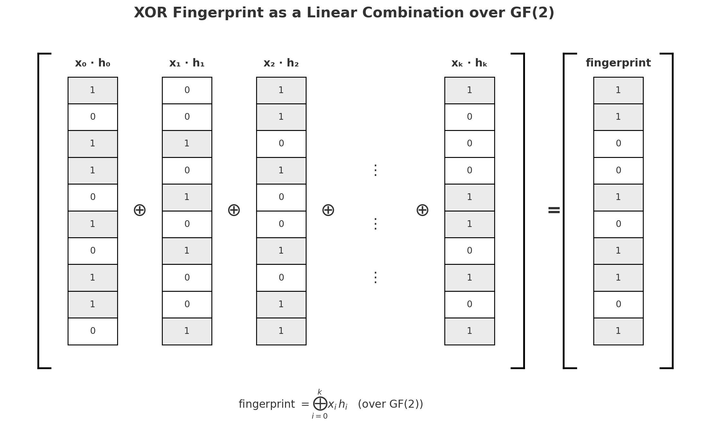

_What happened before and during the recent security incident, and what are the next steps._

## What Happened?

On August 25th, a Cantina researcher reported a critical vulnerability in Panoptic's core protocol that could enable attackers to drain all funds from PanopticPool smart contracts by spoofing position lists & bypassing collateral checks. 
After confirming the vulnerability, we immediately initiated a 72-hour emergency response: notifying users to withdraw funds, successfully coordinating the voluntary withdrawal of over $4M, and executing a whitehat rescue operation on August 28th that secured >98% of remaining at-risk funds across mainnet and L2s. 
All rescued funds have been transferred to [vault.panoptic.eth](https://etherscan.io/address/0x82BF455e9ebd6a541EF10b683dE1edCaf05cE7A1) and will be fully returned to users through a Merkle-root claim system. No user funds were lost.

  
## Initial Response and Social Recovery

On Monday, August 25th, we received a report from a Cantina researcher claiming that a critical vulnerability existed in the core Panoptic protocol which could enable anyone to drain nearly all funds locked in the PanopticPool smart contracts.

The Panoptic team immediately spent 4 hours on Monday evening testing the claims from the Cantina report. 
The Cantina researcher provided a hardcoded list of position IDs that seemed to bypass the internal checks inside the PanopticPool smart contract. 
To test if we could reproduce this attack using new positions, we wrote a Python script to implement the spoof mining, relying on the research of [Bellare & Micciancio](https://cseweb.ucsd.edu/~mihir/papers/inchash.pdf). 
We confirmed that our Python script could produce new lists and execute new attacks, and that the researcher’s findings were valid.

By this point, we had confirmed the vulnerability was real, and live customer funds were at risk. 
We engaged with our Cantina Incident Response team as well as Seal 911 at 10:30pm on Monday night to create war rooms. 
Over the next 2 days, we took the following actions.

- We gathered up the contact information for as many prospective Panoptic users as possible - people who had reached out and told us they were using the protocol, people who had asked research questions about the protocol, protocol team partners - and informed them of the situation, advising them to withdraw their funds.
- By Tuesday morning 9am, $2.35M of funds had already been voluntarily withdrawn from the Panoptic protocol.
- By Tuesday evening, more than 50 users had been contacted through direct messages on blockscan, and some had withdrawn their funds. However, close to $1.6M was still in the WETH-USDC-30bps pool on Mainnet, out of which 70% seemed to be linked to two multisigs wallets. Throughout the day on Tuesday, onchain investigations and help from our community enabled us to link that account to several other protocols such as Euler Finance, Goldfinch, and DYAD, but attempts to contact the owner(s) of these wallets did not prove successful.
- On Wednesday morning, our Discord mod, Hunter, uncovered a link between one of the multisig signers and one of our Discord users. After directly contacting this user on Discord, close to $1.25M was withdrawn from the protocol, leaving $550k of funds still at risk at the protocol level.

## Preparing for Recovery

By midday Wednesday, most of the user funds had been withdrawn and were not at risk anymore. 
It became clear at that point that the next step was to attempt to rescue the funds still present in the Panoptic protocol.

We began designing a whitehat rescue attack for each market. 
We would deploy an Attacker contract for each Panoptic market which would i) use a flash loan to deposit a large number of tokens in the Panoptic pool, ii) borrow a maximum amount of tokens to open Panoptic positions, iii) withdraw borrowed tokens using a spoofed position list to bypass collateral requirements, effectively draining all the funds in each market. 

After improving the Cantina report's proof-of-concept to ensure each market's funds could be rescued in a single operation, we next ranked all live Panoptic markets by TVL, mined a spoof lists for each market, and tested each market's Attacker to ensure that:

- The Attacker contract ended with 95%+ of the market's funds
- The funds were correctly withdrawable by the designated withdrawer address
- The market ended with minimal funds remaining, to avoid replay risk

All attacker development was done in isolation on one dev's machine. 
We refrained from uploading to Github or other collaboration tools to avoid leaking the attack. 
By Thursday afternoon, we had all Attacker scripts ready, and planned to broadcast each attack with a forge script before the end of the day.

## Whitehat Rescue

We planned to deploy through a mainnet Flashbots RPC endpoint to ensure the whitehat attack would not be broadcast to other builders and that the transaction would not be broadcast if it reverted in simulation.

We had managed to fit 2 of the mainnet attacks into one transaction to rescue up to $383k in USDC, WETH, and WBTC. 
All other attacks were to be executed with one attack per transaction. 
The plan was to broadcast the mainnet whitehat first, then broadcast the L2 whitehat rescues as close to simultaneously as possible following the mainnet whitehat's success. 
The majority of funds-at-risk were on mainnet, so the priority was executing that whitehat first.

When we initially tried to execute the whitehat attack on mainnet, our forge script hit rate limits from Flashbots, as the attack required more state reads than Flashbots's transaction submission API permitted. 
We reached out to the Flashbots team and asked if they could lift our rate limit to accommodate the initial plan of executing a forge script. 
They were extremely helpful and responsive, enabling us to execute the attack shortly after contact.

At block 23242436 on Aug-28-2025 05:55:23 PM EDT, we executed the mainnet whitehat: https://etherscan.io/tx/0x67a45dfe5ff4b190058674d7c791bbdc48e889f319f937c24fa13a5f9093f088

We had the entire Panoptic team on a live Google meet confirming attack success, monitoring for funds residing in the attacker contract as well as market TVL dropping as expected. 
We confirmed that the mainnet whitehat succeeded, and we then proceeded with whitehatting the largest Unichain and Base markets.

With >98% of customer funds already secured, the team could breathe a large sigh of relief. 
Later that night, we returned to whitehat 5 more markets across L2s. 
The remaining markets are small enough in TVL that a direct compensation from the treasury is an option, though we welcome whitehats who want to go retrieve those as well. 
All whitehat-rescued funds were then transferred to [vault.panoptic.eth](https://etherscan.io/address/0x82BF455e9ebd6a541EF10b683dE1edCaf05cE7A1).

## What Happens from Here?

Users will be able to claim rescued funds by the end of next week, after we’ve set up a [Merkle-root claim system](https://www.cyfrin.io/blog/what-is-a-merkle-tree-merkle-proof-and-merkle-root). 
We will transfer all rescued tokens into a dedicated contract with a stored merkle root, then enable users to claim their tokens back from the contract.

We will provide an offchain system for generating the correct Merkle proof for each user address, enabling every users to call this dedicated contract with a proof of which tokens they have the rights to and receive a transfer of their funds.

We have also attached a CSV file with our calculations of each account's claimable funds. 
We ask any affected user to send an email to support@panoptic.xyz or create a support ticket on Discord for disputes regarding your redistribution allotment. 
Our goal is to make everyone 100% whole, [in-kind](https://en.wikipedia.org/wiki/In_kind#In-kind_transfers) - we will not be exchanging any underlying assets for USDC or taking similar actions.


Additionally, we have also confirmed to the Cantina reporter that they will receive the maximum $250,000 for responsibly disclosing this vulnerability. 
We are deeply grateful for their research, as well as for the live help we received during this intense period from several teams:

- The Cantina Incident Response team
- Seal 911
- Flashbots
- Panoptic users, investors, and advisors

## Conclusion & Lessons Learned

We want to thank our community for their support, our partners and auditors for their diligence. 
We take full accountability for the design decisions in V1 that led to this vulnerability

Protections against such attacks will include verifying that users actually own the positions they claim to own when interacting with the PanopticPool, rather than solely checking position list fingerprint output. 
In the spirit of learning in public, we want to share the more general lessons we took away from this incident:

- **Catch vulnerabilities early.** For each audit finding, you need to take the time to slow down and inflate the possible damage of each reported finding. We received two reports from our April 2024 Code4rena competition that could have led us to find this issue - one describes how someone could liquidate other users without themselves being solvent by spoofing position lists, and another describes how users are able to continue minting options despite being insolvent. Neither puts the spoof method fully together, but both highlight weaknesses with how TokenIds are validated in the fingerprinting process, as well as weaknesses in sanity checking the full TokenId list. If we had spent time ourselves trying to come up with a position-list-spoofing method, we may have been able to foresee this vulnerability.

- **Be prepared to perform a flawless recovery.** The devops of executing a whitehat attack is massively tricky. You may think you're prepared - you've executed protocol deployments or even governance actions before, and could presumably use the same tools to execute your whitehat. But writing the smart contracts is only half the battle: the number of ways that blackhats might find out about your whitehat are numerous - Github snooping, compromised dev machines, RPC listening, mempool-watching, revert-watching. As part of your security preparation, you must have a secure, tested execution plan that addresses isolated development environments, secure broadcast methods (like Flashbots), and coordination across multiple chains. Security preparation must extend beyond code to include the entire rescue operation pipeline.

- **Don’t underestimate the importance of social recovery.** While technical whitehat operations secured the majority of funds, our ability to quickly contact and coordinate with users prevented a potential catastrophe. Within 48 hours, we successfully reached users controlling over $4.05M in deposits, with community members, protocol founders, and even our Discord moderator proving instrumental in tracking down multisig owners. The security of a protocol is also about maintaining accurate user contact information, building strong community relationships, and having clear communication channels ready before a crisis hits. 

- **Use available tools and methods at all times.** We chose to roll our own cryptographic hash aggregation scheme without doing proper research about existing methods. We set up a fingerprinting method that relied on XORing together hashes, enabling orderless position lists & making updates to the position list gas-efficient. This method is known as XHASH. Had we done our proper research, we’d have known about the issues with XHASH. More generally, the Panoptic team's expertise is in decentralized finance. We should specialize in developing the best rules for an options trading protocol, and rely on cryptography experts to provide the battle-tested security primitives we need. 

Finally, a few words regarding the next steps for Panoptic as a protocol and product. 
We will soon be relaunching with Panoptic V2, an upgrade which addresses this vulnerability at its core while also releasing planned improvements to force exercise mechanics, PLP economics, and position management flexibility.
We remain committed to building a secure options protocol and will share more details about V2's architecture and our enhanced security measures in the coming weeks.

## Note on Security

Please take note of the following security tips:

- All official communication occurs through Panoptic Twitter, Panoptic Discord, and blog.panoptic.xyz.
- Do not click on any links that people DM you. The only links you should will be posted from our official communication channels.
- Only click links from our official channels, and avoid clicking on links sent in direct messages.
- Panoptic does not yet have a live claim portal. Any websites claiming to be a Panoptic claim portal are fraudulent.
- Panoptic team members will never DM you about refunds. If someone does, it's a scam.
- Panoptic is not conducting any airdrops at the moment. If someone DMs you about an airdrop, it’s a scam.

## Appendix: How do you spoof your position list in Panoptic v1?

### Bitpacking for position IDs 

First, we have to understand how a position in Panoptic is represented.

In Panoptic, the positions you hold can be described as a packed `uint256`. 
We break up the 256 bits that store a uint256 into sections. 
Within each section, we store something about your position - we use 8 bits here to store a uint8 number for one leg's option ratio, one bit there for whether it's a put or a call, and so on. 
The full schema can be found in [TokenId.sol](https://github.com/panoptic-labs/panoptic-v1-core/blob/df4dc38dee4fe29fd889cffaa8097dccc561e572/contracts/types/TokenId.sol#L17-L51).

```solidity
// PACKING RULES FOR A TOKENID:
// this is how the token Id is packed into its bit-constituents containing position information.
// The bit pattern is  in general:
//
//                        (strike price tick of the 3rd leg)
//                            |             (width of the 2nd leg)
//                            |                   |
// (8)(7)(6)(5)(4)(3)(2)  (8)(7)(6)(5)(4)(3)(2)  (8)(7)(6)(5)(4)(3)(2)   (8)(7)(6)(5)(4)(3)(2)        (1)           (0)
//  <---- 48 bits ---->    <---- 48 bits ---->    <---- 48 bits ---->     <---- 48 bits ---->   <- 16 bits ->   <- 48 bits ->
//         Leg 4                  Leg 3                  Leg 2                   Leg 1           tickSpacing Uniswap Pool Pattern
//
//  <--- most significant bit                                                                             least significant bit --->
//
```

The resulting number is a unique position ID that, when decoded, tells us everything we need to know to define an option position.

Each user may hold up to 25 such positions. 
But for gas efficiency's sake we don't store that list of numerical position IDs directly in the Panoptic smart contracts. 
Instead, we:

- Combine the hashes of each position ID into a single fingerprint.
- Then, when a user wants to take an action that involves their currently-open positions, they supply a list of positions they claim is accurate.
- The smart contract then combines the hashes of the user-supplied list of positions, compares that fingerprint against the officially-stored fingerprint of the user's positions, and reverts the transaction if the user's list didn't generate the correct fingerprint.

This should mean that our contracts have an accurate picture of the user's open positions whenever the user takes actions that affect their account's liquidatability or active position list.

### Position IDs fingerprinting

A fingerprint for a list of Panoptic positions in Panoptic v1 (and v1.1) is generated using the following code:

```solidity
function updatePositionsHash(
    uint256 existingHash,
    TokenId tokenId,
    bool addFlag
) internal pure returns (uint256) {
    // update hash by taking the XOR of the existing hash with the new tokenId
    uint256 updatedHash = uint248(existingHash) ^
        (uint248(uint256(keccak256(abi.encode(tokenId)))));

    // increment the upper 8 bits (leg counter) if addFlag=true, decrement otherwise
    uint256 newLegCount = addFlag
        ? uint8(existingHash >> 248) + uint8(tokenId.countLegs())
        : uint8(existingHash >> 248) - tokenId.countLegs();

    unchecked {
        return uint256(updatedHash) + (newLegCount << 248);
    }
}
```

That code performs the following operations:

- Take the list of packed uints representing your positions, in their uint-interpreted format (in other words, take a list of numbers).
- Take an "empty" hash to start (e.g., the number 0). Call this value `accumulatedFingerprint`.
- Loop through each position (which is a number) in the list, and:
  - Take the keccak hash of the number
  - Take the lower 248 bits of that hash output
  - XOR those lower 248 bits against the lower 248 bits of the `accumulatedFingerprint`
  - Get the number of legs in the position using the `tokenId.countLegs()` [method](https://github.com/panoptic-labs/panoptic-v1-core/blob/df4dc38dee4fe29fd889cffaa8097dccc561e572/contracts/types/TokenId.sol#L423-L440), which can be stored in a `uint8`, and add those onto the upper 8 bits of `accumulatedFingerprint`
  - Save your accumulatedFingerprint and proceed to the next position
- Over the course of the loop, this should result in the upper 8 bits of `accumulatedFingerprint` containing the total legs across all positions, and the lower 248 bits storing the XOR of the hash of each position's keccak hash.

There are two key flaws to notice here.

- We didn't validate that the passed positions are valid options positions that could actually be minted by Panoptic. Specifically, these `uint256`'s could contain a leg-count of 0. 
  - Under normal circumstances, the accumulated total leg count in a prospective user-supplied position list must match the leg count in the stored finger print. If every position in the list must have a leg count of at least one, and the maximum number of positions is 25 with each position having at least one leg, then the search space of passable user-supplied position lists is constrained to 25-item lists or smaller.
  - By failing to check that the provided position ID had at least 1 leg, however, we remove this constraint and attackers may consider any list of any length when looking for fingerprint collisions.

- The mining of spoofed position ID lists can actually be done quite efficiently because we relied on XOR-ing together hash values.
  - XOR, as an arithmetic operation on binary numbers, has three key properties:
    - It is associative: `a XOR (b XOR c) == (a XOR b) XOR c`
    - It is commutative: `a XOR b == b XOR a`
    - It is self-cancelling: `a XOR a == 0`
  - XORing hash outputs can therefore can be framed as [linear combinations](https://en.wikipedia.org/wiki/Linear_combination), that is, XORing together [vectors](https://en.wikipedia.org/wiki/Row_and_column_vectors), where each hash output is laid out as its binary string in a column, and each column has a coefficient of 0 or 1 multiplied to it before XORing together all columns. Visually:

... with a coefficient of `x_0` multiplied to the first vector `h_0`, `x_1` to the second vector `h_1`, and so on.
  - Why are we now adding in these coefficients?
    - We're setting things up this way on purpose because there are well-known methods for answering the question: "Given this target output vector we're combining some input vectors toward, what coefficient should we set for each vector factor?"
      - [Gaussian elimination](https://en.wikipedia.org/wiki/Gaussian_elimination) is the one we shall use.
      - Note that in linear algebra, coefficients of 0 and 1 mean "exclude or include the whole input vector in the final operation", not "multiply each element of the vector by 0 or 1". 
    - Note that this list of input vectors can be cheaply computed ahead of time - you're just picking `uint`s at random and `keccak`-ing them. The number of input vectors can also be arbitrarily large, as you'll only be picking a subset of them - the ones that receive a coefficient of 1.


### Spoofing the position Id lists

So we now have the problem framed for finding these spoofed lists of tokenIds:

- Given a large pool of vectors - that is, precomputed hashes of candidate TokenIds, which don't even have to conform to the true TokenId standard - set up a long, long sequence of vectors which you want to XOR together such that you end up with the target output fingerprint.
- Use Gaussian elimination to find the target coefficient for each.
- Select the vectors that Gaussian elimination gives a coefficient of 1.
- Consider setting an upper-bound on the number of vectors in your final selection (that is, which receive a coefficient of 1), so that you don't end up with an intolerably-large list as your spoof list (larger lists will cost more gas and may bump up against block gas limits). If your first found solution is too large, try again. But remember: there's no leg-count limit, so lists longer than 25 items are fine.
- Once you have a sufficiently small solution, that's your spoofed list.

We relied heavily on the research of [Bellare & Micciancio](https://cseweb.ucsd.edu/~mihir/papers/inchash.pdf) to understand this insecurity in XORing hash outputs together. 
The curious reader might want to look into David Wagner's [k-tree algorithm](https://iacr.org/archive/crypto2002/24420288/24420288.pdf) and its [open source implementation](https://github.com/hoytech/birthday-collisions) for a more complete description of the general birthday problem.

We implemented this spoof searching as a Python script, which will be posted [here](https://github.com/panoptic-labs). 
It was built in the heat of the moment and there are several optimisations that could be made. 
But even on low-budget laptops we were able to find spoof lists for arbitrary real positions, given that Gaussian elimination can be performed in polynomial time, enabling whitehat attacks on all pools.

### Economic attack with a spoofed list

With the ability to spoof the positions you hold to the PanopticPool, you can, in general:

- Open positions with large collateral requirements
- Engage in actions that would normally consider that large collateral requirement, but supply a fake list of positions with zero collateral requirement when performing the action

A tangible example supplied by the researcher is an attack that carries out the following steps:

- Borrow assets in a [flash loan](https://chain.link/education-hub/flash-loans)
- Use that funding to deposit lots of collateral
- Open two deeply [in-the-money](https://www.investopedia.com/ask/answers/042715/what-difference-between-money-and-out-money.asp) positions, a call and a put, at a levered size
   - In Panoptic, you may [borrow up to 5 times](https://panoptic.xyz/docs/panoptic-protocol/collateral) your deposited collateral in the PanopticPool smart contract to increase the size of a position.
   - When Panoptic is functioning correctly, in-the-money options have intrinsic value, so levered in-the-money options credit your account with:
     - The value of your deposited collateral, 
     - Plus the borrowed capital,
     - Minus the collateral requirement of your options, which should mean subtracting whatever you borrowed
- Call the withdrawal method on our contracts, and supply a fake list of zero-collateral-requirement positions, enabling you to withdraw the funds that have been credited to your account for the levered-up in-the-money options without triggering the collateral subtraction of your borrowed funds.

And ultimately, this is what the whitehat Attacker contracts did, using hardcoded spoof lists generated offchain.


