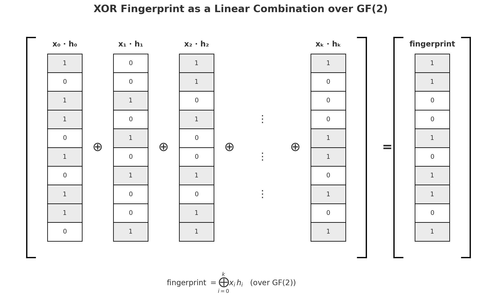
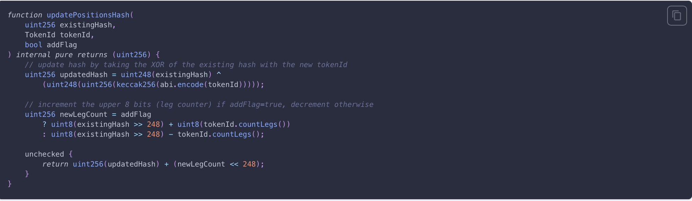
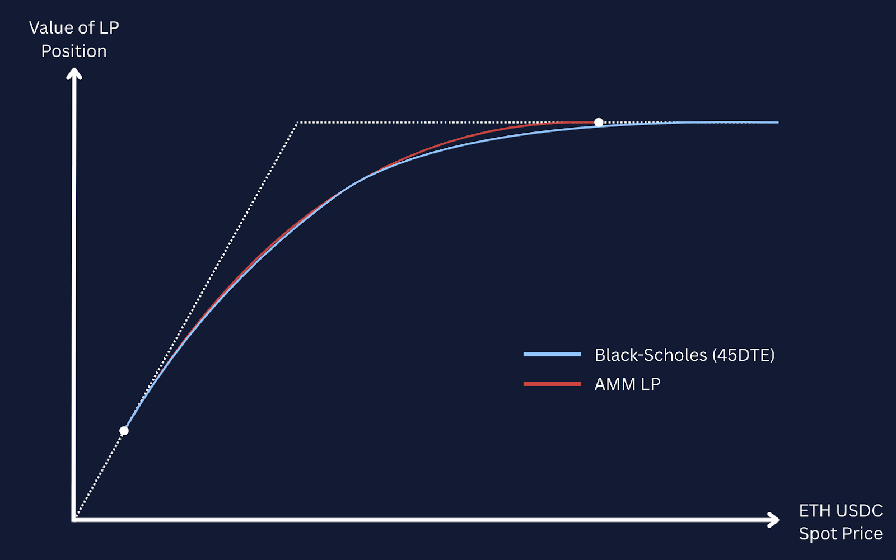

Welcome Panoptimists to the September edition of the Panoptic Newsletter, where we provide industry insights, research recaps, and Panoptic-specific content to keep you updated on our DeFi-native options platform.

If you want future newsletters sent directly to your email, sign up on our [website](https://panoptic.xyz/).

## About Panoptic

Discover the future of trading with Panoptic, your gateway to perpetual options in DeFi. Our cutting-edge platform empowers you to manage risk effectively and trade with unprecedented flexibility. Join us and be part of a secure, decentralized revolution in options trading, tailored for both crypto newcomers and experienced traders.

## The Panoptic Position Spoofing Vulnerability: A Post-Mortem

This report examines a critical vulnerability in Panoptic's decentralized options protocol that threatened $5M in user funds. The incident demonstrates how gas optimization techniques can introduce cryptographic vulnerabilities, and how mathematical properties of XOR operations enabled collision attacks. The researcher who identified and reported the vulnerability received a $250,000 bounty—reflecting both the severity of the potential exploit and the protocol's commitment to responsible disclosure.

The vulnerability allowed attackers to spoof position ownership, transforming hash collision problems into polynomial-time solutions. The incident response involved coordinated social recovery efforts and technical rescue operations across multiple blockchains, ultimately preventing user losses through swift community action and protocol intervention.

### The Attack: When Math Meets Malice

On August 25, 2025, Panoptic received a report from a Cantina researcher disclosing a critical vulnerability in Panoptic's position validation system. The attack exploited fundamental flaws in how the protocol verified user positions.

Panoptic encodes options positions as packed numbers called TokenIDs. To reduce gas costs, the protocol implemented a fingerprinting system that combined position hashes using XOR operations rather than storing full position lists on-chain. Users would submit position lists, and the contract would verify them by regenerating matching fingerprints.

The system contained two critical flaws. It failed to validate that supplied TokenIDs represented legitimate positions, and the mathematical properties of XOR operations enabled engineering fake position lists with identical fingerprints.

XOR operations have three problematic properties in adversarial contexts: they're associative, commutative, and self-cancelling. These characteristics allowed attackers to mimic the fingerprints of real positions by using Gaussian elimination to solve for fake positions that would produce identical target fingerprints. Research by Bellare and Micciancio had previously identified these vulnerabilities in XOR-based hash schemes.

The economic attack was straightforward once position spoofing was possible. Attackers could flash loan capital, deposit collateral, open leveraged positions, then withdraw funds using spoofed lists claiming zero collateral requirements.

### The Incident Response

The protocol team's response involved parallel technical and social recovery efforts. After confirming the vulnerability through testing, they activated incident response procedures with Cantina and Seal 911 security firms.

The social recovery campaign reached users through multiple channels, resulting in $2.35M withdrawn voluntarily by Tuesday morning. Additionally, SEAL 911 reached out to Binance who was able to successfully contact several users to alert them of the ongoing incident, leading to an additional $1.25M withdrawal.

Technical preparation involved developing rescue contracts for each affected pool while maintaining operational security. The team used isolated development environments and coordinated with Flashbots for secure transaction broadcasting across multiple chains.

The rescue operation on August 28 secured over 98% of remaining funds across Ethereum mainnet and Layer 2 networks. All rescued funds were transferred to a vault contract controlled by the Panoptic team to be redistributed to users through a Merkle-root claim system.

### Technical and Operational Lessons

The incident highlighted several security considerations for DeFi protocols. Custom cryptographic constructions often contain subtle vulnerabilities that emerge under adversarial conditions. Panoptic's fingerprinting unknowingly implemented a variant of XHASH, previously identified as insecure in academic literature.

Audit findings can provide warnings if examined through the lens of worst-case scenarios. Two reports from Panoptic’s April 2024 Code4rena audit contained early indicators of this issue—one describing how users could liquidate others without being solvent by spoofing position lists, and another describing how insolvent users could continue minting options. While neither report fully outlined the exploit path, both revealed weaknesses in TokenId validation and list sanity checks within the fingerprinting process. In retrospect, these findings illustrate how partial signals, when stress-tested, can anticipate other vulnerabilities.

The recovery underscored that security extends beyond code. Maintaining community relationships proved as critical as the technical rescue operations for preventing fund losses.

## Fund Recovery and Redistribution

Following the rescue operations, the protocol implemented a [systematic](https://x.com/Panoptic_xyz/status/1965500575891816627) approach to returning user funds. A snapshot of user balances before the rescue operation was executed was taken, ensuring accurate redistribution of recovered assets.

<blockquote class="twitter-tweet">
📢 Redistributing Rescued Funds  We’ve published CSV files on GitHub with each account’s redistribution amounts, calculated from balances before the rescue operation.  If you believe there’s an error in your redistribution allotment, please create a support ticket on Discord or…
&mdash; Panoptic (@Panoptic_xyz) <a href="https://twitter.com/Panoptic_xyz/status/1965500575891816627?ref_src=twsrc%5Etfw">September 9, 2025</a></blockquote>

Users are able to redeem their funds directly through the claims portal at [app.panoptic.xyz/claim/rescued-funds](https://app.panoptic.xyz/claim/rescued-funds). The process required connecting a wallet and claiming funds on each chain where positions were held, with balances validated against the pre-rescue snapshots. For full instructions, see the [official announcement on X](https://x.com/Panoptic_xyz/status/1968774027809570932).

<blockquote class="twitter-tweet">
Redemptions are now live.  To redeem your funds: 1. Visit the claim portal 2. Review your redemption amounts 3. Connect your wallet and claim your funds 4. Repeat for each chain  If you encounter any issues during the process, please open a support ticket on Discord.
&mdash; Panoptic (@Panoptic_xyz) <a href="https://twitter.com/Panoptic_xyz/status/1968774027809570932?ref_src=twsrc%5Etfw">September 18, 2025</a></blockquote>

## Understanding Perpetual Options: The Innovation Behind Panoptic

Panoptic's core [innovation](/research/panoptic-block-scholes-research-perpetual-options) centers on "perpetual options" - derivatives that maintain constant exposure characteristics without expiring. Traditional options decay over time and require manual rolling to maintain positions, creating inefficiencies through repeated transaction fees and bid-ask spreads.

Perpetual options address this by maintaining fixed time-to-expiry horizons through continuous rolling. Instead of upfront premium payments, users pay funding rates based on realized volatility, distributing costs over time rather than concentrating them at position entry.

The protocol's key insight involves recognizing that liquidity providers in Automated Market Makers like Uniswap are implicitly selling perpetual options. When LPs provide liquidity within specific price ranges, their positions mathematically resemble short put options with constant gamma exposure and fee collection over time.

Most LPs operate without understanding options exposure or the tools to evaluate whether collected fees adequately compensate for risks. This creates systematic underpricing in AMM markets due to oversupply of short perpetual options, as LPs don't properly price the optionality they're selling.

Panoptic's "Panoptions" differ from vanilla options in several ways: they don't experience time decay, can be exercised continuously like American options, and charge "streaming premium" based on time spent within price ranges rather than upfront costs.

The protocol completes previously incomplete options markets where only short optionality exposure was possible through LP positions. This addresses market imbalances like the "Uniswap Price Doom Loop," where LPs systematically influence prices through forced rebalancing, by enabling both long and short volatility positions.

This infrastructure transforms AMM liquidity provision into comprehensive options trading, enabling strategies like synthetic futures creation and volatility arbitrage between on-chain and traditional markets.

## Up Next

We’re accelerating our roadmap to relaunch with Panoptic V2. This upgrade fixes the discovered vulnerability and introduces major improvements, including:

-   **Core Protocol Updates:** security enhancements, lower fees, improved position management, a fee switch, and a passive lending model designed to create a liquidity flywheel.
-   **New Vaults:** delegate funds to trusted managers or automated perpetual option vault (POV) strategies, with options ranging from structured products to hedge fund–style vaults.
   
Panoptic V2 will deliver a more secure, feature-rich protocol and smoother user experience. Stay tuned for more details in the coming weeks.

*Join the growing community of Panoptimists and be the first to hear our latest updates by following us on our [social media platforms](https://links.panoptic.xyz/all). To learn more about Panoptic and all things DeFi options, check out our [docs](https://panoptic.xyz/docs/intro) and head to our [website](https://panoptic.xyz/).*
