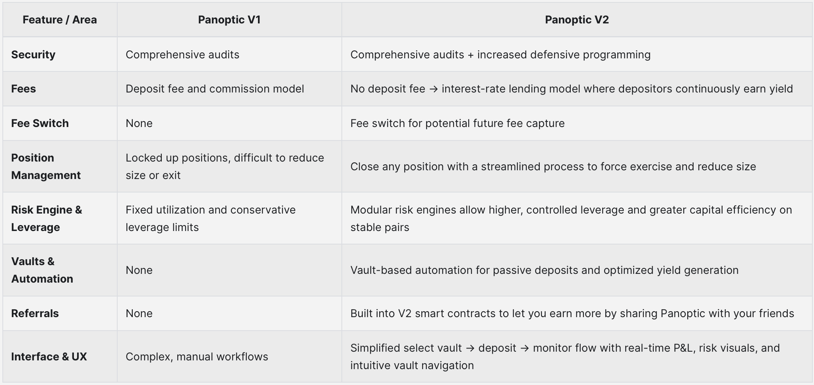
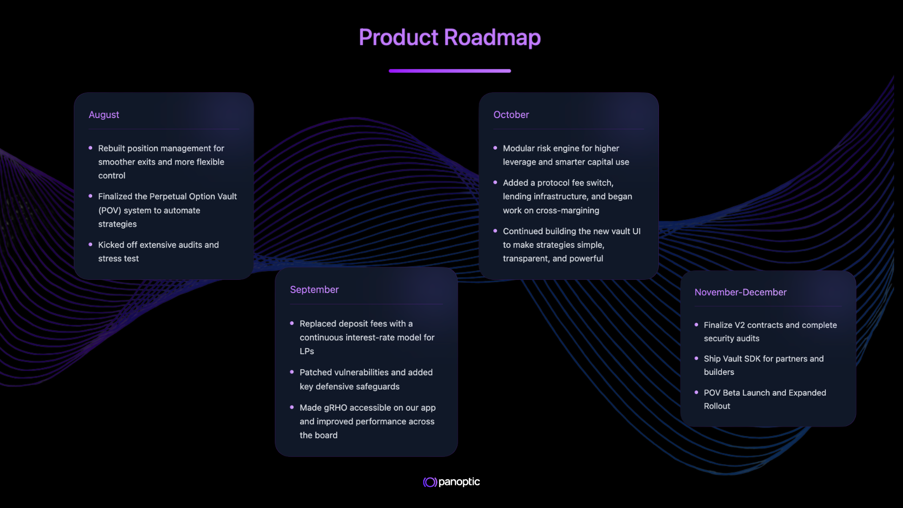
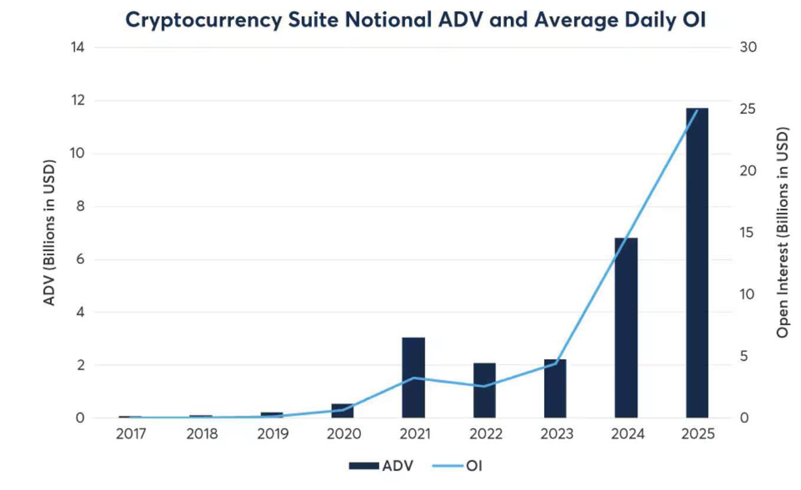

Welcome Panoptimists to the November edition of the Panoptic Newsletter, where we provide industry insights, research recaps, and Panoptic-specific content to keep you updated on our DeFi-native options platform.

If you want future newsletters sent directly to your email, sign up on our [website](https://panoptic.xyz/).

## About Panoptic
Discover the future of trading with Panoptic, your gateway to perpetual options in DeFi. Our cutting-edge platform empowers you to manage risk effectively and trade with unprecedented flexibility. Join us and be part of a secure, decentralized revolution in options trading, tailored for both crypto newcomers and experienced traders.

## The Evolution of Panoptic: What V1 Was
Panoptic V1 turned Uniswap LP positions into perpetual options through an oracle-free design. Instead of pricing options upfront with volatility models, it used a streaming premium system where option holders paid over time as prices moved. Liquidity providers deposited capital that traders could borrow and reposition to simulate long option exposure. The system was permissionless—any Uniswap pool could host an options market.

The innovation proved that "LP equals Options" could work in DeFi. By avoiding external oracles, it reduced manipulation risk while enabling composability across protocols. V1 successfully demonstrated that perpetual options were viable on-chain.

### Why V2 Became Necessary

Despite proving the concept, V1 revealed structural challenges that limited growth. A security vulnerability discovered through the bug bounty program exposed the need for more defensive programming in the smart contracts.

Beyond security, the user experience proved too complex. Users had to manually manage ranges, rebalances, and collateral—creating a steep learning curve. The deposit fee and commission structure discouraged new users from trying the platform. Position management was rigid and exiting positions was difficult due to force exercise restrictions and the inability to reduce position size without topping up collateral. Additionally, uniform collateral requirements across all pools prevented users from accessing higher leverage on stable pairs.

These were fundamental barriers to scaling the protocol for real-world use.

## V2's Core Changes

Our team built V2 from the ground up with several major [improvements](/blog/panoptic-v2-is-coming), including stronger security foundations, automated vault infrastructure, and better position management.

### Security and Architecture
V2 includes over a dozen protocol improvements with comprehensive audits. The smart contracts employ more defensive programming. The contracts are being audited by multiple audit firms, including Octane, Obsidian, Nethermind, and a crowdsourced competition.

### The Vault System
Vaults represent the biggest architectural shift. Instead of manually creating and managing positions, users deposit into Perpetual Option Vault (POVs) curated by strategists. These vaults automate the complexity—handling range selection, rebalancing, and position management behind the scenes. Users simply select a vault strategy, deposit, and track performance.

Vault managers can create rule-based strategies like delta-neutral LPing, passive LPing, covered calls, and more. Additionally, more complex, hedge-fund-esque strategies can be run such as arbitrage, basis trades, and gamma scalping. Each strategy has its own risk-return profile with transparent fees. Strategy creators earn performance fees, aligning their incentives with depositors. This opens up the world of options for customizable and passive yield opportunities.

### New Economics
V2 removes all deposit fees and replaces the commission model with an interest-rate lending system. Passive liquidity providers now earn interest continuously on their deposits rather than one-time fees. This change removes onboarding friction and creates more sustainable incentives. A referral system is also built directly into the smart contracts.

### Better Position Management
Users can now reduce position sizes without needing to add collateral. Force exercise has been expanded to cover in-range positions with cheaper fees, making it easier to close positions when needed. The risk engine is now modular, allowing higher controlled leverage on stable pairs. This improves overall capital efficiency while maintaining safety on riskier pools.

### User Experience
The interface shifts from complex manual workflows to a simplified flow: select vault → deposit → monitor. Real-time P&L curves, utilization metrics, and strategy performance will be visible from the dashboard. The goal is to make options accessible without requiring deep technical knowledge.

## Timeline and Launch

Development and auditing began in August and will continue through November, emphasizing security, vault infrastructure, interest rate models, and position management. November will introduce additional audits, SDKs for vault managers, and depositor interfaces, followed by the beta launch of POVs in December and expanded rollout.

### What This Means
V1 proved perpetual options could exist on-chain without external oracles. V2 makes them practical and profitable. By removing friction through automation and improving capital efficiency through modular risk engines, Panoptic evolves from a proof-of-concept into a sustainable revenue engine. Options become less about active trading complexity and more about accessing yield opportunities through structured strategies.

This vault abstraction is key—it separates strategy creation from capital deployment. Sophisticated actors can build and manage strategies while passive users can simply deposit and earn. This division of labor makes perpetual options not only accessible to early adopters, but to the broader DeFi ecosystem.

## Market Highlights: Crypto Options Hit Record Territory

The third quarter of 2025 saw crypto derivatives reach [unprecedented](https://www.theblock.co/data/crypto-markets/options) levels, with combined futures and options volume exceeding $900 billion—an all-time high. CME Group's crypto options open interest hit a record [$9 billion in October](https://www.coindesk.com/markets/2025/10/23/institutions-drive-cme-crypto-options-to-usd9b-as-eth-sol-xrp-set-records), while average daily open interest closed Q3 at $31.3 billion across their futures and options suite. Since October 10, open interest across CME's crypto regulated products and [options jumped 27%](https://www.coindesk.com/markets/2025/10/23/institutions-drive-cme-crypto-options-to-usd9b-as-eth-sol-xrp-set-records), driven by institutional investors shifting away from offshore platforms following a wave of liquidations.

Total Crypto OI/ADV for Futures on CME

The [expansion](https://www.cmegroup.com/media-room/press-releases/2025/2/28/cme_group_to_launchsolanasolfuturesonmarch17.html) extends beyond Bitcoin and Ethereum. Solana futures launched on March 17, while XRP futures began trading on [May 19](https://www.cmegroup.com/media-room/press-releases/2025/4/24/cme_group_to_expandcryptoderivativessuitewithlaunchofxrpfutures.html). By September, Solana futures had crossed $2.1 billion in open interest while XRP reached $1.4 billion. Building on this momentum, CME launched options on these futures contracts on [October 13](https://www.cmegroup.com/media-room/press-releases/2025/9/17/cme_group_to_launchoptionsonsolanaandxrpfutures.html)—the first CFTC-approved options for these assets in the U.S. This broadening participation signals that crypto derivatives are maturing into essential risk management tools across the digital asset ecosystem.

### Hyperliquid Enables Equity Perpetuals Through HIP-3
On October 13, 2025, Hyperliquid [activated](https://finance.yahoo.com/news/hyperliquid-goes-permissionless-hip-3-143449177.html?guccounter=1) its [HIP-3](https://hyperliquid.gitbook.io/hyperliquid-docs/hyperliquid-improvement-proposals-hips/hip-3-builder-deployed-perpetuals) network upgrade, marking one of the biggest structural changes in the protocol's history by making it closer to a permissionless platform for all derivatives. Qualified developers can now deploy perpetual contract markets by staking 500,000 HYPE tokens, enabling them to earn up to 50% of trading fees from the markets they create. The activation came days after Hyperliquid handled [$10 billion](https://ambcrypto.com/hyperliquid-leads-10b-liquidation-should-regulators-look-into-the-exchanges/) in liquidations during a market-wide leverage flush, demonstrating the platform's infrastructure resilience during extreme volatility.

The upgrade broadens Hyperliquid's scope beyond crypto, enabling the creation of perpetual markets for assets like equities, commodities, and prediction markets. The launch of equity perpetuals enables users to trade tokenized forms of blue-chip stocks such as Apple, Tesla, and Nvidia on-chain. The permissionless model removes centralized gatekeeping from derivatives creation, potentially accelerating innovation in on-chain structured products and bringing traditional finance assets into decentralized trading infrastructure.

### Federal Reserve Signals End of Quantitative Tightening
The Federal Reserve announced on [October 29](https://www.cnbc.com/2025/10/29/fed-rate-decision-october-2025.html) that it would end quantitative tightening on December 1, 2025. The program had reduced the Fed's portfolio of Treasurys and mortgage-backed securities by approximately $2.3 trillion. Recent signs of tightening in short-term lending markets raised concerns that the balance sheet roll-off had gone far enough.

The policy shift represents a move toward more accommodative monetary conditions. Ending quantitative tightening effectively stops the drainage of liquidity from the financial system, which could support risk asset valuations and increase capital availability for growth-oriented investments. For crypto markets specifically, the transition from restrictive to neutral monetary policy historically correlates with improved conditions for digital assets as investors seek higher returns in alternative markets.

## Up Next: Security and Audits
Panoptic V2's security continues to strengthen with upcoming audits from Nethermind and a competitive audit bringing multiple researchers into direct competition to find vulnerabilities.

### Redesigned Interface and POVs
The new UI transforms complex options workflows into an intuitive vault experience with clear visualizations of P&L, risk metrics, and strategy performance. Dedicated interfaces serve both passive vault depositors and advanced traders, allowing different sophistication levels to coexist seamlessly.

Perpetual Option Vaults (POVs) will enable experienced strategists to create and manage custom vaults, earning performance fees while depositors access specialized strategies. This creates a marketplace where the best performers attract capital and build reputation, turning options expertise into a scalable service layer.

*Join the growing community of Panoptimists and be the first to hear our latest updates by following us on our [social media platforms](https://links.panoptic.xyz/all). To learn more about Panoptic and all things DeFi options, check out our [docs](https://panoptic.xyz/docs/intro) and head to our [website](https://panoptic.xyz/).*
