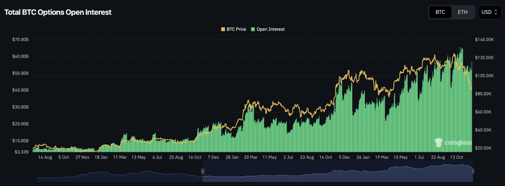
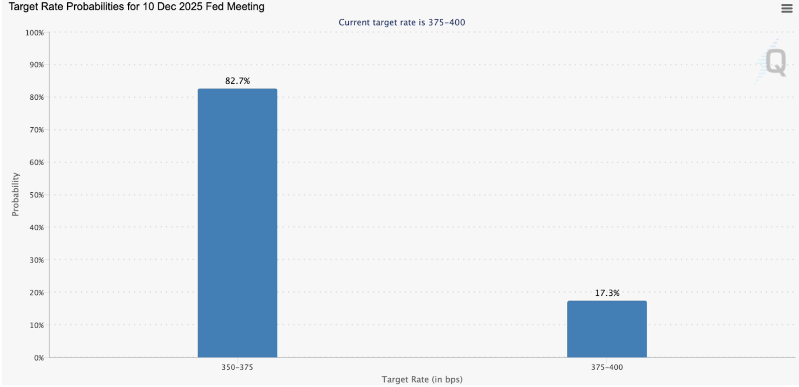

Welcome Panoptimists to the December edition of the Panoptic Newsletter, where we provide industry insights, research recaps, and Panoptic-specific content to keep you updated on our DeFi-native options platform.

If you want future newsletters sent directly to your email, sign up on our [website](https://panoptic.xyz/).

## About Panoptic

Discover the future of trading with Panoptic, your gateway to perpetual options in DeFi. Our cutting-edge platform empowers you to manage risk effectively and trade with unprecedented flexibility. Join us and be part of a secure, decentralized revolution in options trading, tailored for both crypto newcomers and experienced traders.

## Panoptic Highlights

### Audits & Security

Panoptic V2 has successfully completed its first [security audit](https://x.com/ObsidianAudits/status/1995417302955860280) with Obsidian Audits. <blockquote class="twitter-tweet">
Our audit report for <a href="https://twitter.com/Panoptic_xyz?ref_src=twsrc%5Etfw">@Panoptic_xyz</a>&#39;s v2 upgrade has been published!   Check it out below ⬇️ <a href="https://t.co/9hou9KdBy5">pic.twitter.com/9hou9KdBy5</a>
&mdash; Obsidian | DeFi Security (@ObsidianAudits) <a href="https://twitter.com/ObsidianAudits/status/1995417302955860280?ref_src=twsrc%5Etfw">December 1, 2025</a></blockquote> 
The review identified eleven issues across the codebase which have already been acknowledged and fixed. We're currently undergoing a month-long, second audit on Panoptic V2 smart contracts with Nethermind. Following these two audits, Panoptic V2 will enter a third, competitive audit.  
  

We're also [hiring](https://x.com/i/jobs/1988728081163694382) a backend software engineer to join the team. Applications for this cycle are now closed, but future openings will be announced on our channels. <blockquote class="twitter-tweet">
We’re hiring a senior engineer to help build our perpetual options vaults (POVs), curator systems, and liquidation bot.  A rare chance to build out the future of DeFi Derivatives and automated risk management!  Full-time, remote (Eastern Time Zone).  Apply using the link below &amp;… <a href="https://t.co/6mlrtsUn5i">pic.twitter.com/6mlrtsUn5i</a>
&mdash; Panoptic (@Panoptic_xyz) <a href="https://twitter.com/Panoptic_xyz/status/1989317519161934163?ref_src=twsrc%5Etfw">November 14, 2025</a></blockquote> 

  

### Perpetual Option Vaults (POVs)

Launching alongside V2 are our Perpetual Option Vaults: single-sided, fully on-chain strategies managed by Panoptic with zero performance fees.  

Initial offerings span the risk-return spectrum. Passive USDC and ETH lending vaults provide simple, low-risk yield. Other POVs will represent some of the first volatility strategies of their kind: durable, delta-neutral yield generation native to DeFi.  

Launch begins as a gated beta, with new vaults and expanded caps rolling out every few weeks. Join our [Discord community](https://discord.com/invite/8sX5Af2KXG) to get the latest updates and announcements.

## Market Highlights

### Bitcoin Options Open Interest Hits $50B as Defensive Positioning Dominates

Bitcoin options open interest on Deribit surged to a record $50.27 billion in late October, with the total number of active contracts doubling year-to-date to over 453,000. The rally reflects sustained market participation even as BTC corrected from above $126,000 to the mid-$80,000s in November. However, the character of positioning has shifted markedly. A large call-selling entity known as the "Call Overwriting Fund," which was active throughout the summer generating yield by selling upside, has [disappeared from the market](https://beincrypto.com/crypto-derivatives-market-binance-futures-november-2025/) since the October 10 selloff when prices dropped from $120,000 to $105,000 and altcoins fell over 40%.

In its absence, implied volatility has risen as traders increasingly accumulate puts in the $85,000 to $95,000 strike zone, with over [$2 billion in open interest concentrated there](https://beincrypto.com/crypto-derivatives-market-binance-futures-november-2025/). According to [Greeks.Live](https://www.ccn.com/news/crypto/analysts-say-bitcoin-facing-worst-q4-ever-as-options-market-turns-red/), the options market has "entered a bear market" with put buyers gaining the upper hand following BTC's breach below $100,000 in mid-November. The shift suggests options traders are now leaning defensively, hedging against further downside rather than chasing upside exposure. This posture reflects broader uncertainty as Q4 2025 shapes up to be what [analysts describe](https://www.coindesk.com/markets/2025/10/23/bitcoin-options-open-interest-surges-to-record-usd50b-on-deribit-as-traders-actively-hedge-downside-risks) as one of the most difficult quarters on record for crypto investors.  

> Chart: [CoinGlass BTC Options Open Interest](https://www.coinglass.com/options)

### Coinbase Closes $2.9B Deribit Acquisition, Reshaping Global Options Landscape

Coinbase completed its [acquisition of Deribit](https://www.coinbase.com/blog/deribit-joins-coinbase-unlocking-the-future-of-global-crypto-derivatives) in August 2025 for $2.9 billion ($700 million cash plus 11 million COIN shares), creating the world's largest crypto derivatives platform by open interest and options volume.

Three months in, the integration is shaping up during a pivotal stretch for crypto options. Deribit recorded its [highest monthly BTC options volume ever in October](https://bitcoinethereumnews.com/crypto/4-billion-in-crypto-options-disappear-today-2026-bets-surge/) (1.49M contracts), followed closely by November (1.33M). As of late October, Deribit held [over 90% of the $55.4 billion](https://www.fool.com/investing/2025/11/15/3-big-moves-coinbase-could-make-by-the-end-of-2025/) in total Bitcoin options open interest. YTD options volumes are [36% higher than all of 2024](https://www.coindesk.com/markets/2025/11/25/bitcoin-faces-usd13-3b-monthly-options-expiry-as-btc-trades-well-below-max-pain).

The timing aligns with Coinbase's thesis: options revenues tend to be less cyclical than spot, as traders use them for risk management in both directions. November's market drawdown saw sustained hedging activity, with [$13-15 billion in monthly options expiries](https://beincrypto.com/bitcoin-ethereum-options-expiry-impact-december-2023/). Deribit remains unavailable to U.S. customers, but Coinbase is positioning for eventual domestic expansion as regulatory clarity develops.

### Fed Cuts Rates Amid Internal Division, December Decision Uncertain

The Federal Reserve [cut its benchmark rate by 25 basis points](https://www.federalreserve.gov/newsevents/pressreleases/monetary20251029a.htm) to 3.75%-4% at its October meeting, continuing its easing cycle that began in September. However, the 10-2 vote masked significant internal divisions. Governor Stephen Miran preferred a 50 basis point cut while Kansas City Fed President Jeffrey Schmid wanted no change. [Minutes from the meeting](https://www.cnbc.com/2025/11/19/fed-minutes-october-2025.html) revealed that "many" FOMC members believe no more cuts are needed in 2025.

Chair Powell described the environment as "driving in the fog," referencing the lack of government economic data during the 44-day federal government shutdown that disrupted releases from the Bureau of Labor Statistics and Bureau of Economic Analysis.

Market expectations have recalibrated accordingly. Whereas traders assigned [95% probability to a December cut a month ago](https://www.cnbc.com/2025/11/13/markets-rethink-december-rate-cut-amid-fed-doubts.html), CME FedWatch now shows odds fluctuating between [35% and 70%](https://stocktwits.com/news-articles/markets/equity/fed-rate-cut-probability-december-shoots-up-ny-fed-room-for-cut/cLPMplbREOV) depending on the day and latest Fed speaker commentary. The Fed concluded quantitative tightening on December 1 after reducing its balance sheet by approximately $2.5 trillion, a shift that stops the drainage of liquidity from financial markets. For crypto, the transition from restrictive to neutral monetary policy has historically correlated with improved conditions, though the divided Fed and data uncertainty leave the near-term path unclear.  

> Chart: [CME FedWatch Tool](https://www.cmegroup.com/markets/interest-rates/cme-fedwatch-tool.html)

### ETF Options and Institutional Infrastructure Accelerate

BlackRock's IBIT options, which launched in November 2024, have grown to [nearly half the size of Deribit's BTC options market](https://www.coindesk.com/markets/2025/01/14/options-tied-to-black-rocks-bitcoin-etf-surge-to-nearly-50-of-deribits-btc-open-interest-in-two-months) in just over a year, with notional open interest reaching $11 billion against Deribit's $23 billion as of early 2025. The growth demonstrates substantial U.S. retail demand for regulated crypto exposure. In November 2025, spot Bitcoin ETFs collectively saw [record weekly trading volume exceeding $40 billion](https://www.coindesk.com/markets/2025/11/24/bitcoin-etfs-led-by-blackrock-s-ibit-see-record-usd40b-trading-volume-as-institutions-capitulate), though much of this activity reflected institutional capitulation as prices fell and a record [$3.55 billion in monthly redemptions](https://ambcrypto.com/bitcoin-november-2025-turns-historic-for-all-the-wrong-reasons/) occurred.  

The infrastructure buildout continues. [Grayscale launched an Ethereum Covered Call ETF (ETCO)](https://blockworks.co/news/grayscale-ethereum-covered-call-etf) in September to generate income by writing call options on ETH-linked products. BlackRock has [registered a new staked Ethereum ETF](https://www.benzinga.com/crypto/cryptocurrency/25/11/48973301/blackrock-preps-staked-ethereum-etf-launch-but-vitalik-buterin-warns-against-wall-street-capture) in Delaware, building on ETHA's $13.1 billion asset base since its July 2024 launch. If approved, the product would offer approximately 3.95% annual staking yields alongside ETH exposure.

Meanwhile, the SEC has [fast-tracked the approval process](https://www.morningstar.com/funds/new-crypto-etfs-are-coming-heres-how-investors-can-prepare) for crypto ETFs, shifting from case-by-case reviews to standard listing approval, clearing the way for combined BTC and ETH products and potentially Solana ETFs in 2026. As regulated options, staking, and multi-asset products proliferate, the infrastructure gap between crypto and traditional finance continues to narrow.  
  

## Up Next
### Security and Audits

Panoptic V2's security continues to strengthen with audits from Nethermind and an upcoming competitive audit bringing multiple researchers into direct competition to find vulnerabilities.

### Panoptic V2 Launch

We’re targeting a January launch for Panoptic V2. Our Perpetual Option Vaults (POVs) will let anyone easily deposit into vaults to earn volatility yield, while advanced traders can tap into the full V2 interface. The vaults will debut in a gated beta for early users.

Want in? Join our [Discord community](https://discord.com/invite/8sX5Af2KXG) to be first in line for updates, access, and the full V2 rollout.

*Join the growing community of Panoptimists and be the first to hear our latest updates by following us on our [social media platforms](https://links.panoptic.xyz/all). To learn more about Panoptic and all things DeFi options, check out our [docs](/docs/intro) and head to our [website](https://panoptic.xyz/).*