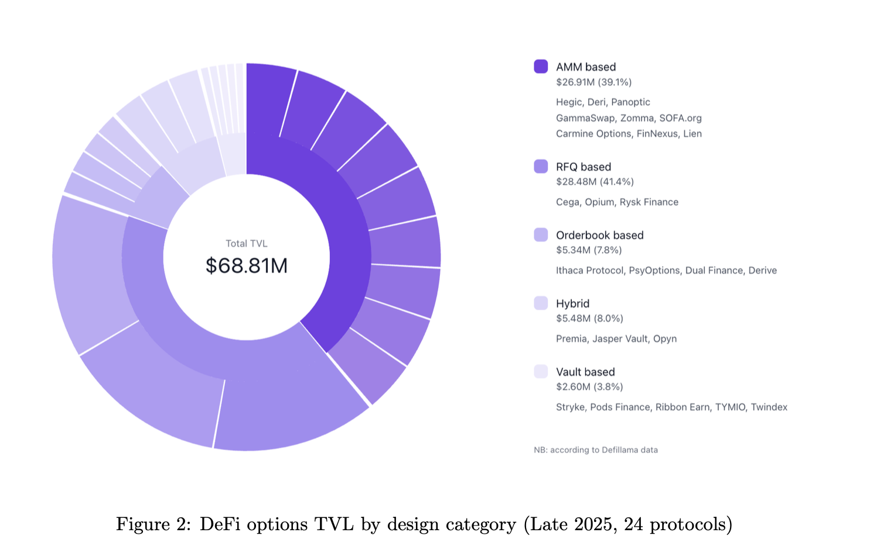
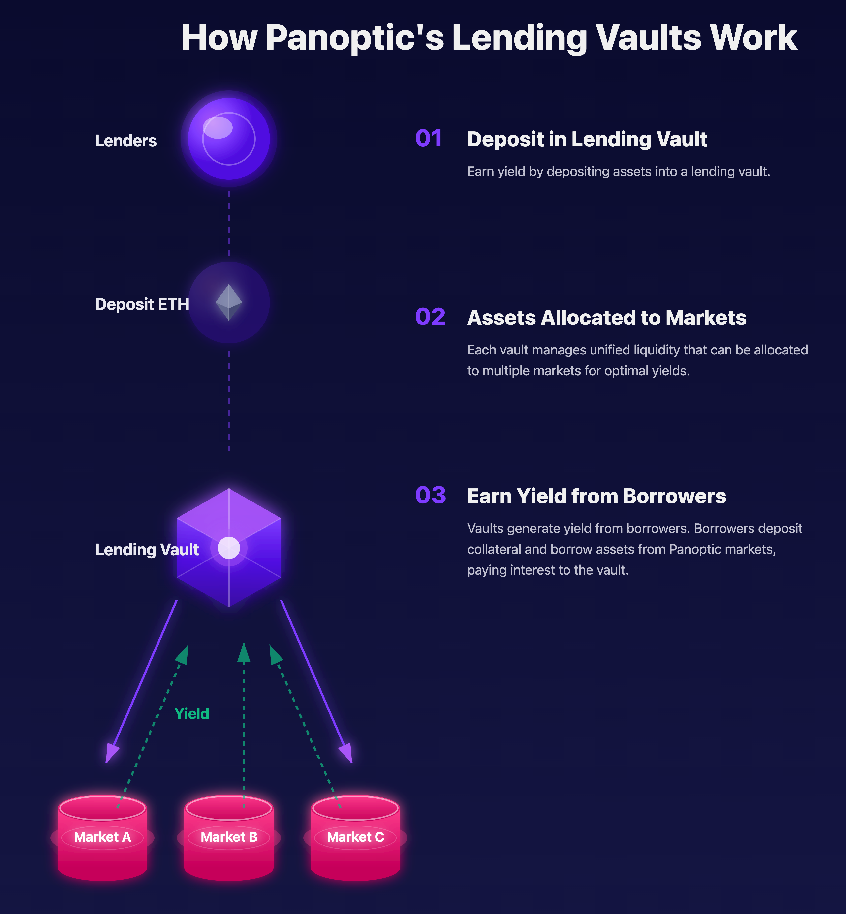
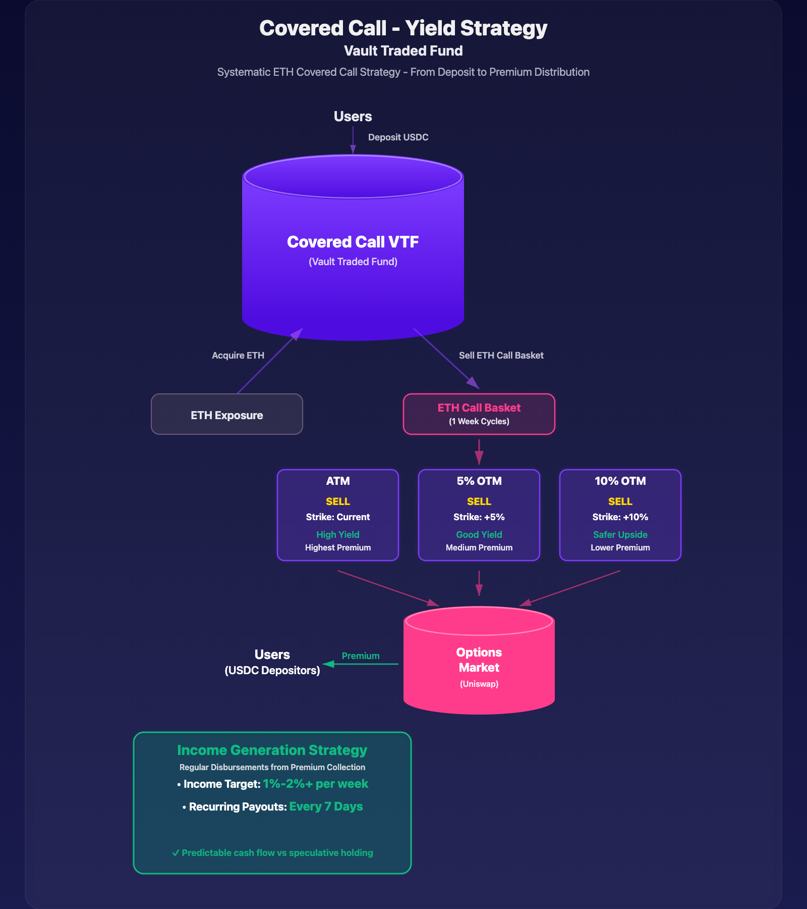
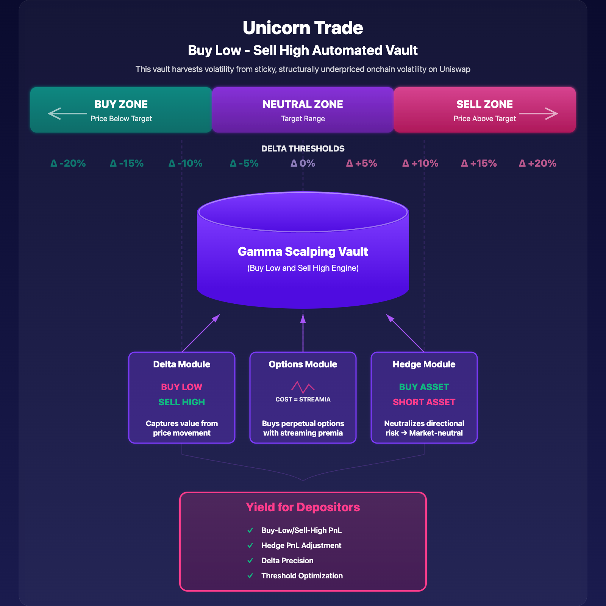
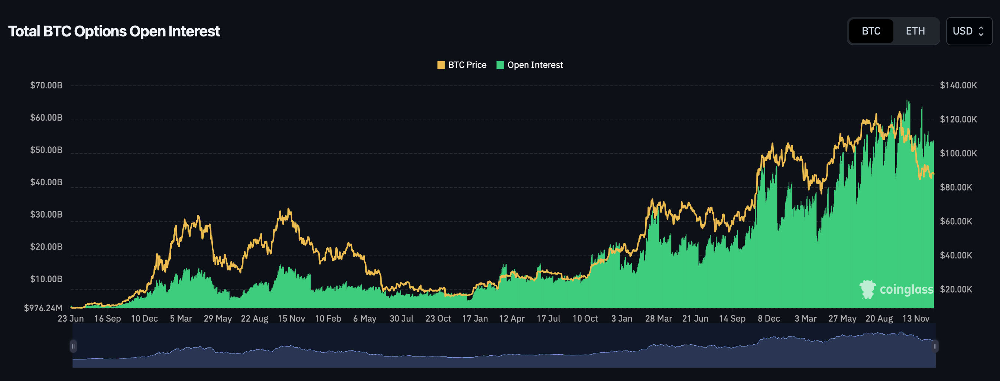
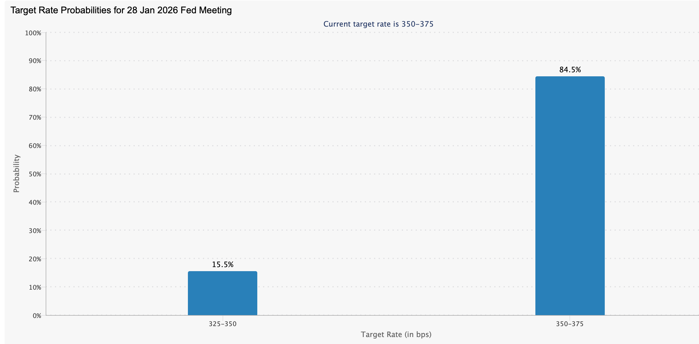

Welcome Panoptimists to the January edition of the Panoptic Newsletter, where we provide industry insights, research recaps, and Panoptic-specific content to keep you updated on our DeFi-native options platform.

If you want future newsletters sent directly to your email, sign up on our [website](https://panoptic.xyz/).

## About Panoptic

Discover the future of trading with Panoptic, your gateway to perpetual options in DeFi. Our cutting-edge platform empowers you to manage risk effectively and trade with unprecedented flexibility. Join us and be part of a secure, decentralized revolution in options trading, tailored for both crypto newcomers and experienced traders.

## Panoptic Highlights  
  
### DeFi Options Landscape Report 2025

This newsletter includes the release of our comprehensive [DeFi Options Landscape Report 2025](https://x.com/Panoptic_xyz/status/2002061394213302471?s=20). The 30+ page report provides institutional-grade analysis of the on-chain options ecosystem, covering market structure, protocol architectures, and strategic implications for sophisticated market participants. <blockquote class="twitter-tweet">
This is our DeFi Options Landscape Report (2025).  We analyze the current state of onchain options markets and deep-dive into six protocols, including <a href="https://twitter.com/ryskfinance?ref_src=twsrc%5Etfw">@RyskFinance</a>, <a href="https://twitter.com/DeriveXYZ?ref_src=twsrc%5Etfw">@DeriveXYZ</a>, <a href="https://twitter.com/GammaSwapLabs?ref_src=twsrc%5Etfw">@GammaSwapLabs</a>, <a href="https://twitter.com/cega_fi?ref_src=twsrc%5Etfw">@Cega_Fi</a>, <a href="https://twitter.com/IthacaProtocol?ref_src=twsrc%5Etfw">@IthacaProtocol</a>, and Panoptic. <a href="https://t.co/J5ZIw8vPLl">pic.twitter.com/J5ZIw8vPLl</a>
&mdash; Panoptic (@Panoptic_xyz) <a href="https://twitter.com/Panoptic_xyz/status/2002061394213302471?ref_src=twsrc%5Etfw">December 19, 2025</a></blockquote> 

Key findings from the report include aggregate DeFi options TVL of approximately $68.8 million across 24 protocols as of late 2025, with RFQ-based systems (41% of TVL) and AMM-based architectures (39%) dominating the market. The report notes that while DeFi options represent less than 1% of CeFi options volume, structural improvements are converging to accelerate growth.

The report provides in-depth architectural analysis of six key protocols: Rysk Finance (vault-based covered calls), Derive (CLOB with SVI volatility surfaces), GammaSwap (perpetual options via borrowed AMM liquidity), Ithaca Protocol (auction-based clearing with portfolio margining), Cega Finance (exotic structured products), and Panoptic (perpetual, oracle-free options on Uniswap V3/V4).

Strategic insights cover treasury management applications, LP strategy optimization with options overlays, risk hedging use cases, and integration opportunities with vaults and structured products. The future outlook section explores potential breakthroughs including cross-chain options, restaking integration, RWA-backed derivatives, and AI-driven risk management systems.

### Security and Audits

Panoptic V2's security review continues ahead of launch. Following audits with [Obsidian](https://x.com/Panoptic_xyz/status/1995553518007308773?s=20)  <blockquote class="twitter-tweet">
The <a href="https://twitter.com/ObsidianAudits?ref_src=twsrc%5Etfw">@ObsidianAudits</a> report is now published.  As we move toward the final stages of V2, ensuring the highest level of protocol security remains our core focus. <a href="https://t.co/gefxcPOoh5">https://t.co/gefxcPOoh5</a>
&mdash; Panoptic (@Panoptic_xyz) <a href="https://twitter.com/Panoptic_xyz/status/1995553518007308773?ref_src=twsrc%5Etfw">December 1, 2025</a></blockquote> and [Nethermind](https://x.com/Panoptic_xyz/status/2000672236680970613?s=20), Panoptic V2 entered a [competitive audit on Code4rena](https://code4rena.com/audits/2025-12-panoptic-next-core) with a $56,000 prize pool. The audit began December 19 and ran through January 7.

### Season 2 Points Program

Season 2 of Panoptic Incentive Points (Pips) will launch alongside the upcoming V2 beta release. With Season 1 concluding, Season 2 introduces a redesigned rewards structure aligned with the new vault system.

Season 2 features bi-weekly epochs, with points distributed at the end of each two-week period. Total issuance is capped at 1.7B Pips. The first epoch allocates Pips across four categories: Lending Vaults, Option Selling Vaults, Option Buying Vaults, and Advanced Trading.

Early participants benefit from Epoch 1 boosts, while loyal users will receive an additional boost. These boosts do not decay with usage and apply at a flat rate to accumulated Pips for the full epoch duration.

### Perpetual Option Vaults (POVs) Coming to Ethereum Mainnet

Panoptic V2 will launch on Ethereum mainnet with four initial vaults. The vault lineup spans the risk-return spectrum, offering options for both conservative depositors and risk-taking yield seekers.

**Lending Vaults:** Two passive lending vaults for USDC and ETH will provide simple, low-risk yield generation. These vaults are optimized to allocate deposited tokens into underlying lending markets on Panoptic, starting with deployment to the ETH/USDC market.

**Covered Call VTF (Vault Traded Fund):** This option selling vault functions as an ETH covered call ETF, bringing tried-and-true investment vehicles like Grayscale's BTCC and BlackRock's upcoming premium income ETF to DeFi. Users deposit stablecoins and receive high-income returns through systematic call selling, with regular disbursements.

**Gamma Scalping Vault:** This option buying vault aims to buy low and sell high by systematically buying call options and continuously hedging the delta to zero. The strategy is similar to Ethena's basis trade, but for options.

New vaults and expanded caps will roll out every few weeks after launch. Join our [Discord community](https://discord.com/invite/8sX5Af2KXG) to get the latest updates and early access announcements.

## Market Highlights

### Record $27B Options Expiry Triggers Year-End Volatility Reset

The crypto market saw its [largest](https://www.coindesk.com/markets/2025/12/22/boxing-day-bonanza-usd27-billion-in-bitcoin-ether-options-set-for-year-end-reset) quarterly options expiry of 2025 on December 26, with $27 billion in bitcoin and ether options expiring on Deribit. The event cleared approximately $23.6 billion in BTC contracts and $3.8 billion in ETH contracts, representing over 50% of Deribit's total open interest. Positioning remains [decidedly bullish](https://www.investmentnews.com/alternatives/bitcoin-volatility-rises-ahead-of-23-billion-options-expiry/263639) with a put-call ratio of just 0.38, meaning call options outnumber puts by nearly 3-to-1.

Chart: [CoinGlass BTC Options Open Interest](https://www.coinglass.com/options)

The max pain level sits near $96,000, where options buyers would suffer maximum losses at expiry. Bitcoin has spent December pinned between $85,000 and $90,000, with dealer hedging tied to heavy options exposure enforcing this range. According to [QCP Capital](https://www.mitrade.com/insights/crypto-analysis/bitcoin/bitcoin-gen-20251225), the expiry event has acted as a "lid" on Bitcoin's price, but post-settlement dynamics could shift market structure toward an initial $100,000 target.

Implied volatility has moderated from November's peaks, with Deribit's BTC DVOL hovering around 45%, down from 63% when BTC tanked to $80,000 in late November. Despite the size of the expiry, Deribit's global head of retail sales Sidrah Fariq noted that volatility remains contained and the settlement is likely to be more orderly than last year. Put open interest has concentrated at the [$85,000 strike with roughly $1.4 billion in notional value](https://www.tradealgo.com/news/bitcoin-swings-intensify-ahead-of-23-billion-options-expiry), acting as a gravitational "magnet" into expiration.

### Fed Delivers Third Cut, Signals Prolonged Pause Into 2026

The Federal Reserve [cut rates by 25 basis points](https://www.cnbc.com/2025/12/10/fed-interest-rate-decision-december-2025-.html) at its December meeting to a target range of 3.50% to 3.75%, marking the third consecutive reduction and bringing total easing since September 2024 to 175 basis points. The decision passed 9-3 with unusual dissent from both directions: hawks Goolsbee and Schmid wanted no cut, while dove Miran pushed for 50 basis points. This marks the [first time since September 2019](https://tradingeconomics.com/united-states/interest-rate) that three FOMC members have dissented on a rate decision.

Chart: [CME FedWatch Tool](https://www.cmegroup.com/markets/interest-rates/cme-fedwatch-tool.html)

The December dot plot projected just one additional 25bp cut through end-2026, a notably hawkish pivot. Seven FOMC members indicated they want no cuts next year, highlighting growing division over the policy path. Chair Powell reinforced the Fed's positioning: "We are well positioned to wait and see how the economy evolves." The committee continues to expect inflation to hold above its 2% target until 2028, with the [Fed's preferred PCE gauge](https://www.ishares.com/us/insights/fed-outlook-2026-interest-rate-forecast) at 2.8% in September.

For markets, the Fed also announced it will resume buying Treasury securities, starting with [$40 billion in Treasury bills beginning December 12](https://www.cnn.com/business/live-news/federal-reserve-interest-rate-12-10-2025), characterized as "reserve management" rather than QE. Looking ahead, Powell's term expires May 15, 2026, and the president is widely expected to nominate someone who favors lower rates. This leadership transition could usher in a [very different policy framework](https://finance.yahoo.com/news/divisions-at-the-fed-that-defined-2025-are-expected-to-carry-into-2026-182017036.html) in the second half of 2026.

### IBIT Options Crack US Top 10 as BlackRock Names Bitcoin a 2025 Investment Theme

Options tied to BlackRock's bitcoin ETF have surged to become the [ninth largest in the entire US market](https://www.coindesk.com/markets/2025/12/03/blackrock-s-spot-bitcoin-etf-secures-top-10-spot-in-u-s-options-universe-with-7-7m-ibit-active-contracts), with over 7.7 million contracts open. IBIT options have surpassed those of the SPDR Gold Shares ETF (5.15 million contracts) despite gold gaining 50% this year while BTC declined. The growth demonstrates how quickly Bitcoin has established itself as a macro asset class through regulated, accessible vehicles.

BlackRock has now named IBIT one of its [top three investment themes for 2025](https://finance.yahoo.com/news/blackrock-names-bitcoin-etf-top-160113971.html), placing it alongside Treasury bills and US mega-cap tech stocks. Despite posting a negative 9.6% return for the year, IBIT ranks sixth among all ETFs by 2025 inflows, pulling in over $25 billion since January. "If the objective were purely revenue generation, BlackRock has no shortage of ETFs with significantly higher fees," noted ETF Store president Nate Geraci. "This is about conviction that bitcoin belongs in diversified portfolios."

The fund has experienced headwinds, recording its [longest streak of weekly withdrawals](https://www.coindesk.com/markets/2025/12/05/blackrock-s-ibit-faces-record-outflow-run-as-bitcoin-struggles-to-reclaim-bull-trend) since launch, with $2.7 billion pulled over five weeks through late November. Yet total inflows since inception now exceed $62.5 billion, more than five times larger than the Fidelity Wise Origin Bitcoin Fund. BlackRock continues expanding its crypto lineup, having filed in September for a Bitcoin Premium Income ETF that would generate yield through covered call strategies.

# Up Next

## Security and Audits

Panoptic V2's security continues to strengthen having completed audits with Obsidian and Nethermind, with a third [Code4rena competitive audit](https://code4rena.com/audits/2025-12-panoptic-next-core) currently taking place.

Panoptic V2 is launching soon. Our Perpetual Option Vaults (POVs) will let anyone easily deposit into vaults to earn volatility yield, while advanced traders can tap into the full V2 interface. The vaults will debut in a gated beta for early users.

Want in? Join our [Discord community](https://discord.com/invite/8sX5Af2KXG) to be first in line for updates, access, and the full V2 rollout.

*Join the growing community of Panoptimists and be the first to hear our latest updates by following us on our [social media platforms](https://links.panoptic.xyz/all). To learn more about Panoptic and all things DeFi options, check out our [docs](/docs/intro) and head to our [website](https://panoptic.xyz/).*
