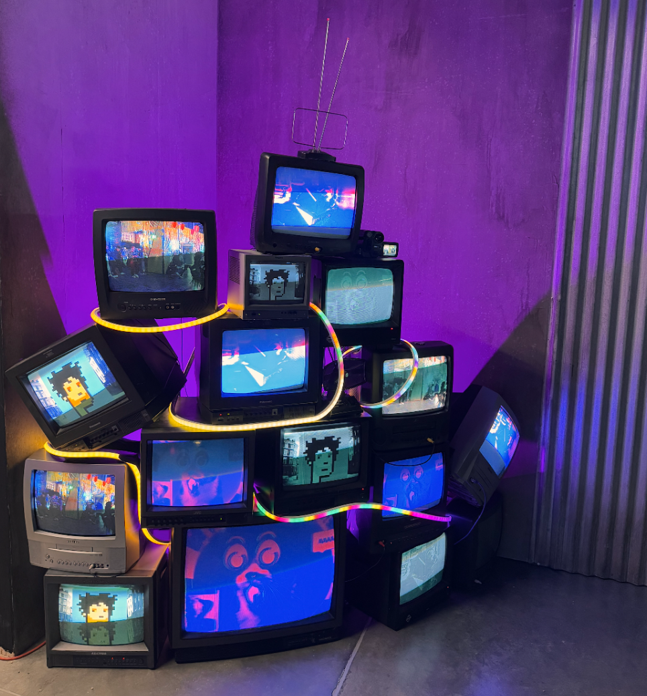
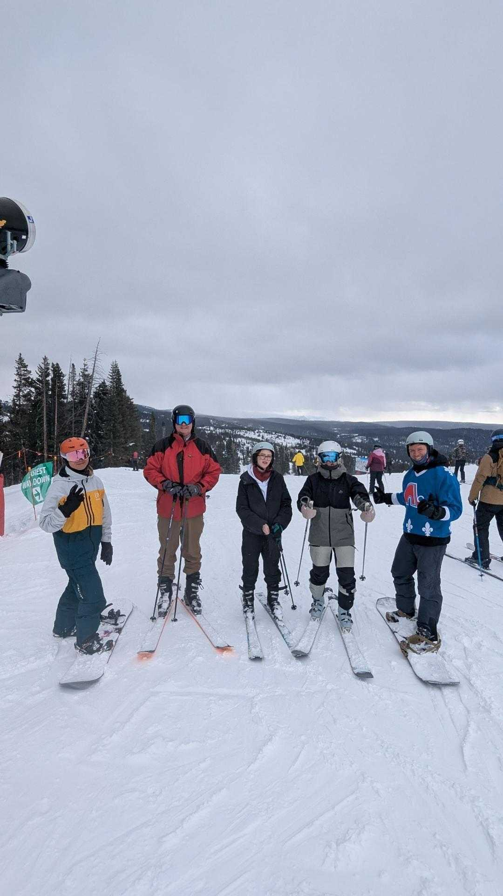
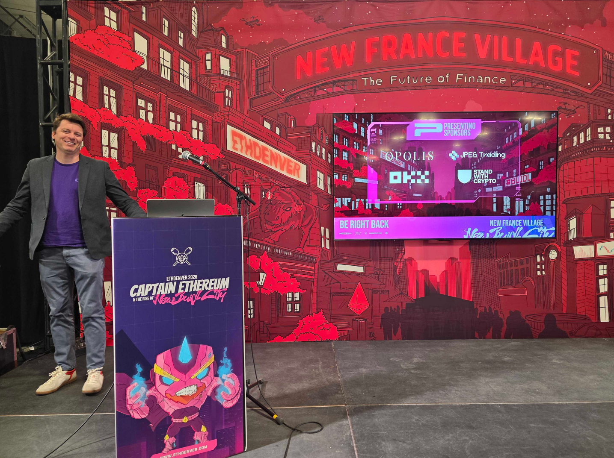
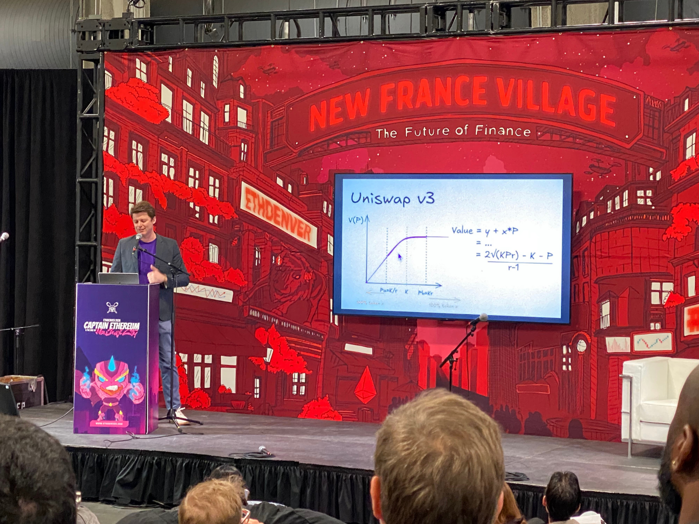

## High Signal, Low Noise

Another year of ETH Denver. We are extremely grateful to be back. While the conference felt smaller than peak-cycle years, the quality of people and conversations more than made up for it. The noise is lower now. What’s left are builders, researchers, serious traders, and founders thinking long-term. DeFi feels like it’s maturing. There’s a need for real infrastructure, and sophistication is more obvious than ever.

Before the conference officially began, the Panoptic team headed west to the mountains for team building and skiing. Our mornings started early with coffee and strategy sessions.

## Panoptic and JPEG Host Rooftop Bar Happy Hour

One of the highlights of our week at ETH Denver was co-hosting our side event with JPEG Trading. We’d like to extend a big thank you to JPEG Trading for hosting our side event with us, and to everyone who [attended](https://x.com/Panoptic_xyz/status/2023547977886036065?s=20).

<blockquote class="twitter-tweet">
We’re back for our annual <a href="https://twitter.com/EthereumDenver?ref_src=twsrc%5Etfw">@EthereumDenver</a> side event!  Join <a href="https://twitter.com/jpegtrading?ref_src=twsrc%5Etfw">@jpegtrading</a> x Panoptic for a rooftop Happy Hour above the city. Great views, great drinks, and even better conversations.  📆 Wednesday, Feb 18 ⏰ 5:30 PM – 7:30 PM 📍 La Estrella Rooftop Terrace  Let’s talk markets,… <a href="https://t.co/QAeRKfVU3x">pic.twitter.com/QAeRKfVU3x</a>
&mdash; Panoptic (@Panoptic_xyz) <a href="https://twitter.com/Panoptic_xyz/status/2023547977886036065?ref_src=twsrc%5Etfw">February 17, 2026</a></blockquote> 

These moments reminded us that this ecosystem is collaborative, vibrant, and certainly ready for options.

Seeing so many users, collaborators, and builders IRL is always special.

## Perpetual Options With Panoptic

Guillaume Lambert spoke at [ETH Denver](https://x.com/Panoptic_xyz/status/2024604057521049911?s=20) on the future of DeFi and perpetual options. DeFi needs native volatility infrastructure – not just perpetual swaps, but capital-efficient, permissionless options markets that integrate yield generation and advanced trading into a unified system. Check out the full video below. 

<blockquote class="twitter-tweet">
Our CEO &amp; Founder <a href="https://twitter.com/guil_lambert?ref_src=twsrc%5Etfw">@guil_lambert</a> speaking at <a href="https://twitter.com/EthereumDenver?ref_src=twsrc%5Etfw">@EthereumDenver</a> <a href="https://t.co/bFzU38Yjpo">https://t.co/bFzU38Yjpo</a>
&mdash; Panoptic (@Panoptic_xyz) <a href="https://twitter.com/Panoptic_xyz/status/2024604057521049911?ref_src=twsrc%5Etfw">February 19, 2026</a></blockquote> 

Capital shouldn’t need to fragment across multiple protocols just to earn yield, manage risk, and express views. The response to this message was encouraging, and the appetite for more sophisticated derivatives infrastructure is real.

Of course, ETHDenver is never just meetings and panels. There were side events across the city, spontaneous conversations, art installations, and even puppies making the rounds.

It’s one of the few conferences where serious financial discussions coexist with creativity and community in such a natural way. It’s a reminder that crypto isn’t just charts and code. It’s people attempting to redesign financial systems in public, together.

## What’s Next?
Denver always feels like a checkpoint. A moment to measure progress and recalibrate for what’s next. We’re leaving with new partnerships forming, strategic conversations underway, a sharper articulation of our thesis, and deeper conviction in what we’re building. The path toward more sophisticated, capital-efficient derivatives in DeFi is becoming clearer.

Stay tuned for our updates and our upcoming beta launch of [Panoptic V2](/blog/panoptic-v2-is-coming).

Want in? Join our [Discord community](https://discord.com/invite/8sX5Af2KXG) to be first in line for updates, access, and the full V2 rollout.

*Join the growing community of Panoptimists and be the first to hear our latest updates by following us on our [social media platforms](https://links.panoptic.xyz/all). To learn more about Panoptic and all things DeFi options, check out our [docs](/docs/intro) and head to our [website](https://panoptic.xyz/).*
