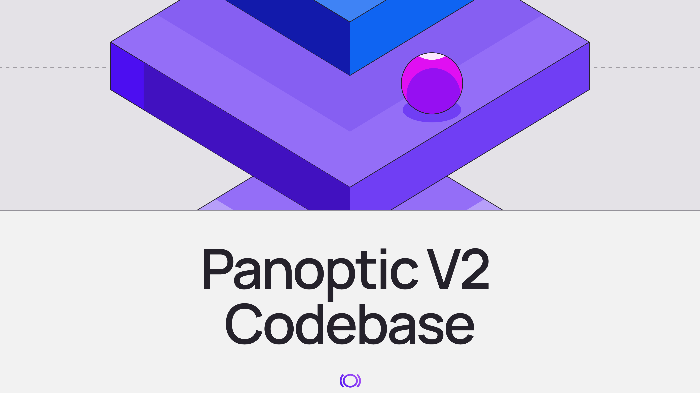
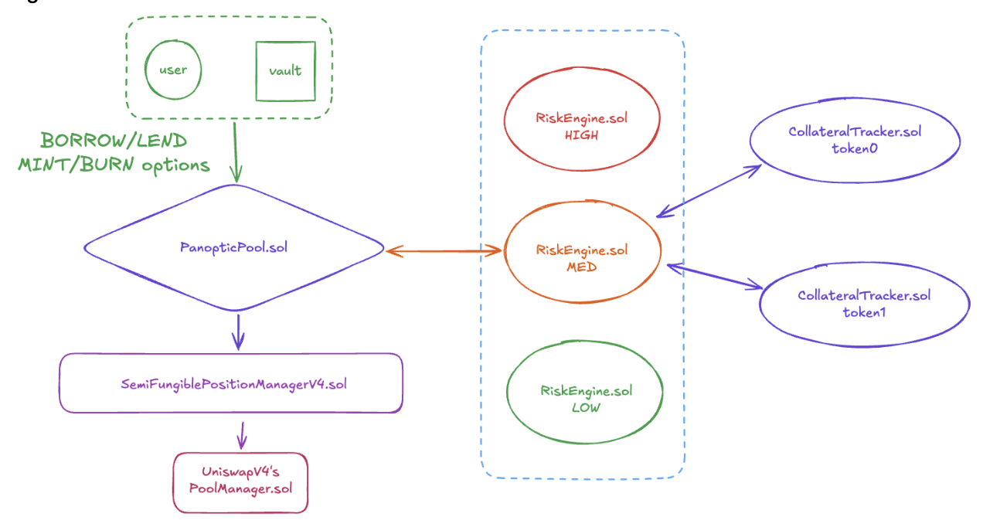

Today, we open source the Panoptic v2 codebase, a unified risk engine for onchain derivatives.

Panoptic v2 is a ground-up rebuild of v1, introducing a modular risk engine designed to support institutional-scale derivatives markets.

DeFi already has primitives for swapping, lending, and linear derivatives like perpetuals. What’s missing is the ability to manage risk across them.

In traditional finance, derivatives markets exist to hedge exposure, price volatility, and manage portfolios holistically. Panoptic v2 introduces that missing layer to DeFi.

## Panoptic v2 is that missing risk management layer

It introduces a unified margin and risk engine for DeFi, which means options, lending, and AMM liquidity all operate inside the same collateral system. Panoptic v2 increases capital efficiency by making it possible to hedge, borrow, and trade options using the same capital. With Panoptic v2, DeFi gets the infrastructure that sophisticated institutional users and derivatives markets have always needed.

Here's a brief overview of several powerful new features incorporated into Panoptic v2.

### A Modular RiskEngine Layer

This allows Panoptic to support everything from low-risk FX-style markets to fully collateralized options.

Different RiskEngine.sol contracts will be released for different asset classes. Think of this like Uniswap v3 fee tiers, but for risk parameters. Low-risk pairs like stablecoin-stablecoin receive FX-level margining, blue-chip pairs use Reg-T style margining, and memecoins require fully collateralized options.

### Loans Native to Panoptic

While building V2 we discovered something interesting: loans are an edge case of perpetual options. By extending the options clearing system, we were able to build a full credit layer directly inside Panoptic.

This means that we were able to build a fully-featured credit layer by minimally extending the capabilities of our options clearing process. This allows us to offer cross-margining between options and loans, leading to a significant unlock in capital efficiency and capital protection for both borrowers and lenders.

### Adaptive Interest Model

Borrowing from Morpho v1's AdaptiveCurveIRM model, Panoptic now has a more resilient and versatile interest rate model. The adaptive nature of the interest rate model allows users to borrow and lend to active traders in a wide variety of markets without the need for parameter curation and governance overload. 

### Flash Minting

Flash minting allows complex multi-leg strategies to be composed into a single atomic transaction, enabling volatility spreads, delta-neutral hedges, and arbitrage without large upfront capital.

### Better in Situ Oracles

Panoptic v1 relied on Uniswap V3's built-in oracle to create a resilient price feed for liquidations and solvency checks. For Panoptic v2, we rewrote the oracle engine to not rely on any external dependencies. The result is a more resilient oracle with better options-specific safeguards like multi-period EMAs smoothing and median-based safety checks.

### Modular Integration Into Different AMMs

Panoptic v2 was rebuilt using a modular structure. This means that a single file needs to be modified in order to integrate into a new AMM while the remaining core logic remains untouched. As a first step, we've made integrators for Uniswap V3 and V4 pools, but the goal is release integrations to any concentrated liquidity AMM.

### An Integrated Vault Infrastructure

Panoptic v2 introduces an integrated vault infrastructure. While self-directed traders can interact directly with the core contracts, most users will likely access Panoptic through managed strategies and structured product offerings. Strategies available at launch will include passive liquidity provisioning vaults (ie. lend to traders and market makers), a covered call vault, and a gamma scalping vault. The goal is to make vaults the primary way for retail to get exposure to volatility.

### A Publicly Available SDK

A comprehensive SDK has also been open sourced under MIT license. This SDK also demonstrates proof of concept applications like a liquidator bot, a reverse gamma scalping bot, and a hedging bot. The goal is to lower the barrier for algorithmic trading on Panoptic and enable a thriving ecosystem of bots, market makers, and automated strategists.

Panoptic v1 was the result of several years of research into how to make onchain options viable on Eth Mainnet. V2 is the next step in that journey: it demonstrates how options markets, lending markets, and liquidity provisioning can be unified into a single system.

By open sourcing the Panoptic v2 codebase, we’re enabling developers to build the next generation of derivatives infrastructure directly on top of Panoptic.

Our goal is simple: make volatility a core primitive of DeFi. With Panoptic v2, builders can create vaults, trading interfaces, structured products, and entirely new financial primitives on top of a modular risk engine.

The codebase, SDK, and documentation are now publicly available. We’re excited to see what the ecosystem builds next.

Links:

-   Smart contracts: [https://github.com/panoptic-labs/panoptic-v2-core](https://github.com/panoptic-labs/panoptic-v2-core)
-   SDK: [https://github.com/panoptic-labs/panoptic-sdk](https://github.com/panoptic-labs/panoptic-sdk)

*Join the growing community of Panoptimists and be the first to hear our latest updates by following us on our [social media platforms](https://links.panoptic.xyz/all). To learn more about Panoptic and all things DeFi options, check out our [docs](/docs/intro) and head to our [website](https://panoptic.xyz/).*
