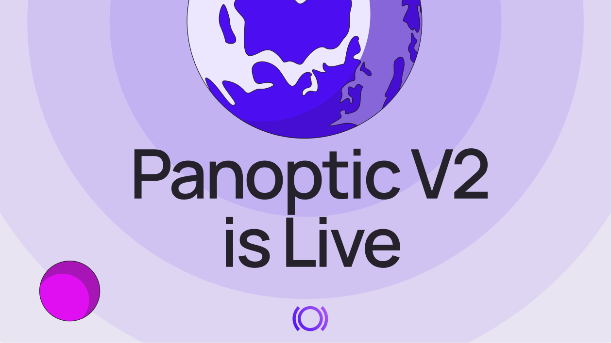
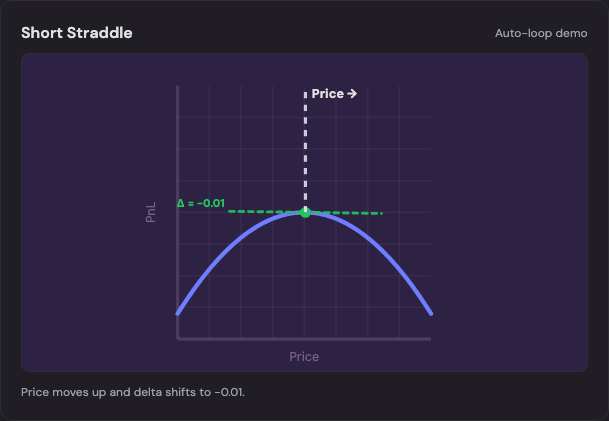
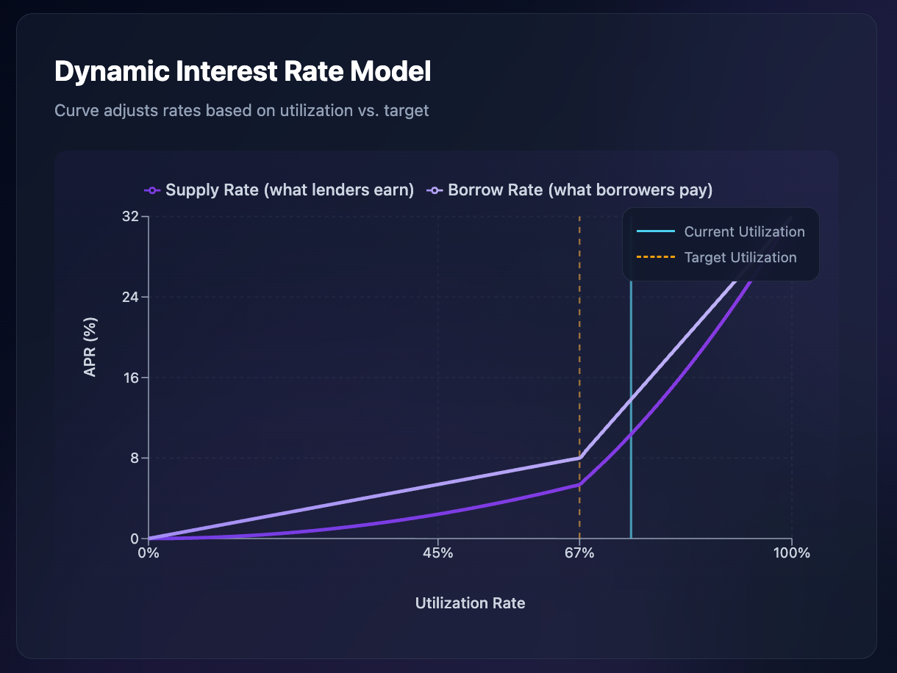
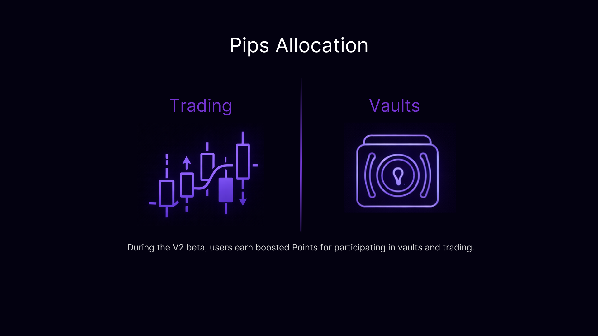
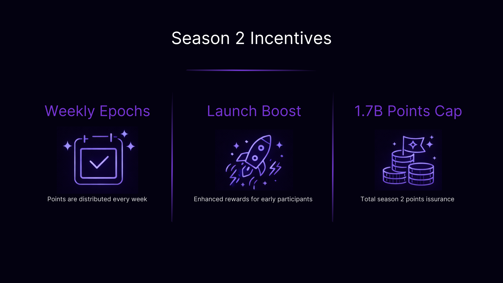
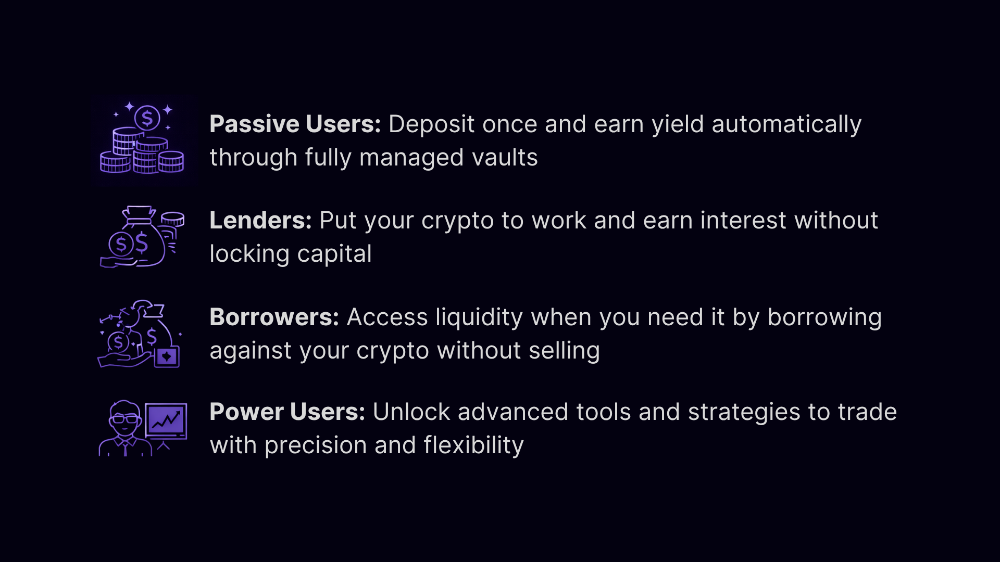

#### Panoptic V2 is [live](https://app.panoptic.xyz) in beta.
Panoptic V2, the new-and-improved DeFi yield platform, launched today on Ethereum.
DeFi offers yield, but rarely in a way that is sustainable. Protocols push users into fixed strategies with narrow risk profiles. What’s missing is the ability to choose where you sit on the risk–return spectrum.
Options are the most powerful tool for shaping risk and return, but in DeFi they’ve remained complex, siloed, and inaccessible to most users. With V2, Panoptic changes this.
## Introducing The Yield Platform
Panoptic is not just an options trading protocol. It is a unified DeFi yield platform to lend, borrow, earn, and trade, all in one system. Panoptic V2 introduces a full prime brokerage layer with native lending and borrowing, portfolio-aware margin, and built-in options infrastructure. At the core are **Panoptic Vaults**, designed to make advanced options strategies accessible through simple, yield-bearing deposits.
V2 launches with two vault types:
1.  **Volatility Harvesting Vaults:** Earn yield from volatility with an automated, market-neutral strategy that buys low and sells high.
2.  **Panoptic Liquidity Provider (PLP) Vault:** Deposit WETH into a market-making vault that earns yield by lending, supplying liquidity, market making, and capturing platform fees.
Users can customize their risk exposure by depositing passively into vaults, supplying capital to specific markets, borrowing to increase exposure, or trade advanced options strategies directly.

## Onchain Yield, Simplified with Vaults

Panoptic V2 launches with a suite of fully managed, onchain vaults. These community vaults are managed by Panoptic with zero performance fees. Vault curators can earn performance fees by building or managing their own custom vaults using [Panoptic’s software development kit (SDK)](https://github.com/panoptic-labs/panoptic-sdk).
### USDC Vault – The Unicorn

Deposit USDC to earn yield. This vault supplies capital to Panoptic’s lending markets and performs gamma scalping. The market-neutral vault profits from volatility by automatically buying low and selling high.

### WETH Vault – Panoptic Liquidity Provider (PLP)

Deposit WETH to earn yield. This automated hedging vault earns yield on WETH by supplying ETH to lending markets, market making on Panoptic, and capturing platform fees.

*Vaults are capped at launch, with new vaults and expanded caps rolling out over time. If you hold WETH or USDC and want yield without selling, are looking for access to liquidity, or want passive income, Panoptic is for you.*

## Start Earning by Lending
With Panoptic V2, users can deposit into lending vaults or lend directly to Panoptic markets. Supply any asset to start earning interest. Interest rates adjust dynamically based on usage, ensuring competitive rates.

## Unlock Liquidity by Borrowing
Borrowing on Panoptic lets you tap into lender-supplied liquidity to withdraw funds, loop positions, or trade options with leverage. Rates adjust automatically based on pool utilization, so borrowing costs respond to real-time demand.
The borrowing feature will be rolled out on our app in the coming weeks.

## Customize Strategies through Options Trading
For users who want more control, Panoptic offers a full-featured options trading interface built directly into the same credit and risk engine that powers vaults and lending.

Traders can create custom positions, buying and selling calls, puts, spreads, iron condors, and other perpetual options, all within a portfolio-aware margin system that enables capital-efficient, multi-legged strategies. Advanced order controls allow users to fine-tune strikes and time horizons with precision.

## Incentives
Season 2 of [Panoptic Incentive Points](/docs/getting-started/points) launches alongside Panoptic V2. Earn points by participating in vaults and trading.

Early users receive boosted rewards. Points will be distributed on a regular basis and tracked through our leaderboard.

## Audits & Security
Panoptic V2 has undergone multiple independent security audits to ensure the protocol is robust, resilient, and ready for real-world use. The protocol and vault smart contracts have been [audited](/docs/security/security_audits) by leading security providers including Code4rena, Nethermind, and Obsidian.
We will also launch a bug bounty program. For more information, visit our [docs](/docs/security/bug-bounties).
## Why Panoptic V2, Why Now
DeFi has matured past simple spot trading. Users want capital efficiency, predictable income, and flexibility without managing multiple protocols. As volatility returns and onchain liquidity consolidates, options-powered systems become the most efficient way to generate yield and manage risk. Panoptic V2 is built for this next phase of DeFi where capital works continuously.

To get started:
-   **Access the** [Panoptic app](http://app.panoptic.xyz) to explore vaults, lending, borrowing (coming soon), and trading.
-   **Learn about our** [Vault Suite](/docs/getting-started/vaults) and choose how you want to earn income.
Read the [documentation](/docs/intro) for a full guide on using Panoptic V2.

*Join the growing community of Panoptimists and be the first to hear our latest updates by following us on our [social media platforms](https://links.panoptic.xyz/all). To learn more about Panoptic and all things DeFi options, check out our [docs](/docs/intro) and head to our [website](https://panoptic.xyz/).*
