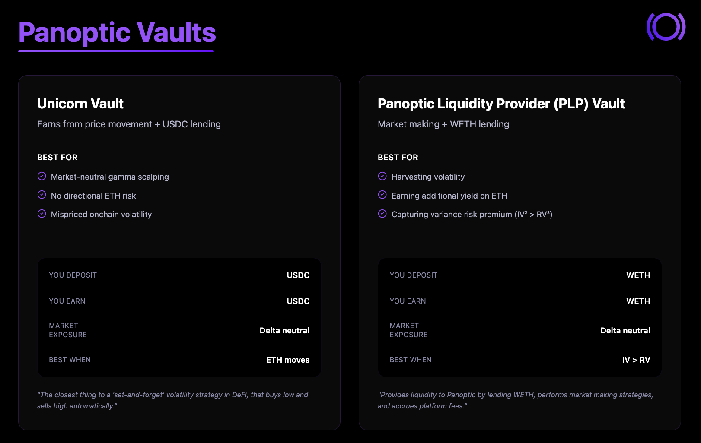
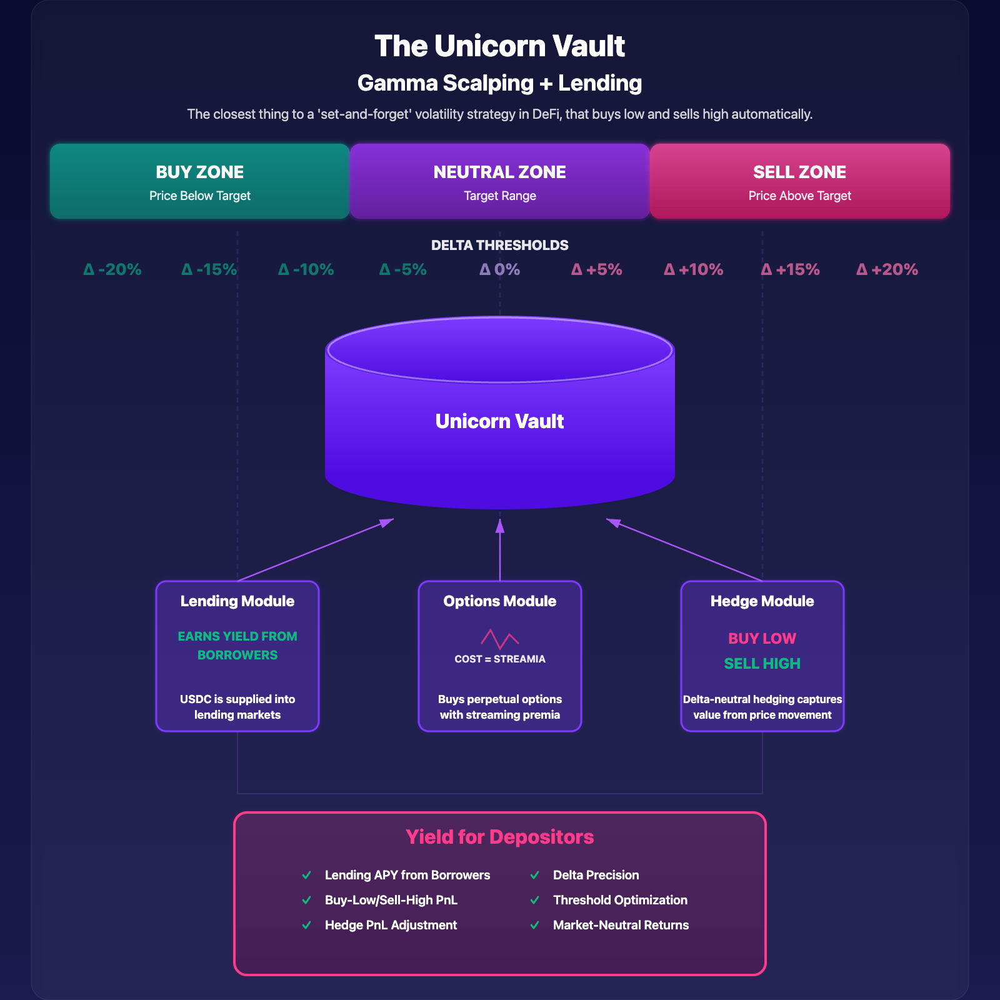
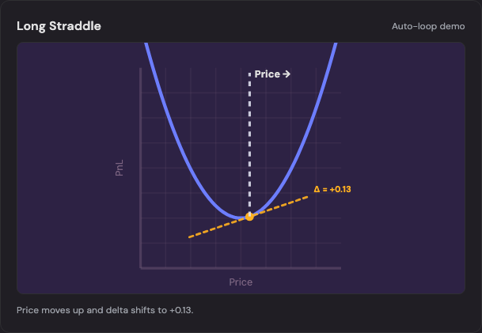
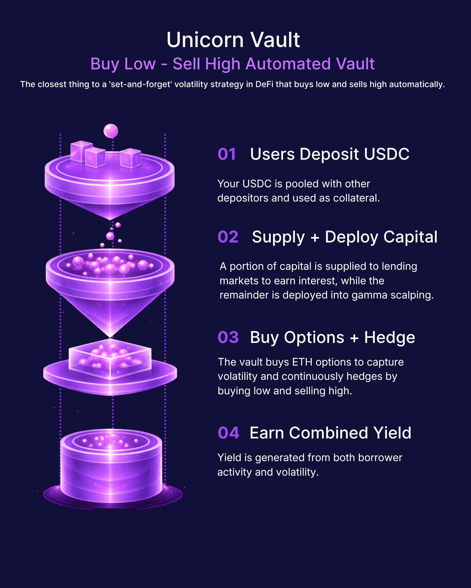
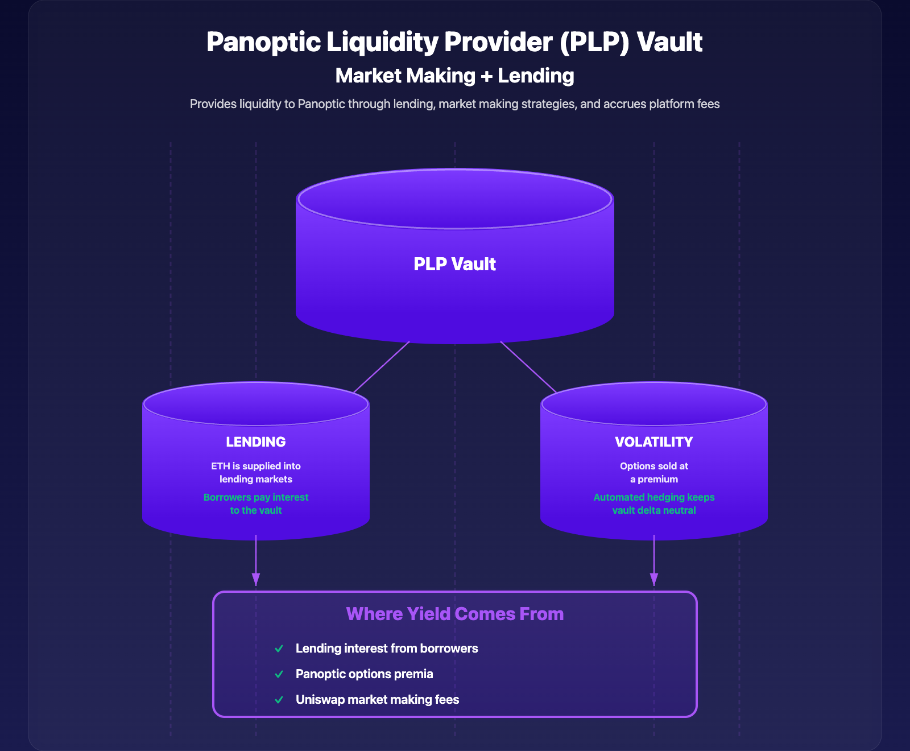
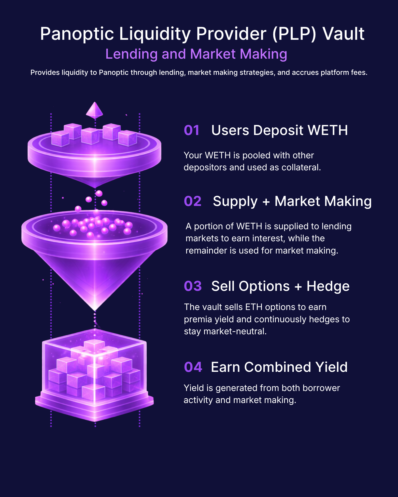

We are introducing the Panoptic Vault suite, initially launching with two vaults.

Usually, earning yield from options requires expertise, constant management, and complex knowledge. Options are powerful, but inaccessible for many DeFi users. With the launch of the Panoptic Vault Suite, that changes.

This launch introduces two interconnected vaults that transform options from a niche trading instrument into onchain income infrastructure. Each vault plays a distinct role, but together they form a system where liquidity, volatility, and yield reinforce one another. The Panoptic vault suite is designed for users who simply want to **deposit** capital and **earn income.**

**Deposit once, earn continuously** - without having to manage options yourself.

## The Vault Layer
The suite of onchain income vaults is designed for different user preferences:
-   A market-neutral vault focused on consistent USDC yield
-   A market-making vault designed for ETH yield

Users can choose how to earn yield, without having to manage strategies.

## The Unicorn Vault
The Unicorn Vault is a stablecoin yield vault designed for users who want consistent returns without taking directional market risk. The vault is denominated in USDC and users receive returns in USDC independent of whether prices go up or down.

The vault earns yield by supplying USDC to lending markets, while generating additional yield through an automated gamma scalping strategy that buys low and sells high. Yield is generated from both borrower activity and volatility, creating a more diversified source of returns.

This strategy is like the Ethena perps basis trade, but operates on options markets. It captures the [Unicorn Trade](/research/panoptic-block-scholes-research-gamma-scalping) which targets structurally underpriced volatility on Uniswap.

### What the Vault Does

-   Supplies USDC to lending markets to earn base yield
-   Generates additional yield through gamma scalping
-   Buys low and sells high via dynamic hedging

## The Panoptic Liquidity Provider (PLP) Vault

The PLP Vault is designed for users who want to earn yield on ETH through a combination of market making and lending. The vault is denominated in WETH and users receive returns in WETH.

This vault earns yield by supplying ETH to lending markets, while generating additional yield through systematic options market making strategies. This creates a dual-yield strategy: stable base yield from borrowers, enhanced by premium yields.

The vault operates similar to how professional options market makers operate, but with automated hedging and made accessible onchain. It performs best in environments where implied volatility is elevated relative to realized volatility, markets are choppy, and demand for buying options is strong.

### What the Vault Does
-   Supplies ETH to lending markets to earn base yield
-   Generates additional yield through systematic options market making strategies
-   Automatically delta-hedges to remain market-neutral

Panoptic's V2 beta initially launches with vaults on Ethereum Mainnet. These vaults are capped, with new vaults and cap increases to be introduced gradually. Season 2 [points](/docs/getting-started/points) will be distributed to vault participants on a regular basis.

Earning yield from onchain options has never been easier. With Panoptic Vaults, just [deposit](https://app.panoptic.xyz) to start earning.

*Join the growing community of Panoptimists and be the first to hear our latest updates by following us on our [social media platforms](https://links.panoptic.xyz/all). To learn more about Panoptic and all things DeFi options, check out our [docs](/docs/intro) and head to our [website](https://panoptic.xyz/).* 
