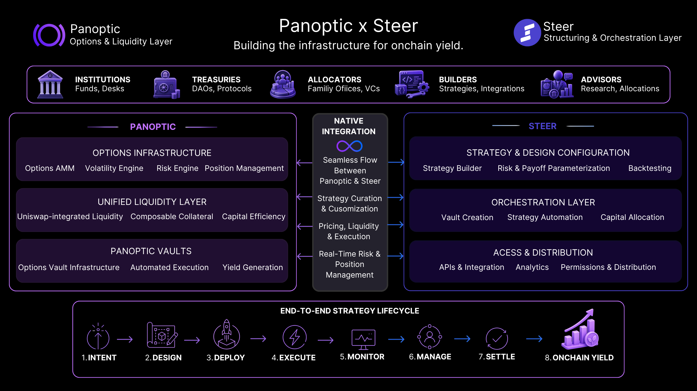

---

slug: panoptic-x-steer-partnership
title: "Panoptic × Steer: Building the Infrastructure for Onchain Structured Yield"
tags: [Partnership, Options, Infrastructure, Liquidity, Yield]
image: /img/banners/banner.png
description: "Panoptic and Steer are partnering to build the infrastructure that enables institutions to design, deploy, and manage structured yield strategies fully onchain.”

---

We are proud to announce our partnership with [Steer](https://www.steer.finance/) to bring onchain yield to institutions.

Institutional interest in DeFi has never been higher. Funds, treasuries, and allocators are actively exploring how to access onchain markets, not just for exposure, but for structured, risk-aware strategies.

We are at a unique moment where:
-   Regulatory clarity is improving
-   Institutional curiosity is turning into action
-   Capital is looking for new forms of yield and exposure
    
But without the right infrastructure, that capital cannot move effectively onchain. This partnership is about building that missing layer.

Today, institutions face a fundamental disconnect. They understand how to structure risk, they know how to deploy capital, and they want exposure to onchain opportunities. But translating that intent into execution is still difficult. Existing tools fall short. Perpetual futures offer partial exposure, but lack precision. OTC and hybrid setups introduce opacity and operational risk. Vaults simplify access, but often remove control over strategy design.

And options, despite being one of the most powerful financial primitives, have not scaled in DeFi due to complexity, fragmented liquidity, lack of unified infrastructure, and high operational overhead. Demand for structured onchain strategies is accelerating, but execution pathways remain underdeveloped.

## A New Model for Onchain Finance

That gap is what this partnership is designed to solve. Panoptic and Steer are building toward a new model, a system where institutions don’t just access DeFi, they **design and deploy their own strategies onchain.**

It requires a new infrastructure layer:

-   One that connects financial intent → onchain execution
-   One that supports customization, transparency, and control
-   One that allows strategies to be designed, deployed, and managed natively onchain
    
Panoptic is the options and liquidity infrastructure layer, while Steer is the structuring, orchestration, and distribution layer.

### Panoptic: The Options and Liquidity Layer

Panoptic introduces a new foundation for onchain yield:
-   Options-powered infrastructure
-   Unified risk engine
-   Composable liquidity via Uniswap
    
Instead of treating options as a niche trading tool, Panoptic turns them into an **underlying engine for generating yield, managing risk, and shaping exposure.**

With the launch of Panoptic [Vaults](/docs/getting-started/vaults), users can:
-   Deposit once
-   Earn from volatility
-   Access options-based strategies without managing them manually

These vaults serve as the first step demonstrating how structured strategies can exist onchain and providing a simple entry point into more complex systems.

### Steer: The Structuring and Orchestration Layer

Steer extends this foundation into a broader system.

As an infrastructure layer for:
-   Strategy design   
-   Vault orchestration    
-   Institutional integrations

Steer enables:
-   Custom vault creation   
-   Strategy parameterization   
-   Operational coordination across protocols 

Where Panoptic provides the primitives, Steer enables the ability to shape those primitives into **fully customized financial strategies.** This is especially important for institutions that require defined risk parameters, portfolio-level control, and integration into existing workflows.

A core component of this partnership is that when demand for structured strategies or custom implementations emerges, it flows seamlessly between Panoptic and Steer, **connecting capital, strategy design, and execution within a single system.** This partnership moves toward a unified model where strategy lifecycles can be managed end-to-end, execution is automated, and risk and state are tracked directly onchain. The objective is to eliminate the infrastructure gaps that have held onchain options adoption back in the past.

## From First Systems to Full Infrastructure
In the near term, our focus is on making this system tangible, bringing structured strategies onchain, expanding research and education, and introducing the first components of this stack. Panoptic Vaults represent an initial surface area, not the final form. From there, we are building toward a more complete framework that supports custom strategy design, deeper integrations across protocols, and clearer pathways for institutional adoption.

We are shifting from isolated products to composable financial systems, and from simply accessing DeFi to actively designing financial strategies onchain. For institutions, funds, treasuries, and builders, this is an entry point into a new model of financial infrastructure.

*Join the growing community of Panoptimists and be the first to hear our latest updates by following us on our [social media platforms](https://links.panoptic.xyz/all). To learn more about Panoptic and all things DeFi options, check out our [docs](/docs/intro) and head to our [website](https://panoptic.xyz/).*