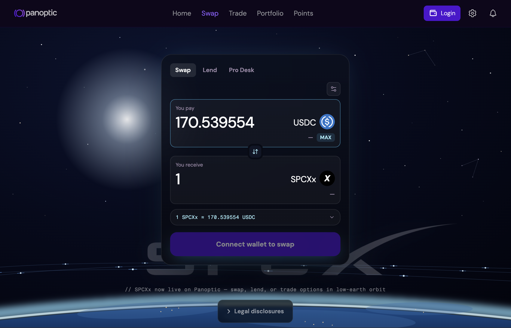
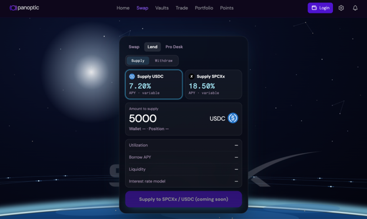
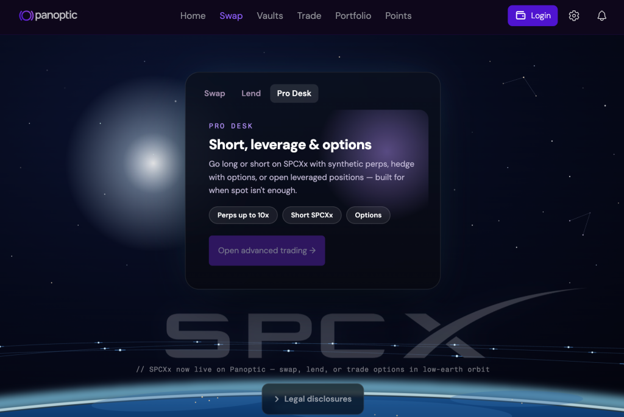

---

slug: trade-spcxx-onchain
title: "Trade SPCXx Onchain"
tags: [SPCXx, Options, Beta, Liquidity, Yield]
image: /img/banners/spcxx-banner.png
description: "Panoptic transforms SPCXx, a tokenized representation of SpaceX available onchain, into a complete financial ecosystem where eligible users can swap, lend, earn yield, and trade options and volatility strategies."

---

## What is SPCXx?

SpaceX is one of the world's most closely watched private companies, with an anticipated IPO generating significant market attention. As interest around the company grows, xStocks is introducing **SPCXx**, a tokenized representation of SpaceX available onchain, giving eligible users a way to gain onchain price exposure and trade the market 24/7.

Panoptic supports [SPCXx](https://blog.kraken.com/product/xstocks/spacex-ipo-access), not SpaceX common stock itself. SPCXx is a tokenized asset issued by Backed Assets via xStocks. This enables onchain users to swap, lend, or trade options on SPCXx.

# Trading SPCXx on Panoptic

## Step 1: Swap into SPCXx

The easiest way to get started is simple, [swap](https://app.panoptic.xyz/swap/spcxx/usdc) your assets for SPCXx.

You now have exposure to one of the world's most sought-after private companies.

## Step 2: Lend and Earn

Markets need liquidity. Every options trader, every borrower, and every market maker creates demand for capital, users can [lend](https://panoptic.xyz/docs/getting-started/passive-lp) their tokens on Panoptic to earn yield.

You can earn yield from borrowers by depositing either:

-   USDC
-   SPCXx

Rather than simply holding idle capital, your assets earn interest from borrowers and options traders. Think of it as turning passive ownership into productive capital.

Instead of: Buy → Hold
Users Now Can: Buy → Lend → Earn

## Step 3: Advanced Trading

For users who want more than just passive yield, [advanced trading](https://app.panoptic.xyz/trade) unlocks the ability to trade [options](/docs/trading/basic-concepts) on SPCXx. Users who want to go short, speculate on price movements, harvest volatility with delta-neutral strategies, or trade perps can access these on Panoptic.

### Harvest Volatility

Sometimes the biggest opportunity isn't whether SpaceX goes up or down. It's how much it moves or how volatile it is. Users can earn this volatility as a fee by using strategies that are [delta-neutral](/blog/delta-neutral-lp-hedge-uniswap-position) (such as strangles or straddles). This minimizes directional exposure and simply collects fees as the price moves.

### Express Bullish or Bearish Views

Have a conviction? Take a position.

You can:
-   Long SPCXx
-   Short SPCXx
-   Buy options on SPCXx    
-   Sell options on SPCXx   
-   Structure custom SPCXx strategies

Whether you believe SpaceX will outperform or underperform, you can express that view on Panoptic. With options, you have more control over liquidations – options are generally immune to liquidations triggered by one-wick price movements. And even if the price initially moves against your conviction, if the price moves back in the original direction, you will continue to profit. Contrast that with perps, where if the price moves too far, you can get liquidated immediately. There is more room for offsetting risks when you’re trading options.

# One Ecosystem. For all Users.

Every participant has a place. Passive users can swap into SPCXx, hold a tokenized version of SpaceX, or lend SPCXx to earn interest. Advanced users can trade SPCXx options to buy or sell volatility, express market views, or access delta-neutral strategies.

## Start Simple. Scale Your Strategy.

You don't need to be an options expert on day one. Start by swapping, then lend and earn. Advanced tools to trade one of the world's most exciting assets await traders on Panoptic.

From passive capital to professional trading, the entire journey happens on one platform.

## Compliance and Market Access

SPCXx spot markets, options markets, lending products, and market-making vaults are not available to U.S. persons or to persons located in, organized in, or residents of the United States or any other restricted jurisdiction, including jurisdictions subject to comprehensive sanctions administered by OFAC or other applicable sanctions authorities. Access from restricted jurisdictions is prohibited.

We employ jurisdictional screening, IP-based restrictions, VPN detection, and other compliance controls designed to enforce these restrictions. Attempting to circumvent these controls is a violation of the Terms of Use, and we disclaim all liability arising from any such circumvention.

Before participating, users are solely responsible for confirming that their access to and use of these products is permitted under the laws and regulations applicable to them. A list of restricted jurisdictions is set forth in the [Terms of Use.](/terms-of-use)

### Risk Disclaimer

Panoptic is a noncustodial, permissionless options protocol. Panoptic does not issue, sell, custody, or distribute tokenized equities. Options markets on tokenized equities (including IPO and pre-IPO assets) reference third-party tokens that provide price exposure only. They do not confer ownership of, or any rights in, the underlying shares.

Not available to US persons. Not available in the UK, Canada, or Australia. Geo restrictions apply. Access from restricted jurisdictions is prohibited, including via VPN or other circumvention.

Options trading involves significant risk, including the loss of your entire position. Pre-IPO and IPO-linked markets carry elevated risk: specialized index pricing, IPO conversion risk, allocation uncertainty, lower liquidity, and higher volatility. Underlying tokenized assets may depeg from, or fail to track, the referenced security.

Panoptic is not affiliated with, sponsored by, or endorsed by SpaceX, any referenced issuer, or any tokenized equity provider. Nothing herein is investment, legal, or tax advice. Capital at risk. Refer to our terms of service here.

*Join the growing community of Panoptimists and be the first to hear our latest updates by following us on our [social media platforms](https://links.panoptic.xyz/all). To learn more about Panoptic and all things DeFi options, check out our [docs](/docs/intro) and head to our [website](https://panoptic.xyz/).*
