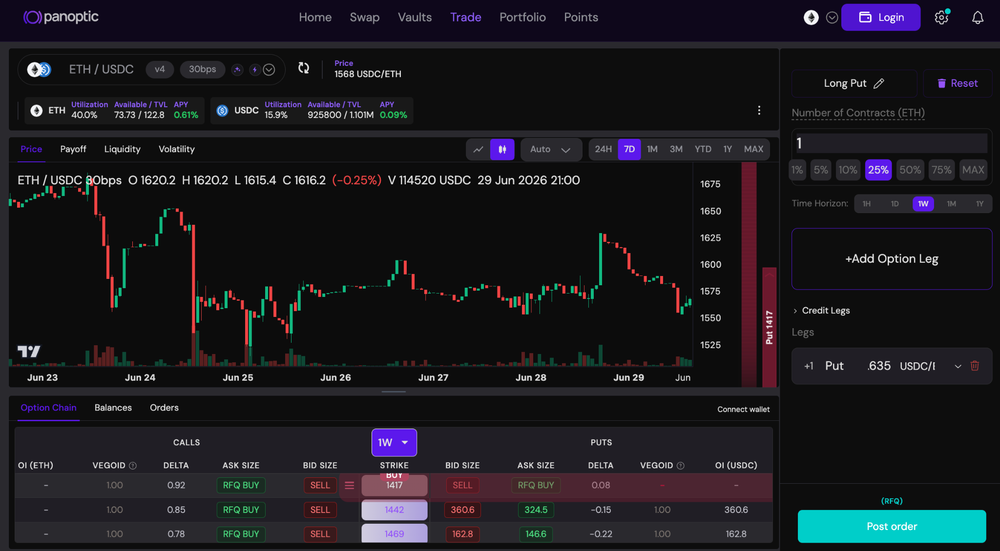
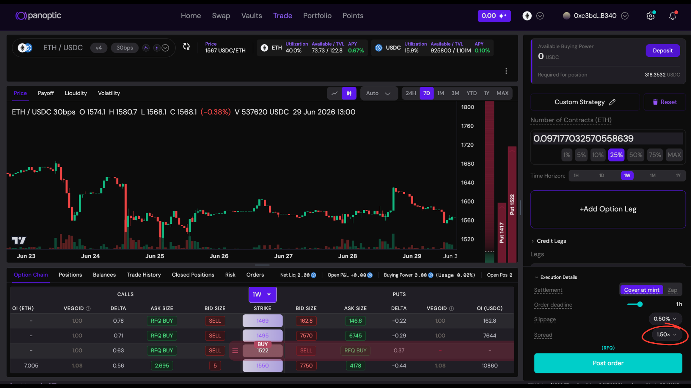
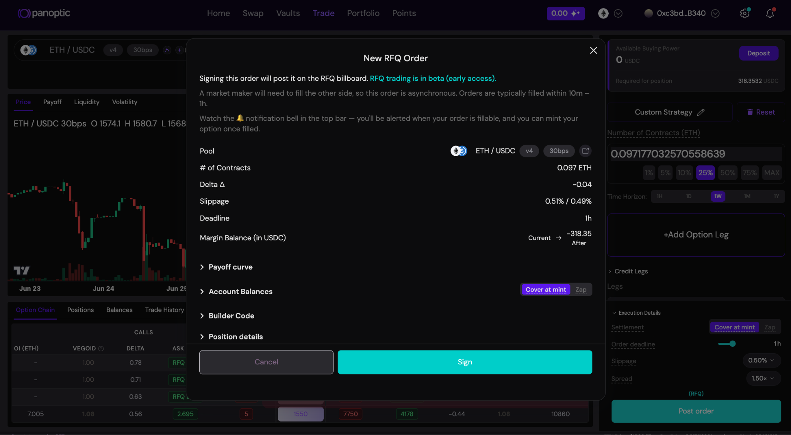
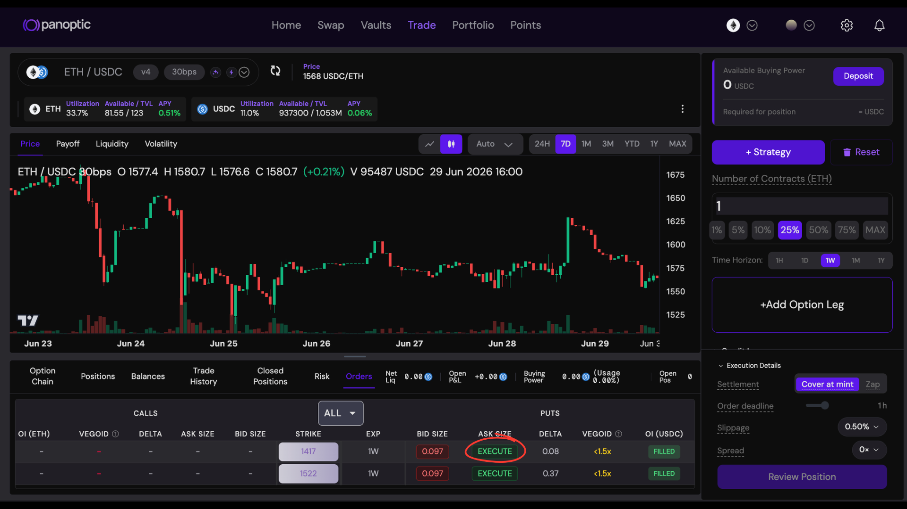
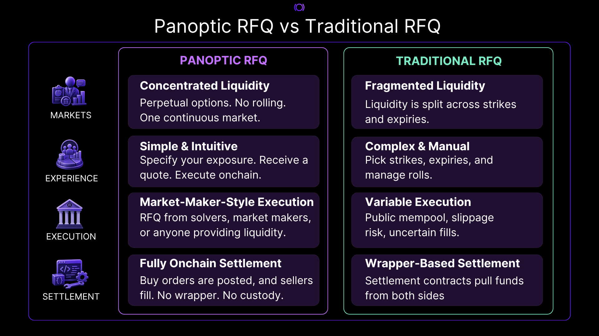

### Panoptic RFQ is live.

_**Traders can now post the exact options exposure they want and let market makers fill it by adding liquidity directly onchain with no settlement contract, no custodian, no counterparty to trust.**_

--- 

Request for Quote (RFQ) has become a common execution model in DeFi. 
In most token RFQ systems, a buyer posts the trade they want and a market maker fills it, with the swap settling through a dedicated exchange or settlement contract that moves assets between the two counterparties.

Panoptic RFQ works differently. 
A buyer specifies the options exposure they want, and liquidity providers respond by adding the liquidity needed to satisfy that request.
And because every Panoptic account already self-custodies its own positions, there's no asset to hand off and no custodial coordinator to trust.

*The initial rollout focuses on the [**ETH-USDC market**](https://app.panoptic.xyz/trade), with additional markets planned over time.*

## How Buying Works

Panoptic is built on [perpetual options](https://panoptic.xyz/docs/trading/perpetual-options), so there are no expiries to select, no positions to roll, and no liquidity fragmented across maturities. 
Because liquidity isn't split across maturities, every order draws on the same shared pool of capital.
Hence, instead of navigating options chains and managing rolls, traders simply specify the options they want and post the order onchain.

Before posting an order, users specify the maximum premium they're willing to pay over realized volatility, expressed as a multiplier on the underlying Uniswap LP fees. 
This multiplier acts as the user's limit on implied volatility: a higher multiplier means the user is willing to pay more over the lifetime of that option, increasing the likelihood that liquidity providers will choose to fill the order, whereas a lower multiplier has a more competitive pricing but may result in fewer sellers willing to fill.

## The RFQ Flow

The user specifies their desired exposure.

The user selects the highest premium multiplier they are willing to pay.

The user posts a buy order, and the RFQ is published to the billboard with the user's requested exposure and maximum acceptable premium.

Once the order enters the billboard, market makers or any participant can fill the request by minting the matching short-side liquidity directly through Panoptic. The coordinator does not match counterparties or settle the trade. It simply hosts the user's signed buy request.

When enough matching liquidity exists onchain, the order becomes executable for the requester. The user can then buy the requested option position directly through Panoptic, and the order is removed from the billboard after execution.

## Beta Launch

For the beta launch, the Panoptic RFQ acts as a coordinator whose job is to coordinate order flow without ever taking custody of user funds.
Since every Panoptic account has full custody of their options, there's no asset to hand off through a settlement contract.
The role of the coordinator is intentionally narrow: host signed RFQ orders, verify that posted orders and order-management actions are authorized by the requester, and expose the billboard for market makers and users. 

That means:

- Posted orders are signed by the requester
- Market makers fill requests by adding liquidity directly onchain
- Fillability is derived from Panoptic liquidity, not coordinator state
- The requester executes the final buy directly through Panoptic

The Panoptic RFQ system is the foundation for permissionless options trading: anyone can quote, anyone can fill, and every trade settles natively onchain. 

RFQ is live today for ETH-USDC, with more markets on the way.

*Join our growing community and be the first to hear our latest updates by following us on our [social media platforms](https://links.panoptic.xyz/all). To learn more about Panoptic and all things DeFi options, check out our [docs](/docs/intro) and head to our [website](https://panoptic.xyz/).*

