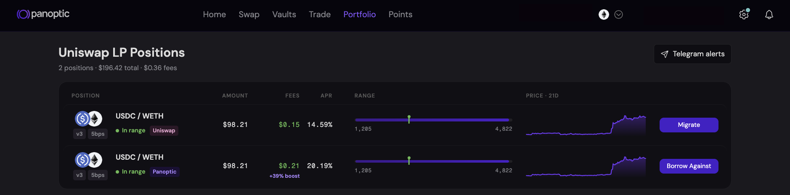
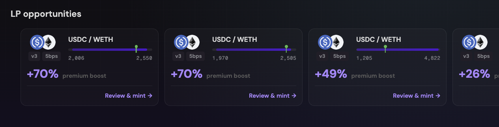

_**Uniswap LPs can now earn up to 20% more fees by staking their LP positions on Panoptic.**_

---

Liquidity providers are the foundation of decentralized markets. They supply the capital that makes trading and swapping possible, yet they also battle impermanent loss, volatility exposure, smart-contract risk, and the opportunity cost of keeping capital inside a liquidity position. LPs need new ways to put their capital to work and earn more, especially following the [recent vote](https://vote.uniswapfoundation.org/proposals/100) by Uniswap governance to direct a portion of swap fees away from LPs and to the protocol. 

** That's why we're launching _Stake Your Uniswap LP_, a new feature on Panoptic for ETH/USDC positions. **

Panoptic is a permissionless options protocol built on top of Uniswap. Instead of replacing Uniswap liquidity, it helps LPs [earn more](/blog/make-uniswap-great-again) through an onchain options market. On Panoptic, LP positions become productive assets that can participate in lending markets and the options market, earning interest from borrowers and premiums from traders while keeping the same underlying liquidity.

## Introducing Panoptic’s Stake Your Uniswap LP 
Uniswap v3 and v4 LPs can stake their existing LP NFTs through Panoptic and earn up to *20% more LP fees* on their ETH/USDC positions, without changing their price range, moving their liquidity, or giving up custody of their position.

For every qualifying deployment, we mint an equivalent Panoptic position with exactly the same parameters, including:

- Token pair
- Fee tier
- Price range
- Liquidity amount

Eligible LP positions may earn up to *20% more* than a comparable Uniswap position through demand from Panoptic's options market. Additional earnings are driven by buying pressure from our Perpetual Options Vaults and other market participants. Since returns depend on buying demand from other participants, returns are not guaranteed.

## How It Works
Stake Your Uniswap LP lets you earn additional yield on top of the swap fees you're already collecting.

1. Connect your wallet.
2. Panoptic detects your eligible Uniswap LP NFTs.
3. Stake your position.
4. Continue earning your normal swap fees, plus additional rewards through Panoptic.

Migrated LP positions will be displayed on the portfolio page alongside Uniswap-native LP positions.

Your liquidity stays in the same pool, with the same token pair and the same price range. You can unstake at any time by paying a 30bps fee on the value of the position if it is still in-range, or 1bps if the position is out-of-range.

> **An additional benefit: borrow against your LP position.** Once migrated, the LP position trades through Panoptic as an undercollateralized option. This allows LPs to borrow against their position without first withdrawing their underlying liquidity, unlocking additional capital efficiency alongside the potential fee boost.

## Where Does the Extra Yield Come From?
Panoptic puts staked LP positions to work inside its options [ecosystem](/blog/panoptic-v2-the-defi-yield-platform). Traders pay premiums to access liquidity for options strategies, creating an additional source of revenue beyond standard swap fees. Those premiums are shared with participating LPs on top of the fees they already earn from Uniswap.

### Eligible LPs Can:

- Keep the same Uniswap position
- Stay in the same price range
- Keep full custody of their LP NFT
- Unstake at any time for a small fee
- Earn additional fees on top of swap fees
- Borrow against their migrated LP position

LP opportunities, with their premium boost relative to the same Uniswap LP position, are displayed on the home page of the Panoptic App:

_Participation is subject to eligibility requirements and campaign terms. The additional returns apply only to qualifying markets (WETH/USDC 5bps v3 pool initially) and does not protect against impermanent loss, changes in asset value, smart contract risk, market risk, or other protocol risks._

## Join The Campaign
If you're already providing ETH/USDC liquidity on Uniswap, deploy your liquidity through Panoptic and start earning up to 1.2x more in fees. 

While protocol fees may reduce LP earnings, Panoptic is committed to helping LPs earn more: liquidity providers make Uniswap possible, and as the economics of providing liquidity continue to evolve, Panoptic is building new ways to make LPs more profitable.  

If you're providing liquidity on Uniswap today, it's time to put your LP position to [work](https://app.panoptic.xyz/home/ethereum).

*Join our growing community and be the first to hear our latest updates by following us on our [social media platforms](https://links.panoptic.xyz/all). To learn more about Panoptic and all things DeFi options, check out our [docs](/docs/intro) and head to our [website](https://panoptic.xyz/).*
