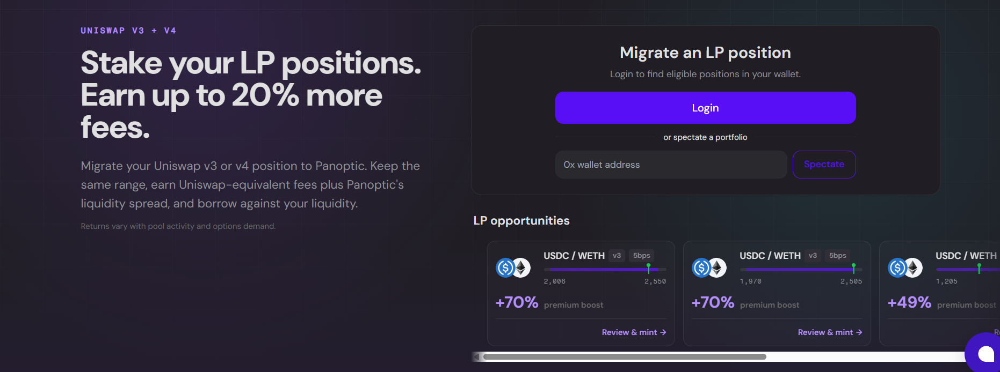

Liquidity providers are the foundation of decentralized markets. They supply the capital that makes trading and swapping possible, yet they also battle impermanent loss, volatility exposure, smart-contract risk, and the opportunity cost of keeping capital inside a liquidity position.

Now, their share of trading fees is facing additional pressure. Uniswap governance has decided to activate protocol fees for selected v4 pool families. This directs a portion of swap fees to the protocol through a new v4 fee controller. Protocol fees have been active across various v2 and v3 markets on multiple chains. [Uniswap’s current governance proposal](https://vote.uniswapfoundation.org/proposals/100) describes the proposed v4 rollout, while the earlier [temperature check](https://gov.uniswap.org/t/temp-check-activate-v4-protocol-fees/26162) details the fee policy.

LPs need new ways to put their capital to work and earn more. That's why we're launching *Stake Your Uniswap LP*, a new feature on Panoptic for ETH/USDC positions. Panoptic is a permissionless options protocol built on top of Uniswap. Instead of replacing Uniswap liquidity, it helps LPs [earn more](/blog/make-uniswap-great-again) through an onchain options market. On Panoptic, LP positions become productive assets that can participate in lending markets and the options market, earning interest from borrowers and premiums from traders while keeping the same underlying liquidity.

## Introducing Panoptic’s Stake Your Uniswap LP 
Uniswap v3 and v4 LPs can stake their existing LP NFTs through Panoptic and earn up to *20% more LP fees*, without changing their price range, moving their liquidity, or giving up custody of their position.

For every qualifying deployment, we calculate the fees an equivalent Uniswap position would have earned using matching parameters, including:
Token pair
Fee tier
Price range
Liquidity amount

Eligible LP positions may earn up to *20% more* than a comparable Uniswap position through demand from Panoptic's options market. Additional earnings are driven by buying pressure from the Unicorn Vault and other market participants, and therefore are not guaranteed.

## How It Works
Stake Your Uniswap LP lets you earn additional yield on top of the swap fees you're already collecting.
1. Connect your wallet.
2. Panoptic detects your eligible Uniswap LP NFTs.
3. Stake your position.
4. Continue earning your normal swap fees, plus additional rewards through Panoptic.

Your liquidity stays in the same pool, with the same token pair and the same price range. **You can unstake at any time.**

## Where Does the Extra Yield Come From?
Panoptic puts staked LP positions to work inside its options [ecosystem](/blog/panoptic-v2-the-defi-yield-platform). Traders pay premiums to access liquidity for options strategies, creating an additional source of revenue beyond standard swap fees. Those premiums are shared with participating LPs on top of the fees they already earn from Uniswap.

### Eligible LPs Can:
Keep the same Uniswap position
Stay in the same price range
Keep full custody of their LP NFT
Unstake at any time
Earn additional fees on top of swap fees

**Participation is subject to eligibility requirements and campaign terms. The guarantee applies only to qualifying LP fees and does not protect against impermanent loss, changes in asset value, smart contract risk, market risk, or other protocol risks. Full campaign details, benchmark methodology, settlement timing, and supported positions will be provided before participation.**

## Join The Campaign
If you're already providing ETH/USDC liquidity on Uniswap, deploy your liquidity through Panoptic and start earning up to 1.2x more in fees. While protocol fees may reduce LP earnings elsewhere, Panoptic is committed to helping LPs earn more. Liquidity providers make Uniswap possible, and as the economics of providing liquidity continue to evolve, Panoptic is building new ways for LPs to earn more.

If you're providing liquidity on Uniswap today, it's time to put your LP position to [work](https://app.panoptic.xyz/home/ethereum).

*Join our growing community and be the first to hear our latest updates by following us on our [social media platforms](https://links.panoptic.xyz/all). To learn more about Panoptic and all things DeFi options, check out our [docs](/docs/intro) and head to our [website](https://panoptic.xyz/).*
