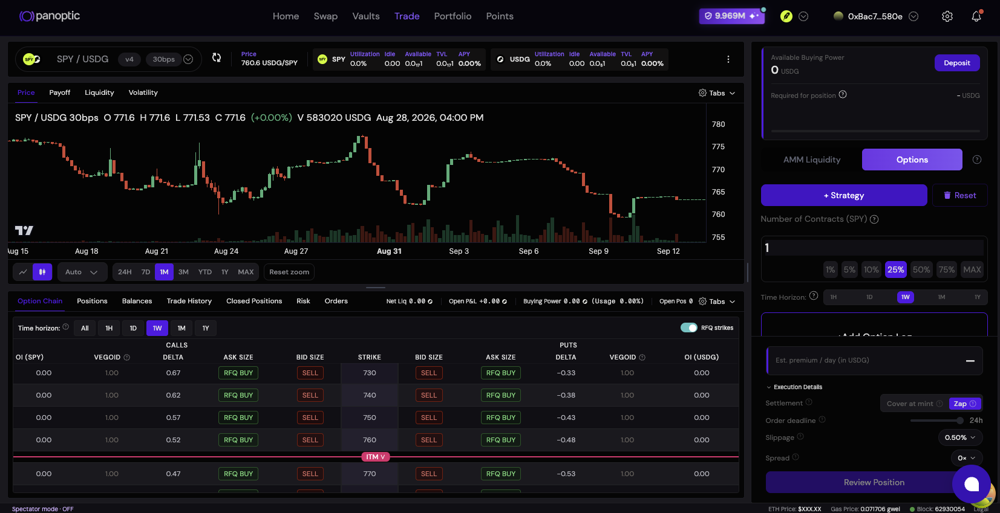

Robinhood Chain is purpose-built for financial services and tokenized real-world assets (RWAs), creating an environment where traditional and crypto-native assets can trade around the clock and participate in DeFi. Panoptic expands what users can do with those assets by introducing a unified credit and derivatives layer.

At launch, users will be able to:

-   Earn interest by supplying assets to Panoptic lending markets
    
-   Borrow against deposited collateral
    
-   Buy and sell perpetual options
    
-   Create custom options strategies using portfolio-aware margin
    
-   Provide concentrated liquidity to Uniswap directly through Panoptic’s revamped interface
    
-   Earn boosted Panoptic Incentive Points in selected launch markets
    

Panoptic will initially support the SPY/USDG  v4 30bs pool with additional crypto and tokenized-asset markets rolling out over time.

# Why Robinhood Chain

Robinhood Chain is a permissionless Layer 2 built using the Arbitrum technology stack and designed specifically for financial services, DeFi, and tokenized RWAs.

Its ecosystem combines deep financial distribution with open onchain infrastructure. Uniswap is deploying a dedicated AMM as a primary public liquidity protocol, creating the spot liquidity required to support lending markets, collateralized borrowing, and derivatives.

Panoptic builds directly on top of that liquidity.

Where spot markets enable users to buy and sell assets, Panoptic enables them to lend, borrow, hedge, earn, and trade volatility around those assets. Together, these components create a more complete onchain financial system.

# From Onchain Ownership to Onchain Utility

Robinhood Chain brings a growing universe of financial assets onchain, including Robinhood Stock Tokens that provide eligible users with economic exposure to assets such as stocks and ETFs.

But putting an asset onchain is only the beginning.

For onchain markets to reach their full potential, users need more than spot trading. They need the ability to earn income, access liquidity, manage risk, hedge positions, and express more sophisticated market views without moving capital across disconnected protocols.

Panoptic provides that infrastructure in one system.

By combining lending, borrowing, and options, Panoptic allows eligible users to put supported assets to work as productive collateral. A user can supply an asset to earn interest, borrow against it without selling, or use options to shape their exposure to its price and volatility.

# Panoptic Incentive Points

Panoptic Incentive Points will be available on Robinhood Chain from launch.

Users can earn points by supplying liquidity, borrowing, and trading in eligible markets. Selected launch markets will receive a points boost for a limited period.

Early participants can earn additional points while helping establish lending liquidity, options depth, and trading activity across Panoptic’s first Robinhood Chain markets.

Full information about eligible activities, market multipliers, and point distribution will be available in the Panoptic documentation.

# Put Your LP to Work

Liquidity providers on Robinhood Chain can make their existing Uniswap positions more productive through Panoptic.

LPs can stake supported Uniswap liquidity positions in Panoptic while that liquidity continues to facilitate swaps and earn trading fees in the underlying pool. Once staked, the position can also support Panoptic’s options markets, creating an additional opportunity to earn options premiums from traders using that liquidity.

LPs will also be able to borrow against their staked positions, unlocking liquidity without withdrawing their capital from Uniswap. Borrowed funds can be withdrawn or deployed across Panoptic’s lending and options markets.

By staking LP positions on Panoptic, liquidity providers can earn up to 20% more on top of their existing LP returns through additional options premiums. The same underlying capital can serve two markets at once: spot liquidity on Uniswap and options liquidity on Panoptic.

Staking does not require LPs to change the underlying pool or price range. Panoptic adds new utility to capital they are already deploying while helping deepen options liquidity across Robinhood Chain.

As liquidity develops across Robinhood Chain, Panoptic gives LPs a way to get more from the same position by earning swap fees, collecting options premiums, and borrowing against their LP position without having to redeploy their liquidity.

# Earn Interest by Lending & Unlock Liquidity by Borrowing

Users can supply supported assets to Panoptic markets to earn interest or borrow against their collateral without selling it. Borrowed liquidity can be withdrawn, used to establish new positions, or deployed within Panoptic’s options markets.

Lending and borrowing rates adjust dynamically according to market utilization, allowing yields and borrowing costs to respond to real-time supply and demand. Because lending and options operate through the same risk engine, capital can move efficiently between credit and derivatives strategies.

# Trade Perpetual Options

Panoptic brings permissionless perpetual options to Robinhood Chain.

Unlike traditional options, Panoptic options do not require users to select a fixed expiration date. Traders can create calls, puts, spreads, straddles, strangles, iron condors, and other strategies with customizable strikes and position sizes.

These markets give users new ways to:

-   Hedge downside risk
    
-   Generate income from existing holdings
    
-   Trade volatility
    
-   Gain leveraged exposure
    
-   Construct defined-risk strategies
    
-   Express directional or market-neutral views
    

Panoptic’s portfolio-aware margin system evaluates positions together instead of treating each leg in isolation. This enables more capital-efficient multi-legged strategies and allows offsetting positions to receive appropriate margin treatment.

# Vaults Are Coming Next

Panoptic Vaults will launch on Robinhood Chain in a later phase.

Vaults package lending, market making, and options strategies into simple, yield-bearing deposits. They allow users to access actively managed strategies without constructing or managing each position themselves.

Future vaults may include strategies designed to earn options premiums, harvest volatility, provide liquidity, or generate yield from supported crypto and tokenized assets.

Additional information about the first Robinhood Chain vaults will be announced following the initial protocol launch.

# Getting Started

Panoptic launches on Robinhood Chain on 09/14/2026.

To participate:

-   Visit the [Panoptic app](https://app.panoptic.xyz/) and select Robinhood Chain
    
-   Supply assets to eligible lending markets
    
-   Borrow against supported collateral
    
-   Create perpetual options positions
    
-   Earn boosted Panoptic Incentive Points in selected markets
    

Follow Panoptic for the final launch-market lineup, points multipliers, and additional product announcements.

Onchain ownership is only the first step. Panoptic is making those assets productive.

## Market Access

Access to specific Panoptic markets and products may be restricted based on jurisdiction. Robinhood Stock Tokens are not available in the United States, to U.S. persons, or in certain other restricted jurisdictions.

Users are solely responsible for confirming that their access to and use of Panoptic and any supported asset is permitted under the laws and regulations applicable to them. Attempting to circumvent jurisdictional restrictions or other compliance controls is prohibited under the Panoptic Terms of Use.

## Risk Disclaimer

Lending, borrowing, and options trading involve significant risk, including smart-contract risk, liquidation risk, market volatility, and the potential loss of principal. Options and leveraged positions may not be suitable for all users.

Rates, rewards, and Panoptic Incentive Points are variable and are not guaranteed. Users should independently evaluate all associated risks before participating.