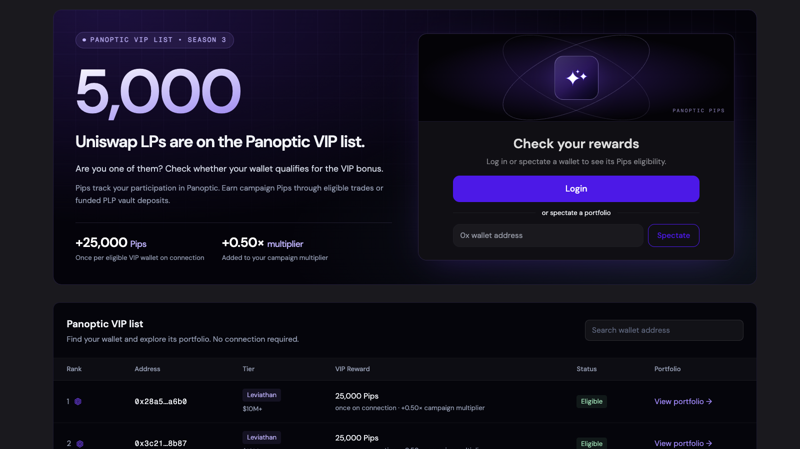
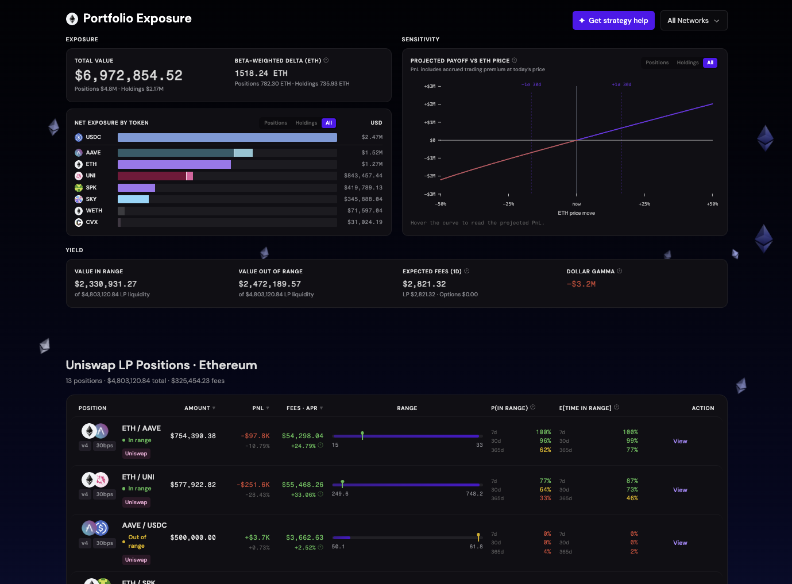
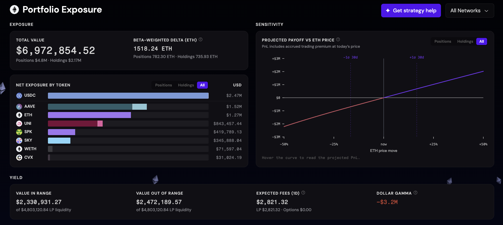
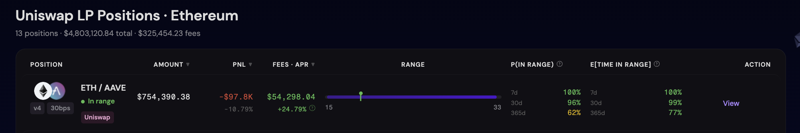
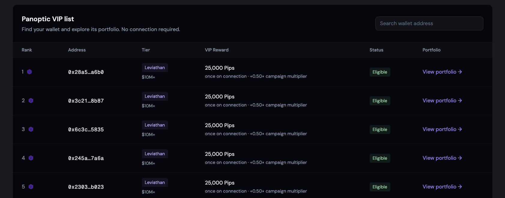

_**Connect your eligible wallet to claim your Season 3 Pips, see all your LP positions in one portfolio, and discover what your liquidity could do in Panoptic.**_

---

Uniswap LPs should not need five dashboards and a spreadsheet to understand their liquidity.

That is why Panoptic has launched a new portfolio experience built specifically for onchain liquidity providers. It brings LP positions, portfolio exposure, yield, and risk analytics into one place across Ethereum and Robinhood Chain.

To introduce it, we identified 5,000 LP wallets across major Uniswap pools using public onchain data. If your wallet is on the list, **25,000 Season 3 Pips are already waiting for you**.

All you need to do is connect your eligible wallet to Panoptic. **No deposit is required** to receive the initial allocation.

## Introducing Panoptic’s Unified Portfolio Dashboard

Once connected, Panoptic automatically finds supported Uniswap, Panoptic, Aave, and Morpho positions associated with your wallet and combines them into a **unified portfolio**.

*The new dashboard shows every supported Uniswap, Panoptic, Aave, and Morpho positions across Ethereum and Robinhood Chain.*

You can see:
- Total portfolio value across supported positions and holdings
- Net exposure by token
- Beta-weighted delta
- Projected payoff as the market moves
- Whether each LP position is in or out of range
- Fees earned and estimated APR
- The probability of remaining in range
- Expected time in range
- LP and options yield
- Dollar gamma and other position-level analytics

**See your whole book at a glance**

The Portfolio Exposure view rolls every supported LP position and wallet holding into a single picture. Instead of adding up token balances by hand, you see your total value, your net exposure to each token, and a beta-weighted delta that expresses your whole portfolio in ETH terms.

*Understand your directional exposure and see how your portfolio may respond as the market moves.*

The goal is simple: help LPs understand not only what they own, but know how each position is really doing.

That makes it easier to spot which positions are earning their keep, which ones need attention, and which ranges may need rebalancing before they stop earning fees.

*Go beyond headline APR. Track performance, range status, and the probability that your liquidity remains active.*

## How to claim 25,000 Pips

1. Visit app.panoptic.xyz/portfolio
2. Connect the wallet you use for Uniswap LP positions.
3. Panoptic will automatically check whether the address is eligible.
4. If it is on the list, the user will be prompted to claim their 25,000 Season 3 Pips reward.
5. The initial 25,000-Pip allocation requires only a wallet connection. You do not need to deposit or move funds to claim it.

Eligibility is determined at the wallet level based on balances held on September 21, 2026. Full rules are available [here](https://panoptic.xyz/docs/getting-started/points).

_If your wallet is on the VIP List, your 25,000 Pips are unlocked when you connect._

## Earn additional Pips by putting your LP to work

The initial reward is only the starting point.

Eligible users can earn additional Season 3 Pips by depositing supported funds or staking LP positions into Panoptic and participating in the protocol.

When you create or stake a supported Uniswap LP position into Panoptic, the underlying liquidity remains in the same Uniswap pool and price range while gaining access to an additional options and lending layer.

Depending on the position and market, LPs can:
- Continue earning Uniswap swap fees
- Earn additional premiums from options activity
- Earn lending interest on deposited collateral
- Borrow against an LP position without selling it
- Use collateral to build custom options strategies
- Earn additional Season 3 Pips

**Same pool. Same price range. Same IL. Higher returns.**  More details [here](https://panoptic.xyz/blog/stake-your-lp).

## Season 3 starts with LPs

Liquidity providers are the foundation of onchain markets. They should have better tools to understand their positions and more ways to put those positions to work.

The VIP List combines both: a purpose-built portfolio for Uniswap LPs and a direct reward for discovering it.

If you have provided liquidity to a major Uniswap pool on Ethereum or Robinhood Chain, your wallet may already be eligible.

[Connect your wallet](https://app.panoptic.xyz/home/ethereum) to find out.

Additional terms: The campaign begins September 23rd and ends when this campaign's pips allocation is exhausted. Eligibility, qualifying actions, distribution timing, supported markets, and geographic restrictions are described in the docs under the points section. Connecting a wallet does not move funds or authorize a transaction.

*Join our growing community and be the first to hear our latest updates by following us on our [social media platforms](https://links.panoptic.xyz/all). To learn more about Panoptic and all things DeFi options, check out our [docs](/docs/intro) and head to our [website](https://panoptic.xyz/).*
