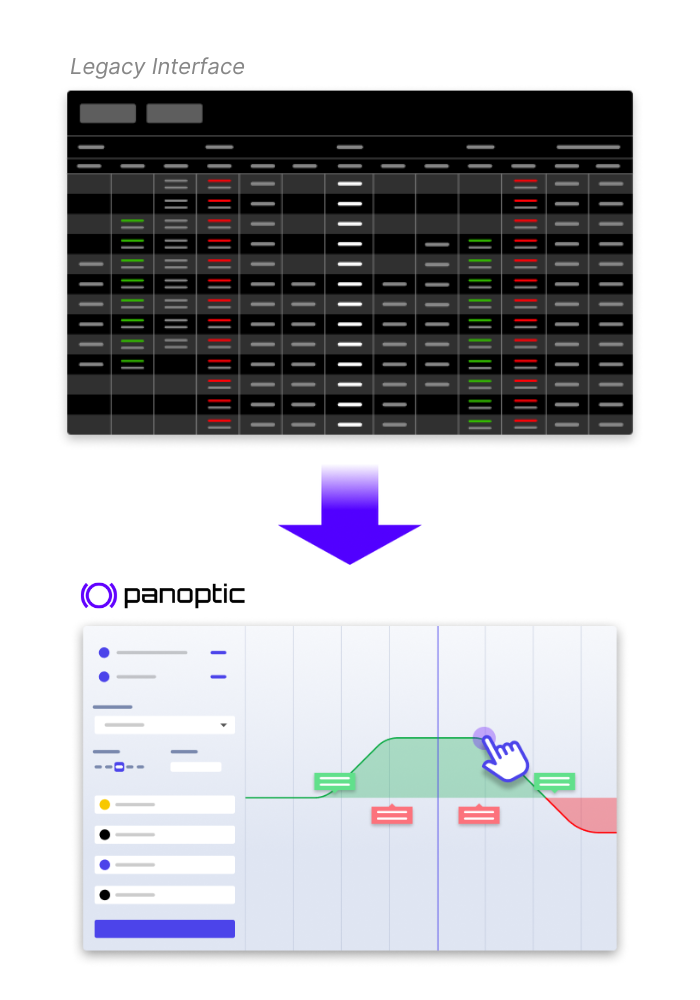

# Frequently Asked Questions
There's a good chance it's been asked before :)

## Panoptic Protocol

What is Panoptic?

The Panoptic protocol enables the minting, trading, and market-making of perpetual put and call options. All smart contracts are available 24/7 and users can interact with the Panoptic protocol without the need for intermediaries like banks, brokerage firms, clearinghouses, market makers, or centralized exchanges. 

How can I use Panoptic?

You can access Panoptic by connecting your wallet to the Panoptic App, which will be deployed on app.panoptic.xyz (COMING SOON...)

What are the key benefits?

Options in Panoptic differ slightly from conventional options. Instead of using a clearinghouse to settle options contracts, the Panoptic protocol uses Liquidity Provider (LP) positions in Uniswap v3 as a fundamental building block for trading long and short options.
  
Panoptic allows users to access new and improved features when options trading: 
1) Panoptic options never expire and are perpetual. 
2) Anybody can deploy an options market on any asset in a permissionless manner. 
3) Panoptic enables anyone to lend their capital to options traders as a liquidity provider. 
4) Pricing is path-dependent and does not involve counterparties (such as market makers).

Which assets can I trade?

Panoptic works on any ERC20 token. Panoptic users can create an options market on any token pair that exists on Uniswap V3.

Where will Panoptic launch?

Panoptic will launch on Ethereum mainnet and all EVM-compatible layer 2's where the Uniswap v3 smart contracts have been deployed.

Is there a token?

No. Panoptic does not have a token at this time. 

Wen launch?

Testnet is scheduled for September 2023. Mainnet is scheduled for Q4 2023. See our <a href="https://panoptic.xyz/blog/panoptic-defi-options-protocol-roadmap">roadmap</a>.

How does liquidity in Uniswap benefit Panoptic?

Panoptic harnesses Uniswap's liquidity to enhance the user experience for options traders. High liquidity and volume in Uniswap pools benefit Panoptic by ensuring steady and predictable returns for options sellers, more stable options pricing, more predictable moneyness, and lower risks of liquidation or forced exercise. This allows for the creation of robust options markets from day one.

Are there any off-chain components?

No.

How does the impending release of Uniswap v4 affect Panoptic?

We are very excited for Uniswap's remarkable achievement! With Uniswap v4, Panoptic is set for an exciting journey:
  
1️⃣ Panoptic will launch on Uniswap v3 🔜
  
2️⃣ Being backed by <a href="https://blog.uniswap.org/ventures">Uniswap Labs Ventures</a>, Uniswap v4 has always been part of our growth map🗺️
  
3️⃣ Uniswap v4 will supercharge Panoptic⚡
  
Stay tuned...

## Perpetual Options

Do Panoptic options (Panoptions) expire?

No, Panoptions are perpetual and never expire. Buyers can hold Panoptions for an unlimited amount of time while potentially incurring <a href="https://panoptic.xyz/blog/black-scholes-streamia-defi-options-pricing-models">fees</a> for each block the Panoption is held. Note that buyers may be <a href="https://panoptic.xyz/docs/panoptic-protocol/forced-exercise">forcefully exercised</a>, but are compensated with fees should this occur.

Do crypto users want options?

Options are extremely popular in traditional finance (TradFi), so much that <a href="https://qz.com/2092197/options-trading-is-poised-to-overtake-the-stock-market">options actually overshadow stocks</a> in terms of volume.
  
Crypto users, like investors in any other asset class, also express interest in options for a variety of reasons. These financial instruments allow for income generation, risk management, hedging, and speculation in <a href="https://twitter.com/Panoptic_xyz/status/1661114864386068480?s=20">more strategic and flexible</a> ways. However, their desire to use options is contingent upon a robust, transparent, and easy-to-use platform.
  
Panoptic makes options easy for all users by providing a seamless, draggable interface for trading options. Panoptic solves the problem of illiquid, oracle-dependent, restrictive options in DeFi by reimagining options to work on-chain: options have no expiry and require no oracles, intermediaries, counterparties, or order books. The result is a permissionless, governance-minimized protocol with no liquidity fragmentation.

Options are too complicated!

Options trading doesn't have to be complicated. At Panoptic, we've created a <a href="https://www.youtube.com/watch?v=deqbeqjyKgg">novel UI</a> that allows anybody to easily and seamlessly trade options. 

How do Perpetual Options Compare to Perpetual Futures ("Perps")?

Perpetual options and perpetual futures are non-expiring financial instruments. Panoptic's perpetual options provides option-like payoffs that are priced through <a href="https://panoptic.xyz/docs/panoptic-protocol/streamia">streamia</a> (streaming premia), while perpetual futures offer long/short payoffs that are priced via a <a href="https://panoptic.xyz/docs/trading/perpetual-options#how-do-perpetual-options-compare-to-perpetual-futures-perps">funding rate</a>.
  
While perpetual futures often offer more leverage, perpetual options offer more <a href="https://twitter.com/Panoptic_xyz/status/1661114864386068480?s=20">flexibility</a> including: 
1) No liquidation risk from single-wick fluctuations 
2) Capped losses 
3) Market-neutrality 
4) Volatility bets 
5) Custom probability of profit and profit potential 
6) Dynamic delta and gamma

Why should perp traders use Panoptic when options are so complicated?

Options trading can offer a more retail-friendly approach than perpetual futures (perps). Users can buy puts/calls if they feel bearish/bullish, but without the risk of immediate liquidation. Even during market volatility, options holders won't face sudden liquidations from price wicks. While liquidation risk remains, it is linked to premium accumulation and is more predictable, giving traders several days to anticipate potential liquidation events.
  
A misconception exists that retail traders desire +50x leverage, mainly achievable with perps. However, our research shows most perp traders on GMX use only <a href="https://panoptic.xyz/research/retail-prefers-2x-over-125x-leverage">2-3x leverage</a>. Panoptic offers up to 10x leverage on options, making it a suitable tool for retail traders looking for manageable leverage without sudden liquidation risks.

## Traders

Can I buy and sell options on leverage?

Yes. Traders can buy options with up to 10x leverage and sell options with up to 5x leverage under normal market conditions. Please note that <a href="https://panoptic.xyz/docs/panoptic-protocol/buying-power">collateral requirements</a> are dynamic and change in response to pool utilization.

Does Panoptic only allow for limited upside positions?

No. You can create limited upside, unlimited upside, limited downside, and unlimited downside positions by <a href="https://twitter.com/Panoptic_xyz/status/1628530117118169088?s=20">combining put and call options</a> on Panoptic.

Is Panoptic only useful for hedging Uniswap LP positions?

No. While Panoptic allows you to hedge against Uniswap LP positions by shorting them, it also allows you to create puts, calls, straddles, jade lizards, zebra spreads, and <a href="https://twitter.com/Panoptic_xyz/status/1628530117118169088?s=20">many other custom option payoffs</a>!

What tokens can I trade options on?

Any ERC20 tokens. The Panoptic protocol enables permissionless options trading for longtail assets just as Uniswap allows for permissionless spot trading for longtail assets.

Can I sell options at any strike?

Yes.

Can I buy options at any strike?

Yes, as long as there is enough seller liquidity at that strike.

Does someone have to sell an option before I can buy the option?

Yes.

Why should I sell an option on Panoptic when I can just LP directly on Uniswap?

Selling an option on Panoptic has the same before-fees payoff as LPing on Uniswap. However, selling an option on Panoptic earns a premium (paid by the option buyer) that is strictly greater than the swap fees earned by an LP position due to the <a href="https://panoptic.xyz/docs/panoptic-protocol/streamia#net-gross-and-owed-fees-with-spread">liquidity spread</a> and improved gas efficiency.

Uniswap LPs (and options sellers) are losing money!

Uniswap is a <a href="https://panoptic.xyz/research/defi-put-options-uniswap-backtest">one-sided market</a> where perpetual options can only be sold but not bought. This leads to an oversupply of liquidity in Uniswap, resulting in lower returns for Uniswap LPs.
  
Panoptic solves this by opening up a two-sided market, where perpetual options are bought and sold by lending and borrowing Uniswap LP tokens. Options buying is implemented through removing liquidity from Uniswap, which leads to higher Uniswap fees earned, higher streamia received, and increased returns to Uniswap LPs (and options sellers).

## Liquidity Providers

What is the Panoptic liquidity provider (PLP) role? How is this different from the option seller?

The Panoptic liquidity provider (PLP) passively provides fungible liquidity to the Panoptic pool and receives commission fees in return. This differs from the liquidity provider (LP) who deploys liquidity in a Uniswap V3 pool and receives swap fees in return. The option seller borrows liquidity from the PLP to deploy in a Uniswap V3 pool as an LP. This act of moving liquidity from the Panoptic pool to the Uniswap pool constitutes selling an option.   
  
Example A: Alice is a PLP for the ETH-USDC pool on Panoptic. She can deposit ETH, USDC, or both ETH & USDC into the pool. She receives a share of commission fees in return.  
  
Example B: Bob is an option seller for ETH-USDC options. After depositing some collateral to the ETH-USDC pool on Panoptic (making him a PLP), he borrows a larger amount of ETH & USDC. The Panoptic protocol deploys his borrowed ETH & USDC into the ETH-USDC pool on Uniswap (making him an LP). His LP position on Uniswap has the same payoffs as a short option (making him an option seller).

Do Panoptic liquidity providers (PLPs) suffer impermanent loss (IL)?

No, Panoptic liquidity providers (PLPs) do not suffer IL from Uniswap LP positions. PLPs earn commission fees, and take on protocol risk (e.g. if the Panoptic pool accrues bad debt from <a href="https://panoptic.xyz/docs/panoptic-protocol/margin">failing to liquidate</a> on time, then PLPs can lose capital). However, protocol risk is minimized through a tried-and-true <a href="https://panoptic.xyz/docs/panoptic-protocol/liquidations#liquidation-bonus">decentralized liquidation network</a> just as Aave, Compound, and dYdX use to prevent protocol insolvency.

Is the capital deposited by Panoptic liquidity providers (PLP) locked when they are utilized by traders in Panoptic?

Yes, the capital of Panoptic Liquidity Providers (PLPs) can be locked under certain conditions. PLPs play a more passive role in which they deposit their tokens and earn yield from commissions. However, if 100% of PLP capital has been utilized by options sellers, then PLPs may have to wait to withdraw their capital. This is similar to what happens in lending protocols when they reach 100% utilization and withdrawals are temporarily locked. Note that options buyers in Panoptic actually reduce pool utilization by returning liquidity to the Panoptic pool, freeing up capital that PLPs can withdraw.

## Fees

What does it cost to sell an option?

Selling an option costs a commission fee and gas fee. The commission fee is 0.2% to 0.6% of the notional value of the option position, depending on the <a href="https://panoptic.xyz/docs/panoptic-protocol/commission#commission-rate-and-pool-utilization">pool utilization</a> at the time of sell. There is no commission fee to close the position.

What does it cost to buy an option?

Buying an option costs a commission fee, streamia (streaming premia), and gas fee. The commission fee is 0.2% to 0.6% of the notional value of the option position, depending on the <a href="https://panoptic.xyz/docs/panoptic-protocol/commission#commission-rate-and-pool-utilization">pool utilization</a> at the time of purchase. The streamia starts at 0, and accumulates while the underlying price remains in range. There is no commission fee to close the position.

What is the commission fee?

This is the fee to mint an option. When an option seller or buyer opens their position, they pay a commission fee on the notional value of the position. The commission is paid to the PLPs. The commission fee percentage varies between 0.2% - 0.6% based on <a href="https://panoptic.xyz/docs/panoptic-protocol/commission#commission-rate-and-pool-utilization">pool utilization</a>.

How is the streaming premia (streamia) calculated?

The <a href="https://panoptic.xyz/docs/panoptic-protocol/streamia">streamia</a> is equal to the amount of swap fees the borrowed LP position would have earned in the Uniswap pool, plus an additional <a href="https://panoptic.xyz/docs/panoptic-protocol/streamia#net-gross-and-owed-fees-with-spread">liquidity spread</a>.  
  
Example: Alice sells an out-of-the-money (OTM) ETH-USDC put Panoption, with strike = 1000 and width = ±10%. Bob buys the OTM put Panoption from Alice for 0 upfront premium. If the ETH-USDC price moves between 909 and 1100, the option is “in range” and would have earned swap fees from the Uniswap pool. If the ETH-USDC price is above 1100 or below 909, the option is “out of range” and would not have earned any swap fees. Bob owes the total amount of accumulated swap fees to Alice as premium.

What is the "liquidity spread"

The <a href="https://panoptic.xyz/docs/panoptic-protocol/streamia#net-gross-and-owed-fees-with-spread">liquidity spread</a> is a floating rate paid by options buyers to options sellers, and is determined by the utilization ratio of each set of options. The spread prevents someone from buying all of the available options for sell.
  
The spread is given by the formula 0.25 * buy/(sell-buy).
  
Example 1: If Alice sells a 10 ETH call and Bob buys a 5 ETH call, then the <a href="https://panoptic.xyz/blog/black-scholes-streamia-defi-options-pricing-models">streamia</a> paid by Bob to Alice for holding the option is 25% greater than Alice's forgone Uniswap LP fees.
  
Example 2: If Alice sells a 10 ETH call and Bob buys a 9 ETH call, then the streamia paid by Bob to Alice for holding the option is 325% greater than Alice's forgone Uniswap LP fees.
  
For buyers, it is costly to purchase all available options. For sellers, it is profitable to identify popular options and strike prices to <a href="https://panoptic.xyz/research/options-market-making#market-making-in-panoptic">market make</a> on.

Has a streaming premia (streamia) been used in practice before?

No, Panoptic is a pioneer in introducing <a href="https://panoptic.xyz/docs/panoptic-protocol/streamia">streamia</a> for options. While similar pricing mechanisms exist such as the <a href="https://panoptic.xyz/docs/trading/perpetual-options#how-do-perpetual-options-compare-to-perpetual-futures-perps">funding rate</a> in perpetual futures (perps), Panoptic's streamia is unique and innovative.

How can I manage risks associated with an unpredictable streaming premia (streamia)?

Panoption streamia can be managed similar to <a href="https://panoptic.xyz/research/perpetual-futures-vs-options#what-are-perps">perp funding rates</a>, since both are unpredictable fees. Users should closely monitor their positions including their collateral amounts, intrinsic value, and owed fees. Users must maintain sufficient collateral to prevent liquidations, and should be prepared to close or exercise positions to secure profits or limit losses. Remember that options trading is not "set it and forget it"; it requires active management.
  
Additionally, you will soon be able to view dashboards of historical streamia and fees to better inform you of potential costs.
  
You can also think of Panoptions as a "perp-like" instrument where users purchase a perpetual call option to gain 10x leveraged exposure with a "funding rate" that adjusts at every block. But unlike perps, Panoptions have limited downside risk and are not subject to liquidation risk from price fluctuations. The only liquidation risk for buyers comes from the accumulation of streamia, which generally happens at a gradual, more manageable pace.

How does Panoptic's new pricing model, streamia, differ from the Black-Scholes model?

Panoptic's streamia pricing model is specifically designed for perpetual options, unlike the Black-Scholes model (BSM) which is used to price expiring options. Streamia introduces dynamic payments as opposed to a single upfront payment.
  
Streamia operates efficiently on-chain, providing accessibility, risk management, capital efficiency, gas efficiency, transparency, and fair pricing for expirationless options. <a href="https://paper.panoptic.xyz">Research</a> shows that streamia-based perpetual options pricing converges to the BSM price of an equivalent traditional option.
  
For a detailed explanation of the differences and advantages of streamia, you can refer to <a href="https://panoptic.xyz/blog/black-scholes-streamia-defi-options-pricing-models">this article</a>.

## Security

Will there be an audit?

Yes. Panoptic's smart contracts were audited by <a href="https://panoptic.xyz/blog/abdk-audit-completion">ABDK</a> and is currently undergoing an audit with <a href="https://panoptic.xyz/blog/openzeppelin-audits-panoptic-defi-options-protocol">OpenZeppelin</a>. There are multiple other audits scheduled to ensure the holistic, end-to-end security of Panoptic. This includes a smart contract audit by Code4rena, economic audits by <a href="https://panoptic.xyz/blog/panoptic-three-sigma-partnership">Three Sigma</a> and <a href="https://panoptic.xyz/blog/simtopia-partnership-panoptic-defi-options">Simtopia</a>, and more to come. See our <a href="https://panoptic.xyz/blog/panoptic-defi-options-protocol-roadmap">roadmap</a>.

Why is Panoptic oracle-free?

Panoptic is designed to minimize the risk of single-point failures and broaden market opportunities. This approach enables the creation of options markets for any asset immediately upon launch, eliminating the need to wait for oracle support to list specific assets.

How are existing options protocols subject to manipulation?

Options protocols that depend on positions expiring at a certain block are susceptible to manipulation. Bad actors can manipulate the price on that specific block, altering the status of an option from in-the-money (ITM) to out-of-the-money (OTM), or the reverse. In contrast, Panoptic's perpetual options model significantly reduces this vulnerability.
  
Furthermore, DeFi options vaults with publicly scheduled auctions may face the risk of <a href="https://www.coindesk.com/markets/2022/04/19/crypto-options-traders-adopt-new-strategies-to-profit-from-defi-volatility-gyrations/">front-running</a>, a strategy where traders anticipate and exploit market movements created by the auctions. The result leads to unfavorable pricing for auction participants. 

Are options for long-tail assets with low liquidity in Uniswap at risk of being manipulated on Panoptic?

Every Panoptic pool relies on its Uniswap counterpart for key metrics such as pricing, moneyness, and liquidations. The downside is that if the Uniswap pool is illiquid, it may be easier to manipulate. Such manipulation could result in heightened liquidation risk for sellers and buying/selling of deep ITM options temporarily pushed OTM.
  
Panoptic discourages manipulation by implementing Time-Weighted Average Price (TWAP) requirements, meaning manipulators must hold the price for several minutes &mdash; not just a single block &mdash; in order to exercise their ITM options or liquidate other users.

