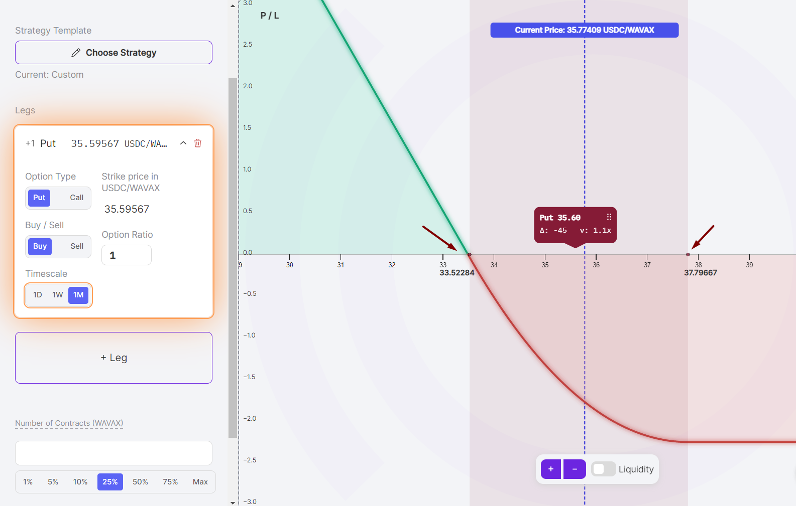

# Forced Exercise
How far-the-money options can be exercised by external users.

### Force Exerciser (Anybody)
Given that Panoptions are expirationless, option buyers may hold their position to perpetuity. In order to prevent option sellers from becoming locked into their position forever, option sellers (or any external party) may force exercise an option buyer's position at any time for a fee. The farther-the-money, the cheaper it is to force exercise an option position.

### Force Exercisee (Buyer)
For Panoptions, there is a risk that a long option position may be forced to close due to an external party exercising the option. The long option holder receives a [fee](/docs/panoptic-protocol/forced-exercise#forced-exercise-cost) as compensation.  

To mitigate forced exercise risk, it is important to monitor positions closely and be prepared to adjust or close the position if needed.

### Single-leg positions
For single-leg positions, only long positions may be force exercised. Short positions cannot be force exercised.

### Multi-leg positions
For multi-leg positions, force exercising must close all legs of the position.

### Forced Exercise Cost

```solidity

EXERCISE
_COST         ^   max cost = 1.28%
  128bps _ |____
   64bps _ |    |____
   32bps _ |    .    |____
   16bps _ |    .    .    |____
    8bps _ |    .    .    .    |____
    4bps _ |    .    .    .    .    |____
    2bps _ |    .    .    .    .    .    |____
     1bp _ |    .    .    .    .    .    .    |____
  0.5bps _ |    .    .    .    .    .    .    .    |____
 0.25bps _ |    .    .    .    .    .    .    .    .    |____    min cost = 0.00125%
0.125bps _ |    .    .    .    .    .    .    .    .    .    |____
              +----+----+----+----+----+----+----+----+----+----+--->
                  1x   2x   3x   4x   5x   6x   7x   8x   9x  10x    DISTANCE_FROM_STRIKE
                                                                      (number of "widths")

```

The width is defined by the position's lower and upper price range. For example, one contract of a one-month (1M) AVAX put option with a lower price of $33.52 and upper price of $37.80 has a width of $4.28 ($4.28 = $37.80 - $33.52).



In this scenario, the cost to force exercise this position would be as follows:

|    Pool Price   |        Force Exercise Cost       |
|:---------------:|:--------------------------------:|
|       ...       |                ...               |
| $24.96 - $29.23 |            0.0064 AVAX           |
| $29.24 - $33.51 |            0.0128 AVAX           |
| $33.52 - $37.80 | In range (cannot force exercise) |
| $37.81 - $42.08 |            0.0128 AVAX           |
| $42.09 - $46.36 |            0.0064 AVAX           |
|       ...       |                ...               |

