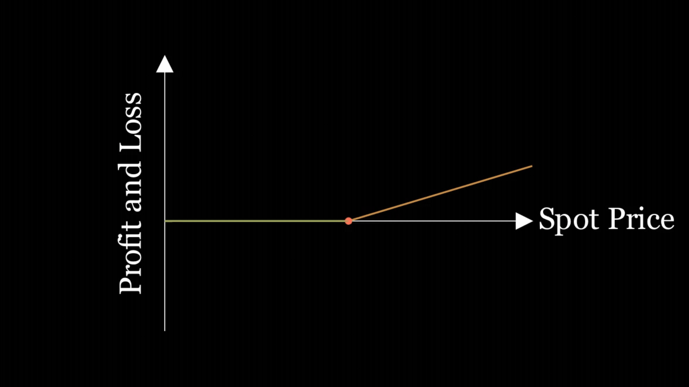
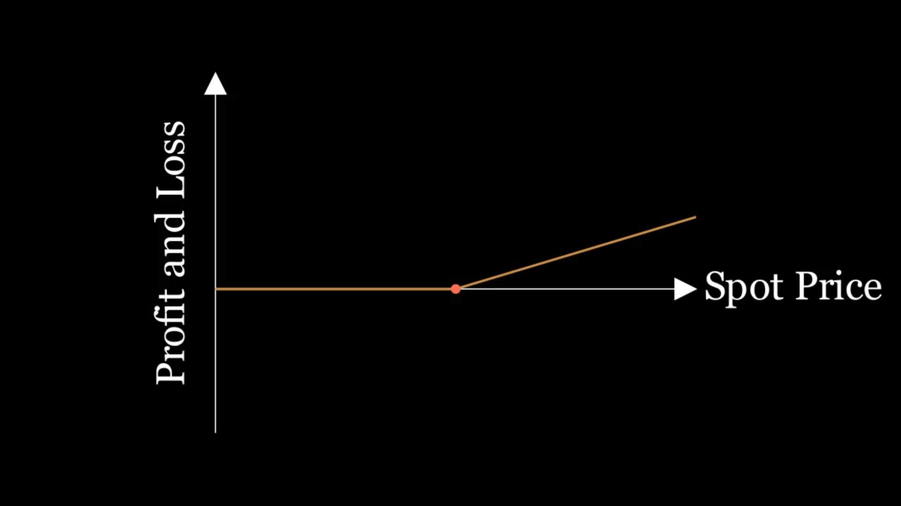
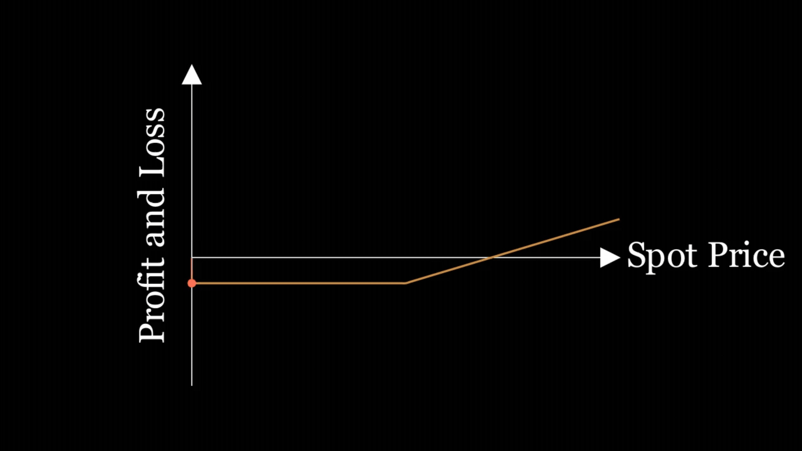
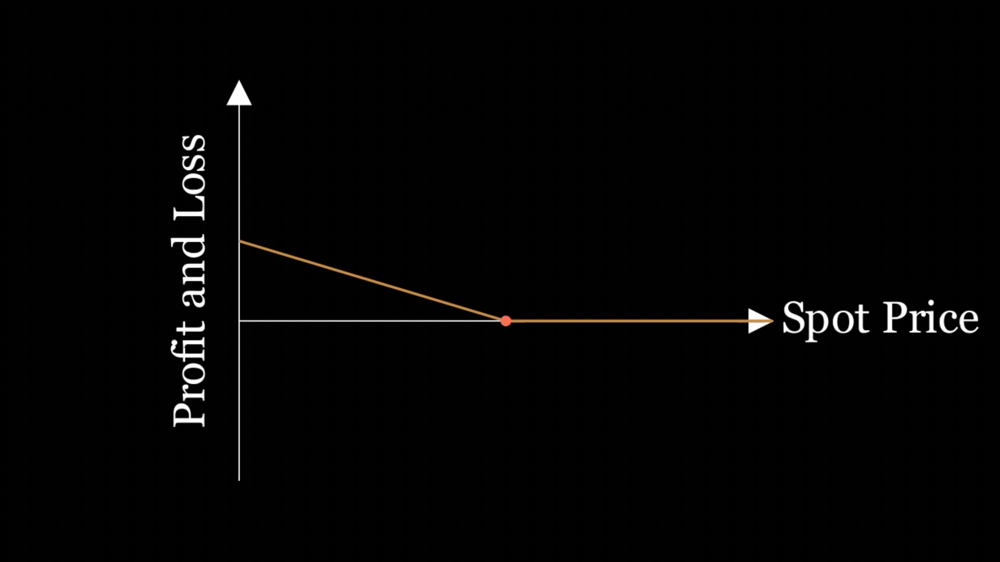
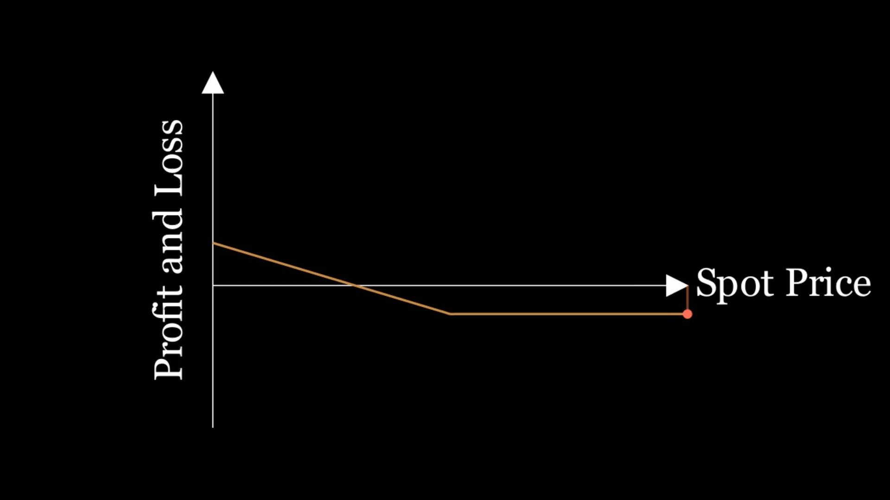
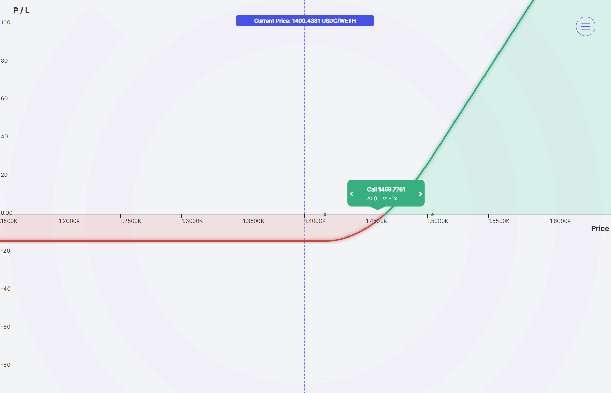
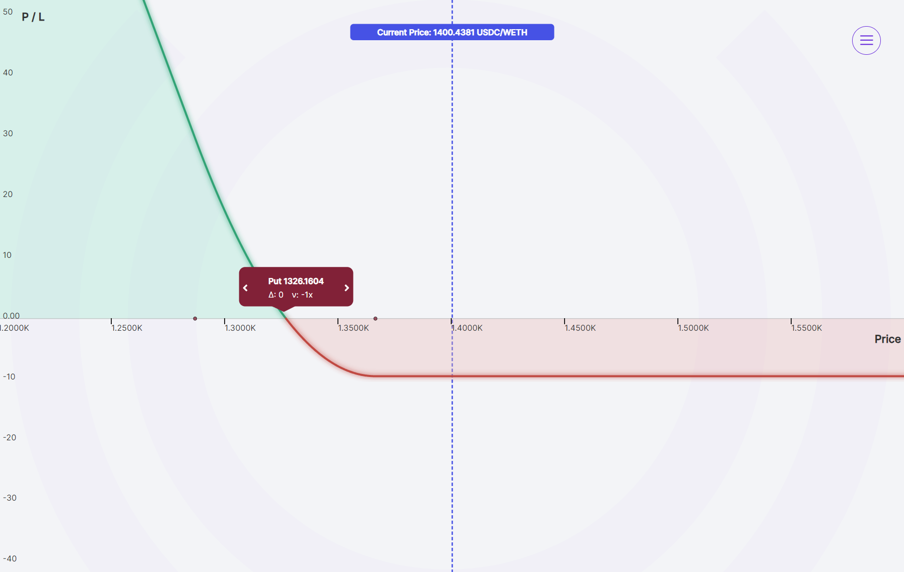

While many DeFi users and traders are familiar with [perpetual futures (perps)](/research/perpetual-futures-vs-options), options often receive less attention due to their perceived complexity. This article aims to demystify options trading, explaining how call and put options work, their advantages, and how to utilize them in various market conditions to enhance your trading strategies.

>### Questions We’ll Answer
>
>-   What are call options? 
>-   What are put options?
>-   What is the difference between options and perps?
>-   What are the benefits of call and put options?
    

## Call Options

Call options are contracts that give a trader the right to buy a specific asset at a predetermined price (strike price) by a certain date (expiry date).

For example, a trader believes ETH’s value will surge. By buying a call option, the trader locks in the ability to buy ETH at today's price even if it goes higher later. This potentially allows the trader to profit by selling it at the higher market price.

   

However, if the price of ETH goes lower, the trader is protected from large losses.

  

The privelege of owning the option has a cost, called the premium, which is reflected by shifting the curve down. The trader’s losses are limited to the premium of the option. In Panoptic, traders’ losses are limited to the accumulated streaming premia (streamia).

Putting it all together, the profitability of a call option depending on whether the ETH price moves up or down is shown below.

## Put Options

Put options are contracts that give a trader the right to sell a specific asset at a predetermined price (strike price) by a certain date (expiry date).

For example, a trader believes ETH’s value will drop. By buying a put option, they secure the ability to sell ETH at a set price even if it plummets, potentially allowing them to profit by repurchasing it at the lower market price.  

However, if the price of ETH goes higher, the trader is protected from large losses.

The privelege of owning the option has a cost, called the premium, which is reflected by shifting the curve down. The trader’s losses are limited to the premium of the option. In Panoptic, traders’ losses are limited to the accumulated streaming premia (streamia).

Putting it all together, the profitability of a put option depending on whether the ETH price moves up or down is shown below.

## Difference Between Options and Perps

Both perpetual options and perpetual futures (perps) lack expiry dates. However, they function differently. Perps are a vehicle for buying and selling (short) tokens with leverage. Perpetual options, on the other hand, are instruments that not only allow you to buy and sell the token with leverage, but also allow you to limit losses, generate income, trade volatility, and create custom bets that match your predictions.

  

Perps are simpler and riskier due to leverage, while options limit potential losses but require understanding of factors like volatility.

## Buying Calls and Puts

### Buying Calls

Traders who are bullish on a particular asset, meaning they believe its price will rise, are drawn to call options. They allow the trader to leverage a small amount of upfront capital to control a larger amount of the underlying asset. In traditional options, the required capital is the options premium, while in Panoptic, the required capital is one-tenth of the amount of underlying tokens.

  

If the price surges past the strike price, the trader can exercise the option to buy at the lower price and immediately sell at the higher market price, potentially generating significant profits.

  

#### Call option example

-   Current price of ETH: $1,000
    
-   Strike price: $1,050
    
-   Accumulated premium paid: $50
    
-   Expiry date: Perpetual (does not expire)
    
-   Number of contracts: 1
    

If ETH Price Rises to $1,500:

-   Profit = Current price - Strike price - Premium paid
    
-   Profit = $1,500 - $1,050 - $50 = $400
    
-   Total profit = $400
    

If ETH Price Falls to $900:

-   The option will not be exercised since the current price is below the strike price.
    
-   Loss = Premium paid = $50
    
-   Total loss = $50
    

### Buying Puts

Traders who are bearish on an asset, meaning they expect its price to decline, utilize put options to capitalize on this prediction. Traders can profit if the price falls below the strike price. The trader can exercise the option, selling the token at the higher strike price, locking in a profit.

  

Put options provide a hedge against existing holdings. If a trader already owns a token but fears a price drop, buying a put option sets a minimum selling price. Even if the price falls, they can still recoup some losses by exercising the put option.

  

  

#### Put option example

-   Current price of ETH: $1,000
    
-   Strike price: $950
    
-   Accumulated premium paid: $50
    
-   Expiry date: Perpetual (does not expire)
    
-   Number of contracts: 1
    

If ETH Price Falls to $500:

-   Profit = Strike price - Current price - Premium paid
    
-   Profit = $950 - $500 - $40 = $410
    
-   Total profit = $410
    

If ETH Price Rises to $1,100:

-   The option will not be exercised since the current price is above the strike price.
    
-   Loss = Premium paid = $40
    
-   Total loss = $40
    

## Conclusion

Options have four distinct advantages:

-   Calculated Risk: Options limit potential losses to the premium paid, unlike perps which have unlimited losses.
    
-   Profitable in Any Market: Whether traders predict a rise or fall in price, call and put options allow them to profit from their market forecasts.
    
-   Strategic  Flexibility: Options empower traders to hedge existing holdings, minimizing losses during large price movements.
    
-   Cost-Effective  Leverage: Control larger amounts with less upfront capital compared to buying the underlying asset outright.
    

  

While options may initially seem complex, understanding basic call and put options empowers traders to make informed decisions in various market conditions. Whether bullish or bearish, options offer strategic advantages over perps by allowing traders to limit their risks and potentially magnify their gains.

  

*Join the growing community of Panoptimists and be the first to hear our latest updates by following us on our [social media platforms](https://links.panoptic.xyz/all). To learn more about Panoptic and all things DeFi options, check out our [docs](https://panoptic.xyz/docs/intro) and head to our [website](https://panoptic.xyz/).*