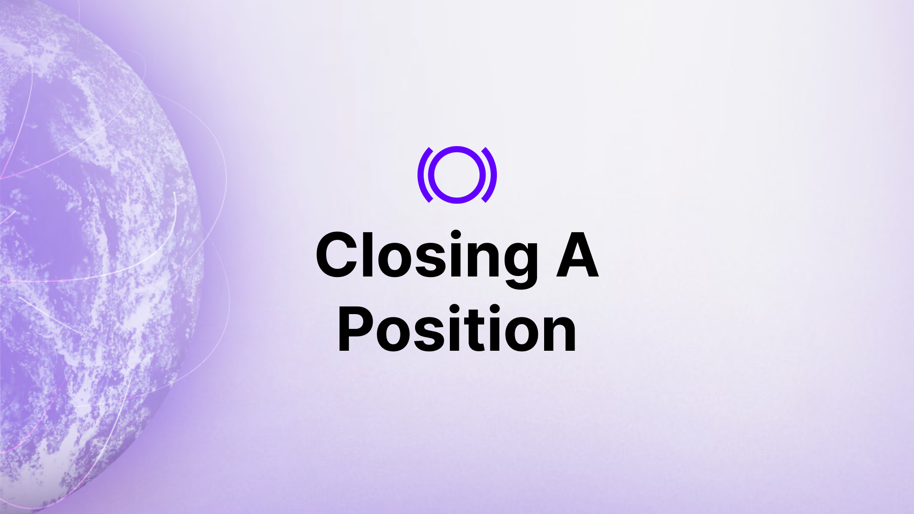
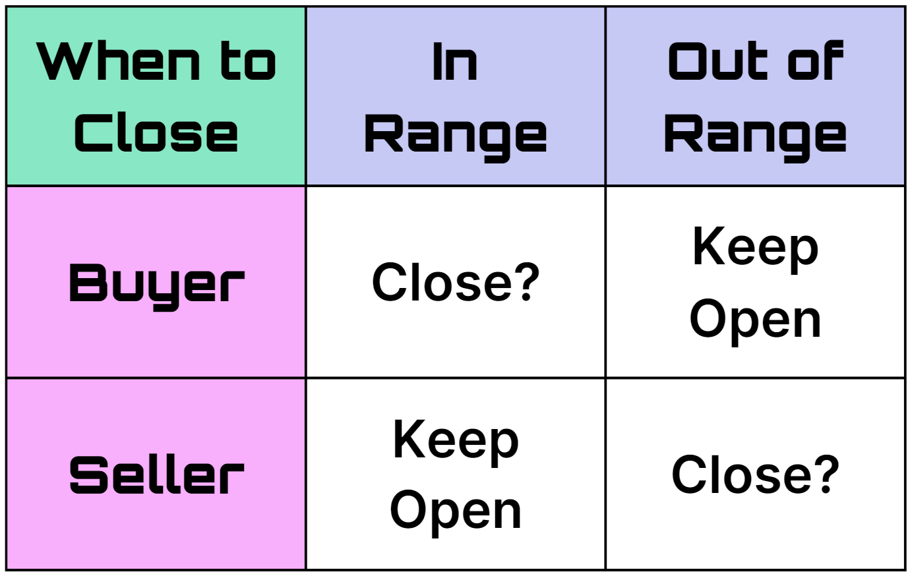
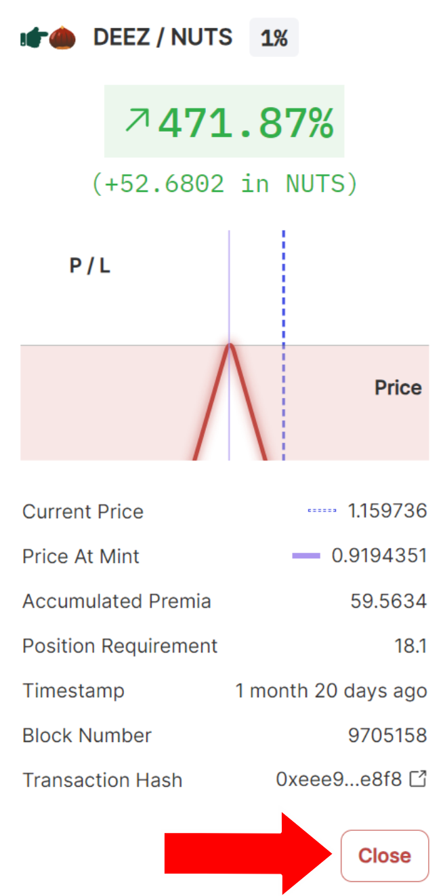
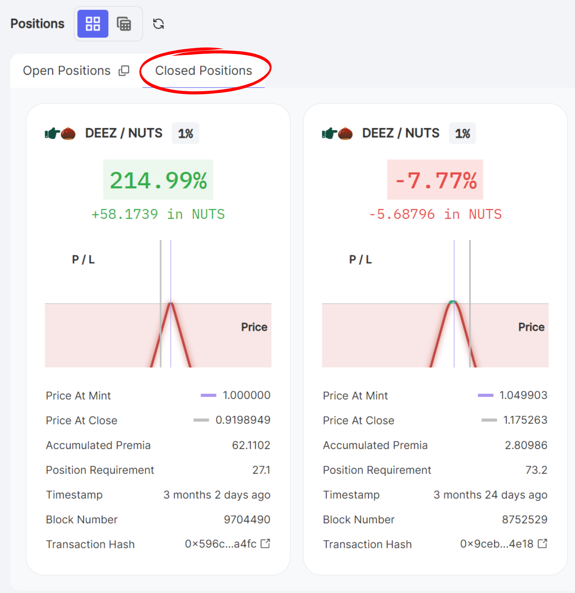
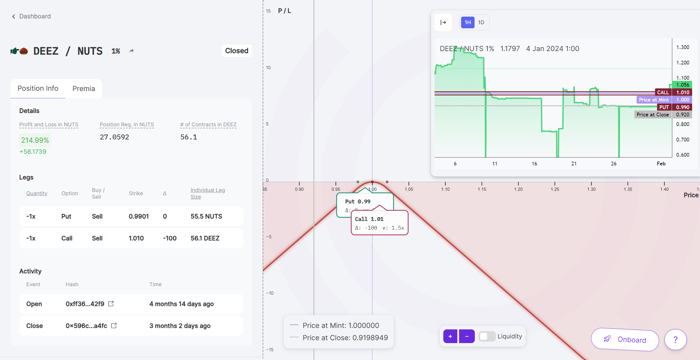

Closing a position is a crucial step in [position management](/docs/product/position-management) to eliminate exposure while securing gains or limiting losses. This guide offers insights on how traders can efficiently close positions and handle potential issues.

>### Questions We'll Answer
>
>*  When should I close a position?
>*  How do I close a position?    
>*   How do I view the details of a closed position?   
>*  How do I troubleshoot issues involved with closing a position?
    

## Understanding When to Close a Position

Perpetual options differ from traditional options as they don't expire, leaving the duration of their lifecycle in the trader's hands. Knowing when to close a position is pivotal—doing it timely can be the difference between profit and loss.

  

Here are some of the most important indicators to consider when deciding whether to close a position.

### Range

[Streamia](/docs/product/streamia) only accumulates while the position is [in range](/docs/product/streamia#in-range-options-accumulate-streamia). Hence, the range of your position greatly affects your profit and loss and whether you should close the position.

-   For sellers: Consider keeping the position open to continue earning streamia if in range. Consider closing if out of range.
    
-   For buyers: Consider closing if the cost of accumulating streamia outweighs potential profits. Position has no additional cost as long as it stays out of range, so no need to close if out of range.
    

### Collateral Management

Monitor your [buying power usage](/docs/product/collateral-and-buying-power#managing-buying-power) to avoid liquidation. Closing a position can decrease buying power usage, thus preventing potential account liquidation.

### Profit and Loss (PnL)

Traders should monitor their PnL to determine if target profits are achieved, in which traders can realize their gains by closing their position. If the position is at a loss, consider closing the position to prevent further losses.

## How to Close a Position

Positions can be closed via the [positions details](/docs/product/position-management#position-details) or [positions overview](/docs/product/position-management#positions-overview) page of the trading dashboard. To close your position, navigate to one of these pages and click the “Close” or “Close Position” button.

  

## Reviewing Closed Positions

After closing a position, head to the closed positions tab of the trading dashboard.

Here, you can review the details of your closed positions such as the PnL, streamia, leg info, transaction timestamps, and more.

## Troubleshooting Issues with Closing a Position

Generally, options on Panoptic may be freely closed. However, positions with insufficient free [liquidity](/docs/product/liquidity) cannot be closed in the traditional manner. Sometimes you may be unable to close your position without first paying a fee to [force exercise](/docs/product/force-exercise) other positions. In other cases, you may need to wait for the price to move out of range or for more liquidity to be added before closing.

### Insufficient Liquidity

Option buyers may freely close their positions at any time. However, option sellers may only close their positions if there is sufficient liquidity. This is because sellers may not close their position if it has been purchased by another account.

  

In most situations, you may close your position for a fee by force exercising the required positions. The further the current price of the underlying asset is from the strike price of the position you wish to close, the cheaper the fee. If your position is eligible to be closed via force exercise, you will be prompted to force exercise all required positions for a fee immediately before closing your own position.

  

An in-range position with insufficient liquidity cannot be closed—even via force exercise—until it becomes out of range or more liquidity is provided.

  

*Join the growing community of Panoptimists and be the first to hear our latest updates by following us on our [social media platforms](https://links.panoptic.xyz/all). To learn more about Panoptic and all things DeFi options, check out our [docs](https://panoptic.xyz/docs/intro) and head to our [website](https://panoptic.xyz/).*

