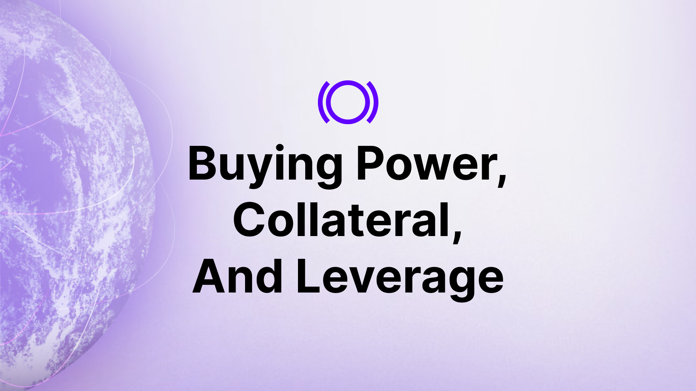
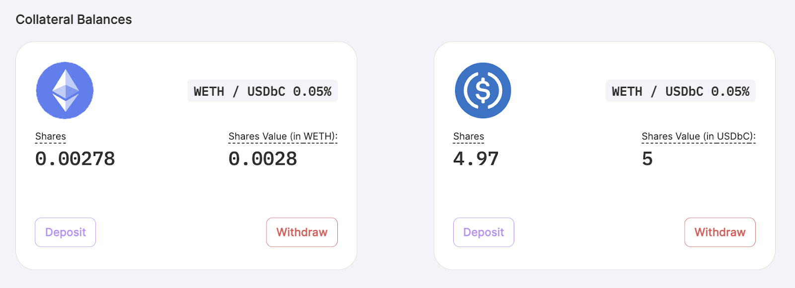
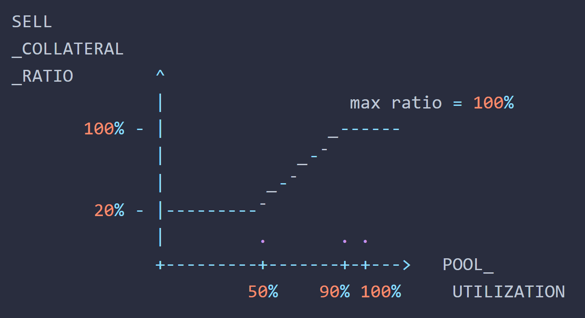
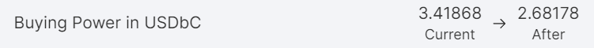
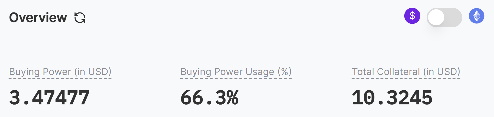
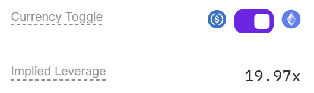
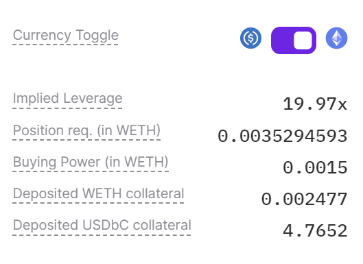
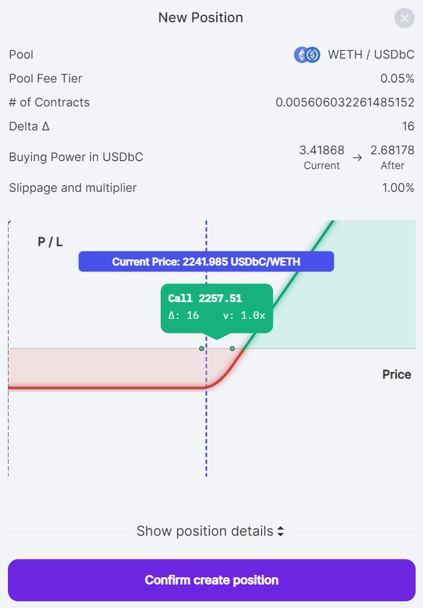

  

Options trading on platforms like Panoptic offers a unique approach to maximizing capital efficiency, pivoting around two core concepts: buying power and collateral. Unlike the conventional leverage metric in perps, options trading emphasizes buying power as the primary indicator of a trader's ability to manage and magnify gains with minimal capital. This article explores the nuanced relationship between buying power and collateral requirements, offering insights into their distinct roles and impact in perpetual options trading.

>### Questions We'll Answer:
>
>-   What are buying power and collateral in options trading?  
>-   How do they differ from traditional leverage?
>-   What factors influence collateral requirements?
>-   How does buying power reduction impact trading strategies?
    

## Collateral

Collateral refers to the funds deposited as a guarantee of repayment to a lender. Panoptic utilizes this concept in its money market liquidity provisioning system, enabling traders to engage in undercollateralized options trading and maximize their leverage.

  
  

  

>*Example*: Consider a scenario where a trader deposits 0.0028 WETH and 5 USDbC. The deposited WETH and USDbC is considered as collateral for the trader’s account. The collateral is used in Panoptic to guarantee the trader can pay back any debt or losses from trading options.

## Collateral Requirements

On Panoptic, collateral requirements are managed with transparency. Differing from the often arbitrary requirements of many centralized exchanges, Panoptic's collateral requirements are fixed in code, offering predictability and consistency. Traders can confidently know the exact amount of collateral required to open and maintain positions at any given time.

  

  

Despite being fixed, these requirements dynamically adjust based on factors like pool utilization and the option's moneyness. For example, a high utilization rate in a pool correlates with heightened risks and translates into [increased collateral requirements](https://panoptic.xyz/docs/panoptic-protocol/buying-power) for sellers. 

>*Example*: Consider a situation where the seller collateral ratio is 20% (equivalent to 5x leverage). This means maintaining a 1 ETH short put position would necessitate at least 0.2 ETH in collateral.

Additionally, Panoptic facilitates cross-collateralized trading. This allows traders to use a single type of deposit, such as USDC, to settle positions in trading pairs that include that token.

## Buying Power

Buying power measures the capital usage of a trader in Panoptic. It starts with the total capital a trader controls and adjusts based on trading activities. This dynamic nature of buying power accurately reflects a trader's real-time capacity to initiate and maintain trades.

  

Buying power represents the total capital a user has available for executing trades. It's a measure of how much of your collateral is currently employed and what remains available for new trades. On Panoptic, collateral is foundational for generating buying power, which can then be used for creating multiple options positions.

  

>*Example*: A trader deposits $50 in USDC and $50 in ETH, starting with $100 in buying power. This buying power serves as the basis for their trading activities on the platform.

## Buying Power Reduction

  

Buying power reduction (BPR) is a critical factor when [opening positions](/docs/product/opening-a-position) on Panoptic. It's based on the option's value, the underlying asset’s price, and associated trading risks. Panoptic dynamically adjusts the BPR based on real-time pool utilization, aligning collateral requirements with current market conditions.

  

>*Example*: A trader with an initial $3.42 in buying power decides to purchase a $10 call option. This option requires $0.74 in collateral, thereby reducing the trader's buying power from $3.42 to $2.68. Note that the trader has more than 10x leverage on this position, since the trader controls $10 worth of the underlying asset while only needing to post $0.74 in collateral.

## Managing Buying Power

On Panoptic, buying power and collateral are easily monitored on the positions’ dashboard. The platform displays buying power in USD and buying power usage as a percentage, indicating how much of the total buying power is engaged in active trades.

  

For example, if a trader deposits $10 in collateral and uses 66.3% of their buying power to open a call option, the buying power will display 66.3% usage, and $3.47 in leftover buying power.

### Key Terms Explained

-   Buying Power (in USD): The total capital available for trading. Opening new positions will reduce your buying power by the position requirement.
    
-   Buying Power Usage (%): The portion of total buying power currently utilized in open positions. At 100% usage an account is considered to be liquidatable.
    
-   Total Collateral (in USD): The total value of your deposited collateral.
    

  

## Leverage and Buying Power

Leverage in options trading on Panoptic is intrinsically connected to buying power. Importantly, leverage is the inverse of the collateral requirement — a lower collateral requirement results in higher leverage for a position.

  

>*Example*: Consider a scenario where a trader wants to purchase a $100 call option. If the collateral requirement for this option is 5%, the trader needs to provide only $5 in collateral. This setup grants the trader 20x leverage on the call option, meaning they control a value ten times greater than the amount posted as collateral. This illustrates how leverage amplifies a trader's buying power, allowing for greater market exposure with less capital.

### Placing a Trade on Panoptic

  

Once traders have filled out their trade they can view the buying power and position requirement (Position req.), which shows how much buying power the trade will use.

  

  

By subtracting the buying power by the position requirement, traders will know how much buying power they will have after the trade. Panoptic displays this in the position review screen that shows how much buying power will be available after the position is opened.

## Conclusion

Understanding buying power and collateral dynamics is crucial for effective options trading on Panoptic. This knowledge influences practical trading strategies and risk management, with buying power as a key metric of capital efficiency in options trading.

*Join the growing community of Panoptimists and be the first to hear our latest updates by following us on our [social media platforms](https://links.panoptic.xyz/all). To learn more about Panoptic and all things DeFi options, check out our [docs](https://panoptic.xyz/docs/intro) and head to our [website](https://panoptic.xyz/).*