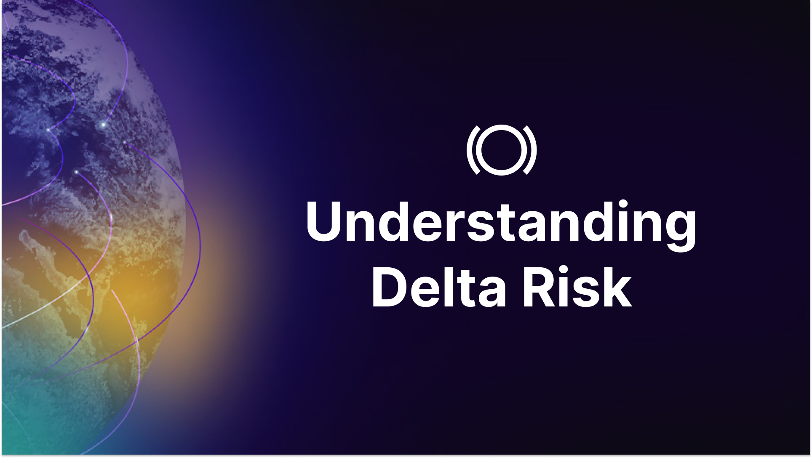
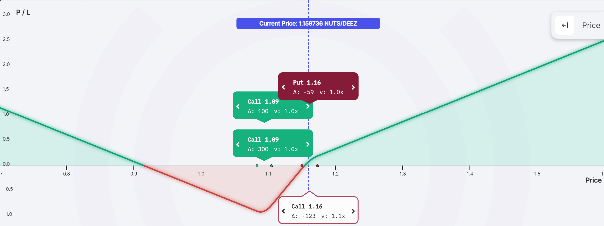
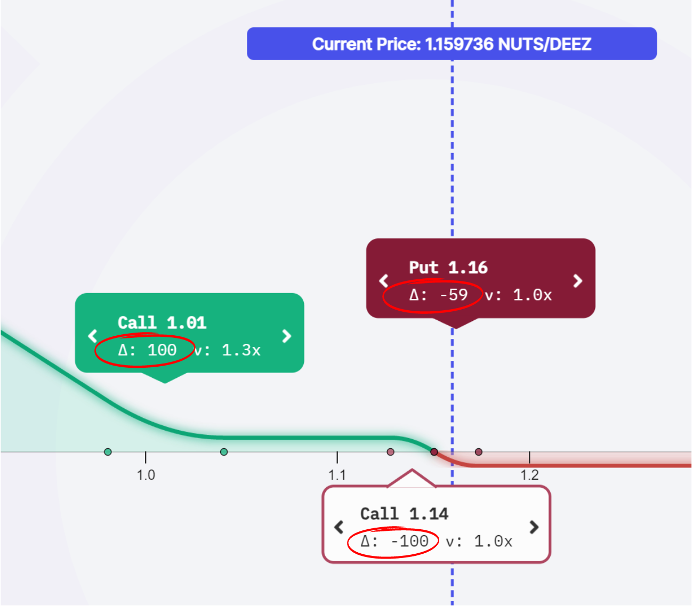
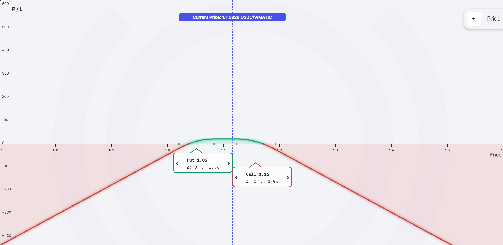
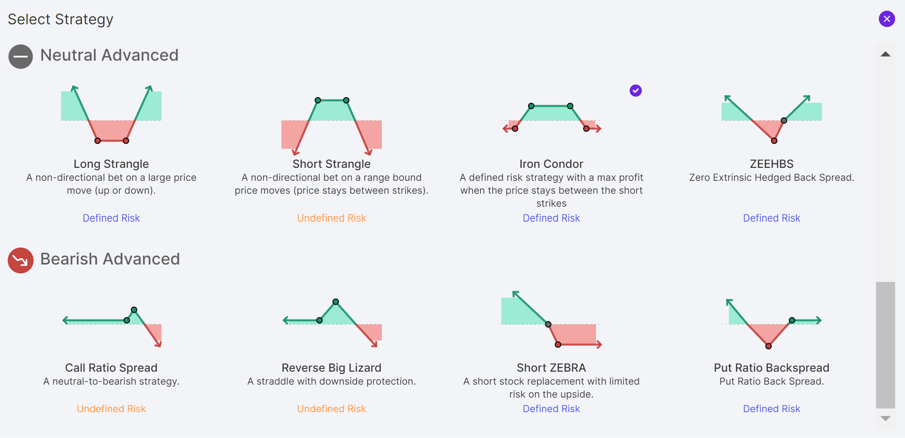
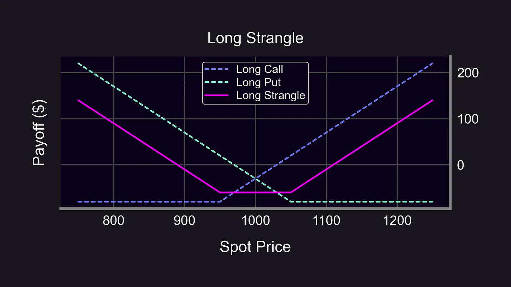
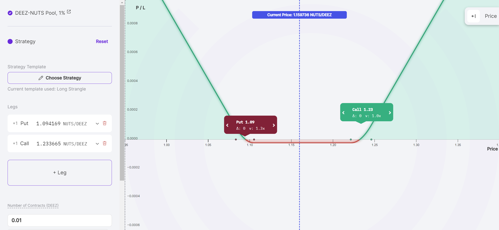
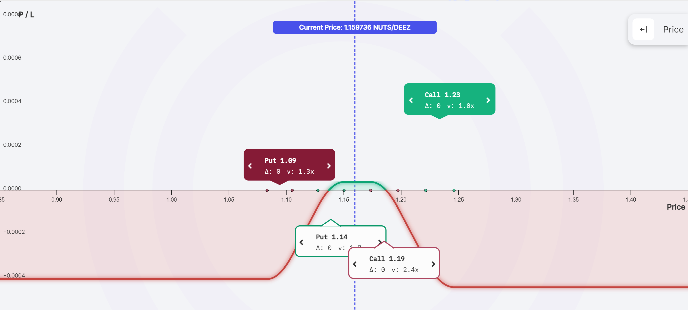

## Delta
In options trading, delta indicates an option's price sensitivity to its underlying asset and is a key component of risk management. This guide delves into the essence of delta in options trading and the strategic implementation of delta-neutral strategies on Panoptic’s platform, equipping you with the finesse to navigate market volatility.

>### Questions We'll Answer
>
>-   What role does delta play in options trading?
>-   What strategies mitigate risk in volatile markets?
>-   How does Panoptic facilitate effective management of delta in trading?
    

### Introduction: Options and Risk

Options allow traders to [leverage](/docs/product/leverage) smaller amounts of capital to potentially reap larger profits, highlighting the allure of significant gains alongside increased risk. This necessitates an understanding of risk management, especially as it pertains to delta and other factors affecting the trader’s profitability.
  

One of the most important risk metrics in options is delta Δ which offers insights into the directional risk associated with an asset. This article unpacks the fundamentals of delta and how traders can utilize Panoptic to employ strategies that safely manage delta risk.

## What is Delta?

Delta is a risk metric used in options trading to measure the sensitivity of an option’s price to changes in the price of the underlying asset. More specifically, it is the expected change in the option's price for a $1 change in the price of the underlying asset.

Call options have a positive delta between 0 and 1, while put options have a negative delta between 0 and -1. For example, an ETH call option with a delta of 0.5 would increase in value by $0.50 if the price of ETH increased by $1.

### Delta Expressed From 0 to 100

Sometimes delta is expressed as a number between 0 and 100 rather than 0 and 1. This is because options contracts traditionally control 100 shares of the underlying asset.

For example, a call option with a delta of 50 would profit $50 (50 = 100 x 0.50) if the underlying asset’s price increased by $1. The Panoptic app uses this more conventional form to display delta.

  

### Delta Neutral

A delta neutral trade in options trading is a position whose value is immune to small changes up or down in the price of the underlying asset. Delta neutral strategies enable traders to reduce their directional risk from price movements in their portfolio’s assets. By holding offsetting options on the same asset, traders can create portfolios with little-to-no directional risk.

Panoptic enables options traders to easily select from a list of “one-click strategies” that include delta-neutral positions. Delta neutrality is achieved by combining options with offsetting deltas, e.g. -1 and +1. However it is important to note that maintaining a delta-neutral position is not a passive duty by any means – it requires [continually adjusting](https://panoptic.xyz/research/options-market-making#delta-hedging-examples) one’s position to remain delta neutral.

## Delta Neutral Trading with Panoptic

Many delta neutral strategies are suited for trading market volatility rather than a particular directional bias on price going up or down. To better understand how to enter a delta neutral position, let’s consider some examples of real strategies traders can utilize with Panoptic.

### Long Strangle

A strangle involves buying a call and a put at different strike prices. The delta of the call option and put option offset each other to achieve delta neutrality. The purpose is to enable traders to profit if price moves significantly in either direction.  

### Iron Condor

An iron condor involves selling a call spread and selling a put spread. The net delta is zero, offset by the opposing long and short [legs](/docs/product/option-legs). The iron condor is one of the most popular delta neutral trading strategies, as it earns [streamia](/docs/product/streamia) irregardless of small changes in the price of the underlying asset. If price makes a large move up or down, the position’s maximum loss is also capped.

## Conclusion

Delta is a crucial metric for traders assessing risk in options trading. It guides decisions on opening and closing positions by indicating how the value of an option might change with the underlying asset's price movement. Understanding delta helps traders manage the risks associated with the direction of the market, making it an indispensable tool in their trading arsenal.

*Join the growing community of Panoptimists and be the first to hear our latest updates by following us on our [social media platforms](https://links.panoptic.xyz/all). To learn more about Panoptic and all things DeFi options, check out our [docs](https://panoptic.xyz/docs/intro) and head to our [website](https://panoptic.xyz/).*
